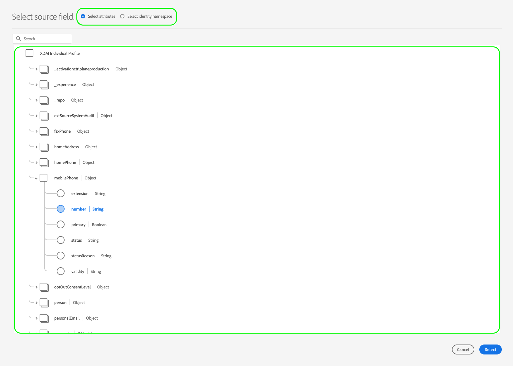

# 将受众数据激活到流区段导出目标

## 概述 {#overview}

本文介绍了在Adobe Experience Platform区段流目标中激活受众数据所需的工作流。

## 先决条件 {#prerequisites}

要将数据激活到目标，您必须成功 [连接到目标](./connect-destination.md). 如果您尚未执行此操作，请转到 [目标目录](../catalog/overview.md)，浏览支持的目标，并配置要使用的目标。

## 选择您的目标 {#select-destination}

1. 转到 **[!UICONTROL 连接>目标]**，然后选择 **[!UICONTROL 目录]** 选项卡。

   

1. 选择 **[!UICONTROL 激活区段]** 在与要激活区段的目标对应的卡上，如下图所示。

   

1. 选择要用于激活区段的目标连接，然后选择 **[!UICONTROL 下一个]**.

   

1. 移到下一个部分 [选择区段](#select-segments).

## 选择您的区段 {#select-segments}

使用区段名称左侧的复选框选择要激活到目标的区段，然后选择 **[!UICONTROL 下一个]**.

## 映射属性和标识 {#mapping}

>[!IMPORTANT]
>
>此步骤仅适用于某些区段流目标。 如果您的目标没有 **[!UICONTROL 映射]** 步骤，跳至 [计划区段导出](#scheduling).

某些区段流目标要求您选择源属性或身份命名空间以映射为目标标识。

1. 在 **[!UICONTROL 映射]** 页面，选择 **[!UICONTROL 添加新映射]**.

   

1. 选择 **[!UICONTROL 源字段]** 中。

   

1. 在 **[!UICONTROL 选择源字段]** 页面，使用 **[!UICONTROL 选择属性]** 或 **[!UICONTROL 选择身份命名空间]** 用于在两类可用源字段之间切换的选项。 从可用 [!DNL XDM] 配置文件属性和身份命名空间中，选择要映射到目标的属性和身份命名空间，然后选择 **[!UICONTROL 选择]**.

   

1. 选择右侧的按钮 **[!UICONTROL 目标字段]** 中。

   

1. 在 **[!UICONTROL 选择目标字段]** ，选择要将源字段映射到的目标标识命名空间，然后选择 **[!UICONTROL 选择]**.

   

1. 要添加更多映射，请重复步骤1至5。

### 应用转换 {#apply-transformation}

>[!CONTEXTUALHELP]
>id="platform_destinations_activate_applytransformation"
>title="应用转换"
>abstract="使用未哈希源字段时，请勾选此选项，以使Adobe Experience Platform在激活时自动对它们进行哈希处理。"
>additional-url="https://experienceleague.adobe.com/docs/experience-platform/destinations/ui/activate/activate-segment-streaming-destinations.html#apply-transformation" text="在文档中了解更多信息"

当您将未哈希化的源属性映射到目标预期经过哈希化的目标属性时(例如： `email_lc_sha256` 或 `phone_sha256`)，请检查 **应用转换** 选项，让Adobe Experience Platform在激活时自动对源属性进行哈希处理。

## 计划区段导出 {#scheduling}

>[!CONTEXTUALHELP]
>id="platform_destinations_activate_enddate"
>title="结束日期"
>abstract="无法为区段计划添加结束日期。"
>additional-url="https://www.adobe.com/go/destinations-activate-segment-scheduling-en" text="在文档中了解更多信息"

默认情况下， [!UICONTROL 区段计划] 页面仅显示您在当前激活流程中选择的新选定区段。

要查看激活到您的目标的所有区段，请使用筛选选项并禁用 **[!UICONTROL 仅显示新区段]** 过滤器。

1. 在 **[!UICONTROL 区段计划]** ，选择每个区段，然后使用 **[!UICONTROL 开始日期]** 和 **[!UICONTROL 结束日期]** 选择器来配置向目标发送数据的时间间隔。

   

   * 某些目标要求您选择 **[!UICONTROL 受众来源]** 对于每个区段，使用日历选择器下方的下拉菜单。 如果您的目标不包含此选择器，请跳过此步骤。

      

   * 某些目标需要您手动映射 [!DNL Platform] 区段到目标中的对应对象。 为此，请选择每个区段，然后在 **[!UICONTROL 映射ID]** 字段。 如果您的目标不包含此字段，请跳过此步骤。

      

   * 某些目标要求您输入 **[!UICONTROL 应用程序ID]** 激活 [!DNL IDFA] 或 [!DNL GAID] 区段。 如果您的目标不包含此字段，请跳过此步骤。

      

1. 选择 **[!UICONTROL 下一个]** 转到 [!UICONTROL 审阅] 页面。

## 审阅 {#review}

在 **[!UICONTROL 审阅]** 页面，则可以查看所选内容的摘要。 选择 **[!UICONTROL 取消]** 来分解流量， **[!UICONTROL 返回]** 修改设置，或 **[!UICONTROL 完成]** 以确认您的选择并开始向目标发送数据。

>[!IMPORTANT]
>
>在此步骤中，Adobe Experience Platform会检查是否存在数据使用策略违规。 下面显示了违反策略的示例。 在解决违规之前，无法完成区段激活工作流。 有关如何解决策略违规的信息，请参阅 [策略执行](../../rtcdp/privacy/data-governance-overview.md#enforcement) 在“数据管理文档”一节中。

如果未检测到任何策略违规，请选择 **[!UICONTROL 完成]** 以确认您的选择并开始向目标发送数据。

## 验证区段激活 {#verify}

检查 [目标监控文档](../../dataflows/ui/monitor-destinations.md) 以详细了解如何监控到目标的数据流。

<!-- 
For [!DNL Facebook Custom Audience], a successful activation means that a [!DNL Facebook] custom audience would be created programmatically in [[!UICONTROL Facebook Ads Manager]](https://www.facebook.com/adsmanager/manage/). Segment membership in the audience would be added and removed as users are qualified or disqualified for the activated segments.

>[!TIP]
>
>The integration between Adobe Experience Platform and [!DNL Facebook] supports historical audience backfills. All historical segment qualifications are sent to [!DNL Facebook] when you activate the segments to the destination.
-->
