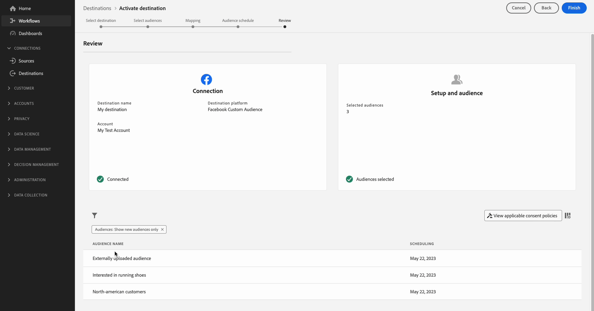

# 将受众激活到流目标

>[!IMPORTANT]
> 
> * 要激活受众并启用工作流的[映射步骤](#mapping)，您需要&#x200B;**[!UICONTROL View Destinations]**、**[!UICONTROL Activate Destinations]**、**[!UICONTROL View Profiles]**&#x200B;和&#x200B;**[!UICONTROL View Segments]** [访问控制权限](/help/access-control/home.md#permissions)。
> * 要激活受众而不执行工作流的[映射步骤](#mapping)，您需要&#x200B;**[!UICONTROL View Destinations]**、**[!UICONTROL Activate Segment without Mapping]**、**[!UICONTROL View Profiles]**&#x200B;和&#x200B;**[!UICONTROL View Segments]** [访问控制权限](/help/access-control/home.md#permissions)。
> * 要导出&#x200B;*标识*，您需要&#x200B;**[!UICONTROL View Identity Graph]** [访问控制权限](/help/access-control/home.md#permissions)。  {width="100" zoomable="yes"}
> 
> 阅读[访问控制概述](/help/access-control/ui/overview.md)或联系您的产品管理员以获取所需的权限。

## 概述 {#overview}

本文介绍了在Adobe Experience Platform流目标中激活受众所需的工作流。

## 先决条件 {#prerequisites}

要将受众激活到目标，您必须已成功[连接到目标](./connect-destination.md)。 如果您尚未这样做，请转到[目标目录](../catalog/overview.md)，浏览支持的目标，然后配置要使用的目标。

## 选择您的目标 {#select-destination}

1. 转到&#x200B;**[!UICONTROL Connections > Destinations]**，然后选择&#x200B;**[!UICONTROL Catalog]**&#x200B;选项卡。

   

1. 在与您要激活受众的目标对应的卡片中选择&#x200B;**[!UICONTROL Activate audiences]**，如下图所示。

   

1. 选择要用于激活受众的目标连接，然后选择&#x200B;**[!UICONTROL Next]**。

   

1. 移到下一部分以[选择您的受众](#select-audiences)。

## 选择您的受众 {#select-audiences}

要选择要激活到目标的受众，请使用受众名称左侧的复选框，然后选择&#x200B;**[!UICONTROL Next]**。

您可以从多种类型的受众中进行选择，具体取决于其来源：

* **[!UICONTROL Segmentation Service]**：分段服务在Experience Platform中生成的受众。 有关详细信息，请参阅[分段文档](../../segmentation/ui/overview.md)。
* **[!UICONTROL Custom upload]**：受众在Experience Platform之外生成，并以CSV文件形式上传到Experience Platform。 要了解有关外部受众的更多信息，请参阅有关[导入受众](../../segmentation/ui/audience-portal.md#import-audience)的文档。
* 其他类型的受众，来自其他Adobe解决方案，如[!DNL Audience Manager]。

## 映射属性和身份 {#mapping}

>[!IMPORTANT]
>
>此步骤仅适用于某些受众流目标。 如果您的目标没有&#x200B;**[!UICONTROL Mapping]**&#x200B;步骤，请跳至[受众计划](#scheduling)。
>
>将受众激活到流式目标时，除了目标配置文件属性外，还必须映射&#x200B;*至少一个目标身份命名空间*。 否则，受众将不会激活到目标平台。
>  {zoomable="yes"}

某些受众流目标要求您选择源属性或身份命名空间以映射为目标中的目标身份。

1. 在&#x200B;**[!UICONTROL Mapping]**&#x200B;页面中，选择&#x200B;**[!UICONTROL Add new mapping]**。

   

1. 选择&#x200B;**[!UICONTROL Source field]**&#x200B;条目右侧的箭头。

   

1. 在&#x200B;**[!UICONTROL Select source field]**&#x200B;页中，使用&#x200B;**[!UICONTROL Select attributes]**&#x200B;或&#x200B;**[!UICONTROL Select identity namespace]**&#x200B;选项在两个类别的可用源字段之间切换。 从可用的[!DNL XDM]配置文件属性和身份命名空间中，选择要映射到目标的配置文件属性和身份命名空间，然后选择&#x200B;**[!UICONTROL Select]**。

   使用&#x200B;**[!UICONTROL Show only fields with data]**&#x200B;切换可仅显示用值填充的架构字段。 默认情况下，仅显示填充的架构字段。

   

1. 选择&#x200B;**[!UICONTROL Target field]**&#x200B;条目右侧的按钮。

   

1. 在&#x200B;**[!UICONTROL Select target field]**&#x200B;页中，选择要将源字段映射到的目标身份命名空间，然后选择&#x200B;**[!UICONTROL Select]**。

   

1. 要添加更多映射，请重复步骤1至5。

### 应用转换 {#apply-transformation}

>[!CONTEXTUALHELP]
>id="platform_destinations_activate_applytransformation"
>title="应用转换"
>abstract="使用未进行哈希处理的源字段时选中此选项，让 Adobe Experience Platform 在激活时自动对它们进行哈希处理。"

将未经过哈希处理的源属性映射到目标期望进行哈希处理的目标属性时（例如： `email_lc_sha256`或`phone_sha256`），请选中&#x200B;**应用转换**&#x200B;选项，以使Adobe Experience Platform在激活时自动对源属性进行哈希处理。

## 计划受众导出 {#scheduling}

>[!CONTEXTUALHELP]
>id="platform_destinations_activate_enddate"
>title="结束日期"
>abstract="无法添加受众计划的结束日期。"

默认情况下，**[!UICONTROL Audience schedule]**&#x200B;页面仅显示您在当前激活流程中选择的新受众。

要查看激活到目标的所有受众，请使用筛选选项并禁用&#x200B;**[!UICONTROL Show new audiences only]**&#x200B;筛选器。

1. 在&#x200B;**[!UICONTROL Audience schedule]**&#x200B;页面上，选择每个受众，然后使用&#x200B;**[!UICONTROL Start date]**&#x200B;和&#x200B;**[!UICONTROL End date]**&#x200B;选择器配置将数据发送到目标的时间间隔。

   

   * 某些目标要求您使用日历选择器下的下拉菜单为每个受众选择&#x200B;**[!UICONTROL Origin of audience]**。 如果您的目标不包含此选择器，请跳过此步骤。

     

   * 某些目标要求您手动将[!DNL Experience Platform]受众映射到其在目标目标中的对应受众。 为此，请选择每个受众，然后在&#x200B;**[!UICONTROL Mapping ID]**&#x200B;字段中输入目标平台中相应的受众ID。 如果您的目标不包含此字段，请跳过此步骤。

     

   * 激活&#x200B;**[!UICONTROL App ID]**&#x200B;或[!DNL IDFA]受众时，某些目标要求您输入[!DNL GAID]。 如果您的目标不包含此字段，请跳过此步骤。

     

1. 选择&#x200B;**[!UICONTROL Next]**&#x200B;以转到[!UICONTROL Review]页面。

## 审查 {#review}

在&#x200B;**[!UICONTROL Review]**&#x200B;页面上，您可以看到所选内容的摘要。 选择&#x200B;**[!UICONTROL Cancel]**&#x200B;以中断流，**[!UICONTROL Back]**&#x200B;以修改您的设置，或&#x200B;**[!UICONTROL Finish]**&#x200B;以确认您的选择并开始将数据发送到目标。

### 同意策略评估 {#consent-policy-evaluation}

如果您的组织购买了&#x200B;**Adobe Healthcare Shield**&#x200B;或&#x200B;**Adobe Privacy &amp; Security Shield**，请选择&#x200B;**[!UICONTROL View applicable consent policies]**&#x200B;以查看应用的同意政策以及激活中因此包含的用户档案数。 有关详细信息，请阅读[同意策略评估](/help/data-governance/enforcement/auto-enforcement.md#consent-policy-evaluation)。

### 数据使用策略检查 {#data-usage-policy-checks}

在&#x200B;**[!UICONTROL Review]**&#x200B;步骤中，Experience Platform还会检查是否存在任何数据使用策略违规。 下面显示了一个违反策略的示例。 在解决该违规之前，您无法完成受众激活工作流。 有关如何解决策略违规的信息，请参阅数据治理文档部分中的[数据使用策略违规](/help/data-governance/enforcement/auto-enforcement.md#data-usage-violation)。

### 筛选受众 {#filter-audiences}

此外，在此步骤中，您可以使用页面上的可用过滤器仅显示其计划或映射作为此工作流的一部分而更新的受众。 您还可以切换要查看的表列。

如果您对您的选择感到满意，并且未检测到任何违反策略的情况，请选择&#x200B;**[!UICONTROL Finish]**&#x200B;以确认您的选择并开始将数据发送到目标。

## 验证受众激活 {#verify}

有关如何监视流向目标的数据流的详细信息，请查看[目标监视文档](../../dataflows/ui/monitor-destinations.md)。

<!-- 
For [!DNL Facebook Custom Audience], a successful activation means that a [!DNL Facebook] custom audience would be created programmatically in [[!UICONTROL Facebook Ads Manager]](https://www.facebook.com/adsmanager/manage/). Audience membership in the audience would be added and removed as users are qualified or disqualified for the activated audiences.

>[!TIP]
>
>The integration between Adobe Experience Platform and [!DNL Facebook] supports historical audience backfills. All historical audience qualifications are sent to [!DNL Facebook] when you activate the audiences to the destination.
-->
