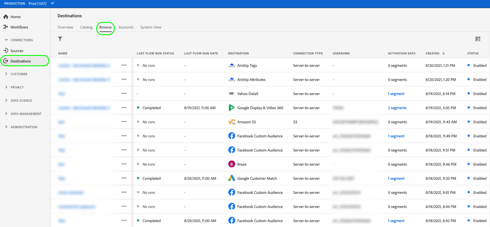

# 激活概述

>[!IMPORTANT]
> 
>要激活数据，您需要 **[!UICONTROL 管理目标]**, **[!UICONTROL 激活目标]**, **[!UICONTROL 查看配置文件]**&#x200B;和 **[!UICONTROL 查看区段]** [访问控制权限](/help/access-control/home.md#permissions). 阅读 [访问控制概述](/help/access-control/ui/overview.md) 或联系您的产品管理员以获取所需的权限。

Adobe Experience Platform支持多种目标。 受众激活工作流因目标所支持的受众数据类型和数据导出频率而异。

## 激活方法 {#activation-methods}

在 [配置目标](connect-destination.md)，您可以通过多种方式激活受众区段：

### 从目标目录激活受众

有关从目标目录将受众激活到您的目标的详细信息，请参阅以下指南：

* [将受众数据激活到流区段导出目标](activate-segment-streaming-destinations.md)
* [将受众数据激活到流配置文件导出目标](activate-streaming-profile-destinations.md)
* [激活受众数据以批量配置文件导出目标](activate-batch-profile-destinations.md)

### 从激活受众 [!UICONTROL 浏览] 页面

请按照以下步骤从 **[!UICONTROL 浏览]** 页面。

1. 转到 **[!UICONTROL 连接>目标]**，然后选择 **[!UICONTROL 浏览]** 选项卡。

   

1. 找到要用于激活区段的目标连接，请在 [!UICONTROL 名称] 列，然后选择 **[!UICONTROL 激活区段]**.

   

1. 根据所选目标，请按照以下文章中描述的步骤操作，从 **[!UICONTROL 选择区段]** 步骤，以完成激活工作流：

   * [将受众数据激活到流区段导出目标](activate-segment-streaming-destinations.md)
   * [将受众数据激活到流配置文件导出目标](activate-streaming-profile-destinations.md)
   * [激活受众数据以批量配置文件导出目标](activate-batch-profile-destinations.md)

### 从区段详细信息页面激活受众 {#activate-segment-details}

您可以从区段详细信息页面将区段激活到目标。 请参阅 [区段详细信息](../../segmentation/ui/overview.md#segment-details) 以了解更多信息。

根据所选目标，按照以下文章中描述的步骤完成激活工作流：

* [将受众数据激活到流区段导出目标](activate-segment-streaming-destinations.md)
* [将受众数据激活到流配置文件导出目标](activate-streaming-profile-destinations.md)
* [激活受众数据以批量配置文件导出目标](activate-batch-profile-destinations.md)
