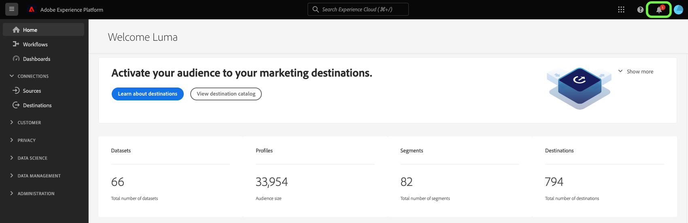

# 订阅上下文关联目标警报

Adobe Experience Platform允许您订阅有关Adobe Experience Platform活动的基于事件的警报。 警报可减少或消除轮询 [[!DNL Observability Insights] API](../../observability/api/overview.md) 为了检查作业是否已完成、是否已到达工作流中的某个里程碑，或是否发生任何错误。

创建数据流时，您可以订阅警报，以接收有关流运行状态、成功或失败的警报消息。

本文档提供了有关如何订阅接收目标数据流的警报消息的步骤。

## 快速入门

本文档要求您对Adobe Experience Platform的以下组件有一定的了解：

* [目标](../home.md):与目标平台预先构建的集成，可无缝激活来自Adobe Experience Platform的数据。 您可以使用目标来激活跨渠道营销活动、电子邮件促销活动、定向广告和许多其他用例的已知和未知数据。
* [可观测性](../../observability/home.md): [!DNL Observability Insights] 允许您通过使用统计量度和事件通知来监控平台活动。
   * [警报](../../observability/alerts/overview.md):当您的Platform操作达到一组特定条件（例如，当系统超出阈值时可能出现问题）时，Platform可以向组织中订阅了这些条件的任何用户发送警报消息。

## 在UI中订阅警报 {#subscribe-destination-alerts}

>[!CONTEXTUALHELP]
>id="platform_destination_alerts_subscribe"
>title="订阅目标提醒"
>abstract="提醒可让您接收基于目标数据流状态的通知。您可以设置提醒，以便在数据流已启动、成功、失败或未向目标发送任何数据时获得更新。"
>text="Learn more in documentation"

>[!IMPORTANT]
>
>您必须为Platform帐户启用电子邮件的即时通知，才能接收数据流基于电子邮件的警报通知。

您可以在 [!UICONTROL 配置新目标] 步骤 [目标连接](connect-destination.md) 工作流。

选择要订阅的警报，然后选择 **[!UICONTROL 下一个]** 以检查和完成数据流。

可用于目标数据流的警报在下表中进行了描述。

* 对于流目标，仅 [!DNL Activation Skipped Rate Exceeded] 警报可用。
* 对于基于文件的目标，所有警报都可用。

| 警报 | 描述 |
| --- | --- |
| 目标流运行延迟 | 当目标流运行时间超过150分钟时，此警报会通知您激活区段。 |
| 目标流运行失败 | 在将区段激活到目标时出错，此警报会通知您。 |
| 目标流运行成功 | 当区段成功激活到目标时，此警报会通知您。 |
| 目标流运行开始 | 当目标流运行开始激活区段时，此警报会通知您。 |
| 已跳过激活率 | 当激活跳过率超过总激活的1%时，此警报会通知您。 在激活过程中，如果标识缺少属性或违反同意，则会跳过标识。 |

## 接收警报 {#receiving-alerts}

目标数据流运行后，您可以通过UI或电子邮件接收警报。

### 在UI中接收警报 {#receiving-alerts-in-ui}

警报在UI中由Platform UI顶部标题中的通知图标表示。 选择通知图标可查看有关数据流的特定警报消息。

此时会出现通知面板，其中显示了您创建的数据流上的状态更新列表。

您可以将鼠标悬停在警报消息上以将其标记为已读，或者选择时钟图标以设置将来有关数据流状态的提醒。

选择警报消息以查看数据流的特定信息。

的 [!UICONTROL 数据流运行详细信息] 页面。 屏幕的上半部分显示有关数据流的概述，包括其属性、相应数据流运行ID和高级错误摘要的信息。

页面的下半部分显示任何 [!UICONTROL 数据流运行错误] 在数据流运行阶段出现。 从此处，您可以预览错误诊断或使用 [[!DNL Data Access] API](https://www.adobe.io/experience-platform-apis/references/data-access/) 下载错误诊断或与数据流对应的文件清单。

有关处理数据流错误的更多信息，请参阅 [监控UI中的目标数据流](../../dataflows/ui/monitor-destinations.md).

### 通过电子邮件接收警报 {#receiving-alerts-by-email}

数据流的警报也通过电子邮件发送给您。 在电子邮件正文中选择数据流名称，以查看有关数据流的更多信息。

与UI警报类似， [!UICONTROL 数据流运行概述] 页面，为您提供一个界面来调查与数据流关联的任何错误。

## 订阅和退订警报 {#subscribe-and-unsubscribe}

您可以订阅更多警报或取消订阅目标中现有目标数据流的已建立警报 [!UICONTROL 浏览] 页面。

找到要接收警报的目标连接，然后选择省略号(`...`)以查看选项的下拉菜单。 接下来，选择 **[!UICONTROL 订阅警报]** 修改目标数据流的警报设置。

此时会出现一个弹出窗口，为您提供目标警报的列表。 选择要订阅或取消订阅的警报。 完成后，选择 **[!UICONTROL 保存]**.

## 后续步骤 {#next-steps}

本文档提供了关于如何订阅目标数据流的上下文关联警报的分步指南。 有关更多信息，请参阅 [警报UI指南](../../observability/alerts/ui.md).
