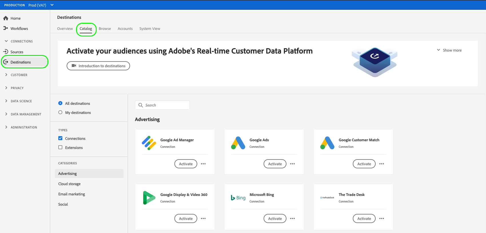

# 创建新目标连接

## 概述 {#overview}

在将受众数据发送到目标之前，您必须设置与目标平台的连接。 本文将向您展示如何使用Adobe Experience Platform用户界面设置新目标。

## 创建新目标连接 {#setup}

1. 转到 **[!UICONTROL 连接]** > **[!UICONTROL 目标]**，然后选择 **[!UICONTROL 目录]** 选项卡。

   

1. 根据您是否与目标存在连接，您可以看到 **[!UICONTROL 设置]** 或 **[!UICONTROL 激活区段]** 按钮。 有关 **[!UICONTROL 激活区段]** 和 **[!UICONTROL 设置]**，请参阅 [目录](../ui/destinations-workspace.md#catalog) 目标工作区文档的部分。

   选择 **[!UICONTROL 设置]** 或 **[!UICONTROL 激活区段]**，具体取决于您可以使用的按钮。

   

   

1. 如果已选择 **[!UICONTROL 设置]**，跳到下一步。

   如果已选择 **[!UICONTROL 激活区段]**，您现在可以看到现有目标连接的列表。

   选择 **[!UICONTROL 配置新目标]**.

   

1. 输入目标平台连接详细信息，然后选择 **[!UICONTROL 连接到目标]**.

   >[!NOTE]
   >
   >下图仅用于插图。 目标连接详细信息因目标而异。 有关目标的连接详细信息，请参阅 **连接参数** 每个 [目标目录](../catalog/overview.md) 页面(例如， [Google客户匹配](..//catalog/advertising/google-customer-match.md#parameters))。

   

1. （可选）选择要订阅的目标数据流警报。 创建数据流时，您可以订阅警报，以接收有关流运行状态、成功或失败的警报消息。 请参阅 [订阅上下文关联目标警报](alerts.md) 有关目标数据流警报的详细信息。

   

1. 选择&#x200B;**[!UICONTROL 下一步]**。

   

1. 选择适用于要导出到目标的数据的营销操作。 营销操作指示将数据导出到目标的意图。 您可以从Adobe定义的营销操作中进行选择，也可以创建自己的营销操作。 有关营销操作的更多信息，请参阅 [数据使用策略概述](../../data-governance/policies/overview.md) 页面。

   

1. 选择 **[!UICONTROL 保存并退出]** 要保存目标配置，或选择 **[!UICONTROL 下一个]** 继续访问受众数据 [激活流程](activation-overview.md).