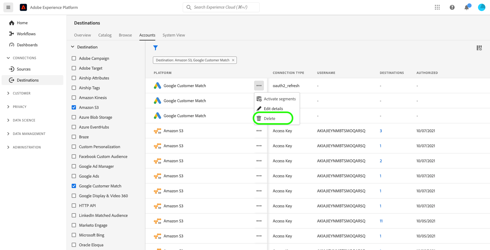

# 删除目标帐户

## 概述 {#overview}

**[!UICONTROL Accounts]**&#x200B;选项卡显示有关您与各种目标建立的连接的详细信息。 有关每个目标帐户的所有可用信息，请参阅[帐户概述](../ui/destinations-workspace.md#accounts)。

本教程介绍了使用Experience Platform UI删除不再需要的目标帐户的步骤。

## 删除帐户 {#delete}

>[!TIP]
>
>在删除目标帐户之前，必须首先删除与目标帐户关联的任何现有数据流。 要删除现有的目标数据流，请参阅有关在UI[中删除目标数据流](./delete-destinations.md)的教程。

请按照以下步骤删除现有目标帐户。

1. 转到[Experience Platform UI](https://platform.adobe.com/)，然后从左侧导航栏中选择&#x200B;**[!UICONTROL Destinations]**。 从顶部标题中选择&#x200B;**[!UICONTROL Accounts]**&#x200B;以查看现有帐户。

   

2. 选择左上角的过滤器图标以启动排序面板。 排序面板提供所有目标的列表。 您可以从列表中选择多个目标，以查看与所选目标关联的已过滤帐户选择。

   

3. 选择要删除的帐户名称旁边的省略号(`...`)。 此时将出现一个弹出面板，其中提供帐户&#x200B;**[!UICONTROL Activate audiences]**、**[!UICONTROL Edit details]**&#x200B;和&#x200B;**[!UICONTROL Delete]**&#x200B;的选项。 选择 **[!UICONTROL Delete]**&#x200B;以删除所需的帐户。

   

4. 出现最终确认对话框，选择&#x200B;**[!UICONTROL Delete]**&#x200B;以完成该过程。

## 后续步骤 {#next-steps}

您已成功使用目标工作区删除现有帐户。

有关如何使用[!DNL Flow Service] API以编程方式执行这些操作的步骤，请参阅有关使用流服务API [删除连接的教程](../api/delete-destination-account.md)
