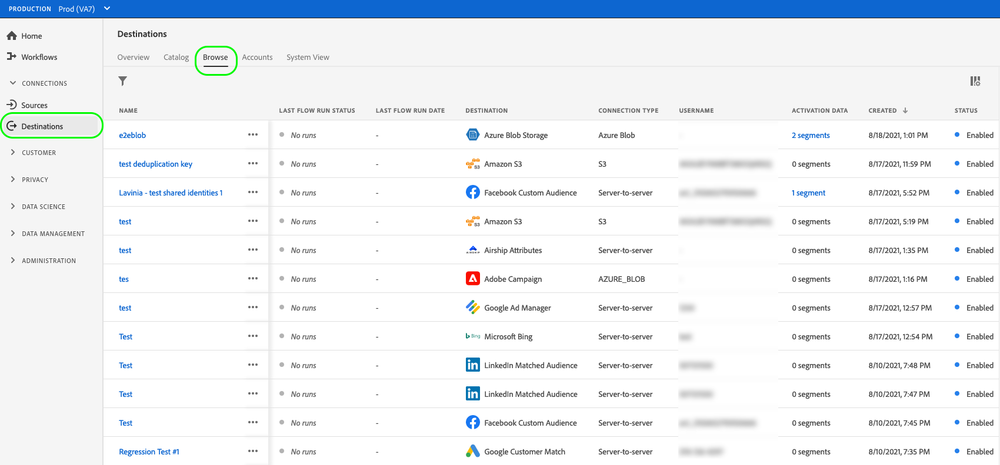
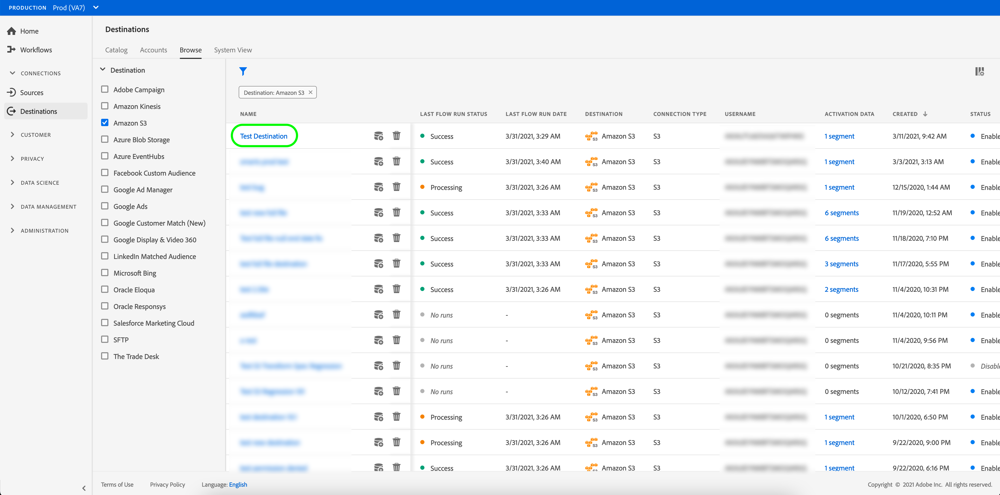
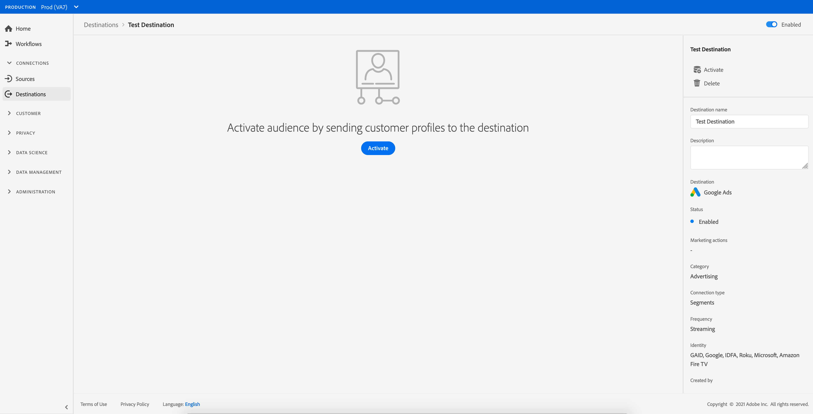

# 删除目标 {#delete-destinations}

## 概述 {#overview}

在Adobe Experience Platform用户界面中，您可以删除到目标的现有连接。

删除目标会删除指向该目标的所有现有数据流。 在删除数据流之前，激活到您删除的目标的所有受众都会取消映射。

有两种方法可以从[!DNL Experience Platform] [!DNL UI]中删除目标。 您可以：

* [从[!UICONTROL 浏览]选项卡中删除目标](#delete-browse-tab)
* [从目标详细信息页面中删除目标](#delete-destination-details-page)

## 从“浏览”选项卡中删除目标{#delete-browse-tab}

按照以下步骤从[!UICONTROL 浏览]选项卡中删除目标。

1. 登录到[Experience Platform UI](https://platform.adobe.com/)，然后从左侧导航栏中选择&#x200B;**[!UICONTROL 目标]**。 要查看现有目标，请从顶部标题中选择&#x200B;**[!UICONTROL 浏览]**。

   

2. 选择左上角的过滤器图标以启动排序面板。 排序面板提供所有目标的列表。 您可以从列表中选择多个目标，以查看与所选目标关联的数据流的过滤选择。

   

3. 在“名称”列中选择按钮，然后选择 **[!UICONTROL 删除]**&#x200B;以删除现有目标连接。
   

4. 选择&#x200B;**[!UICONTROL 删除]**&#x200B;以确认删除目标连接。

   

## 从目标详细信息页面中删除目标{#delete-destination-details-page}

按照以下步骤从目标详细信息页面中删除目标。

1. 登录到[Experience Platform UI](https://platform.adobe.com/)，然后从左侧导航栏中选择&#x200B;**[!UICONTROL 目标]**。 要查看现有目标，请从顶部标题中选择&#x200B;**[!UICONTROL 浏览]**。

   

2. 选择左上角的过滤器图标以启动排序面板。 排序面板提供所有目标的列表。 您可以从列表中选择多个目标，以查看与所选目标关联的数据流的过滤选择。

   

3. 选择要删除的目标名称。

   

   * 如果目标具有现有数据流，则您将被带到[!UICONTROL 数据流运行]选项卡。

     

   * 如果目标没有现有数据流，您将进入一个空页面，您可以在该页面开始激活受众。

     

4. 在右边栏中选择&#x200B;**[!UICONTROL 删除]**。

   

5. 在确认对话框中选择&#x200B;**[!UICONTROL 删除]**&#x200B;以删除目标。

   

   >[!NOTE]
   >
   >根据服务器负载，[!DNL Experience Platform]可能需要几分钟才能删除目标。
