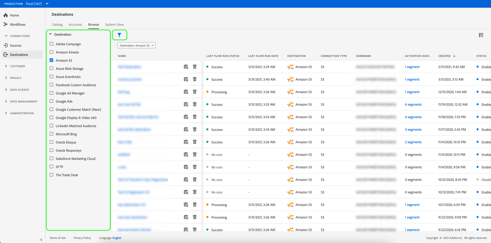
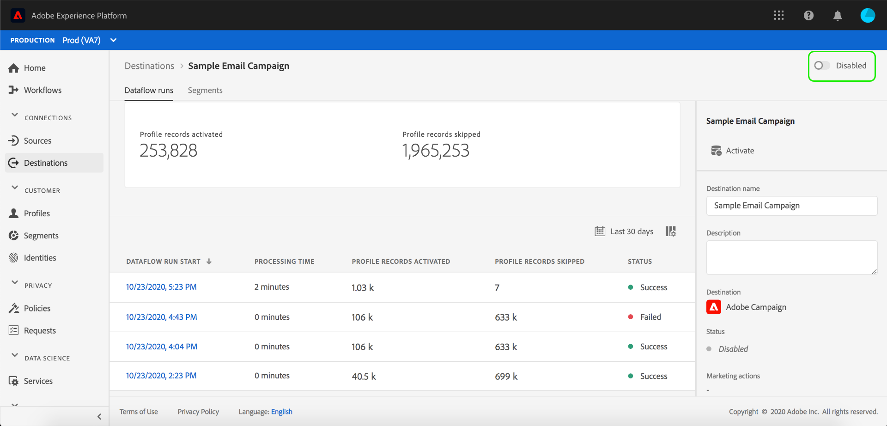

# 查看目标详细信息

## 概述 {#overview}

在Adobe Experience Platform用户界面中，您可以查看和监控目标的属性和活动。 这些详细信息包括目标的名称和ID、用于激活或禁用目标的控件等。 详细信息还包括已激活的配置文件记录、已激活、已失败和已排除的身份的量度，以及数据流运行的历史记录。

>[!NOTE]
>
>目标详细信息页面是[!DNL Experience Platform] [!DNL UI]中[!UICONTROL 目标]工作区的一部分。 有关详细信息，请参阅[[!UICONTROL 目标]工作区概述](./destinations-workspace.md)。

## 查看目标详细信息 {#view-details}

请按照以下步骤查看有关现有目标的更多详细信息。 您可以查找目标的目标ID、创建目标的用户、创建目标的时间以及其他信息。

1. 登录到[Experience Platform UI](https://platform.adobe.com/)，然后从左侧导航栏中选择&#x200B;**[!UICONTROL 目标]**。 从顶部标题中选择&#x200B;**[!UICONTROL 浏览]**&#x200B;以查看现有目标。

   

2. 选择左上角的过滤器图标以启动排序面板。 排序面板提供所有目标的列表。 您可以从列表中选择多个目标，以查看与所选目标关联的数据流的过滤选择。

   

3. 选择要显示其详细信息的目标行。 此时将显示一个右边栏，其中包含有关目标的信息，包括目标ID、创建目标连接的用户以及其他信息。

   右边栏中的

4. 或者，您可以通过选择要查看的目标&#x200B;*的名称*&#x200B;来显示有关目标的其他信息。

   

5. 目标的详细信息页面将显示在右边栏中，并显示其可用的控件。

   

## 右边栏 {#right-rail}

右边栏显示有关选定目标的基本信息。

下表介绍了右边栏提供的控件和详细信息：

| 右边栏项目 | 描述 |
| --- | --- |
| [!UICONTROL 激活受众] | 选择此控件可编辑哪些受众已映射到目标、更新导出计划或添加和删除映射的属性和身份。 有关详细信息，请参阅[将受众数据激活到受众流式目标](./activate-segment-streaming-destinations.md)、[将受众数据激活到基于个人资料的批量目标](./activate-batch-profile-destinations.md)和[将受众数据激活到基于个人资料的流式目标](./activate-streaming-profile-destinations.md)指南。 |
| [!UICONTROL 删除] | 允许您删除此数据流并取消映射之前激活的受众（如果存在）。 |
| [!UICONTROL 目标名称] | 可以编辑此字段以更新目标的名称。 |
| [!UICONTROL 描述] | 可以编辑此字段以更新或向目标添加可选描述。 |
| [!UICONTROL 目标] | 表示受众发送到的目标平台。 有关详细信息，请参阅[目标目录](../catalog/overview.md)。 |
| [!UICONTROL 状态] | 指示目标是启用还是禁用。 |
| [!UICONTROL 营销活动] | 指示出于数据管理目的而应用于此目标的营销操作（用例）。 |
| [!UICONTROL 类别] | 指示目标类型。 有关详细信息，请参阅[目标目录](../catalog/overview.md)。 |
| [!UICONTROL 连接类型] | 指示将受众发送到目标所使用的表单。 可能的值包括[!UICONTROL Cookie]和[!UICONTROL 基于配置文件的]。 |
| [!UICONTROL 频率] | 指示受众发送到目标的频率。 可能的值包括[!UICONTROL 流]和[!UICONTROL 批次]。 |
| [!UICONTROL 身份标识] | 表示目标接受的身份命名空间，如`GAID`、`IDFA`或`email`。 有关接受的身份命名空间的更多信息，请参阅[身份命名空间概述](../../identity-service/features/namespaces.md)。 |
| [!UICONTROL 创建者] | 指示创建此目标的用户。 |
| [!UICONTROL 已创建] | 指示创建此目标时的UTC日期时间。 |

{style="table-layout:auto"}

## [!UICONTROL 已启用]/[!UICONTROL 已禁用]切换 {#enabled-disabled-toggle}

您可以使用&#x200B;**[!UICONTROL 已启用]/[!UICONTROL 已禁用]**&#x200B;切换开关来开始和暂停所有数据导出到目标。

## [!UICONTROL 数据流运行] {#dataflow-runs}

[!UICONTROL 数据流运行]选项卡提供有关数据流运行的量度数据到批处理目标和流式目标。 有关详细信息和量度定义，请参阅[监视器数据流](monitor-dataflows.md)。

>[!NOTE]
>
>* Experience Platform *中除* [Adobe Target](/help/destinations/catalog/personalization/adobe-target-connection.md)、[自定义个性化](/help/destinations/catalog/personalization/custom-personalization.md)和[Experience Cloud受众](/help/destinations/catalog/adobe/experience-cloud-audiences.md)目标之外的所有目标当前都支持目标监视功能。
>* 对于[Amazon Kinesis](/help/destinations/catalog/cloud-storage/amazon-kinesis.md)、[Azure事件中心](/help/destinations/catalog/cloud-storage/azure-event-hubs.md)和[HTTP API](/help/destinations/catalog/streaming/http-destination.md)目标，估计了与排除、失败和激活的标识相关的指标。 较大量的激活数据会导致量度的准确性较高。

### 数据流运行持续时间 {#dataflow-runs-duration}

流媒体目标与基于文件的目标之间显示的数据流运行持续时间存在差异。

### 流目标 {#streaming}

尽管为大多数流数据流运行指定的&#x200B;**[!UICONTROL 处理持续时间]**&#x200B;大约为四小时（如下图所示），但任何数据流运行的实际处理时间都短得多。 数据流运行窗口会保持较长时间处于打开状态，以防Experience Platform需要重新尝试调用目标，并确保它不会错过同一时间窗口的任何延迟送达数据。

有关详细信息，请参阅监视文档中的[数据流运行到流式目标](/help/dataflows/ui/monitor-destinations.md#dataflow-runs-for-streaming-destinations)。

### 基于文件的目标 {#file-based}

对于数据流运行到基于文件的目标，**[!UICONTROL 处理持续时间]**&#x200B;取决于要导出的数据的大小和系统加载。 另请注意，数据流运行到基于文件的目标，将按受众细分。

有关详细信息，请参阅监视文档中的[数据流运行到批处理（基于文件）目标](/help/dataflows/ui/monitor-destinations.md#dataflow-runs-for-batch-destinations)。

## [!UICONTROL 激活数据] {#activation-data}

**[!UICONTROL 激活数据]**&#x200B;选项卡显示已映射到目标的受众列表，包括其开始日期和结束日期（如果适用），以及数据导出的其他相关信息，如导出类型、计划和频率。 要查看特定受众的详细信息，请从列表中选择其名称。

>[!TIP]
>
>要查看和编辑有关映射到目标的属性和身份的详细信息，请在[右边栏](#right-rail)中选择&#x200B;**[!UICONTROL 激活受众]**。

>[!BEGINSHADEBOX]

基于文件的目标的&#x200B;**[!UICONTROL 激活数据]**&#x200B;选项卡。

>[!ENDSHADEBOX]

>[!BEGINSHADEBOX]

流目标的&#x200B;**[!UICONTROL 激活数据]**&#x200B;选项卡。

>[!ENDSHADEBOX]

### 筛选激活的受众 {#filter-audiences}

要筛选激活到目标的受众列表，请在搜索框中输入受众名称。 受众列表会自动随搜索结果更新。

用于筛选受众的

### 从激活流中删除多个受众 {#bulk-remove}

要从现有激活流中删除多个受众，请选择这些受众，然后选择&#x200B;**[!UICONTROL 删除受众]**。

### 按需将多个文件导出到批处理目标 {#bulk-export}

您可以从&#x200B;**[!UICONTROL 激活数据]**&#x200B;页面[按需导出多个文件](../ui/export-file-now.md)。 为此，请选择要按需导出文件的受众，然后选择&#x200B;**[!UICONTROL 立即导出文件]**&#x200B;控件以触发一次性导出，该导出会将每个选定受众的文件传送到批处理目标。

### 编辑导出到批处理目标的多个受众的激活计划 {#bulk-edit-schedule}

要同时编辑多个受众的现有激活计划，请选择所需的受众，然后选择&#x200B;**[!UICONTROL 编辑计划]**。 有关如何定义或编辑导出计划的详细信息，请阅读[计划受众导出](../ui/activate-batch-profile-destinations.md#scheduling)部分。

>[!NOTE]
>
>有关浏览受众详细信息页面的详细信息，请参阅[受众门户概述](../../segmentation/ui/audience-portal.md#segment-details)。

### 编辑导出到批处理目标的多个受众的文件名 {#bulk-edit-file-names}

要同时编辑多个受众的导出文件名，请选择所需受众，然后选择&#x200B;**[!UICONTROL 编辑文件名]**。 有关如何定义或编辑文件名的详细信息，请阅读有关如何[配置文件名](../ui/activate-batch-profile-destinations.md#configure-file-names)部分的说明。

