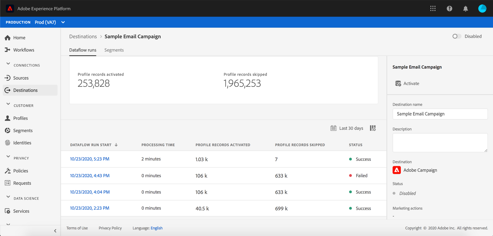

# 视图目标详细信息

在Adobe Experience Platform用户界面中，您可以视图和监视目标的属性和活动。 这些详细信息包括目标的名称和ID、用于激活或禁用目标的控件等。 批处理目标的详细信息还包括激活的用户档案记录的量度和数据流运行的历史记录。

>[!NOTE]
>
>目标详细信息页面是平台UI中[!UICONTROL 目标]工作区的一部分。 有关详细信息，请参阅[[!UICONTROL 目标]工作区概述](./destinations-workspace.md)。

在平台UI中的&#x200B;**[!UICONTROL 目标]**&#x200B;工作区中，导航到&#x200B;**[!UICONTROL 浏览]**&#x200B;选项卡，然后选择要视图的目标的名称。

此时将显示目标的详细信息页面，其中显示了其可用控件。 如果查看批处理目标的详细信息，则还会显示监视仪表板。

此外，在“浏览”选项卡上，您可以选择通过选择图标来删除选定的数据流。 在删除数据流之前，将取消映射已激活到目标的任何区段。

## 右边栏

右边栏显示有关目标的基本信息。

下表涵盖右边栏提供的控件和详细信息：

| 右边栏项目 | 描述 |
| --- | --- |
| [!UICONTROL 激活] | 选择此控件可编辑映射到目标的区段。 有关详细信息，请参阅[将区段激活到目标](./activate-destinations.md)的指南。 |
| [!UICONTROL 删除] | 允许您删除此数据流并取消映射先前激活的区段（如果有）。 |
| [!UICONTROL 目标名称] | 可以编辑此字段以更新目标的名称。 |
| [!UICONTROL 描述] | 可以编辑此字段，以更新或向目标添加可选描述。 |
| [!UICONTROL 目标] | 表示受众被发送到的目标平台。 有关详细信息，请参阅[目标目录](../catalog/overview.md)。 |
| [!UICONTROL 状态] | 指示目标是启用还是禁用。 |
| [!UICONTROL 营销活动] | 指示出于数据管理目的适用于此目标的营销操作（使用案例）。 |
| [!UICONTROL 类别] | 指示目标类型。 有关详细信息，请参阅[目标目录](../catalog/overview.md)。 |
| [!UICONTROL 连接类型] | 指示将受众发送到目标的表单。 可能的值包括&quot;[!UICONTROL Cookie]&quot;和&quot;[!UICONTROL 基于用户档案的]&quot;。 |
| [!UICONTROL 频度] | 指示受众发送到目标的频率。 可能的值包括“[!UICONTROL 流]”和“[!UICONTROL 批]”。 |
| [!UICONTROL 身份] | 表示目标接受的身份命名空间，如`GAID`、`IDFA`或`email`。 有关已接受的标识命名空间的详细信息，请参阅[标识命名空间概述](../../identity-service/namespaces.md)。 |
| [!UICONTROL 创建者] | 指示创建此目标的用户。 |
| [!UICONTROL 已创建] | 指示创建此目标时的UTC日期时间。 |

## [!UICONTROL 已启用]/已禁 用切换

可以使用&#x200B;**[!UICONTROL Enabled]/[!UICONTROL Disabled]**&#x200B;切换到开始并暂停所有导出到目标的数据。

## [!UICONTROL 数据流运行]

[!UICONTROL 数据流运行]选项卡提供数据流运行到批处理目标的度量数据。 将显示单个运行及其特定量度的列表，以及用户档案记录的以下总计：

* **[!UICONTROL 用户档案记录已激活]**:为用户档案创建或更新的激活记录的总数。
* **[!UICONTROL 用户档案记录已跳过]**:根据用户档案退出或缺少属性，为激活而跳过的用户档案记录总数。

>[!NOTE]
>
>根据目标数据流的计划频率生成数据流运行。 将为应用于区段的每个合并策略单独运行数据流。

要视图特定数据流运行的详细信息，请从列表中选择该运行的开始时间。 数据流运行的详细信息页包含其他信息，如处理的数据大小和对错误诊断的详细信息所发生的任何错误的列表。

## [!UICONTROL 激活数据] {#activation-data}

[!UICONTROL 激活数据]选项卡显示已映射到目标的区段的列表，包括其开始日期和结束日期（如果适用）。 要视图特定区段的详细信息，请从列表中选择其名称。

>[!NOTE]
>
>有关浏览区段详细信息页面的详细信息，请参阅[分段UI概述](../../segmentation/ui/overview.md#segment-details)。

## 后续步骤

此文档涵盖了目标详细信息页面的功能。 有关在UI中管理目标的详细信息，请参阅[[!UICONTROL 目标]工作区](./destinations-workspace.md)的概述。