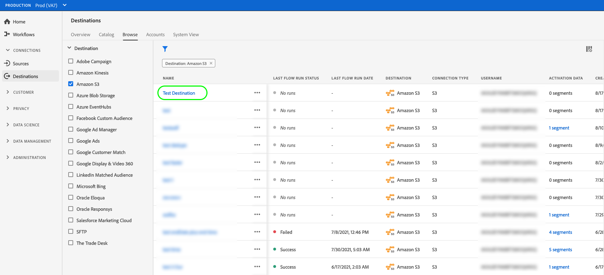

# 查看目标详细信息

## 概述 {#overview}

在Adobe Experience Platform用户界面中，您可以查看和监控目标的属性和活动。 这些详细信息包括目标的名称和ID、用于激活或禁用目标的控件等。 详细信息还包括已激活的配置文件记录、已激活、已失败和已排除的身份的量度，以及数据流运行的历史记录。

>[!NOTE]
>
>目标详细信息页面是 [!UICONTROL 目标] 中的工作区 [!DNL Platform] [!DNL UI]. 请参阅 [[!UICONTROL 目标] 工作区概述](./destinations-workspace.md) 以了解更多信息。

## 查看目标详细信息 {#view-details}

请按照以下步骤查看有关现有目标的更多详细信息。

1. 登录到 [EXPERIENCE PLATFORMUI](https://platform.adobe.com/) 并选择 **[!UICONTROL 目标]** 左侧导航栏中。 选择 **[!UICONTROL 浏览]** 查看现有目标。

   

1. 选择过滤器图标  以启动“排序”面板。 排序面板提供所有目标的列表。 您可以从列表中选择多个目标，以查看与所选目标关联的数据流的过滤选择。

   

1. 选择要查看的目标名称。

   

1. 此时将显示目标的详细信息页面，并显示其可用的控件。

   

## 右边栏 {#right-rail}

右边栏显示有关选定目标的基本信息。

下表介绍了右边栏提供的控件和详细信息：

| 右边栏项目 | 描述 |
| --- | --- |
| [!UICONTROL 激活受众] | 选择此控件可编辑哪些受众已映射到目标、更新导出计划或添加和删除映射的属性和身份。 请参阅指南 [将受众数据激活到受众流目标](./activate-segment-streaming-destinations.md)， [将受众数据激活到基于个人资料的批量目标](./activate-batch-profile-destinations.md)、和 [将受众数据激活到基于个人资料的流目标](./activate-streaming-profile-destinations.md) 以了解更多信息。 |
| [!UICONTROL 删除] | 允许您删除此数据流并取消映射之前激活的受众（如果存在）。 |
| [!UICONTROL 目标名称] | 可以编辑此字段以更新目标的名称。 |
| [!UICONTROL 描述] | 可以编辑此字段以更新或向目标添加可选描述。 |
| [!UICONTROL 目标] | 表示受众发送到的目标平台。 请参阅 [目标目录](../catalog/overview.md) 以了解更多信息。 |
| [!UICONTROL 状态] | 指示目标是启用还是禁用。 |
| [!UICONTROL 营销活动] | 指示出于数据管理目的而应用于此目标的营销操作（用例）。 |
| [!UICONTROL 类别] | 指示目标类型。 请参阅 [目标目录](../catalog/overview.md) 以了解更多信息。 |
| [!UICONTROL 连接类型] | 指示将受众发送到目标所使用的表单。 可能的值包括 [!UICONTROL Cookie] 和 [!UICONTROL 基于配置文件]. |
| [!UICONTROL 频率] | 指示受众发送到目标的频率。 可能的值包括 [!UICONTROL 流] 和 [!UICONTROL 批次]. |
| [!UICONTROL 标识] | 表示目标接受的身份命名空间，例如 `GAID`， `IDFA`，或 `email`. 有关接受的身份命名空间的更多信息，请参见 [身份命名空间概述](../../identity-service/features/namespaces.md). |
| [!UICONTROL 创建者] | 指示创建此目标的用户。 |
| [!UICONTROL 已创建] | 指示创建此目标时的UTC日期时间。 |

{style="table-layout:auto"}

## [!UICONTROL 已启用]/[!UICONTROL 已禁用] 切换 {#enabled-disabled-toggle}

您可以使用 **[!UICONTROL 已启用]/[!UICONTROL 已禁用]** 切换以开始和暂停所有到目标的数据导出。

## [!UICONTROL 数据流运行] {#dataflow-runs}

此 [!UICONTROL 数据流运行] 选项卡提供有关您的数据流运行的量度数据到批处理目标和流式目标。 请参阅 [监测数据流](monitor-dataflows.md) 以了解详细信息和量度定义。

>[!NOTE]
>
>* 当前Experience Platform中的所有目标都支持目标监视功能 *排除* 该 [Adobe Target](/help/destinations/catalog/personalization/adobe-target-connection.md)， [自定义个性化](/help/destinations/catalog/personalization/custom-personalization.md) 和 [Experience Cloud受众](/help/destinations/catalog/adobe/experience-cloud-audiences.md) 目标。
>* 对于 [Amazon Kinesis](/help/destinations/catalog/cloud-storage/amazon-kinesis.md)， [Azure事件中心](/help/destinations/catalog/cloud-storage/azure-event-hubs.md)、和 [HTTP API](/help/destinations/catalog/streaming/http-destination.md) 目标、与排除、失败和激活的标识相关的量度会被估计。 较大量的激活数据会导致量度的准确性较高。

### 数据流运行持续时间 {#dataflow-runs-duration}

流媒体目标与基于文件的目标之间显示的数据流运行持续时间存在差异。

### 流目标 {#streaming}

而 **[!UICONTROL 处理持续时间]** 如下图所示，对于大多数流数据流运行而言，指示大约四个小时，任何数据流运行的实际处理时间都短得多。 如果Experience Platform需要重新尝试调用目标，数据流运行窗口会保持较长时间处于打开状态，同时还要确保它不会错过同一时间窗口的任何延迟送达数据。

有关详细信息，请阅读关于 [数据流运行到流式目标](/help/dataflows/ui/monitor-destinations.md#dataflow-runs-for-streaming-destinations) ，位于监控文档中。

### 基于文件的目标 {#file-based}

对于要运行到基于文件的目标的数据流， **[!UICONTROL 处理持续时间]** 取决于要导出的数据的大小和系统负载。 另请注意，数据流运行到基于文件的目标，将按受众细分。

有关详细信息，请阅读关于 [数据流运行到批处理（基于文件）目标](/help/dataflows/ui/monitor-destinations.md#dataflow-runs-for-batch-destinations) ，位于监控文档中。

## [!UICONTROL 激活数据] {#activation-data}

此 [!UICONTROL 激活数据] 选项卡显示已映射到目标的受众列表，包括其开始日期和结束日期（如果适用），以及用于数据导出的其他相关信息，例如导出类型、时间表和频率。 要查看特定受众的详细信息，请从列表中选择其名称。

>[!TIP]
>
>要查看和编辑有关映射到目标的属性和身份的详细信息，请选择 **[!UICONTROL 激活受众]** 在 [右边栏](#right-rail).

>[!NOTE]
>
>有关浏览受众详细信息页面的详细信息，请参阅 [分段UI概述](../../segmentation/ui/overview.md#segment-details).
