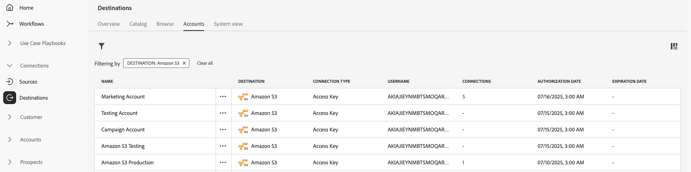

# 目标工作区 {#destinations-workspace}

在Adobe Experience Platform中，从左侧导航栏中选择&#x200B;**[!UICONTROL 目标]**&#x200B;以访问[!UICONTROL 目标]工作区。

[!UICONTROL 目标]工作区包含五个部分，[!UICONTROL 概述]、[!UICONTROL 目录]、[!UICONTROL 浏览]、[!UICONTROL 帐户]和[!UICONTROL 系统视图]，如下部分所述。

## [!UICONTROL 概述] {#overview}

**[!UICONTROL 概述]**&#x200B;选项卡显示[!UICONTROL 目标]仪表板，提供与贵组织的目标数据相关的关键量度。 若要了解详细信息，请访问[[!UICONTROL 目标]仪表板指南](../../dashboards/guides/destinations.md)。

>[!NOTE]
>
>如果您的组织是Experience Platform的新用户，并且还没有活动的目标，则[!UICONTROL 目标]仪表板和[!UICONTROL 概述]选项卡将不可见。 从左侧导航中选择[!UICONTROL 目标]将显示[[!UICONTROL 目录]选项卡](#catalog)。

## [!UICONTROL 目录] {#catalog}

**[!UICONTROL 目录]**&#x200B;选项卡显示[!DNL Experience Platform]中所有可用目标的列表，您可以将这些目标发送到这些目标。

[!DNL Experience Platform]用户界面在目标目录页面上提供了多个搜索和筛选选项：

* 使用页面上的搜索功能来查找特定目标。
* 使用[!UICONTROL 类别]控件筛选目标。
* 在[!UICONTROL 所有目标]和[!UICONTROL 我的目标]之间切换。 当您选择&#x200B;**[!UICONTROL 所有目标]**&#x200B;时，将显示所有可用的[!DNL Experience Platform]目标。 选择&#x200B;**[!UICONTROL 我的目标]**&#x200B;后，您只能查看已与之建立连接的目标。
* 选择以查看&#x200B;**[!UICONTROL 连接]**&#x200B;和/或&#x200B;**[!UICONTROL 扩展]**&#x200B;类型。 若要了解这两个类别之间的差异，请阅读[目标类型和类别](../destination-types.md)。

目标卡包含主要和次要控制选项。 主要控件包括[!UICONTROL 设置]、[!UICONTROL 激活]、[!UICONTROL 激活受众]或[!UICONTROL 导出数据集]。 辅助控件允许查看选项。 这些控制如下所述：

| 控件 | 描述 |
|---------|----------|
| [!UICONTROL 设置] | 用于创建到目标的连接。 |
| [!UICONTROL 激活] | 建立与目标之间的连接后，您可以激活受众或将数据集导出到此目标。 |
| [!UICONTROL 激活受众] | 建立与目标的连接后，即可将受众激活到此目标。 |
| [!UICONTROL 导出数据集] | 建立与目标的连接后，即可将数据集导出到此目标。 |
| [!UICONTROL 查看帐户] | 查看您为目标连接的帐户。 |
| [!UICONTROL 查看数据流] | 查看目标存在的数据激活流。 |
| [!UICONTROL 查看文档] | 打开指向该特定目标的文档页面的链接，以获取更多信息并帮助您进行设置。 |

{style="table-layout:auto"}

在目录中选择目标卡以打开右边栏。 在这里，您可以看到目标的描述。 右边栏提供了上表中描述的相同控件，包括目标的描述，以及目标类别和类型的指示。

有关目标类别和每个目标的详细信息，请参阅[目标目录](../catalog/overview.md)和[目标类型和类别](../destination-types.md)。

## [!UICONTROL 帐户] {#accounts}

**[!UICONTROL 帐户]**&#x200B;选项卡显示有关您与各种目标建立的连接的详细信息，并允许您更新或删除现有帐户详细信息。 有关各个目标帐户的所有信息，请参阅下表。

>[!TIP]
>
> * 选择[!UICONTROL Platform]列中的省略号(`...`)并使用**[!UICONTROL 激活&#x200B;]**/**[!UICONTROL &#x200B;激活受众&#x200B;]**/**[!UICONTROL &#x200B;导出数据集&#x200B;]**&#x200B;控件将受众或数据集导出到该目标。
> * 选择[!UICONTROL Platform]列中的省略号(`...`)并使用**[!UICONTROL 编辑详细信息&#x200B;]**&#x200B;控件来[更新](update-accounts.md)现有目标帐户的详细信息。
> * 选择[!UICONTROL Platform]列中的省略号(`...`)并使用**[!UICONTROL 删除&#x200B;]**&#x200B;控件来[删除](delete-destination-account.md)现有目标帐户。

| 元素 | 描述 |
|---|---|
| [!UICONTROL 目标] | 已为其设置连接的目标连接器。 |
| [!UICONTROL 连接类型] | 表示与存储段或目标的帐户连接类型。 根据目标的不同，身份验证选项有： <ul><li>对于电子邮件营销目标：可以是S3、FTP或Azure Blob。</li><li>对于实时广告目标：服务器到服务器</li><li>对于Amazon S3云存储目标：访问密钥 </li><li>对于SFTP云存储目标：SFTP的基本身份验证</li><li>OAuth 1或OAuth 2身份验证</li><li>持有者令牌身份验证</li></ul> |
| [!UICONTROL 用户名] | 您在[连接目标工作流](../catalog/email-marketing/overview.md#connect-destination)中选择的用户名。 |
| [!UICONTROL 连接] | 表示与为目标创建的基本信息连接的唯一成功目标数据流数。 |
| [!UICONTROL 授权日期] | 授权连接到此目标的日期。 |

{style="table-layout:auto"}

## [!UICONTROL 浏览] {#browse}

**[!UICONTROL 浏览]**&#x200B;选项卡显示您与之建立连接的目标。 打开&#x200B;**[!UICONTROL 已启用/已禁用]**&#x200B;切换开关的目标分别设置为活动或非活动。 您还可以通过选择&#x200B;**[!UICONTROL 受众]** > **[!UICONTROL 浏览]**&#x200B;并选择要检查的受众来查看数据流动的目标。 有关[!UICONTROL 浏览]选项卡中为每个目标提供的全部信息，请参见下表：

>[!TIP]
>
> * 选择[!UICONTROL 名称]列中的省略号(`...`)，然后使用**[!UICONTROL 激活&#x200B;]**&#x200B;控件将受众或数据集导出到该目标。
> * 选择[!UICONTROL Name]列中的省略号(`...`)并使用**[!UICONTROL Delete &#x200B;]**&#x200B;控件来[删除](delete-destinations.md)到目标的现有连接。
> * 选择[!UICONTROL Name]列中的省略号(`...`)并使用监视控件中的![视图&#x200B;]&#x200B;**监视控件中的(/help/images/icons/monitoring.png)**&#x200B;视图，在[监视仪表板](/help/dataflows/ui/monitor-destinations.md#monitoring-destinations-dashboard)中查看此目标的激活信息。
> * 选择[!UICONTROL Name]列中的省略号(`...`)并使用**[!UICONTROL 订阅警报&#x200B;]**&#x200B;控件订阅目标数据流警报。 您可以订阅警报，以接收有关流运行的状态、成功或失败的消息。 有关目标数据流警报的详细信息，请参阅[订阅上下文中的目标警报](alerts.md)。

| 元素 | 描述 |
|---------|----------|
| 名称 | 您为此目标的激活流提供的名称。 同一列包含两个控件： [!UICONTROL 激活]和[!UICONTROL 删除目标]。 |
| [!UICONTROL 上次流运行状态] | 上次数据流运行的状态。 有关数据流运行的详细信息，请参阅[查看目标详细信息](destination-details-page.md)。 |
| [!UICONTROL 上次流运行日期] | 上次数据流运行发生的时间和日期。 有关数据流运行的详细信息，请参阅[查看目标详细信息](destination-details-page.md)。 |
| [!UICONTROL 目标] | 您为激活流选择的目标平台。 |
| [!UICONTROL 连接类型] | 表示与存储段或目标的连接类型。 <ul><li>对于电子邮件营销目标：可以是S3、FTP或[!DNL Azure Blob]。</li><li>对于实时广告目标：服务器到服务器。</li><li>对于流目标：可以是[!DNL Azure Event Hubs]或[!DNL Amazon Kinesis]。</li></ul> |
| [!UICONTROL 用户名] | 您为目标流选择的帐户凭据。 |
| [!UICONTROL 激活数据] | 指示正在激活到此目标的受众数量。 选择此控件可了解有关已激活受众的更多信息。 有关已激活受众的详细信息，请参阅目标详细信息页面中的[激活数据](/help/destinations/ui/destination-details-page.md#activation-data)。 |
| [!UICONTROL 已创建] | 创建到目标的激活流的日期和UTC时间。 选择向上/向下箭头符号，按最新先或最旧先对激活流进行排序。 |
| [!UICONTROL 状态] | `Enabled`或`Disabled`。 指示是否正在将数据激活到此目标。 |

单击目标行可在右边栏中显示有关目标的更多信息，例如目标ID、描述、激活的受众数量等。

选择目标名称可查看有关激活到此目标的受众的信息。 单击&#x200B;**[!UICONTROL 编辑激活]**&#x200B;以修改或添加到发送到此目标的受众。

## [!UICONTROL 系统视图] {#system-view}

**[!UICONTROL 系统视图]**&#x200B;选项卡显示您在Adobe Experience Platform中设置的激活流的图形表示。

选择页面上显示的任何目标，然后单击&#x200B;**[!UICONTROL 查看数据流]**&#x200B;以查看有关您为每个目标设置的所有连接的信息。

