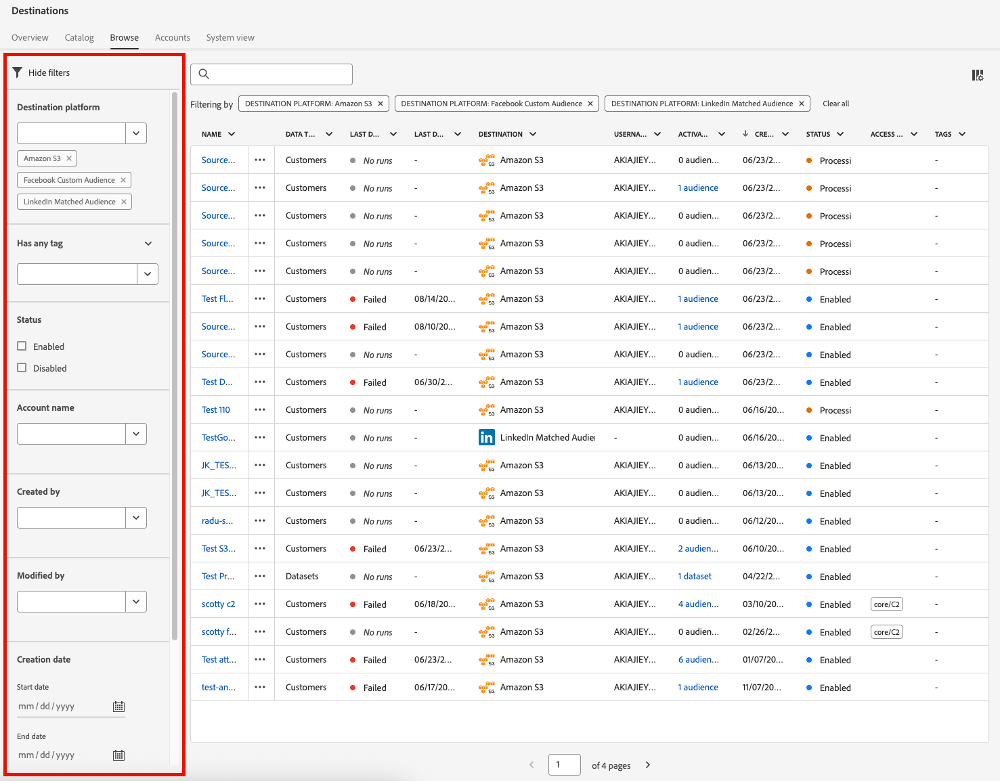
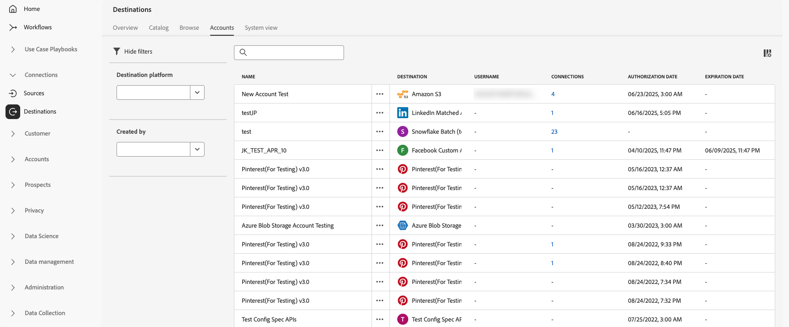
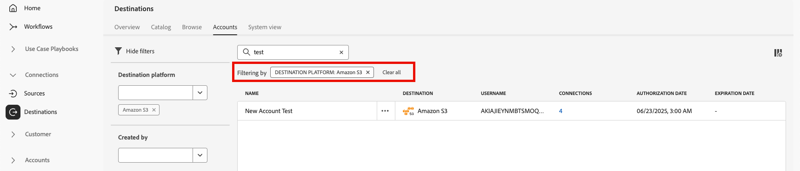

# 目标工作区 {#destinations-workspace}

在Adobe Experience Platform中，从左侧导航栏中选择&#x200B;**[!UICONTROL 目标]**&#x200B;以访问[!UICONTROL 目标]工作区。

[!UICONTROL 目标]工作区包含五个部分，[!UICONTROL 概述]、[!UICONTROL 目录]、[!UICONTROL 浏览]、[!UICONTROL 帐户]和[!UICONTROL 系统视图]，如下部分所述。

## [!UICONTROL 概述] {#overview}

**[!UICONTROL 概述]**&#x200B;选项卡显示[!UICONTROL 目标]仪表板，提供与贵组织的目标数据相关的关键量度。 若要了解详细信息，请访问[[!UICONTROL 目标]仪表板指南](../../dashboards/guides/destinations.md)。

>[!NOTE]
>
>如果您的组织是Experience Platform的新用户，并且还没有活动的目标，则[!UICONTROL 目标]仪表板和[!UICONTROL 概述]选项卡将不可见。 从左侧导航中选择[!UICONTROL 目标]将显示[[!UICONTROL 目录]选项卡](#catalog)。

## [!UICONTROL 目录] {#catalog}

**[!UICONTROL 目录]**&#x200B;选项卡显示[!DNL Experience Platform]中所有可用目标的列表，您可以将这些目标发送到这些目标。

[!DNL Experience Platform]用户界面在目标目录页面上提供了多个搜索和筛选选项：

* 使用页面上的搜索功能来查找特定目标。
* 使用&#x200B;**[!UICONTROL 类别]**&#x200B;控件筛选目标。
* 在&#x200B;**[!UICONTROL 所有目标]**&#x200B;和&#x200B;**[!UICONTROL 我的目标]**&#x200B;之间切换。 当您选择&#x200B;**[!UICONTROL 所有目标]**&#x200B;时，将显示所有可用的[!DNL Experience Platform]目标。 选择&#x200B;**[!UICONTROL 我的目标]**&#x200B;后，您只能查看已与之建立连接的目标。
* 选择以查看&#x200B;**[!UICONTROL 连接]**&#x200B;和/或&#x200B;**[!UICONTROL 扩展]**&#x200B;类型。 若要了解这两个类别之间的差异，请阅读[目标类型和类别](../destination-types.md)。
* 根据支持的[数据类型](/help/destinations/destination-sdk/functionality/destination-configuration/audience-data-type.md)筛选可用的目标。 在人员受众、帐户受众、潜在客户受众或数据集导出之间进行选择。

目标卡包含主要和次要控制选项。 主要控件包括[!UICONTROL 设置]、[!UICONTROL 激活]、[!UICONTROL 激活受众]或[!UICONTROL 导出数据集]。 辅助控件允许查看选项。 这些控制如下所述：

| 控件 | 描述 |
|---------|----------|
| [!UICONTROL 设置] | 用于创建到目标的连接。 |
| [!UICONTROL 激活] | 建立与目标之间的连接后，您可以激活受众或将数据集导出到此目标。 |
| [!UICONTROL 激活受众] | 建立与目标的连接后，即可将受众激活到此目标。 |
| [!UICONTROL 导出数据集] | 建立与目标的连接后，即可将数据集导出到此目标。 |
| [!UICONTROL 查看帐户] | 查看您为目标连接的帐户。 |
| [!UICONTROL 查看数据流] | 查看目标存在的数据激活流。 |
| [!UICONTROL 查看文档] | 打开指向该特定目标的文档页面的链接，以获取更多信息并帮助您进行设置。 |

{style="table-layout:auto"}

在目录中选择目标卡以打开右边栏。 在这里，您可以看到目标的描述。 右边栏提供了上表中描述的相同控件，包括目标的描述，以及目标类别和类型的指示。

有关目标类别和每个目标的详细信息，请参阅[目标目录](../catalog/overview.md)和[目标类型和类别](../destination-types.md)。

## [!UICONTROL 浏览] {#browse}

**[!UICONTROL 浏览]**&#x200B;选项卡显示您与之建立连接的目标。

>[!TIP]
>
> 从[搜索栏](#search-browse)开始查找特定数据流，然后使用[侧栏筛选器](#filter-options-browse)进一步缩小结果范围。

启用了&#x200B;**[!UICONTROL 已启用/已禁用]**&#x200B;切换的目标分别设置为&#x200B;**[!UICONTROL 已启用]**&#x200B;或&#x200B;**[!UICONTROL 已禁用]**。 您还可以通过选择&#x200B;**[!UICONTROL 受众]** > **[!UICONTROL 浏览]**&#x200B;并选择要检查的受众来查看数据流动的目标。

>[!TIP]
>
> 
> 
> * 选择`...`名称[!UICONTROL 列中的省略号(])，然后使用 **[!UICONTROL 激活受众]**&#x200B;控件将受众或数据集导出到该目标。
> * 选择`...`名称[!UICONTROL 列中的省略号(])，并使用**[!UICONTROL 编辑目标&#x200B;]**控件编辑现有目标连接。 有关详细信息，请阅读有关[编辑目标](/help/destinations/ui/edit-destination.md)的教程。
> * 选择`...`名称[!UICONTROL 列中的省略号(])并使用 **[!UICONTROL 编辑营销操作]**&#x200B;控件将选定目标的营销操作[更改为](/help/destinations/ui/edit-activation.md#edit-marketing-actions)。
> * 选择`...`Name[!UICONTROL 列中的省略号(])并使用 **[!UICONTROL Delete]**&#x200B;控件来[删除](delete-destinations.md)到目标的现有连接。
> * 选择`...`Name[!UICONTROL 列中的省略号(])并使用监视控件中的 **[!UICONTROL 监视控件中的视图]**&#x200B;在[监视仪表板](/help/dataflows/ui/monitor-destinations.md#monitoring-destinations-dashboard)中查看此目标的激活信息。
> * 选择`...`Name[!UICONTROL 列中的省略号(])并使用 **[!UICONTROL 订阅警报]**&#x200B;控件订阅目标数据流警报。 您可以订阅警报，以接收有关流运行的状态、成功或失败的消息。 有关目标数据流警报的详细信息，请参阅[订阅上下文中的目标警报](alerts.md)。
> * 选择`...`名称[!UICONTROL 列中的省略号(])并使用 **[!UICONTROL 管理标记]**&#x200B;控件在目标中添加或删除标记。 有关使用标记的详细信息，请参阅[管理目标标记](#manage-tags)部分。

有关[!UICONTROL 浏览]选项卡中为每个目标提供的全部信息，请参见下表。

| 元素 | 描述 |
|---------|----------|
| 名称 | 您为此目标的激活流提供的名称。 |
| 数据类型 | 目标连接支持的数据类型。 支持的数据类型： <ul><li>**[!UICONTROL 客户]**</li><li>**[!UICONTROL 潜在客户]**</li><li>**[!UICONTROL 帐户]**</li><li>**[!UICONTROL 数据集]**</li></ul> |
| [!UICONTROL 上次数据流运行状态] | 上次数据流运行的状态。 有关数据流运行的详细信息，请参阅[查看目标详细信息](destination-details-page.md)。 |
| [!UICONTROL 上次数据流运行日期] | 上次数据流运行发生的时间和日期。 有关数据流运行的详细信息，请参阅[查看目标详细信息](destination-details-page.md)。 |
| [!UICONTROL 目标] | 您为激活流选择的目标平台。 |
| [!UICONTROL 帐户到期日期] | 此目标的连接授权到期的日期。  **重要信息**：此列当前仅可用于[Facebook](../catalog/social/facebook.md)连接。 |
| [!UICONTROL 用户名] | 您为目标流选择的帐户凭据。 |
| [!UICONTROL 激活数据] | 指示正在激活到此目标的受众数量。 选择此控件可了解有关已激活受众的更多信息。 有关已激活受众的详细信息，请参阅目标详细信息页面中的[激活数据](/help/destinations/ui/destination-details-page.md#activation-data)。 |
| [!UICONTROL 已创建] | 创建到目标的激活流的日期和UTC时间。 选择向上/向下箭头符号，按最新先或最旧先对激活流进行排序。 |
| [!UICONTROL 状态] | `Enabled`或`Disabled`。 指示是否正在将数据激活到此目标。 |
| [!UICONTROL 访问标签] | 显示已添加到此目标数据流的任何访问标签。 了解有关[将访问标签应用于目标数据流](/help/access-control/abac/apply-access-labels-destinations.md)的更多信息。 |
| [!UICONTROL 标记] | 显示已添加到此目标数据流的任何标记。 使用标记来组织和分类数据流以便轻松管理。 |

单击目标行可在右边栏中显示有关目标的更多信息，例如目标ID、描述、激活的受众数量等。

选择目标名称可查看有关激活到此目标的受众的信息。 单击&#x200B;**[!UICONTROL 编辑目标]**&#x200B;以[修改目标设置](/help/destinations/ui/edit-destination.md)或&#x200B;**[!UICONTROL 激活受众]**&#x200B;以将新受众添加到数据流。

### 在浏览选项卡中过滤数据流 {#filter-browse}

**[!UICONTROL 浏览]**&#x200B;选项卡包含增强的筛选和搜索功能，可帮助您快速查找和管理目标数据流。 使用左侧边栏应用过滤器，使用搜索栏按名称查找特定数据流。

### 搜索功能 {#search-browse}

使用表顶部的搜索栏可按名称快速查找数据流。 键入内容时，结果会自动进行筛选，以仅显示匹配的数据流。

>[!NOTE]
>
> 使用搜索框搜索数据流时，结果可能包括您的[用户访问标签](/help/access-control/abac/apply-access-labels-destinations.md)限制您查看的数据流。 此行为将在以后的更新中纠正。 选择此类数据流不会在右边栏中显示信息，并且无法访问所需标签的用户无法进行任何修改，例如将受众映射到数据流或编辑其计划。

### 筛选器选项 {#filter-options-browse}

使用左侧边栏中的筛选器可缩小搜索范围。

在“浏览”选项卡中

* **[!UICONTROL 目标平台]**：按特定目标平台（如[!DNL Amazon S3]、[!DNL Facebook Custom Audience]、[!DNL LinkedIn Matched Audience]等）筛选数据流。 您可以同时选择多个平台。
* **[!UICONTROL 具有任何标记]**：已为其分配特定标记的筛选数据流。 这有助于您根据自定义标记组织和查找数据流。
* **[!UICONTROL 状态]**：按工作状态筛选数据流：
   * **[!UICONTROL 已启用]**：仅显示活动数据流
   * **[!UICONTROL 已禁用]**：仅显示非活动数据流
* **[!UICONTROL 帐户名]**：按关联的帐户名筛选数据流。 这有助于您查找连接到特定目标帐户的所有数据流。
* **[!UICONTROL 已创建]**：按创建数据流的用户筛选数据流。 使用此过滤器查找由特定团队成员创建的数据流。
* **[!UICONTROL 修改者]**：按上次修改者的用户筛选数据流。 使用此过滤器可识别特定用户最近所做的更改。
* **[!UICONTROL 创建日期]**：使用日期范围按创建日期筛选数据流：
   * **[!UICONTROL 开始日期]**：设置日期范围的开始
   * **[!UICONTROL 结束日期]**：设置日期范围的结束日期
* **[!UICONTROL 修改日期]**：使用日期范围按修改日期筛选数据流：
   * **[!UICONTROL 开始日期]**：设置日期范围的开始
   * **[!UICONTROL 结束日期]**：设置日期范围的结束日期

### 活动筛选器 {#active-filters-browse}

应用过滤器时，过滤器会在搜索栏下方显示为标记。

您可以：

* 查看所有当前活动的筛选器
* 通过单击每个筛选器标记上的`X`图标可删除单个筛选器
* 使用&#x200B;**[!UICONTROL 全部清除]**&#x200B;选项一次清除所有筛选器

### 管理目标标记 {#manage-tags}

标记可帮助您组织和分类目标数据流，以便于管理。 您可以在单个数据流中添加和删除标记，以根据业务需求对它们进行分组。

若要向数据流添加标记，请选择`...`名称&#x200B;**[!UICONTROL 列中的省略号(]**)，然后从上下文菜单中选择&#x200B;**[!UICONTROL 管理标记]**。
在**[!UICONTROL 标记]**&#x200B;字段中键入新标记的名称，然后选择&#x200B;**[!UICONTROL 保存]**&#x200B;以应用更改。

要从数据流中删除标记，请选择“`...`名称&#x200B;**[!UICONTROL ”列中的省略号(]**)，然后从上下文菜单中选择“**[!UICONTROL 管理标记]**”，然后选择要删除的标记上的`X`图标。

### 标记最佳实践 {#tag-best-practices}

请遵循以下标记准则，确保您的目标数据流保持有组织、易于查找和管理。

* **使用描述性名称**：创建明确指示数据流目的或类别的标记（例如，“营销活动”、“客户维系”、“季节性促销”）
* **保持一致**：在整个组织内使用一致的命名约定
* **保持简单**：避免创建过多标记，因为这会降低筛选的效率
* **使用分层标记**：请考虑使用前缀对相关标记进行分组（例如，“Campaign-Q4”、“Campaign-Q1”）

## [!UICONTROL 帐户] {#accounts}

**[!UICONTROL 帐户]**&#x200B;选项卡显示有关您与各种目标建立的连接的详细信息，并允许您更新或删除现有帐户详细信息。 有关各个目标帐户的所有信息，请参阅下表。

>[!TIP]
>
> * 选择`...`Platform[!UICONTROL 列中的省略号(])并使用**[!UICONTROL 激活&#x200B;]**/**[!UICONTROL &#x200B;激活受众&#x200B;]**/**[!UICONTROL &#x200B;导出数据集&#x200B;]**控件将受众或数据集导出到该目标。
> * 选择`...`Platform[!UICONTROL 列中的省略号(])并使用**[!UICONTROL 编辑详细信息&#x200B;]**控件来[更新](update-accounts.md)现有目标帐户的详细信息。
> * 选择`...`Platform[!UICONTROL 列中的省略号(])并使用**[!UICONTROL 删除&#x200B;]**控件来[删除](delete-destination-account.md)现有目标帐户。

| 元素 | 描述 |
|---|---|
| [!UICONTROL 名称] | [设置](connect-destination.md#authenticate)目标时分配给目标帐户的名称。 |
| [!UICONTROL 目标] | 已为其设置连接的目标连接器。 |
| [!UICONTROL 连接类型] | 表示与存储段或目标的帐户连接类型。 根据目标的不同，身份验证选项有： <ul><li>对于电子邮件营销目标：可以是S3、FTP或Azure Blob。</li><li>对于实时广告目标：服务器到服务器</li><li>对于Amazon S3云存储目标：访问密钥 </li><li>对于SFTP云存储目标：SFTP的基本身份验证</li><li>OAuth 1或OAuth 2身份验证</li><li>持有者令牌身份验证</li></ul> |
| [!UICONTROL 用户名] | 您在[连接目标工作流](../catalog/email-marketing/overview.md#connect-destination)中选择的用户名。 |
| [!UICONTROL 连接] | 表示与为目标创建的基本信息连接的唯一成功目标数据流数。 |
| [!UICONTROL 授权日期] | 授权连接到此目标的日期。 |
| [!UICONTROL 到期日期] | 此目标的连接授权到期的日期。  **重要信息**：此列当前仅适用于[Facebook](../catalog/social/facebook.md)、[LinkedIn](../catalog/social/linkedin.md)和[LinkedIn匹配的受众](../catalog/social/linkedin-b2b.md)连接。 |

{style="table-layout:auto"}

### 筛选帐户 {#filter-accounts}

**[!UICONTROL 帐户]**&#x200B;选项卡包含增强的筛选和搜索功能，可帮助您快速查找和管理目标帐户。 使用左侧边栏应用过滤器，使用搜索栏按名称查找特定帐户。

#### 搜索帐户 {#search-accounts}

使用表顶部的搜索栏可按名称快速查找帐户。 键入时，结果会自动进行筛选，以仅显示匹配的帐户。

#### 筛选器选项 {#filter-options-accounts}

使用左侧边栏中的筛选器可缩小搜索范围。

* **[!UICONTROL 目标平台]**：按特定目标平台筛选帐户（例如： [!DNL Microsoft Bing]、[!DNL Amazon S3]、[!DNL Facebook Custom Audiences]、[!DNL LinkedIn Matched Audiences]等）。 您可以同时选择多个平台。
* **[!UICONTROL 创建者]**：按创建帐户的用户筛选帐户。 使用此筛选器查找由特定团队成员创建的帐户。

#### 活动筛选器 {#active-filters-accounts}

应用过滤器时，过滤器会在搜索栏下方显示为标记。

您可以：

* 查看所有当前活动的筛选器
* 通过单击每个筛选器标记上的`X`图标可删除单个筛选器
* 使用&#x200B;**[!UICONTROL 全部清除]**&#x200B;选项一次清除所有筛选器

## [!UICONTROL 系统视图] {#system-view}

**[!UICONTROL 系统视图]**&#x200B;选项卡显示您在Adobe Experience Platform中设置的激活流的图形表示。

选择页面上显示的任何目标，然后单击&#x200B;**[!UICONTROL 查看数据流]**&#x200B;以查看有关您为每个目标设置的所有连接的信息。

