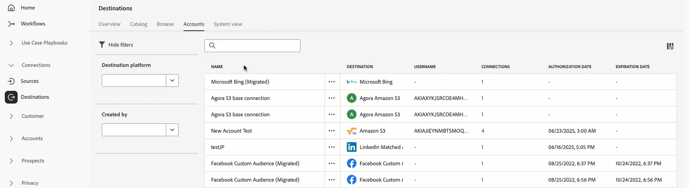

# 目标工作区 {#destinations-workspace}

在Adobe Experience Platform中，从左侧导航栏中选择&#x200B;**[!UICONTROL Destinations]**&#x200B;以访问[!UICONTROL Destinations]工作区。

[!UICONTROL Destinations]工作区由[!UICONTROL Overview]、[!UICONTROL Catalog]、[!UICONTROL Browse]、[!UICONTROL Accounts]和[!UICONTROL System View]五个部分组成，具体说明见以下部分。

## [!UICONTROL Overview] {#overview}

**[!UICONTROL Overview]**&#x200B;选项卡显示[!UICONTROL Destinations]仪表板，提供与贵组织目标数据相关的关键量度。 若要了解详细信息，请访问[[!UICONTROL Destinations]仪表板指南](../../dashboards/guides/destinations.md)。

>[!NOTE]
>
>如果您的组织是Experience Platform的新用户，并且还没有有效的目标，则[!UICONTROL Destinations]仪表板和[!UICONTROL Overview]选项卡将不可见。 从左侧导航中选择[!UICONTROL Destinations]将显示[[!UICONTROL Catalog]选项卡](#catalog)。

## [!UICONTROL Catalog] {#catalog}

**[!UICONTROL Catalog]**&#x200B;选项卡显示[!DNL Experience Platform]中可用的所有目标列表，您可以将这些目标发送到这些目标。

[!DNL Experience Platform]用户界面在目标目录页面上提供了多个搜索和筛选选项：

* 使用页面上的搜索功能来查找特定目标。
* 使用&#x200B;**[!UICONTROL Categories]**&#x200B;控件筛选目标。
* 在&#x200B;**[!UICONTROL All destinations]**&#x200B;和&#x200B;**[!UICONTROL My destinations]**&#x200B;之间切换。 选择&#x200B;**[!UICONTROL All destinations]**&#x200B;后，将显示所有可用的[!DNL Experience Platform]目标。 选择&#x200B;**[!UICONTROL My destinations]**&#x200B;后，您只能查看已与之建立连接的目标。
* 选择以查看&#x200B;**[!UICONTROL Connections]**&#x200B;和/或&#x200B;**[!UICONTROL Extensions]**&#x200B;类型。 若要了解这两个类别之间的差异，请阅读[目标类型和类别](../destination-types.md)。
* 根据支持的[数据类型](/help/destinations/destination-sdk/functionality/destination-configuration/audience-data-type.md)筛选可用的目标。 在人员受众、帐户受众、潜在客户受众或数据集导出之间进行选择。

目标卡包含主要和次要控制选项。 主控件包括[!UICONTROL Set up]、[!UICONTROL Activate]、[!UICONTROL Activate audiences]或[!UICONTROL Export datasets]。 辅助控件允许查看选项。 这些控制如下所述：

| 控件 | 描述 |
|---------|----------|
| [!UICONTROL Set up] | 用于创建到目标的连接。 |
| [!UICONTROL Activate] | 建立与目标之间的连接后，您可以激活受众或将数据集导出到此目标。 |
| [!UICONTROL Activate audiences] | 建立与目标的连接后，即可将受众激活到此目标。 |
| [!UICONTROL Export datasets] | 建立与目标的连接后，即可将数据集导出到此目标。 |
| [!UICONTROL View account] | 查看您为目标连接的帐户。 |
| [!UICONTROL View dataflows] | 查看目标存在的数据激活流。 |
| [!UICONTROL View documentation] | 打开指向该特定目标的文档页面的链接，以获取更多信息并帮助您进行设置。 |

{style="table-layout:auto"}

在目录中选择目标卡以打开右边栏。 在这里，您可以看到目标的描述。 右边栏提供了上表中描述的相同控件，包括目标的描述，以及目标类别和类型的指示。

有关目标类别和每个目标的详细信息，请参阅[目标目录](../catalog/overview.md)和[目标类型和类别](../destination-types.md)。

## [!UICONTROL Browse] {#browse}

>[!NOTE]
>
>由于访问标签配置，用户无权访问的目标数据流可能会以灰色状态显示在UI中。 有关详细信息，请阅读有关[使用访问标签管理用户对目标数据流](../../access-control/abac/apply-access-labels-destinations.md#important-callouts-and-items-to-know)的访问权限的文档。

**[!UICONTROL Browse]**&#x200B;选项卡显示您与之建立连接的目标。

>[!TIP]
>
> 从[搜索栏](#search-browse)开始查找特定数据流，然后使用[侧栏筛选器](#filter-options-browse)进一步缩小结果范围。

打开了&#x200B;**[!UICONTROL Enabled/Disabled]**&#x200B;切换的目标分别将目标设置为&#x200B;**[!UICONTROL Enabled]**&#x200B;或&#x200B;**[!UICONTROL Disabled]**。 您还可以通过选择&#x200B;**[!UICONTROL Audiences]** > **[!UICONTROL Browse]**&#x200B;并选择要检查的受众来查看数据流动的目标。

>[!TIP]
>
> 
> 
> * 选择`...`列中的省略号([!UICONTROL Name])并使用 **[!UICONTROL Activate audiences]**&#x200B;控件将受众或数据集导出到该目标。
> * 选择`...`列中的省略号([!UICONTROL Name])并使用**[!UICONTROL Edit destination]**&#x200B;控件编辑现有目标连接。 有关详细信息，请阅读有关[编辑目标](/help/destinations/ui/edit-destination.md)的教程。
> * 选择`...`列中的省略号([!UICONTROL Name])，并使用 **[!UICONTROL Edit marketing actions]**&#x200B;控件将所选目标的营销操作[更改为](/help/destinations/ui/edit-activation.md#edit-marketing-actions)。
> * 选择`...`列中的省略号([!UICONTROL Name])并使用 **[!UICONTROL Delete]**&#x200B;控件来[删除](delete-destinations.md)到目标的现有连接。
> * 选择`...`列中的省略号([!UICONTROL Name])并使用监视控件中的 **[!UICONTROL View in monitoring]**&#x200B;控件在[监视仪表板](/help/dataflows/ui/monitor-destinations.md#monitoring-destinations-dashboard)中查看此目标的激活信息。
> * 选择`...`列中的省略号([!UICONTROL Name])并使用 **[!UICONTROL Subscribe to alerts]**&#x200B;控件订阅目标数据流警报。 您可以订阅警报，以接收有关流运行的状态、成功或失败的消息。 有关目标数据流警报的详细信息，请参阅[订阅上下文中的目标警报](alerts.md)。
> * 选择`...`列中的省略号([!UICONTROL Name])并使用 **[!UICONTROL Manage tags]**&#x200B;控件在目标中添加或删除标记。 有关使用标记的详细信息，请参阅[管理目标标记](#manage-tags)部分。

有关[!UICONTROL Browse]选项卡中为每个目标提供的所有信息，请参见下表。

| 元素 | 描述 |
|---------|----------|
| 名称 | 您为此目标的激活流提供的名称。 |
| 数据类型 | 目标连接支持的数据类型。 支持的数据类型： <ul><li>**[!UICONTROL Customers]**</li><li>**[!UICONTROL Prospects]**</li><li>**[!UICONTROL Accounts]**</li><li>**[!UICONTROL Datasets]**</li></ul> |
| [!UICONTROL Last Dataflow Run Status] | 上次数据流运行的状态。 有关数据流运行的详细信息，请参阅[查看目标详细信息](destination-details-page.md)。 |
| [!UICONTROL Last Dataflow Run Date] | 上次数据流运行发生的时间和日期。 选择列标题以访问排序选项(**[!UICONTROL Sort Ascending]**， **[!UICONTROL Sort Descending]**)。 有关数据流运行的详细信息，请参阅[查看目标详细信息](destination-details-page.md)。 |
| [!UICONTROL Destination] | 您为激活流选择的目标平台。 |
| [!UICONTROL Account Expiration Date] | 此目标的连接授权到期的日期。  警告图标会在过期日期之前显示，提醒您连接将过期，可能需要续订。 过期连接的数据流已停止，您必须重新进行身份验证才能继续激活工作流。  **重要信息**：此列当前仅适用于[Pinterest](../catalog/advertising/pinterest.md)、[LinkedIn](../catalog/social/linkedin.md)和[LinkedIn匹配的受众](../catalog/social/linkedin-b2b.md)连接。  {width="100" zoomable="yes" alt="Screenshot showing the account expiration warning icon and expiration date in the Browse tab."} |
| [!UICONTROL Username] | 您为目标流选择的帐户凭据。 |
| [!UICONTROL Activation Data] | 指示正在激活到此目标的受众数量。 选择此控件可了解有关已激活受众的更多信息。 有关已激活受众的详细信息，请参阅目标详细信息页面中的[激活数据](/help/destinations/ui/destination-details-page.md#activation-data)。 |
| [!UICONTROL Created] | 创建到目标的激活流的日期和时间。 选择向上/向下箭头符号，按最新先或最旧先对激活流进行排序。 |
| [!UICONTROL Modified] | 上次修改指向目标的激活流的日期和时间。 |
| [!UICONTROL Status] | `Enabled`或`Disabled`。 指示是否正在将数据激活到此目标。 |
| [!UICONTROL Access labels] | 显示已添加到此目标数据流的任何访问标签。 了解有关[将访问标签应用于目标数据流](/help/access-control/abac/apply-access-labels-destinations.md)的更多信息。 |
| [!UICONTROL Tags] | 显示已添加到此目标数据流的任何标记。 使用标记来组织和分类数据流以便轻松管理。 |

单击目标行可在右边栏中显示有关目标的更多信息，例如目标ID、描述、激活的受众数量等。

选择目标名称可查看有关激活到此目标的受众的信息。 单击&#x200B;**[!UICONTROL Edit destination]**&#x200B;以[修改目标设置](/help/destinations/ui/edit-destination.md)或&#x200B;**[!UICONTROL Activate audiences]**&#x200B;以将新受众添加到数据流。

### 在浏览选项卡中过滤数据流 {#filter-browse}

**[!UICONTROL Browse]**&#x200B;选项卡包含增强的筛选和搜索功能，可帮助您快速查找和管理目标数据流。 使用左侧边栏应用过滤器，使用搜索栏按名称查找特定数据流。

### 搜索功能 {#search-browse}

使用表顶部的搜索栏可按名称快速查找数据流。 键入内容时，结果会自动进行筛选，以仅显示匹配的数据流。

### 筛选器选项 {#filter-options-browse}

使用左侧边栏中的筛选器可缩小搜索范围。

在“浏览”选项卡中

* **[!UICONTROL Destination platform]**：按特定目标平台（例如，[!DNL Amazon S3]、[!DNL Facebook Custom Audience]、[!DNL LinkedIn Matched Audience]等）筛选数据流。 您可以同时选择多个平台。
* **[!UICONTROL Has any tag]**：筛选已为其分配特定标记的数据流。 这有助于您根据自定义标记组织和查找数据流。
* **[!UICONTROL Status]**：按工作状态筛选数据流：
   * **[!UICONTROL Enabled]**：仅显示活动数据流
   * **[!UICONTROL Disabled]**：仅显示不活动的数据流
* **[!UICONTROL Account name]**：按关联的帐户名筛选数据流。 这有助于您查找连接到特定目标帐户的所有数据流。
* **[!UICONTROL Created]**：按创建数据流的用户筛选数据流。 使用此过滤器查找由特定团队成员创建的数据流。
* **[!UICONTROL Modified by]**：按上次修改它们的用户筛选数据流。 使用此过滤器可识别特定用户最近所做的更改。
* **[!UICONTROL Creation date]**：使用日期范围按创建日期筛选数据流：
   * **[!UICONTROL Start date]**：设置日期范围的开始
   * **[!UICONTROL End date]**：设置日期范围的结尾
* **[!UICONTROL Modified date]**：使用日期范围按修改日期筛选数据流：
   * **[!UICONTROL Start date]**：设置日期范围的开始
   * **[!UICONTROL End date]**：设置日期范围的结尾

### 活动筛选器 {#active-filters-browse}

应用过滤器时，过滤器会在搜索栏下方显示为标记。

您可以：

* 查看所有当前活动的筛选器
* 通过单击每个筛选器标记上的`X`图标可删除单个筛选器
* 使用&#x200B;**[!UICONTROL Clear all]**&#x200B;选项一次清除所有筛选器

### 管理目标标记 {#manage-tags}

标记可帮助您组织和分类目标数据流，以便于管理。 您可以在单个数据流中添加和删除标记，以根据业务需求对它们进行分组。

要将标记添加到数据流，请在`...`列中选择省略号(**[!UICONTROL Name]**)，然后从上下文菜单中选择&#x200B;**[!UICONTROL Manage tags]**。
在&#x200B;**[!UICONTROL Tags]**&#x200B;字段中键入新标记的名称，然后选择&#x200B;**[!UICONTROL Save]**&#x200B;以应用更改。

要从数据流中删除标记，请选择`...`列中的省略号(**[!UICONTROL Name]**)并从上下文菜单中选择&#x200B;**[!UICONTROL Manage tags]**，然后选择要删除的标记上的`X`图标。

### 标记最佳实践 {#tag-best-practices}

请遵循以下标记准则，确保您的目标数据流保持有组织、易于查找和管理。

* **使用描述性名称**：创建明确指示数据流目的或类别的标记（例如，“营销活动”、“客户维系”、“季节性促销”）
* **保持一致**：在整个组织内使用一致的命名约定
* **保持简单**：避免创建过多标记，因为这会降低筛选的效率
* **使用分层标记**：请考虑使用前缀对相关标记进行分组（例如，“Campaign-Q4”、“Campaign-Q1”）

## [!UICONTROL Accounts] {#accounts}

**[!UICONTROL Accounts]**&#x200B;选项卡显示有关您与各种目标建立的连接的详细信息，并允许您更新或删除现有帐户详细信息。 有关各个目标帐户的所有信息，请参阅下表。

>[!TIP]
>
> * 选择`...`列中的省略号([!UICONTROL Platform])并使用**[!UICONTROL Activate]**/**[!UICONTROL Activate audiences]**/**[!UICONTROL Export datasets]**&#x200B;控件将受众或数据集导出到该目标。
> * 选择`...`列中的省略号([!UICONTROL Platform])并使用**[!UICONTROL Edit details]**&#x200B;控件来[更新](update-accounts.md)现有目标帐户的详细信息。
> * 选择`...`列中的省略号([!UICONTROL Platform])并使用**[!UICONTROL Delete]**&#x200B;控件来[删除](delete-destination-account.md)现有目标帐户。

| 元素 | 描述 |
|---|---|
| [!UICONTROL Name] | [设置](connect-destination.md#authenticate)目标时分配给目标帐户的名称。 选择列标题以访问排序选项(**[!UICONTROL Sort Ascending]**， **[!UICONTROL Sort Descending]**)。 |
| [!UICONTROL Destination] | 已为其设置连接的目标连接器。 |
| [!UICONTROL Connection Type] | 表示与存储段或目标的帐户连接类型。 根据目标的不同，身份验证选项有： <ul><li>对于电子邮件营销目标：可以是S3、FTP或Azure Blob。</li><li>对于实时广告目标：服务器到服务器</li><li>对于Amazon S3云存储目标：访问密钥 </li><li>对于SFTP云存储目标：SFTP的基本身份验证</li><li>OAuth 1或OAuth 2身份验证</li><li>持有者令牌身份验证</li></ul> |
| [!UICONTROL Username] | 您在[连接目标工作流](../catalog/email-marketing/overview.md#connect-destination)中选择的用户名。 |
| [!UICONTROL Connections] | 表示与为目标创建的基本信息连接的唯一成功目标数据流数。 |
| [!UICONTROL Authorization date] | 授权连接到此目标的日期。 |
| [!UICONTROL Expiration date] | 此目标的连接授权到期的日期。  警告图标在过期日期之前出现，以提醒您连接将过期，可能需要续订。 过期连接的数据流已停止，您必须重新进行身份验证才能继续激活工作流。  **重要信息**：此列当前仅适用于[Pinterest](../catalog/advertising/pinterest.md)、[LinkedIn](../catalog/social/linkedin.md)和[LinkedIn匹配的受众](../catalog/social/linkedin-b2b.md)连接。  {width="100" zoomable="yes"} |

{style="table-layout:auto"}

### 筛选帐户 {#filter-accounts}

**[!UICONTROL Accounts]**&#x200B;选项卡包含增强的筛选和搜索功能，可帮助您快速查找和管理目标帐户。 使用左侧边栏应用过滤器，使用搜索栏按名称查找特定帐户。

#### 搜索帐户 {#search-accounts}

使用表顶部的搜索栏可按名称快速查找帐户。 键入时，结果会自动进行筛选，以仅显示匹配的帐户。

#### 筛选器选项 {#filter-options-accounts}

使用左侧边栏中的筛选器可缩小搜索范围。

* **[!UICONTROL Destination platform]**：按特定目标平台筛选帐户（例如： [!DNL Microsoft Bing]、[!DNL Amazon S3]、[!DNL Facebook Custom Audiences]、[!DNL LinkedIn Matched Audiences]等）。 您可以同时选择多个平台。
* **[!UICONTROL Created by]**：按创建帐户的用户筛选帐户。 使用此筛选器查找由特定团队成员创建的帐户。

#### 活动筛选器 {#active-filters-accounts}

应用过滤器时，过滤器会在搜索栏下方显示为标记。

您可以：

* 查看所有当前活动的筛选器
* 通过单击每个筛选器标记上的`X`图标可删除单个筛选器
* 使用&#x200B;**[!UICONTROL Clear all]**&#x200B;选项一次清除所有筛选器

## [!UICONTROL System View] {#system-view}

**[!UICONTROL System View]**&#x200B;选项卡以图形方式显示您在Adobe Experience Platform中设置的激活流程。

选择页面上显示的任何目标，然后单击&#x200B;**[!UICONTROL View dataflows]**&#x200B;以查看有关您为每个目标设置的所有连接的信息。

