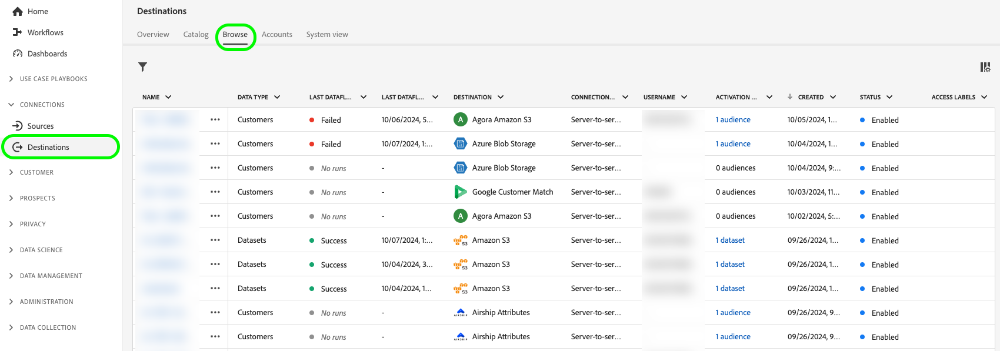
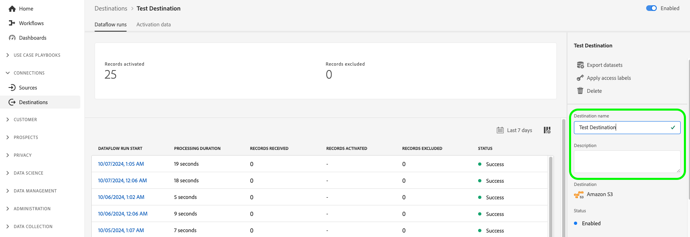

# 编辑激活数据流 {#edit-activation-flows}

在Adobe Experience Platform中，您可以将现有激活数据流的各个组件配置为发送到目标，例如：

* [启用或禁用](#enable-disable-dataflows)激活数据流
* [向激活数据流添加其他受众](#add-audiences)
* [编辑映射的属性和身份](#edit-mapped-attributes)
* [编辑激活计划和导出频率](#edit-schedule-frequency)
* [添加其他数据集](#add-datasets)到激活工作流
* [编辑激活数据流的营销操作](#edit-marketing-actions)
* [将访问标签](#apply-access-labels)应用于导出的数据
* [编辑激活数据流的名称和描述](#edit-names-descriptions)

## 浏览激活数据流 {#browse-activation-dataflows}

按照以下步骤浏览现有的激活数据流并识别要编辑的数据流。

1. 登录到[Experience Platform UI](https://platform.adobe.com/)，然后从左侧导航栏中选择&#x200B;**[!UICONTROL Destinations]**。 从顶部标题中选择&#x200B;**[!UICONTROL Browse]**&#x200B;以查看现有目标数据流。

   

2. 选择左上角的过滤器图标以启动排序面板。 排序面板提供所有目标的列表。 您可以从列表中选择多个目标，以查看与所选目标关联的数据流的过滤选择。

   

3. 选择要编辑的目标数据流的名称。

   

4. 此时将显示目标的&#x200B;**[!UICONTROL Dataflow runs]**&#x200B;页面，并显示其可用的控件。 根据目标类型，您可以执行各种数据流操作。 有关每个支持的数据流操作，请参阅以下部分。

## 启用或禁用激活数据流 {#enable-disable-dataflows}

使用&#x200B;**[!UICONTROL Enabled]/[!UICONTROL Disabled]**&#x200B;切换开关开始或暂停所有数据导出到目标。

## 将受众添加到激活数据流 {#add-audiences}

在右边栏中选择&#x200B;**[!UICONTROL Activate audiences]**&#x200B;以更改要发送到目标的受众。 此操作会将您转到激活工作流。

在激活工作流的&#x200B;**[!UICONTROL Select audiences]**&#x200B;步骤中，您可以移除现有受众或向激活工作流中添加新受众。

激活工作流会因目标类型而略有不同。 有关每种目标类型的激活工作流的更多信息，请阅读以下指南：

* [将受众激活到流式目标](./activate-segment-streaming-destinations.md)（例如，Facebook或Twitter）；
* [将受众激活到批量配置文件导出目标](./activate-batch-profile-destinations.md)(例如Amazon S3或Oracle Eloqua)；
* [将受众激活到流式配置文件导出目标](./activate-streaming-profile-destinations.md)(例如，HTTP API或Amazon Kinesis)。

## 编辑激活计划和导出频率 {#edit-schedule-frequency}

在右边栏中选择&#x200B;**[!UICONTROL Activate audiences]**。 此操作会将您转到激活工作流。

选择激活工作流中的&#x200B;**[!UICONTROL Scheduling]**&#x200B;步骤以编辑数据流的激活计划和导出频率。 此步骤允许您配置将数据导出到目标的频率。

在激活工作流的&#x200B;**[!UICONTROL Scheduling]**&#x200B;步骤中，您可以：

* 调整导出频率。
* 设置或修改激活数据流的开始和结束日期等。

您可以执行的计划操作因目标类型而异。 有关每种目标类型的激活工作流的更多信息，请阅读以下指南：

* [将受众激活到流式目标](./activate-segment-streaming-destinations.md)（例如，Facebook或Twitter）；
* [将受众激活到批量配置文件导出目标](./activate-batch-profile-destinations.md)(例如Amazon S3或Oracle Eloqua)；
* [将受众激活到流式配置文件导出目标](./activate-streaming-profile-destinations.md)(例如，HTTP API或Amazon Kinesis)。

## 编辑映射的属性和身份 {#edit-mapped-attributes}

在右边栏中选择&#x200B;**[!UICONTROL Activate audiences]**。 此操作会将您转到激活工作流。

选择激活工作流中的&#x200B;**[!UICONTROL Mapping]**&#x200B;步骤以编辑激活数据流的映射属性和标识。 这允许您调整应将哪些配置文件属性和身份导出到目标。

在激活工作流的&#x200B;**[!UICONTROL Mapping]**&#x200B;步骤中，您可以：

* 向映射添加新属性或标识。
* 从映射中删除现有属性或标识。
* 调整映射顺序以定义导出文件中的列顺序。

激活工作流会因目标类型而略有不同。 有关每种目标类型的激活工作流的更多信息，请阅读以下指南：

* [将受众激活到流式目标](./activate-segment-streaming-destinations.md)（例如，Facebook或Twitter）；
* [将受众激活到批量配置文件导出目标](./activate-batch-profile-destinations.md)(例如Amazon S3或Oracle Eloqua)；
* [将受众激活到流式配置文件导出目标](./activate-streaming-profile-destinations.md)(例如，HTTP API或Amazon Kinesis)。

## 将数据集添加到激活数据流 {#add-datasets}

在右边栏中选择&#x200B;**[!UICONTROL Export datasets]**&#x200B;以选择要导出到目标的附加数据集。 此选项会将您转到[数据集导出工作流](export-datasets.md)。

>[!NOTE]
>
>此选项仅对支持数据集导出[的](export-datasets.md#supported-destinations)目标可见。

## 编辑市场营销操作 {#edit-marketing-actions}

>[!IMPORTANT]
>
>要编辑营销操作，您需要&#x200B;**[!UICONTROL Activate Destinations]**&#x200B;和&#x200B;**[!UICONTROL Manage Destinations]** [访问控制权限](/help/access-control/home.md#permissions)。 阅读[访问控制概述](/help/access-control/ui/overview.md)或联系您的产品管理员以获取所需的权限。

您可以添加或删除在最初连接到目标时设置的营销操作。

在右边栏中选择&#x200B;**[!UICONTROL Edit marketing actions]**&#x200B;以打开营销操作选择屏幕。

选择适用的营销操作，然后选择&#x200B;**[!UICONTROL Save]**&#x200B;以应用更改。

## 应用访问标签 {#apply-access-labels}

选择&#x200B;**[!UICONTROL Apply access labels]**&#x200B;以编辑导出数据的数据使用标签。 请参阅[数据使用标签文档](../../data-governance/labels/overview.md)以了解更多信息。

## 编辑激活数据流名称和描述 {#edit-names-descriptions}

要编辑激活数据流名称和描述，请使用&#x200B;**[!UICONTROL Destination name]**&#x200B;和&#x200B;**[!UICONTROL Description]**&#x200B;字段。

## 后续步骤 {#next-steps}

通过完成本教程，您已成功使用&#x200B;**[!UICONTROL destinations]**&#x200B;工作区来更新现有的目标数据流。

有关目标的详细信息，请参阅[目标概述](../catalog/overview.md)。
