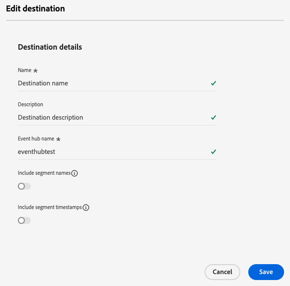

# 编辑目标

了解如何编辑现有目标连接的各种组件，包括如何使用Experience Platform UI更新身份验证凭据、导出位置等。

>[!NOTE]
>
> 此外，还通过API操作支持本教程中描述的编辑操作。 阅读有关如何[编辑API中的目标](/help/destinations/api/edit-destination.md)的教程以了解更多信息。

## 先决条件 {#prerequisites}

要编辑目标连接，您需要&#x200B;**[!UICONTROL Manage Destinations]** [访问控制权限](/help/access-control/home.md#permissions)。 阅读[访问控制概述](/help/access-control/ui/overview.md)或联系您的产品管理员以获取所需的权限。

## 编辑目标连接 {#edit}

要编辑现有目标连接的各种组件，请执行以下操作：

1. 导航到&#x200B;**[!UICONTROL Destinations]** > **[!UICONTROL Browse]**。
2. 选择要编辑的所需目标。
3. 选择`...`列中的省略号([!UICONTROL Name])并使用**[!UICONTROL Edit destination]**控件编辑现有目标连接。
4. 在模式窗口中，编辑任何所需的设置。 完成后选择&#x200B;**[!UICONTROL Save]**。

在“编辑目标”窗口中，可以更新最初连接到目标时配置的任何设置。 这些设置因要更新的目标平台而异。

根据目标的配置方式，某些字段可能是只读的，无法编辑。 要更改只读字段的值，您必须[使用新字段值](../ui/connect-destination.md)创建新的目标连接。

以下是您可以为[Amazon S3](../catalog/cloud-storage/amazon-s3.md)、[Azure事件中心](../catalog/cloud-storage/azure-event-hubs.md)和[Google Ads](../catalog/advertising/google-ads-destination.md)目标更新的设置示例。

  
  
  

>[!SUCCESS]
>
>您的目标连接设置现已更新。

## 其他编辑选项

通过使用Experience Platform UI或流服务API，您可以编辑各种目标配置，如以下链接中所述：

| 使用Experience Platform UI | 使用流服务API |
|---------|----------|
| 编辑目标连接（本页） | [编辑目标连接组件（存储位置和其他组件）](/help/destinations/api/edit-destination.md#patch-target-connection) |
| [编辑帐户](/help/destinations/ui/update-accounts.md) | [编辑基本连接组件（身份验证参数和其他组件）](/help/destinations/api/edit-destination.md#patch-base-connection) |
| [编辑激活数据流](/help/destinations/ui/edit-activation.md) | [更新目标数据流](/help/destinations/api/update-destination-dataflows.md) |

## 后续步骤

通过完成本教程，您已成功使用&#x200B;**[!UICONTROL destinations]**&#x200B;工作区来更新现有的目标连接。

有关目标的详细信息，请参阅[目标概述](../catalog/overview.md)。
