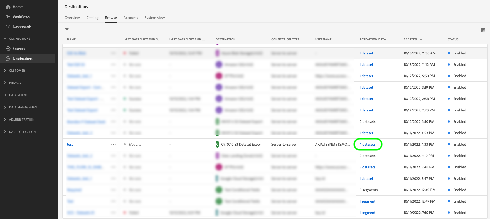
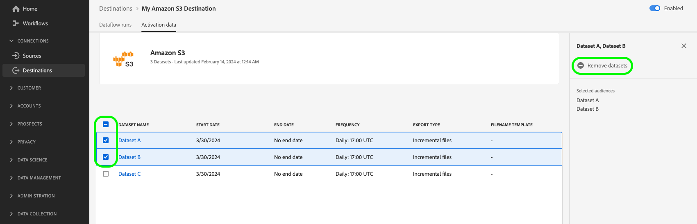

# 将数据集导出到云存储目标

>[!AVAILABILITY]
>
>已购买Real-Time CDP Prime或Ultimate包、Adobe Journey Optimizer或Customer Journey Analytics的客户可使用此功能。 请联系 Adobe 代表以获取更多信息。

>[!IMPORTANT]
>
>**操作项**： Experience Platform[的](/help/release-notes/latest/latest.md#destinations)2024年9月版本引入了为导出数据集数据流设置`endTime`日期的选项。 Adobe还为&#x200B;*在2024年11月1日之前创建的所有数据集导出数据流引入了默认结束日期2025年9月1日*。
>
>对于其中任何数据流，您需要手动更新数据流中的结束日期在结束日期之前，否则您的导出将在该日期停止。 使用Experience Platform UI查看哪些数据流将设置为在2025年9月1日停止。
>
>有关如何编辑数据集导出数据流的结束日期的信息，请参阅[计划部分](#scheduling)。

本文介绍使用Experience Platform UI将[数据集](/help/catalog/datasets/overview.md)从Adobe Experience Platform导出到首选云存储位置（如[!DNL Amazon S3]、SFTP位置或[!DNL Google Cloud Storage]）所需的工作流。

您还可以使用Experience Platform API导出数据集。 有关详细信息，请阅读[导出数据集API教程](/help/destinations/api/export-datasets.md)。

## 可用于导出的数据集 {#datasets-to-export}

根据Experience Platform应用程序(Real-Time CDP、Adobe Journey Optimizer)、层(Prime或Ultimate)以及您购买的任何加载项(例如：Data Distiller)，您可以导出的数据集会有所不同。

使用下表了解根据您的应用程序、产品层和购买的任何加载项，您可以导出哪些数据集类型：

<table>
<thead>
  <tr>
    <th>应用程序/加载项</th>
    <th>层</th>
    <th>可用于导出的数据集</th>
  </tr>
</thead>
<tbody>
  <tr>
    <td rowspan="2">Real-Time CDP</td>
    <td>Prime</td>
    <td>通过源、Web SDK、Mobile SDK、Analytics Data Connector和Audience Manager摄取或收集数据后，在Experience Platform UI中创建的配置文件和体验事件数据集。</td>
  </tr>
  <tr>
    <td>Ultimate</td>
    <td><ul><li>通过源、Web SDK、Mobile SDK、Analytics Data Connector和Audience Manager摄取或收集数据后，在Experience Platform UI中创建的配置文件和体验事件数据集。</li><li> <a href="https://experienceleague.adobe.com/docs/experience-platform/dashboards/query.html#profile-attribute-datasets">系统生成的配置文件快照数据集</a>。</li></td>
  </tr>
  <tr>
    <td rowspan="2">Adobe Journey Optimizer</td>
    <td>Prime</td>
    <td>请参阅<a href="https://experienceleague.adobe.com/docs/journey-optimizer/using/data-management/datasets/export-datasets.html#datasets"> Adobe Journey Optimizer</a>文档。</td>
  </tr>
  <tr>
    <td>Ultimate</td>
    <td>请参阅<a href="https://experienceleague.adobe.com/docs/journey-optimizer/using/data-management/datasets/export-datasets.html#datasets"> Adobe Journey Optimizer</a>文档。</td>
  </tr>
  <tr>
    <td>Customer Journey Analytics</td>
    <td>全部</td>
    <td> 通过源、Web SDK、Mobile SDK、Analytics Data Connector和Audience Manager摄取或收集数据后，在Experience Platform UI中创建的配置文件和体验事件数据集。</td>
  </tr>
  <tr>
    <td>数据蒸馏器</td>
    <td>Data Distiller（加载项）</td>
    <td>通过查询服务创建的派生数据集。</td>
  </tr>
</tbody>
</table>

## 视频教程 {#video-tutorial}

观看以下视频，了解此页面上描述的工作流的端到端说明、使用导出数据集功能的好处以及一些建议的用例。

>[!VIDEO](https://video.tv.adobe.com/v/3424392/)

## 支持的目标 {#supported-destinations}

目前，您可以将数据集导出到屏幕快照中突出显示的云存储目标，如下所列。

* [[!DNL Azure Data Lake Storage Gen2]](../../destinations/catalog/cloud-storage/adls-gen2.md)
* [[!DNL Data Landing Zone]](../../destinations/catalog/cloud-storage/data-landing-zone.md)
* [[!DNL Google Cloud Storage]](../../destinations/catalog/cloud-storage/google-cloud-storage.md)
* [[!DNL Amazon S3]](../../destinations/catalog/cloud-storage/amazon-s3.md#changelog)
* [[!DNL Azure Blob]](../../destinations/catalog/cloud-storage/azure-blob.md#changelog)
* [[!DNL SFTP]](../../destinations/catalog/cloud-storage/sftp.md#changelog)

## 何时激活受众或导出数据集 {#when-to-activate-audiences-or-activate-datasets}

Experience Platform目录中的一些基于文件的目标同时支持Audience Activation和数据集导出。

* 当您希望将数据结构化为按受众兴趣或资格分组的用户档案时，请考虑激活受众。
* 或者，在要导出未按受众兴趣或资格进行分组或构建的原始数据集时，请考虑数据集导出。 您可以将此数据用于报表、数据科学工作流和许多其他用例。 例如，作为管理员、数据工程师或分析师，您可以从Experience Platform导出数据以与数据仓库同步、在BI分析工具、外部云ML工具中使用，或存储在您的系统中以满足长期存储需求。

本文档包含导出数据集所需的所有信息。 如果要将&#x200B;*受众*&#x200B;激活到云存储或电子邮件营销目标，请阅读[将受众数据激活到批量配置文件导出目标](/help/destinations/ui/activate-batch-profile-destinations.md)。

## 先决条件 {#prerequisites}

要导出数据集，请注意以下先决条件：

* 要将数据集导出到云存储目标，您必须已成功[连接到目标](./connect-destination.md)。 如果您尚未这样做，请转到[目标目录](../catalog/overview.md)，浏览支持的目标，然后配置要使用的目标。
* 需要启用配置文件数据集才能在实时客户配置文件中使用。 [阅读更多](/help/ingestion/tutorials/ingest-batch-data.md#enable-for-profile)以了解如何启用此选项。

### 所需的权限 {#permissions}

要导出数据集，您需要&#x200B;**[!UICONTROL View Destinations]**、**[!UICONTROL View Datasets]**&#x200B;和&#x200B;**[!UICONTROL Manage and Activate Dataset Destinations]** [访问控制权限](/help/access-control/home.md#permissions)。 阅读[访问控制概述](/help/access-control/ui/overview.md)或联系您的产品管理员以获取所需的权限。

要确保您具有导出数据集的必要权限并且目标支持导出数据集，请浏览目标目录。 如果目标具有&#x200B;**[!UICONTROL Activate]**&#x200B;或&#x200B;**[!UICONTROL Export datasets]**&#x200B;控件，则您具有相应的权限。

## 选择您的目标 {#select-destination}

按照相关说明选择一个可导出数据集的目标：

1. 转到&#x200B;**[!UICONTROL Connections > Destinations]**，然后选择&#x200B;**[!UICONTROL Catalog]**&#x200B;选项卡。

   

1. 在与要将数据集导出到的目标对应的卡片中选择&#x200B;**[!UICONTROL Activate]**&#x200B;或&#x200B;**[!UICONTROL Export datasets]**。

   

1. 选择&#x200B;**[!UICONTROL Data type Datasets]**&#x200B;并选择要将数据集导出到的目标连接，然后选择&#x200B;**[!UICONTROL Next]**。

>[!TIP]
> 
>如果要设置新目标以导出数据集，请选择&#x200B;**[!UICONTROL Configure new destination]**&#x200B;以触发[连接到目标](/help/destinations/ui/connect-destination.md)工作流。

1. 出现&#x200B;**[!UICONTROL Select datasets]**&#x200B;视图。 继续到[选择要导出的数据集](#select-datasets)的下一部分。

## 选择您的数据集 {#select-datasets}

使用数据集名称左侧的复选框选择要导出到目标的数据集，然后选择&#x200B;**[!UICONTROL Next]**。

## 计划数据集导出 {#scheduling}

>[!CONTEXTUALHELP]
>id="platform_destinations_activate_datasets_exportoptions"
>title="数据集的文件导出选项"
>abstract="选择&#x200B;**导出增量文件**&#x200B;以仅导出自上次导出后添加到数据集的数据。 第一个增量文件导出包括数据集中的所有数据，充当回填。后续增量文件仅包含自第一次导出后添加到数据集的数据。  选择&#x200B;**导出完整文件**，以在每次导出时导出每个数据集的完整成员信息。 "

>[!CONTEXTUALHELP]
>id="dataset_dataflow_needs_schedule_end_date_header"
>title="更新此数据流的结束日期"
>abstract="更新此数据流的结束日期"

>[!CONTEXTUALHELP]
>id="dataset_dataflow_needs_schedule_end_date_body"
>title="更新此数据流主体的结束日期"
>abstract="由于此目标最近进行了更新，数据流现在需要结束日期。Adobe 将默认结束日期设置为 2025 年 9 月 1 日。请更新为您希望的结束日期，否则数据导出将在默认日期停止。"

使用&#x200B;**[!UICONTROL Scheduling]**&#x200B;步骤可以：

* 设置数据集导出的开始日期和结束日期以及导出节奏。
* 配置导出的数据集文件是应导出数据集的完整成员资格，还是只应在每次导出时增量更改成员资格。
* 自定义存储位置中应导出数据集的文件夹路径。 阅读有关如何[编辑导出文件夹路径](#edit-folder-path)的详细信息。

使用页面上的&#x200B;**[!UICONTROL Edit schedule]**&#x200B;控件编辑导出的导出节奏，并选择是导出完整文件还是增量文件。

默认情况下已选中&#x200B;**[!UICONTROL Export incremental files]**&#x200B;选项。 这会触发导出一个或多个表示数据集的完整快照的文件。 后续文件是自上次导出以来向数据集添加的增量文件。 您还可以选择&#x200B;**[!UICONTROL Export full files]**。 在这种情况下，选择频率&#x200B;**[!UICONTROL Once]**&#x200B;以一次性完全导出数据集。

>[!IMPORTANT]
>
>第一个增量文件导出包含数据集中的所有现有数据，充当回填。 导出可以包含一个或多个文件。

1. 使用&#x200B;**[!UICONTROL Frequency]**&#x200B;选择器选择导出频率：

   * **[!UICONTROL Daily]**：计划每天在指定的时间导出一次增量文件。
   * **[!UICONTROL Hourly]**：计划每3、6、8或12小时导出一次增量文件。

2. 使用&#x200B;**[!UICONTROL Time]**&#x200B;选择器以[!DNL UTC]格式选择何时进行导出。

3. 使用&#x200B;**[!UICONTROL Date]**&#x200B;选择器选择应进行导出的时间间隔。

4. 选择&#x200B;**[!UICONTROL Save]**&#x200B;以保存计划并继续&#x200B;**[!UICONTROL Review]**&#x200B;步骤。

>[!NOTE]
> 
>对于数据集导出，文件名具有无法修改的预设默认格式。 有关导出文件的更多信息和示例，请参阅[验证成功的数据集导出](#verify)部分。

## 编辑文件夹路径 {#edit-folder-path}

>[!CONTEXTUALHELP]
>id="destinations_folder_name_template"
>title="编辑文件夹路径"
>abstract="使用提供的几个宏来自定义导出数据集的文件夹路径。"

>[!CONTEXTUALHELP]
>id="destinations_folder_name_template_preview"
>title="数据集文件夹路径预览"
>abstract="预览根据您在此窗口中添加的宏在您的存储位置中创建的文件夹结构。"

选择&#x200B;**[!UICONTROL Edit folder path]**&#x200B;以自定义存储导出数据集的存储位置的文件夹结构。

您可以使用多个可用的宏来自定义所需的文件夹名称。 双击宏以将其添加到文件夹路径，并在宏之间使用`/`以分隔文件夹。

选择所需的宏后，您可以看到将在存储位置创建的文件夹结构的预览。 文件夹结构中的第一个级别表示您在&#x200B;**[!UICONTROL Folder path]**&#x200B;连接到目标[以导出数据集时指示的](/help/destinations/ui/connect-destination.md##set-up-connection-parameters)。

## 审查 {#review}

在&#x200B;**[!UICONTROL Review]**&#x200B;页面上，您可以看到所选内容的摘要。 选择&#x200B;**[!UICONTROL Cancel]**&#x200B;以拆分流，**[!UICONTROL Back]**&#x200B;以修改您的设置，或&#x200B;**[!UICONTROL Finish]**&#x200B;以确认您的选择并开始将数据集导出到目标。

## 验证是否成功导出数据集 {#verify}

导出数据集时，Experience Platform会在您提供的存储位置创建一个或多个`.json`或`.parquet`文件。 希望根据您提供的导出计划将新文件存储在您的存储位置。

Experience Platform会在您指定的存储位置创建一个文件夹结构，存放导出的数据集文件。 默认文件夹导出模式如下所示，但您可以[使用首选宏](#edit-folder-path)自定义文件夹结构。

>[!TIP]
> 
>此文件夹结构中的第一个级别 — `folder-name-you-provided` — 表示当您&#x200B;**[!UICONTROL Folder path]**&#x200B;连接到目标[以导出数据集时指示的](/help/destinations/ui/connect-destination.md##set-up-connection-parameters)。

`folder-name-you-provided/datasetID/exportTime=YYYYMMDDHHMM`

默认文件名是随机生成的，并确保导出的文件名是唯一的。

### 示例数据集文件 {#sample-files}

这些文件在存储位置中的存在是成功导出的确认。 要了解导出文件的结构方式，您可以下载示例[.parquet文件](../assets/common/part-00000-tid-253136349007858095-a93bcf2e-d8c5-4dd6-8619-5c662e261097-672704-1-c000.parquet)或[.json文件](../assets/common/part-00000-tid-4172098795867639101-0b8c5520-9999-4cff-bdf5-1f32c8c47cb9-451986-1-c000.json)。

#### 压缩的数据集文件 {#compressed-dataset-files}

在[连接到目标工作流](/help/destinations/ui/connect-destination.md#file-formatting-and-compression-options)中，您可以选择要压缩的导出数据集文件，如下所示：

请注意两种文件类型在压缩后的文件格式差异：

* 导出压缩的JSON文件时，导出的文件格式为`json.gz`。 导出的JSON格式为NDJSON，它是大数据生态系统中的标准交换格式。 Adobe建议使用与NDJSON兼容的客户端读取导出的文件。
* 导出压缩的parquet文件时，导出的文件格式为`gz.parquet`

仅支持在压缩模式下&#x200B;*导出到JSON文件*。 在压缩和未压缩模式下支持导出到Parquet文件。

## 从目标中删除数据集 {#remove-dataset}

要从现有数据流中删除数据集，请执行以下步骤：

1. 登录到[Experience Platform UI](https://experience.adobe.com/platform/)，然后从左侧导航栏中选择&#x200B;**[!UICONTROL Destinations]**。 从顶部标题中选择&#x200B;**[!UICONTROL Browse]**&#x200B;以查看现有目标数据流。

   

   >[!TIP]
   > 
   >选择左上角的过滤器图标以启动排序面板。 排序面板提供所有目标的列表。 您可以从列表中选择多个目标，以查看与所选目标关联的数据流的过滤选择。

2. 从&#x200B;**[!UICONTROL Activation data]**&#x200B;列中，选择数据集控件以查看映射到此导出数据流的所有数据集。

   

3. 将显示目标的&#x200B;**[!UICONTROL Activation data]**&#x200B;页面。 使用数据集列表左侧的复选框选择要删除的数据集，然后在右边栏中选择&#x200B;**[!UICONTROL Remove datasets]**&#x200B;以触发删除数据集确认对话框。

   

4. 在确认对话框中，选择&#x200B;**[!UICONTROL Remove]**&#x200B;以立即从导出到目标的数据集中删除该数据集。

   

## 数据集导出授权 {#licensing-entitlement}

请参阅产品描述文档，了解您每年有权为每个Experience Platform应用程序导出多少数据。 例如，您可以在[此处](https://helpx.adobe.com/legal/product-descriptions/real-time-customer-data-platform-b2c-edition-prime-and-ultimate-packages.html)查看Real-Time CDP产品说明。

请注意，不同应用程序的数据导出权限不是累加的。 例如，这意味着如果您购买Real-Time CDP Ultimate和Adobe Journey Optimizer Ultimate，则根据产品描述，配置文件导出权利将是两个权利中的较大者。 您的卷权利的计算方法是：取用您的许可配置文件的总数，然后乘以Real-Time CDP Prime的500 KB或Real-Time CDP Ultimate的700 KB，从而确定您有权获得的数据量。

另一方面，如果您购买了Data Distiller等加载项，则您有权获得的数据导出限制表示产品层和加载项的总和。

您可以在[许可证使用情况仪表板](/help/landing/license-usage-and-guardrails/license-usage-dashboard.md)中查看和跟踪配置文件导出是否符合合同限制。

## 已知限制 {#known-limitations}

对于数据集导出的常规可用性版本，请牢记以下限制：

* 即使是小型数据集，Experience Platform也可能导出多个文件。 数据集导出旨在实现系统到系统的集成，并优化了性能，因此无法自定义导出的文件数量。
* 当前无法自定义导出的文件名。
* 目前，UI不会阻止您删除正在导出到目标的数据集。 请勿删除任何正在导出到目标的数据集。 [删除目标数据流中的数据集](#remove-dataset)之前。
* 数据集导出的监控量度当前与用户档案导出的数字混杂在一起，因此它们不反映真正的导出数字。
* 时间戳超过365天的数据将从数据集导出中排除。 有关详细信息，请查看计划数据集导出的[护栏](/help/destinations/guardrails.md#guardrails-for-scheduled-dataset-exports)

## 常见问题 {#faq}

**如果我们仅在`/`处保存为文件夹路径，是否可以生成没有文件夹的文件？ 此外，如果我们不需要文件夹路径，如何在文件夹或位置中生成具有重复名称的文件？**

+++回答
从2024年9月版开始，可以自定义文件夹名称，甚至可以使用`/`导出同一文件夹中所有数据集的文件。 Adobe不建议将这一点用于导出多个数据集的目标，因为属于不同数据集的系统生成的文件名将混合到同一文件夹中。
+++

**是否可以将清单文件路由到一个文件夹，将数据文件路由到另一个文件夹？**

+++回答
否，无法将清单文件复制到其他位置。
+++

**我们可以控制文件传送的顺序或时间吗？**

+++回答
有多种选项可用于计划导出。 没有用于延迟或排序文件副本的选项。 生成后，它们会立即复制到您的存储位置。
+++

**清单文件有哪些格式可用？**

+++回答
清单文件采用.json格式。
+++

**清单文件是否有API可用性？**

+++回答
清单文件没有API可用，但它包含构成导出的文件列表。
+++

**能否向清单文件添加其他详细信息（即记录计数）？ 如果是，如何进行？**

+++回答
无法向清单文件添加其他信息。 记录计数可通过`flowRun`实体获得（可通过API查询）。 有关更多信息，请参阅目标监控。
+++

**数据文件如何拆分？ 每个文件有多少条记录？**

+++回答
数据文件按Experience Platform数据湖中的默认分区进行拆分。 数据集越大，分区数量就越大。 由于默认分区已针对读取进行了优化，因此用户无法对其进行配置。
+++

**是否可以设置阈值（每个文件的记录数）？**

+++回答
不，这不可能。
+++

**在初始发送错误时，我们如何重新发送数据集？**

+++回答
对于大多数类型的系统错误，会自动进行重试。
+++
