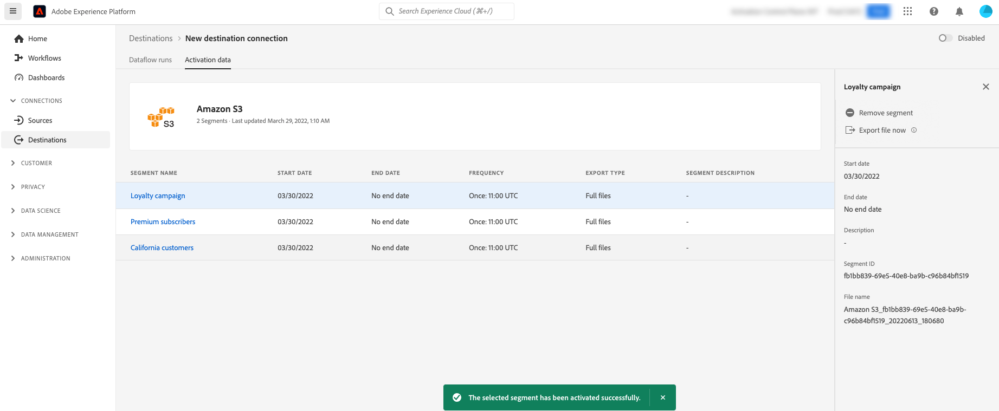

# （测试版）使用Experience PlatformUI按需将文件导出到批处理目标

>[!IMPORTANT]
>
>此 **[!UICONTROL 立即导出文件]** Adobe Experience Platform中的选项当前为测试版。 文档和功能可能会发生更改。
>请联系您的Adobe代表以获取此功能的访问权限。

>[!IMPORTANT]
> 
>要激活数据，您需要 **[!UICONTROL 管理目标]**， **[!UICONTROL 激活目标]**， **[!UICONTROL 查看配置文件]**、和 **[!UICONTROL 查看区段]** [访问控制权限](/help/access-control/home.md#permissions). 阅读 [访问控制概述](/help/access-control/ui/overview.md) 或与产品管理员联系以获取所需的权限。

## **[!UICONTROL 立即导出文件]**&#x200B;概述 {#overview}

>[!CONTEXTUALHELP]
>id="platform_destinations_activationchaining_activatenow"
>title="立即导出文件"
>abstract="选择此控件可交付完整文件导出以及任何之前计划的导出。将立即触发文件导出，并获取 Experience Platform 分段运行的最新结果。"

本文介绍如何使用Experience PlatformUI按需将文件导出到批处理目标，例如 [云存储](/help/destinations/catalog/cloud-storage/overview.md) 和 [电子邮件营销](/help/destinations/catalog/email-marketing/overview.md) 目标。

此 **[!UICONTROL 立即导出文件]** 通过控制，您可以导出完整的文件而不会中断先前计划受众的当前导出计划。 此导出操作在之前计划的导出之外进行，不会更改受众的导出频率。 将立即触发文件导出，并获取 Experience Platform 分段运行的最新结果。

您还可以将Experience PlatformAPI用于此目的。 阅读如何 [通过临时激活API将受众按需激活到批处理目标](/help/destinations/api/ad-hoc-activation-api.md).

## 先决条件 {#prerequisites}

要将按需文件导出到批处理目标，您必须已成功完成 [已连接到目标](./connect-destination.md). 如果您尚未这样做，请转到 [目标目录](../catalog/overview.md)，浏览支持的目标，并配置要使用的目标。

## 如何按需导出文件 {#how-to-export-files-on-demand}

1. 转到 **[!UICONTROL “连接”>“目标”]**，选择 **[!UICONTROL 浏览]** 选项卡和过滤器符号，用于显示到所需批处理目标的现有连接。

   

2. 选择所需的目标连接以检查到目标的现有数据流。

   

3. 选择 **[!UICONTROL 激活数据]** 选项卡，选择要按需导出文件的受众，然后选择 **[!UICONTROL 立即导出文件]** 控件，可触发一次性导出，该导出会将文件传送到批处理目标。

   >[!IMPORTANT]
   >
   >目前，UI不支持选择多个受众来批量导出文件。 使用 [临时激活API](/help/destinations/api/ad-hoc-activation-api.md) 为了这个目的。

   

4. 选择 **[!UICONTROL 是]** 以确认并触发文件导出。

   

5. 此时会显示确认消息，告知您文件导出已开始。

   

6. 您也可以切换到 **[!UICONTROL 数据流运行]** 选项卡以确认文件导出已启动。

## 注意事项 {#considerations}

在使用时，请牢记以下注意事项 **[!UICONTROL 立即导出文件]** 控件：

* **[!UICONTROL 立即导出文件]** 仅适用于批量激活数据流中的计划与当前日期重叠的受众。 其中包括其计划没有结束日期（导出频率）的受众 **[!UICONTROL 一次]**)，或尚未超过结束日期。
* 将受众添加到现有数据流时，请等待至少15分钟，直到使用 **[!UICONTROL 立即导出文件]** 控制。
* 如果您更改受众的合并策略，或者如果您创建的受众使用新的合并策略，请等待24小时，直到使用 **[!UICONTROL 立即导出文件]** 控制。

## UI错误消息 {#ui-error-messages}

使用时 **[!UICONTROL 立即导出文件]** 控制，您可能会遇到下面列出的任何错误消息。 请查看表格以了解如何在它们出现时解决它们。

| 错误消息 | 解决方法 |
|---------|----------|
| 已在为受众运行 `segment ID` 订购 `dataflow ID` 具有运行id `flow run ID` | 此错误消息表示受众当前正在进行临时激活流程。 等待作业完成，然后再触发激活作业。 |
| 受众 `<segment name>` 不是此数据流的一部分或超出计划范围！ | 此错误消息表示您选择要激活的受众未映射到数据流，或者为受众设置的激活计划已过期或尚未开始。 检查受众是否确实映射到数据流，并验证受众激活计划是否与当前日期重叠。 |

## 相关信息 {#related-information}

* [使用Experience PlatformAPI按需将受众激活到批处理目标](/help/destinations/api/ad-hoc-activation-api.md)
* [将受众数据激活到批量配置文件导出目标](/help/destinations/ui/activate-batch-profile-destinations.md)
