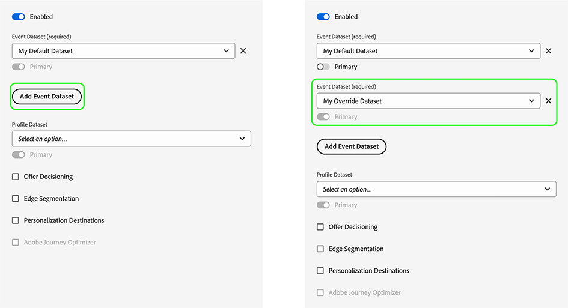

# 配置数据流覆盖

数据流覆盖允许您为数据流定义其他配置，这些配置将通过Web SDK传递到Edge Network。

这有助于触发与默认数据流行为不同的数据流行为，而无需创建新数据流或修改现有设置。

数据流配置覆盖是一个两步过程：

1. 首先，您必须在以下位置定义数据流配置覆盖 [数据流配置页面](configure.md).
2. 然后，您必须通过Web SDK命令或使用Web SDK将覆盖发送到Edge Network [标记扩展](../../tags/extensions/client/web-sdk/web-sdk-extension-configuration.md).

本文解释了每种支持的覆盖类型的端到端数据流配置覆盖过程。

## 在数据流UI中配置数据流覆盖 {#configure-overrides}

数据流配置覆盖允许您修改以下数据流配置：

* Experience Platform事件数据集
* Adobe Target资产令牌
* Audience ManagerID同步容器
* Adobe Analytics报表包

### Adobe Target的数据流覆盖 {#target-overrides}

要为Adobe Target数据流配置数据流覆盖，您必须首先创建Adobe Target数据流。 按照说明进行操作，以 [配置数据流](configure.md) 使用 [Adobe Target](configure.md#target) 服务。

创建数据流后，编辑 [Adobe Target](configure.md#target) 您已添加并使用 **[!UICONTROL 资产令牌覆盖]** 部分来添加所需的数据流覆盖，如下图所示。 每行添加一个属性令牌。


添加所需的覆盖后，请保存数据流设置。

您现在应该已配置Adobe Target数据流覆盖。 现在您可以 [通过Web SDK将覆盖发送到Edge Network](#send-overrides).

### Adobe Analytics的数据流覆盖 {#analytics-overrides}

要为Adobe Analytics数据流配置数据流覆盖，您必须首先具有 [Adobe Analytics](configure.md#analytics) 已创建数据流。 按照说明进行操作，以 [配置数据流](configure.md) 使用 [Adobe Analytics](configure.md#analytics) 服务。

创建数据流后，编辑 [Adobe Analytics](configure.md#target) 您已添加并使用 **[!UICONTROL 报表包覆盖]** 部分来添加所需的数据流覆盖，如下图所示。

选择 **[!UICONTROL 显示批处理模式]** 以启用对报表包覆盖的批量编辑。 您可以复制并粘贴报表包覆盖的列表，每行输入一个报表包。


添加所需的覆盖后，请保存数据流设置。

您现在应该已配置Adobe Analytics数据流覆盖。 现在您可以 [通过Web SDK将覆盖发送到Edge Network](#send-overrides).

### Experience Platform事件数据集的数据流覆盖 {#event-dataset-overrides}

要为Experience Platform事件数据集配置数据流覆盖，您必须首先具有 [Adobe Experience Platform](configure.md#aep) 已创建数据流。 按照说明进行操作，以 [配置数据流](configure.md) 使用 [Adobe Experience Platform](configure.md#aep) 服务。

创建数据流后，编辑 [Adobe Experience Platform](configure.md#aep) 添加的服务并选择 **[!UICONTROL 添加事件数据集]** 用于添加一个或多个覆盖事件数据集的选项，如下图所示。



添加所需的覆盖后，请保存数据流设置。

您现在应该已配置Adobe Experience Platform数据流覆盖。 现在您可以 [通过Web SDK将覆盖发送到Edge Network](#send-overrides).

### 第三方ID同步容器的数据流覆盖 {#container-overrides}

要为第三方ID同步容器配置数据流覆盖，必须首先创建数据流。 按照说明进行操作，以 [配置数据流](configure.md) 创建一个。

创建数据流后，转到 **[!UICONTROL 高级选项]** 并启用 **[!UICONTROL 第三方ID同步]** 选项。

然后，使用 **[!UICONTROL 容器ID覆盖]** 区域来添加要覆盖默认设置的容器ID，如下图所示。

>[!IMPORTANT]
>
>容器ID必须是数字值，例如 `1234567`，而不是字符串，例如 `"1234567"`. 如果通过Web SDK发送字符串值作为容器ID覆盖，您将收到一个错误。


添加所需的覆盖后，请保存数据流设置。

您现在应该已配置ID同步容器覆盖。 现在您可以 [通过Web SDK将覆盖发送到Edge Network](#send-overrides).

## 通过Web SDK将覆盖发送到Edge Network {#send-overrides}

>[!NOTE]
>
>作为通过Web SDK命令发送配置覆盖的替代方法，您可以将配置覆盖添加到Web SDK [标记扩展](../../tags/extensions/client/web-sdk/web-sdk-extension-configuration.md).

晚于 [配置数据流覆盖](#configure-overrides) 在数据收集UI中，您现在可以通过Web SDK将覆盖发送到Edge Network。

通过Web SDK将覆盖发送到Edge Network是激活数据流配置覆盖的第二步，也是最后一步。

数据流配置覆盖将通过 `edgeConfigOverrides` Web SDK命令。 此命令创建数据流覆盖，并将其传递给 [!DNL Edge Network] 在下一个命令中，或者 `configure` 命令，针对每个请求。

此 `edgeConfigOverrides` 命令创建数据流覆盖，这些覆盖传递给 [!DNL Edge Network] 在下一个命令中，或者，如果是 `configure`，以处理每个请求。

当使用发送配置覆盖时 `configure` 命令，它包含在以下支持的命令中。

* [sendEvent](../fundamentals/tracking-events.md)
* [setConsent](../consent/iab-tcf/overview.md)
* [getIdentity](../identity/overview.md)
* [appendIdentityToUrl](../identity/id-sharing.md#cross-domain-sharing)
* [配置](../fundamentals/configuring-the-sdk.md)

全局指定的选项可以由单个命令上的配置选项覆盖。

### 通过发送配置覆盖 `sendEvent` 命令 {#send-event}

以下示例显示了在上可能发生的配置覆盖 `sendEvent` 命令。

```js {line-numbers="true" highlight="5-25"}
alloy("sendEvent", {
  xdm: {
    /* ... */
  },
  edgeConfigOverrides: {
    datastreamId: "{DATASTREAM_ID}"
    com_adobe_experience_platform: {
      datasets: {
        event: {
          datasetId: "MyOverrideDataset"
        },
        profile: {
          datasetId: "www"
        }
      }
    },
    com_adobe_analytics: {
      reportSuites: [
        "MyFirstOverrideReportSuite",
        "MySecondOverrideReportSuite",
        "MyThirdOverrideReportSuite"
        ]
    },
    com_adobe_identity: {
      idSyncContainerId: "1234567"
    },
    com_adobe_target: {
      propertyToken: "63a46bbc-26cb-7cc3-def0-9ae1b51b6c62"
    }
  }
});
```

| 参数 | 描述 |
|---|---|
| `edgeConfigOverrides.datastreamId` | 使用此参数可允许单个请求转到与定义的数据流不同的数据流。 `configure` 命令。 |

### 通过发送配置覆盖 `configure` 命令 {#send-configure}

以下示例显示了在上可能发生的配置覆盖 `configure` 命令。

```js {line-numbers="true" highlight="8-30"}
alloy("configure", {
  defaultConsent: "in",
  edgeDomain: "etc",
  edgeBasePath: "ee",
  datastreamId: "{DATASTREAM_ID}",
  orgId: "org",
  debugEnabled: true,
  edgeConfigOverrides: {
    "com_adobe_experience_platform": {
      "datasets": {
        "event": { 
          datasetId: "MyOverrideDataset"
        },
        "profile": { 
          datasetId: "www"
        }
      }
    },
    "com_adobe_analytics": {
      "reportSuites": [
        "MyFirstOverrideReportSuite",
        "MySecondOverrideReportSuite",
        "MyThirdOverrideReportSuite"
      ]
    },
    "com_adobe_identity": {
      "idSyncContainerId": "1234567"
    },
    "com_adobe_target": {
      "propertyToken": "63a46bbc-26cb-7cc3-def0-9ae1b51b6c62"
    }
  },
  onBeforeEventSend: function() { /* … */ });
};
```

### 有效负载示例 {#payload-example}

上述示例会生成 [!DNL Edge Network] 有效负载如下所示：

```json
{
  "meta": {
    "configOverrides": {
      "com_adobe_experience_platform": {
        "datasets": {
          "event": {
            "datasetId": "MyOverrideDataset"
          },
          "profile": {
            "datasetId": "www"
          }
        }
      },
      "com_adobe_analytics": {
        "reportSuites": [
        "MyFirstOverrideReportSuite",
        "MySecondOverrideReportSuite",
        "MyThirdOverrideReportSuite"
        ]
      },
      "com_adobe_identity": {
        "idSyncContainerId": "1234567"
      },
      "com_adobe_target": {
        "propertyToken": "63a46bbc-26cb-7cc3-def0-9ae1b51b6c62"
      }
    },
    "state": {  }
  },
  "events": [  ],
  "query": {
    "identity": {
      "fetch": [
        "ECID"
      ]
    }
  }
}
```
