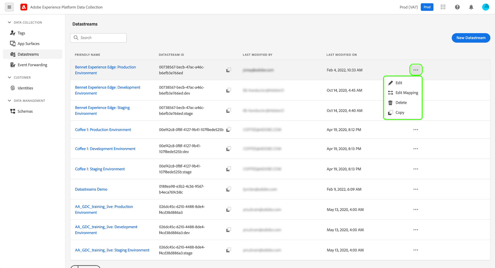
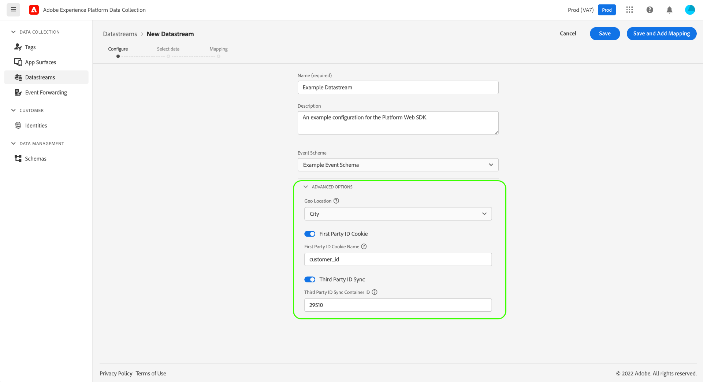
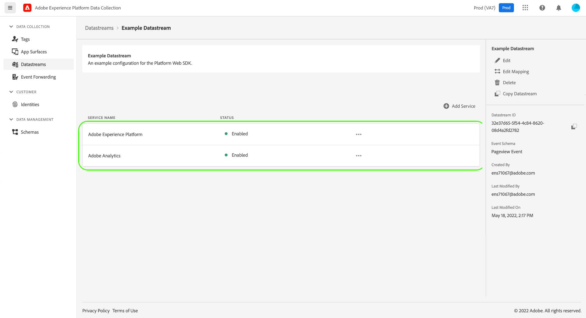
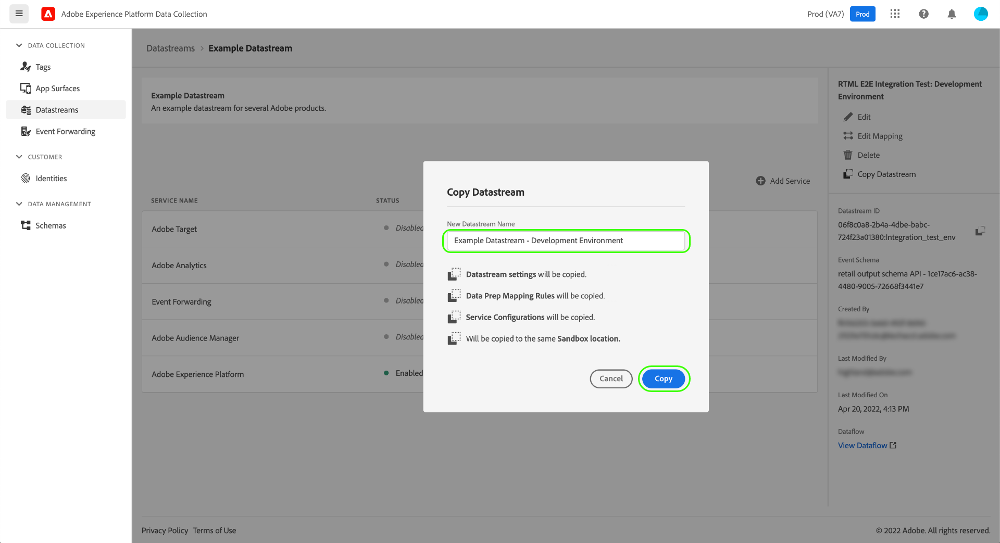

# 数据流概述

数据流表示实施Adobe Experience Platform Web和移动SDK时的服务器端配置。 而 [配置命令](../fundamentals/configuring-the-sdk.md) 中的控件控制必须在客户端上处理的事项(例如 `edgeDomain`)，数据流将处理SDK的所有其他配置。 请求发送至Adobe Experience Platform边缘网络时， `edgeConfigId` 用于引用数据流。 这样，您就无需在网站上进行代码更改即可更新服务器端配置。

本文档介绍了在数据收集UI中配置数据流的步骤。

## 访问 [!UICONTROL 数据流] 工作区

您可以通过选择 **[!UICONTROL 数据流]** 中。

的 [!UICONTROL 数据流] 选项卡显示现有数据流的列表，包括其友好名称、ID和上次修改日期。 选择要跟踪的数据流的名称 [查看其详细信息并配置服务](#view-details).

选择“更多”图标(**...**)以显示更多选项。 选择 **[!UICONTROL 编辑]** 更新 [基本配置](#configure) ，或选择 **[!UICONTROL 删除]** 删除数据流。

## 创建新数据流 {#create}

要创建数据流，请首先选择 **[!UICONTROL 新数据流]**.

此时会显示数据流创建工作流，从配置步骤开始。 在此，必须为数据流提供名称和可选描述。

如果要配置此数据流以在Experience Platform中使用，并且使用的是Platform Web SDK，则还必须选择 [基于事件的体验数据模型(XDM)架构](../../xdm/classes/experienceevent.md) 来表示您计划摄取的数据。

选择 **[!UICONTROL 高级选项]** 以显示用于配置数据流的其他控件。

| 设置 | 描述 |
| --- | --- |
| [!UICONTROL 地理位置] | 根据用户的IP地址确定是否进行GPS查找。 默认设置 **[!UICONTROL 无]** 禁用任何GPS查找，而 **[!UICONTROL 城市]** 设置可将GPS坐标设为两位小数。 |
| [!UICONTROL 第一方ID Cookie] | 启用后，此设置会告知边缘网络在查找 [第一方设备ID](../identity/first-party-device-ids.md)，而不是在身份映射中查找此值。  启用此设置时，您必须提供应存储ID的Cookie的名称。 |
| [!UICONTROL 第三方ID同步] | ID同步可以分组到容器中，以允许在不同时间运行不同的ID同步。 启用此设置后，您可以指定为此数据流运行哪个ID同步容器。 |
| [!UICONTROL 访问类型] | 定义 [!DNL Edge Network] 接受数据流。 <ul><li>**[!UICONTROL 混合身份验证]**:如果选择此选项，边缘网络将接受经过身份验证的请求和未经身份验证的请求。 当您计划使用Web SDK时，请选择此选项；或 [Mobile SDK](https://aep-sdks.gitbook.io/docs/)，以及 [服务器API](../../server-api/overview.md). </li><li>**[!UICONTROL 仅验证]**:如果选择此选项，边缘网络将仅接受经过验证的请求。 如果您计划仅使用服务器API，并且希望阻止任何未经身份验证的请求由 [!DNL Edge Network]. </li></ul> |

从此处，如果您要配置Experience Platform数据流，请按照 [为数据收集准备数据](./data-prep.md) ，以在返回到本指南之前将数据映射到Platform事件架构。 否则，请选择 **[!UICONTROL 保存]** 并继续下一节。

## 查看数据流详细信息 {#view-details}

配置新数据流或选择要查看的现有数据流后，将显示该数据流的详细信息页面。 在此，您可以找到有关数据流（包括其ID）的更多信息。

从数据流详细信息屏幕中，您可以 [添加服务](#add-services) 从您有权访问的Adobe Experience Cloud产品中启用各项功能。 您还可以编辑数据流的 [基本配置](#create)，更新 [映射规则](./data-prep.md), [复制数据流](#copy)，或将其完全删除。

## 向数据流添加服务 {#add-services}

在数据流的详细信息页面上，选择 **[!UICONTROL 添加服务]** 以开始添加该数据流的可用服务。

在下一个屏幕中，使用下拉菜单选择要为此数据流配置的服务。 此列表中将仅显示您有权访问的服务。

选择所需的服务，填写显示的配置选项，然后选择 **[!UICONTROL 保存]** 将服务添加到数据流。 所有添加的服务都显示在数据流的详细信息视图中。

以下子部分介绍了每项服务的配置选项。

>[!NOTE]
>
>每个服务配置都包含一个 **[!UICONTROL 已启用]** 在选择服务时自动激活的切换开关。 要禁用此数据流的选定服务，请选择 **[!UICONTROL 已启用]** 再次切换。

### Adobe Analytics设置 {#analytics}

此服务可控制数据是否以及如何发送到Adobe Analytics。 有关更多详细信息，请参阅 [向Analytics发送数据](../data-collection/adobe-analytics/analytics-overview.md).

| 设置 | 描述 |
| --- | --- |
| [!UICONTROL 报表包 ID] | **（必需）** 要将数据发送到的Analytics报表包的ID。 此ID可在Adobe Analytics UI中的 [!UICONTROL 管理员] > [!UICONTROL 报表包]. 如果指定了多个报表包，则数据会复制到每个报表包。 |

### Adobe Audience Manager设置 {#audience-manager}

此服务可控制数据是否以及如何发送到Adobe Audience Manager。 将数据发送到Audience Manager所需的只是启用此部分。 其他设置是可选的，但鼓励使用。

| 设置 | 描述 |
| --- | --- |
| [!UICONTROL Cookie目标已启用] | 允许SDK通过 [cookie目标](https://experienceleague.adobe.com/docs/audience-manager/user-guide/features/destinations/custom-destinations/create-cookie-destination.html) 从 [!DNL Audience Manager]. |
| [!UICONTROL 启用URL目标] | 允许SDK通过 [URL目标](https://experienceleague.adobe.com/docs/audience-manager/user-guide/features/destinations/custom-destinations/create-url-destination.html) 从 [!DNL Audience Manager]. |

### Adobe Experience Platform设置 {#aep}

>[!IMPORTANT]
>
>为Platform启用数据流时，请注意您当前使用的Platform沙盒，如数据收集UI顶部功能区中所示。
>
>
>
>沙盒是Adobe Experience Platform中的虚拟分区，允许您将数据和实施与组织中的其他人员隔离开来。 创建数据流后，便无法更改其沙盒。 有关沙箱在Experience Platform中角色的更多详细信息，请参阅 [沙盒文档](../../sandboxes/home.md).

此服务可控制数据是否以及如何发送到Adobe Experience Platform。

| 设置 | 描述 |
|---| --- |
| [!UICONTROL 事件数据集] | **（必需）** 选择将客户事件数据流式传输到的Platform数据集。 此架构必须使用 [XDM ExperienceEvent类](../../xdm/classes/experienceevent.md). |
| [!UICONTROL 配置文件数据集] | 选择要将客户属性数据发送到的Platform数据集。 此架构必须使用 [XDM个人配置文件类](../../xdm/classes/individual-profile.md). |
| [!UICONTROL 优惠决策] | 选中此复选框可启用Platform Web SDK实施的Offer decisioning。 请参阅 [将Offer decisioning与Platform Web SDK结合使用](../personalization/offer-decisioning/offer-decisioning-overview.md) 以了解更多实施详细信息。 有关Offer decisioning功能的更多信息，请参阅 [Adobe Journey Optimizer文档](https://experienceleague.adobe.com/docs/journey-optimizer/using/offer-decisioniong/get-started/starting-offer-decisioning.html?lang=zh-Hans). |
| [!UICONTROL 边缘分割] | 选中此复选框可启用 [边缘分割](../../segmentation/ui/edge-segmentation.md) 数据流。 当SDK通过启用边缘分段的数据流发送数据时，相关用户档案的任何更新区段成员关系将在响应中发送回。  此选项可与 [!UICONTROL 个性化目标] 表示 [下一页个性化用例](../../destinations/ui/configure-personalization-destinations.md). |
| [!UICONTROL 个性化目标] | 在启用 [!UICONTROL 边缘分割] 复选框，此选项允许数据流连接到个性化目标，例如 [自定义个性化](../../destinations/catalog/personalization/custom-personalization.md). 有关的具体步骤，请参阅目标文档 [配置个性化目标](../../destinations/ui/configure-personalization-destinations.md). |

### Adobe Target设置 {#target}

此服务可控制数据是否以及如何发送到Adobe Target。

| 设置 | 描述 |
| --- | --- |
| [!UICONTROL 资产令牌] | [!DNL Target] 允许客户通过使用资产来控制权限。 有关属性的更多信息，请参阅 [配置企业权限](https://experienceleague.adobe.com/docs/target/using/administer/manage-users/enterprise/properties-overview.html) 在 [!DNL Target] 文档。  资产令牌可在Adobe Target UI中的 [!UICONTROL 设置] > [!UICONTROL 属性]. |
| [!UICONTROL Target环境ID] | [Adobe Target中的环境](https://experienceleague.adobe.com/docs/target/using/administer/hosts.html) 帮助您在所有开发阶段管理实施。 此设置指定要与此数据流一起使用的环境。  最佳做法是对您的 `dev`, `stage`和 `prod` 数据流环境，使事情保持简单。 但是，如果您已经定义了Adobe Target环境，则可以使用这些环境。 |
| [!UICONTROL Target第三方ID命名空间] | 的标识命名空间 `mbox3rdPartyId` 要用于此数据流。 请参阅 [实施 `mbox3rdPartyId` 和Web SDK](../personalization/adobe-target/using-mbox-3rdpartyid.md) 以了解更多信息。 |

### [!UICONTROL 事件转发] 设置

此服务控制数据是否以及如何发送到 [事件转发](../../tags/ui/event-forwarding/overview.md).

| 设置 | 描述 |
| --- | --- |
| [!UICONTROL Launch资产] | **（必需）** 要将数据发送到的事件转发属性。 |
| [!UICONTROL Launch环境] | **（必需）** 要将数据发送到的选定资产中的环境。 |

>[!NOTE]
>
>您可以选择 **[!UICONTROL 手动输入ID]** 以键入属性和环境名称，而不使用下拉菜单。

## 复制数据流 {#copy}

您可以创建现有数据流的副本并根据需要更改其详细信息。

>[!NOTE]
>
>数据流只能在同一数据流中复制 [沙盒](../../sandboxes/home.md). 换言之，您无法将数据流从一个沙盒复制到另一个沙盒。

从 [!UICONTROL 数据流] 工作区中，选择省略号(**....**)，然后选择 **[!UICONTROL 复制]**.

![显示 [!UICONTROL 复制] 从数据流列表视图中选择的选项](../images/datastreams/overview/copy-datastream-list.png)

或者，您也可以选择 **[!UICONTROL 复制数据流]** 从给定数据流的详细信息视图。

![显示 [!UICONTROL 复制] 从数据流详细信息视图中选择的选项](../images/datastreams/overview/copy-datastream-details.png)

此时会出现确认对话框，提示您为要创建的新数据流提供唯一的名称，以及有关将要复制的配置选项的详细信息。 准备就绪后，选择 **[!UICONTROL 复制]**.

的主页 [!UICONTROL 数据流] 工作区会重新显示，并列出新的数据流。

## 后续步骤

本指南介绍了如何在数据收集UI中管理数据流。 有关如何在设置数据流后安装和配置Web SDK的更多信息，请参阅 [数据收集E2E指南](../../collection/e2e.md#install).
