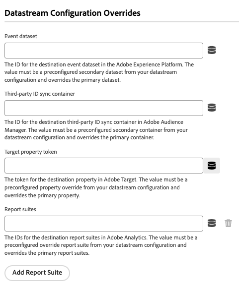

# 配置Adobe Experience Platform Web SDK扩展

Adobe Experience Platform Web SDK标记扩展通过Adobe Experience Platform Edge Network从Web资产向Adobe Experience Cloud发送数据。 扩展允许您将数据流式传输到Platform、同步身份、处理客户同意信号以及自动收集上下文数据。

本文档介绍如何在UI中配置扩展。

## 快速入门

如果已为某个资产安装了Platform Web SDK扩展，请在UI中打开该资产，然后选择 **[!UICONTROL 扩展]** 选项卡。 在Platform Web SDK下，选择 **[!UICONTROL 配置]**.

如果尚未安装扩展，请选择 **[!UICONTROL 目录]** 选项卡。 从可用扩展的列表中，找到Platform Web SDK扩展，然后选择 **[!UICONTROL 安装]**.

在这两种情况下，您都会转到Platform Web SDK的配置页面。 以下部分介绍了扩展的配置选项。

## 常规配置选项

页面顶部的配置选项可告知Adobe Experience Platform将数据路由到何处以及要在服务器上使用哪些配置。

### [!UICONTROL 名称]

Adobe Experience Platform Web SDK扩展支持页面上的多个实例。 该名称用于通过标记配置向多个组织发送数据。

扩展名默认为&quot;[!DNL alloy]“。 但是，您可以将实例名称更改为任何有效的 JavaScript 对象名称。

### **[!UICONTROL IMS 组织 ID]**

此 [!UICONTROL IMS组织ID] 是您希望在Adobe时将数据发送到的organization。 大多数情况下，使用自动填充的默认值。 当页面上有多个实例时，使用要将数据发送到的第二个组织的值填充此字段。

### **[!UICONTROL 边缘域]**

此 [!UICONTROL 边缘域] 是Adobe Experience Platform扩展发送和接收数据的域。 Adobe建议对此扩展使用第一方域(CNAME)。 默认的第三方域适用于开发环境，但不适合生产环境。[此处](https://experienceleague.adobe.com/docs/core-services/interface/ec-cookies/cookies-first-party.html?lang=zh-Hans)列出了有关如何设置第一方 CNAME 的说明。

## [!UICONTROL 数据流]

当请求发送至Adobe Experience Platform Edge Network时，将使用数据流ID来引用服务器端配置。 您可以更新配置，而无需在网站上更改代码。

请参阅指南，网址为 [数据流](../datastreams/overview.md) 了解更多信息。

## [!UICONTROL Privacy]

此 [!UICONTROL 隐私] 部分允许您配置SDK如何处理来自您网站的用户同意信号。 具体来说，它允许您选择在没有提供其他明确同意首选项的情况下假定为用户的默认同意级别。 默认同意级别不会保存到用户的配置文件中。 下表列出了每个选项的具体内容：

| [!UICONTROL 默认同意级别] | 描述 |
| --- | --- |
| [!UICONTROL In] | 收集在用户提供同意首选项之前发生的事件。 |
| [!UICONTROL 去话] | 丢弃在用户提供同意首选项之前发生的事件。 |
| [!UICONTROL 待处理] | 在用户提供同意首选项之前发生的队列事件。 提供同意首选项时，将根据提供的首选项收集或丢弃事件。 |
| [!UICONTROL 由数据元素提供] | 默认同意级别由您定义的单独数据元素决定。 使用此选项时，必须使用提供的下拉菜单指定数据元素。 |

如果您的业务操作需要明确的用户同意，请使用“去话”或“挂起”。

## [!UICONTROL 标识]

### [!UICONTROL 从VisitorAPI迁移ECID]

默认启用选项。启用此功能后，SDK可以读取AMCV和s_ecid Cookie，并设置Visitor.js使用的AMCV Cookie。 在迁移到Adobe Experience Platform Web SDK时，此功能很重要，因为某些页面可能仍在使用Visitor.js。 它允许SDK继续使用同一ECID，以便用户不会被标识为两个单独的用户。

### [!UICONTROL 使用第三方Cookie]

此选项使SDK能够尝试将用户标识符存储在第三方Cookie中。 如果成功，则在用户跨多个域导航时将用户标识为单个用户，而不是在每个域上将用户标识为单独的用户。 如果启用此选项，则如果浏览器不支持第三方Cookie，或者用户已将其配置为不允许第三方Cookie，则SDK可能仍无法将用户标识符存储在第三方Cookie中。 在这种情况下，SDK仅将标识符存储在第一方域中。

## [!UICONTROL 个性化]

如果要在加载个性化内容时隐藏网站的某些部分，您可以在预隐藏样式编辑器中指定要隐藏的元素。 然后，您可以复制提供给您的默认预隐藏代码片段，并将其粘贴到 `<head>`HTML站点的元素。

## [!UICONTROL 数据收集]

### [!UICONTROL 回调函数]

扩展中提供的回调函数也称为 [`onBeforeEventSend` 函数](https://experienceleague.adobe.com/docs/experience-platform/edge/fundamentals/configuring-the-sdk.html?lang=zh-Hans) 在图书馆里。 此函数允许您在将事件发送到Adobe Edge Network之前对其进行全局修改。 有关如何使用此函数的更多详细信息，请参阅 [此处](https://experienceleague.adobe.com/docs/experience-platform/edge/fundamentals/tracking-events.html?lang=en#modifying-events-globally).

### [!UICONTROL 单击数据收集]

SDK可以自动为您收集链接点击信息。 默认情况下，此功能处于启用状态，但可以使用此选项禁用该功能。 如果链接包含中列出的下载表达式之一，则这些链接也标记为下载链接。 [!UICONTROL 下载链接限定符] 文本框。 Adobe会为您提供一些默认的下载链接限定符，但这些限定符可以随时编辑。

### [!UICONTROL 自动收集的上下文数据]

默认情况下，SDK会收集有关设备、Web、环境和位置上下文的特定上下文数据。 如果您想查看Adobe收集的信息列表，可以找到该列表 [此处](https://experienceleague.adobe.com/docs/experience-platform/edge/data-collection/automatic-information.html?lang=en). 如果不希望收集此数据，或者只希望收集某些类别的数据，则可以更改这些选项。

## [!UICONTROL 数据流配置覆盖]

数据流覆盖允许您为数据流定义其他配置，这些配置将通过Web SDK传递到Edge Network。

这有助于触发与默认数据流行为不同的数据流行为，而无需创建新数据流或修改现有设置。

数据流配置覆盖是一个两步过程：

1. 首先，您必须在以下位置定义数据流配置覆盖 [数据流配置页面](../datastreams/configure.md).
2. 然后，您必须通过Web SDK命令或Web SDK标记扩展将覆盖发送到Edge Network。

查看数据流 [配置覆盖文档](../datastreams/overrides.md) 有关如何覆盖数据流配置的详细说明。

作为通过Web SDK命令传递覆盖的替代方法，您可以在下面显示的标记扩展屏幕中配置覆盖。

## [!UICONTROL 高级设置]

### [!UICONTROL 边缘基本路径]

如果需要更改用于与Adobe Edge Network交互的基本路径，请使用此字段。 这应该不需要更新，但是如果您参与Beta或Alpha测试，Adobe可能会要求您更改此字段。
