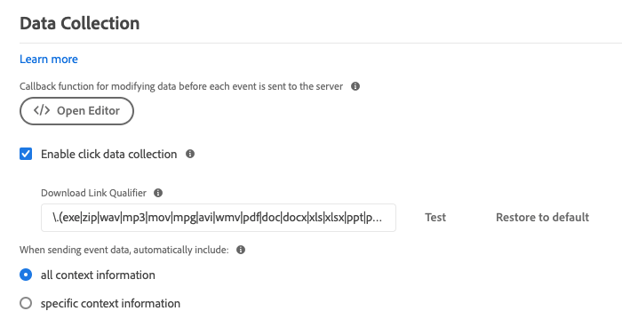

# 配置Adobe Experience Platform Web SDK扩展

Adobe Experience Platform Web SDK标记扩展通过Adobe Experience Platform Edge Network从Web属性向Adobe Experience Cloud发送数据。 该扩展允许您将数据流式传输到平台、同步身份、处理客户同意信号并自动收集上下文数据。

本文档介绍如何在数据收集UI中配置扩展。

## 快速入门

如果已为资产安装Platform Web SDK扩展，请在数据收集UI中打开该资产，然后选择 **[!UICONTROL 扩展]** 选项卡。 在Platform Web SDK下，选择 **[!UICONTROL 配置]**.

如果尚未安装该扩展，请选择 **[!UICONTROL 目录]** 选项卡。 从可用扩展的列表中，找到Platform Web SDK扩展，然后选择 **[!UICONTROL 安装]**.

在这两种情况下，您都会到达Platform Web SDK的配置页面。 以下部分介绍扩展的配置选项。

## 常规配置选项

页面顶部的配置选项告知Adobe Experience Platform要将数据路由到何处以及要在服务器上使用的配置。

### [!UICONTROL 名称]

Adobe Experience Platform Web SDK扩展支持页面上的多个实例。 该名称用于通过标记配置向多个组织发送数据。

扩展的名称默认为“[!DNL alloy]&quot; 但是，您可以将实例名称更改为任何有效的 JavaScript 对象名称。

### **[!UICONTROL IMS 组织 ID]**

的 [!UICONTROL IMS组织ID] 是您希望在Adobe时将数据发送到的组织。 大多数情况下，会使用自动填充的默认值。 当页面上有多个实例时，使用要向其发送数据的第二个组织的值填充此字段。

### **[!UICONTROL 边缘域]**

的 [!UICONTROL 边缘域] 是Adobe Experience Platform扩展发送和接收数据的域。 Adobe建议为此扩展使用第一方域(CNAME)。 默认的第三方域适用于开发环境，但不适合生产环境。[此处](https://experienceleague.adobe.com/docs/core-services/interface/ec-cookies/cookies-first-party.html?lang=zh-Hans)列出了有关如何设置第一方 CNAME 的说明。

## [!UICONTROL 数据流]

将请求发送到Adobe Experience Platform边缘网络时，会使用数据流ID引用服务器端配置。 您无需在网站上进行代码更改即可更新配置。

请参阅 [数据流](../fundamentals/datastreams.md) 以了解更多信息。

## [!UICONTROL 隐私]

的 [!UICONTROL 隐私] 部分，用于配置SDK如何处理来自您网站的用户同意信号。 具体而言，如果未提供其他明确的同意首选项，则允许您选择用户假定的默认同意级别。 默认同意级别不会保存到用户的配置文件中。 下表分析了每个选项的要求：

| [!UICONTROL 默认同意级别] | 描述 |
| --- | --- |
| [!UICONTROL 在] | 收集在用户提供同意首选项之前发生的事件。 |
| [!UICONTROL 输出] | 放弃在用户提供同意首选项之前发生的事件。 |
| [!UICONTROL 待定] | 在用户提供同意首选项之前发生的队列事件。 提供同意首选项后，将根据提供的首选项收集或丢弃事件。 |
| [!UICONTROL 由数据元素提供] | 默认同意级别由您定义的单独数据元素决定。 使用此选项时，必须使用提供的下拉菜单指定数据元素。 |

如果您需要明确的用户同意您的业务操作，请使用“禁用”或“待定”。

## [!UICONTROL 标识]

### [!UICONTROL 从VisitorAPI迁移ECID]

默认启用此选项。启用此功能后，SDK可以读取AMCV和s_ecid Cookie，并设置Visitor.js使用的AMCV Cookie。 此功能在迁移到Adobe Experience Platform Web SDK时很重要，因为某些页面可能仍在使用Visitor.js。 它允许SDK继续使用相同的ECID，以便用户不会被标识为两个单独的用户。

### [!UICONTROL 使用第三方Cookie]

此选项允许SDK尝试将用户标识符存储在第三方Cookie中。 如果成功，则当用户在多个域中导航时，该用户将被标识为单个用户，而不是在每个域上被标识为单独的用户。 如果启用了此选项，如果浏览器不支持第三方Cookie或者用户已配置为不允许第三方Cookie，则SDK仍可能无法将用户标识符存储在第三方Cookie中。 在这种情况下，SDK仅将标识符存储在第一方域中。

## [!UICONTROL 个性化]

如果要在加载个性化内容时隐藏网站的某些部分，则可以在预隐藏样式编辑器中指定要隐藏的元素。 然后，您可以复制为您提供的默认预隐藏代码片段，并将其粘贴到 `<head>`元素。

## [!UICONTROL 数据收集]

### [!UICONTROL 回调函数]

扩展中提供的回调函数也称为 [`onBeforeEventSend` 函数](https://experienceleague.adobe.com/docs/experience-platform/edge/fundamentals/configuring-the-sdk.html?lang=en) 中。 利用此函数，可在将事件发送到Adobe Edge网络之前全局修改事件。 有关如何使用此函数的更多详细信息，请参阅 [此处](https://experienceleague.adobe.com/docs/experience-platform/edge/fundamentals/tracking-events.html?lang=en#modifying-events-globally).

### [!UICONTROL 单击数据收集]

SDK可以自动收集您的链接点击信息。 默认情况下，此功能处于启用状态，但可以使用此选项将其禁用。 如果链接包含 [!UICONTROL 下载链接限定符] 文本框。 Adobe为您提供一些默认的下载链接限定符，但这些限定符可以随时进行编辑。

### [!UICONTROL 自动收集的上下文数据]

默认情况下，SDK会收集与设备、Web、环境和放置上下文有关的特定上下文数据。 如果要查看Adobe收集的信息列表，可以找到 [此处](https://experienceleague.adobe.com/docs/experience-platform/edge/data-collection/automatic-information.html?lang=en). 如果您不希望收集此数据，或者您只想收集某些类别的数据，则可以更改这些选项。

## [!UICONTROL 高级设置]

### [!UICONTROL 边缘基本路径]

如果需要更改用于与Adobe Edge网络交互的基本路径，请使用此字段。 这不应该需要更新，但如果您参与测试版或Alpha版，Adobe可能会要求您更改此字段。
