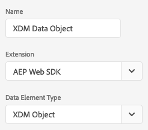

# Adobe Experience PlatformWeb SDK发布快速开始指南

本指南引导您了解在Launch中设置Adobe Experience PlatformWeb SDK的不同方法。 要使用此功能，您需要处于允许列表状态。 如果您希望进入等待列表，请联系您的认证软件经理(CSM)。

- 启用 [第一方域(CNAME)](https://docs.adobe.com/content/help/zh-Hans/core-services/interface/ec-cookies/cookies-first-party.html) 。 如果您已经拥有Analytics的CNAME，则应使用该CNAME。 在开发中进行测试没有CNAME，但您在开始生产之前需要一个CNAME。
- 有权获得Adobe Experience Platform。 如果您尚未购买平台，Adobe将为您提供Experience Platform数据服务基础，以便在SDK中以有限方式使用，并且不收取额外费用。
- 使用最新版的访客ID服务。

## 准备模式

Experience Platform边缘网络使用体验数据模型(XDM)。 XDM是一种数据格式，允许您定义模式。 模式定义边缘网络希望数据的格式。 要发送数据，您必须定义模式。

1. [创建模式](../../xdm/tutorials/create-schema-ui.md)
2. 将AEP Mixin [!DNL Web SDK ExperienceEvent] 添加到您创建的模式。
3. 根据您创建的模式创建数据集。

以下视频旨在支持您为模式创建数据集、数据集和流源连接器。 [!DNL Web SDK]

>[!VIDEO](https://video.tv.adobe.com/v/35395?quality=12&learn=on)

登录到启动并安装扩 `AEP Web SDK` 展。 安装SDK时，系统会提示您配置扩展。 输入您在上面请求的配置ID。 该扩展将自动填充您的组织ID。

有关不同配置选项的更多详细信息，请 [参阅配置SDK](../fundamentals/configuring-the-sdk.md)。

## 创建配置ID

您可以使用启动项中的边缘配 [置工具创建配](../fundamentals/edge-configuration.md) 置ID。 这样，边缘网络就可以将数据发送到各种解决方案。 有关如何查找每个选项的详细信息，请参阅 [边缘配置工具](../fundamentals/edge-configuration.md) 页。

>[!NOTE]
>
>您的组织必须允许列表此功能。 请联系您的认证软件经理(CSM)，开始允许列表。

## 根据您的模式创建数据元素

在Launch中，通过将扩展更改为AEP Web SDK并将类型设置为，创建引用模式的数据元素 `XDM Object`。 这将加载您的模式，并允许您将数据元素映射到模式的不同部分。

## 发送事件

安装扩展后，开始通过将AEP Web SDK扩展 `sendEvent` 中的操作添加到规则来发送事件。 将刚创建的事件元素作为XDM数据添加到该数据中。 Adobe建议您在每次加载页面时至少发送一个事件。

有关如何跟踪事件的更多详细信息，请参阅 [跟踪事件](../fundamentals/tracking-events.md)。

## 后续步骤

在数据流动后，您可以执行以下操作。

- [构建模式](https://docs.adobe.com/content/help/zh-Hans/experience-platform/xdm/schema/composition.html)
- [了解调试](../fundamentals/debugging.md)
- 了解如何 [个性化体验](../fundamentals/rendering-personalization-content.md)
- 将IAB透明 [度和同意框架2.0纳入Adobe Experience Platform Launch](../solution-specific/iab-tcf/with-launch.md) 。
- 了解如何将数据发送到多个解决方案
   - [Adobe Analytics](../solution-specific/analytics/analytics-overview.md)
   - [Adobe Audience Manager](../solution-specific/audience-manager/audience-manager-overview.md)
   - [Adobe Target](../solution-specific/target/target-overview.md)
