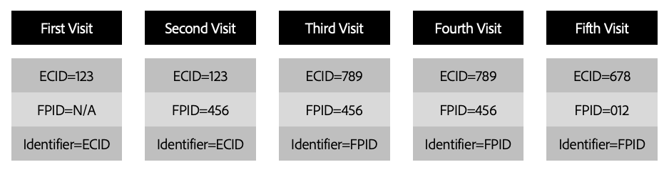

# 平台Web SDK中的第一方设备ID

Adobe Experience Platform Web SDK分配 [Adobe Experience Cloud ID(ECID)](https://experienceleague.adobe.com/docs/experience-platform/identity/ecid.html?lang=en) 通过使用cookie向网站访客发送，以跟踪用户行为。 要考虑浏览器对Cookie生命周期的限制，您可以选择设置并管理您自己的设备标识符。 这些ID称为第一方设备ID(FPID)。

>[!NOTE]
>
>仅当通过Platform Web SDK将数据发送到Platform Edge Network时，才提供第一方设备ID支持。

本文档介绍如何为您的Platform Web SDK实施配置第一方设备ID。

## 先决条件

本指南假定您熟悉Platform Web SDK身份数据的工作方式，包括ECID的角色和 `identityMap`. 请参阅 [Web SDK中的身份数据](./overview.md) 以了解更多信息。

## 使用FPID

FPID通过使用第一方Cookie跟踪访客。 使用利用DNS的服务器设置第一方Cookie时，它们最有效 [记录](https://datatracker.ietf.org/doc/html/rfc1035) （对于IPv4）或 [AAAA记录](https://datatracker.ietf.org/doc/html/rfc3596) （对于IPv6），而不是DNS CNAME或JavaScript代码。

>[!IMPORTANT]
>
>仅支持设置和跟踪Cookie的记录或AAAA记录。 数据收集的主要方法是通过DNS CNAME。 换言之，FPID使用A记录或AAAA记录进行设置，然后使用CNAME发送到Adobe。
>
>的 [Adobe管理的证书计划](https://experienceleague.adobe.com/docs/core-services/interface/administration/ec-cookies/cookies-first-party.html#adobe-managed-certificate-program) 也仍支持用于第一方数据收集。

设置FPID Cookie后，即可获取其值，并在收集事件数据时将其值发送到Adobe。 收集的FPID用作生成ECID的种子，ECID仍是Adobe Experience Cloud应用程序中的主要标识符。

要将网站访客的FPID发送到平台边缘网络，您必须在 `identityMap` 访客。 请参阅本文档后面部分的 [在中使用FPID `identityMap`](#identityMap) 以了解更多信息。

### ID格式要求

平台边缘网络仅接受符合 [UUIDv4格式](https://datatracker.ietf.org/doc/html/rfc4122). 不采用UUIDv4格式的设备ID将被拒绝。

生成UUID几乎总是会生成一个唯一的随机ID，发生冲突的概率可以忽略不计。 UUIDv4不能使用IP地址或任何其他个人身份信息(PII)进行植入。 UUID无所不在，而且几乎每种编程语言都可以找到相应的库来生成UUID。

## 使用您自己的服务器设置Cookie

使用您拥有的服务器设置Cookie时，可以使用多种方法来防止Cookie因浏览器策略而受到限制：

* 使用服务器端脚本语言生成Cookie
* 设置Cookie以响应对对网站上的子域或其他端点发出的API请求
* 使用CMS生成Cookie。
* 使用CDN生成Cookie

>[!IMPORTANT]
>
>使用JavaScript设置的Cookie `document.cookie` 方法几乎永远不会受到限制Cookie持续时间的浏览器策略的保护。

### 何时设置Cookie

最好在向边缘网络发出任何请求之前设置FPID Cookie。 但是，在无法实现的情况下，仍会使用现有方法生成ECID，并在Cookie存在的情况下充当主标识符。

假设ECID最终会受到浏览器删除策略的影响，但FPID没有影响，则FPID将在下次访问时成为主要标识符，并将用于在后续每次访问时为ECID提供种子。

### 设置Cookie的过期时间

在实施FPID功能时，应仔细考虑设置Cookie的过期时间。 在做出此决策时，您应考虑贵组织所在的国家或地区，以及这些地区中每个地区的法律和政策。

作为此决策的一部分，您可能希望采用公司范围的Cookie设置策略，或者针对您运行的每个区域设置中的用户而采用的Cookie设置策略。

无论您为Cookie的初始过期选择何种设置，都必须确保包含的逻辑会在每次对网站进行新访问时延长Cookie的过期时间。

## Cookie标记的影响

有各种Cookie标记会影响不同浏览器对Cookie的处理方式：

* [&#39;HTTPOnly&#39;](#http-only)
* [`安全`](#secure)
* [`SameSite`](#same-site)

### `HTTPOnly` {#http-only}

使用 `HTTPOnly` 标记无法使用客户端脚本进行访问。 这表示如果您将 `HTTPOnly` 标记时，您必须利用服务器端脚本语言来读取要包含在 `identityMap`.

如果您选择让Platform Edge Network读取FPID Cookie的值，请将 `HTTPOnly` 标记将确保值不可由任何客户端脚本访问，但不会对平台边缘网络读取Cookie的能力造成任何负面影响。

>[!NOTE]
>
>使用 `HTTPOnly` 标记对可能限制Cookie生命周期的Cookie策略没有影响。 但是，在设置和读取FPID的值时，仍应考虑这一点。

### `Secure` {#secure}

使用 `Secure` 属性仅会通过HTTPS协议通过加密请求发送到服务器。 使用此标记有助于确保中间人攻击者无法轻松访问Cookie的值。 在可能的情况下，最好设置 `Secure` 标记。

### `SameSite` {#same-site}

的 `SameSite` 属性允许服务器确定cookie是否随跨站点请求一起发送。 该属性可提供一些针对跨站点伪造攻击的保护。 存在三个可能的值： `Strict`, `Lax` 和 `None`. 请咨询您的内部团队，以确定适合贵组织的设置。

如果否 `SameSite` 属性时，某些浏览器的默认设置现在为 `SameSite=Lax`.

## 在中使用FPID `identityMap` {#identityMap}

以下是如何在 `identityMap`:

```json
{
  "identityMap": {
    "FPID": [
      {
        "id": "123e4567-e89b-42d3-9456-426614174000",
        "authenticatedState": "ambiguous",
        "primary": true
      }
    ]
  }
}
```

与其他身份类型一样，您可以在 `identityMap`. 以下是经过身份验证的CRM ID随附的FPID示例：

```json
{
  "identityMap": {
    "FPID": [
      {
        "id": "123e4567-e89b-42d3-9456-426614174000",
        "authenticatedState": "ambiguous",
        "primary": true
      }
    ],
    "EMAIL": [
      {
        "id": "email@mail.com",
        "authenticatedState": "authenticated",
        "primary": true
      }
    ]
  }
}
```

如果在启用第一方数据收集时，FPID包含在边缘网络读取的Cookie中，则您应仅捕获经过身份验证的CRM ID:

```json
{
  "identityMap": {
    "EMAIL": [
      {
        "id": "email@mail.com",
        "authenticatedState": "authenticated",
        "primary": true
      }
    ]
  }
}
```

以下 `identityMap` 会导致边缘网络发生错误响应，因为它缺少 `primary` FPID指示器。 最后， `identityMap` 必须标记为 `primary`.

```json
{
  "identityMap": {
    "FPID": [
      {
        "id": "123e4567-e89b-12d3-a456-426614174000",
        "authenticatedState": "ambiguous"
      }
    ],
    "EMAIL": [
      {
        "id": "email@mail.com",
        "authenticatedState": "authenticated"
      }
    ]
  }
}
```

在这种情况下，Experience Edge返回的错误响应类似于以下内容：

```json
{
    "type": "https://ns.adobe.com/aep/errors/EXEG-0306-400",
    "status": 400,
    "title": "No primary identity set in request (event)",
    "detail": "No primary identity found in the input event. Update the request accordingly to your schema and try again.",
    "report": {
        "requestId": "{REQUEST_ID}",
        "configId": "{CONFIG_ID}",
        "orgId": "{ORG_ID}"
    }
}
```

## ID层次结构

当ECID和FPID都存在时，ECID将在识别用户时按优先顺序排列。 这将确保当浏览器Cookie存储中存在现有ECID时，它将继续是主要标识符，并且现有访客计数不会受到影响。 对于现有用户，FPID将在ECID过期或由于浏览器策略或手动过程而被删除之前成为主标识。

身份按以下顺序排列优先级：

1. ECID包含在 `identityMap`
1. 存储在Cookie中的ECID
1. FPID包含在 `identityMap`
1. FPID存储在Cookie中

## 迁移到第一方设备ID

如果您使用以前实施中的FPID迁移到，则可能很难在较低级别显示过渡的外观。

为了帮助说明此过程，请考虑一个涉及先前访问过您网站的客户的情景，以及FPID迁移对该客户在Adobe解决方案中的识别方式有何影响。



| 访问 | 描述 |
| --- | --- |
| 首次访问 | 假设您尚未开始设置FPID Cookie。 包含在 [AMCV Cookie](https://experienceleague.adobe.com/docs/id-service/using/intro/cookies.html#section-c55af54828dc4cce89f6118655d694c8) 将是用于标识访客的标识符。 |
| 第二次访问 | 已开始使用第一方设备ID解决方案。 现有的ECID仍然存在，并且仍然是访客标识的主要标识符。 |
| 第三次访问 | 在第二次和第三次访问之间，由于浏览器策略，已经过了足够长的时间，ECID已被删除。 但是，由于FPID是使用DNS A记录设置的，因此FPID会持续存在。 FPID现在被视为主ID，用于为ECID进行种子化，ECID将写入最终用户设备。 在Adobe Experience Platform和Experience Cloud解决方案中，用户现在将被视为新访客。 |
| 第四次访问 | 在第三次和第四次访问之间，由于浏览器策略，已经过足够的时间，ECID已被删除。 与上次访问一样，FPID由于其设置方式而保持不变。 此时，将生成与上次访问相同的ECID。 在整个Experience Platform和Experience Cloud解决方案中，用户都被视为与上次访问相同的用户。 |
| 第五次访问 | 在第四次到第五次访问之间，最终用户清除了其浏览器中的所有Cookie。 生成新的FPID，并用于为新ECID的创建提供种子。 在Adobe Experience Platform和Experience Cloud解决方案中，用户现在将被视为新访客。 |

{style=&quot;table-layout:auto&quot;}

## 常见问题解答

以下是有关第一方设备ID的常见问题解答列表。

### 为ID设定种子与简单地生成ID有何不同？

种子设定的概念是独特的，因为传递到Adobe Experience Cloud的FPID是使用确定性算法转换为ECID的。 每次在Adobe Experience Platform边缘网络中发送相同的FPID时，FPID中都会植入相同的ECID。

### 何时应生成第一方设备ID?

为了减少潜在的访客虚增，应在使用Platform Web SDK发出首个请求之前生成FPID。 但是，如果您无法执行此操作，则仍会为该用户生成ECID，并将用作主标识符。 在ECID不再存在之前，生成的FPID将不会成为主标识符。

### 哪些数据收集方法支持第一方设备ID?

目前，只有平台Web SDK支持FPID。

### FPID是否存储在任何平台或Experience Cloud解决方案上？

使用FPID为ECID种子后，该ECID会从 `identityMap` 并替换为已生成的ECID。 FPID不存储在任何Adobe Experience Platform或Experience Cloud解决方案中。
