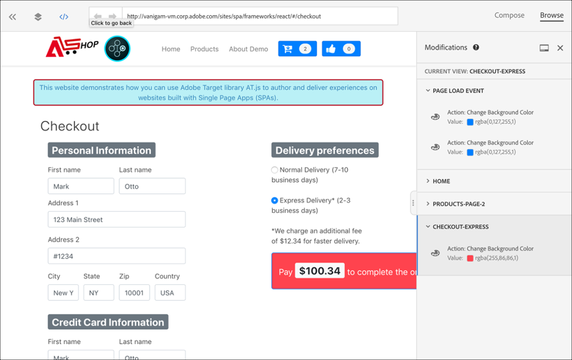

# 单页应用程序实施

Adobe Experience PlatformWeb SDK提供丰富的功能，使您的企业能够基于下一代客户端技术(如单页应用程序(SPA))进行个性化。

传统网站使用的是“页面到页面”导航模型，也称为多页应用程序，其中网站设计与 URL 紧密耦合，并且从一个网页转换到另一个网页时，需要页面加载。

现代Web应用程序（如单页应用程序）采用的模型推动了浏览器UI渲染的快速使用，这种渲染通常独立于页面重新加载。 客户互动（如滚动、点击和光标移动）可以触发这些体验。 随着现代Web的范式不断发展，传统通用事件（如页面加载）部署个性化和实验的相关性不再有效。


## SPA平台Web SDK的优势

以下是将Adobe Experience PlatformWeb SDK用于单页应用程序的一些优势：

* 能够在页面加载时缓存所有选件，将多次服务器调用减少至一次服务器调用。
* 极大地改善了您网站上的用户体验，因为优惠会通过缓存立即显示，而不会因传统服务器调用而延迟。
* 只需编写一行代码并设置一次性开发人员，营销人员便可通过SPA上的可视体验书写器(VEC)创建并运行A/B和体验定位(XT)活动。

## XDM视图和单页应用程序

Adobe Target 中 SPA VEC 利用了称作“视图”的新概念，即视觉元素的逻辑组合，这些元素共同构成了 SPA 体验。因此，根据用户交互，单个页面应用程序可被视为通过视图而不是URL进行转换。 “视图”通常可显示整个站点或某个站点中分组的可视化元素。

为进一步解释哪些是视图，以下示例使用React中实现的假设在线电子商务站点来探索示例视图。

导航到主站点后，一幅英雄图像将宣传复活节销售以及网站上提供的最新产品。 在这种情况下，可以为整个主屏幕定义视图。 这种视图可以简单地称为“家”。


As the customer becomes more interested in the products that the business is selling, they decide to click the **Products** link. 与主页网站类似，可将整个产品站点定义为一个“视图”。此视图可命名为“全部产品”。


由于视图可以定义为整个站点或站点上的一组可视元素，因此产品站点上显示的四个产品可以分组并视为视图。 此视图可命名为“产品”。


当客户决定单击“加 **载更多** ”按钮以浏览网站上的更多产品时，网站URL在此情况下不会更改，但可以在此创建一个视图以仅表示显示的第二行产品。 视图名称可以是“products-page-2”。


客户决定从站点购买几款产品，然后继续到结帐屏幕。 在结帐站点上，客户可以选择普通投放或快速投放。 视图可以是站点上的任何可视元素组，因此可以为投放首选项创建视图并称为“投放首选项”。


视图的概念可以进一步扩展。 这些只是可在站点上定义的视图的几个示例。

## 实施XDM视图

在Adobe Target，可以利用XDM视图，使营销人员能够通过可视体验书写器在SPA上运行A/B和XT测试。 这需要执行以下步骤才能完成一次性开发人员设置：

1. 安装 [Adobe Experience PlatformWeb SDK](../../fundamentals/installing-the-sdk.md)
2. 确定您的单页应用程序中要进行个性化的所有XDM视图。
3. 定义XDM视图后，为了传送AB或XT VEC活动，在单页应用程 `sendEvent()` 序中 `renderDecisions` 实现 `true` 设置为的函数和相应的XDM视图。 XDM视图必须传入 `xdm.web.webPageDetails.viewName`。 此步骤允许营销人员利用Visual Experience Composer启动这些XDM的A/B和XT测试。

   ```javascript
   alloy("sendEvent",  { 
     "renderDecisions": true, 
     "xdm": { 
       "web": { 
         "webPageDetails": { 
            "viewName":"home" 
         }      
       } 
     } 
   });
   ```

>[!NOTE]
>
>在第一次 `sendEvent()` 呼叫时，将读取并缓存应呈现给最终用户的所有XDM视图。 接 `sendEvent()` 入XDM视图的后续调用将从缓存中读取，并在不进行服务器调用的情况下呈现。

## `sendEvent()` 函数示例

本节概述三个示例，其中显示如 `sendEvent()` 何调用假设的电子商务SPA的React中的函数。

### 示例1:A/B测试主页

营销团队希望对整个主页运行A/B测试。


要在整个主站点上运行A/B测试， `sendEvent()` 必须调用XDM并将 `viewName` 其设置为 `home`:

```javascript
function onViewChange() { 
  
  var viewName = window.location.hash; // or use window.location.pathName if router works on path and not hash 

  viewName = viewName || 'home'; // view name cannot be empty 

  // Sanitize viewName to get rid of any trailing symbols derived from URL 

  if (viewName.startsWith('#') || viewName.startsWith('/')) { 
    viewName = viewName.substr(1); 
  }
   
  alloy("sendEvent",  { 
    "renderDecisions": true, 
    "xdm": { 
      "web": { 
        "webPageDetails": { 
          "viewName":"home" 
        } 
      } 
  }); 
} 

// react router v4 

const history = syncHistoryWithStore(createBrowserHistory(), store); 

history.listen(onViewChange); 

// react router v3 

<Router history={hashHistory} onUpdate={onViewChange} > 
```

### 示例2:个性化产品

营销团队希望在用户单击“加载更多”后，将价格标签颜色更改为红色，从而个性化第二 **行产品**。


```javascript
function onViewChange(viewName) { 

  alloy("sendEvent",  { 
    "renderDecisions": true, 
    "xdm": { 
       "web": { 
        "webPageDetails": { 
          "viewName": viewName
        }
      } 
    } 
  }); 
} 

class Products extends Component { 
  
  render() { 
    return ( 
      <button type="button" onClick={this.handleLoadMoreClicked}>Load more</button> 
    ); 
  } 

  handleLoadMoreClicked() { 
    var page = this.state.page + 1; // assuming page number is derived from component’s state 
    this.setState({page: page}); 
    onViewChange('PRODUCTS-PAGE-' + page); 
  } 

} 
```

### 示例3:A/B测试投放首选项

The marketing team want to run an A/B test to see whether changing the color of the button from blue to red when **Express Delivery** is selected can boost conversions (as opposed to keeping the button color blue for both delivery options).


要根据选择的投放首选项对网站上的内容进行个性化，可以为每个投放首选项创建一个视图。 选 **择“正常投放** ”后，视图可命名为“checkout-normal”。 If **Express Delivery** is selected, the View can be named &quot;checkout-express&quot;.

```javascript
function onViewChange(viewName) { 

  alloy("sendEvent",  { 
    "renderDecisions": true, 
    "xdm": { 
      "web": { 
        "webPageDetails": { 
          "viewName": viewName   
        }
      }
    }
  }); 
} 

class Checkout extends Component { 

  render() { 
    return ( 
      <div onChange={this.onDeliveryPreferenceChanged}> 
        <label> 
          <input type="radio" id="normal" name="deliveryPreference" value={"Normal Delivery"} defaultChecked={true}/> 
          <span> Normal Delivery (7-10 business days)</span> 
        </label> 
        <label> 
          <input type="radio" id="express" name="deliveryPreference" value={"Express Delivery"}/> 
          <span> Express Delivery* (2-3 business days)</span> 
        </label> 
      </div> 
    ); 
  } 

  onDeliveryPreferenceChanged(evt) { 
    var selectedPreferenceValue = evt.target.value; 
    onViewChange(selectedPreferenceValue); 
  } 

} 
```

## 为SPA使用Visual Experience Composer

当您定义完XDM视图并实`sendEvent()` 施传入的XDM视图后，VEC将能够检测这些视图并允许用户为A/B或XT活动创建操作和修改。

>[!NOTE]
>
>要为SPA使用VEC，必须安装并激活Firefox [或](https://addons.mozilla.org/en-US/firefox/addon/adobe-target-vec-helper/) Chrome [VEC Helper](https://chrome.google.com/webstore/detail/adobe-target-vec-helper/ggjpideecfnbipkacplkhhaflkdjagak) Extension。

### “修改”面板

“修改”面板捕获为特定视图创建的操作。 视图的所有操作都在该视图下进行分组。


### 操作

单击某个操作会突出显示将应用此操作的网站上的元素。Each VEC action created under a View has the following icons: **Information**, **Edit**, **Clone**, **Move**, and **Delete**. 下表中将更详细地介绍这些图标。


| 图标 | 描述 |
|---|---|
| 信息 | 显示操作的详细信息。 |
| Edit | 允许您直接编辑操作的属性。 |
| 克隆 | 将操作克隆到位于“修改”面板上的一个或多个视图，或者您在 VEC 中浏览并导航到的一个或多个视图。该操作不一定存在于“修改”面板中。<br/><br/>**注意：** 执行克隆操作后，必须通过浏览导航到VEC中的视图，以查看克隆操作是否是有效操作。 如果该操作未应用到视图，您将看到一个错误。 |
| 移动 | 将操作移动到“页面加载事件”或修改面板中已存在的任何其他视图。<br/><br/>**页面加载事件:** 与页面加载事件对应的任何操作都将应用于Web应用程序的初始页面加载。 <br/><br/>**注意**：执行移动操作后，必须通过浏览导航到VEC中的视图，以查看移动是否是有效操作。 如果该操作未应用到视图，您将看到一个错误。 |
| Delete | 删除操作。 |

## 将VEC用于SPA示例

本节概述了三个使用Visual Experience Composer为A/B或XT活动创建操作和修改的示例。

### 示例1:更新“主页”视图

在此文档的早期，为整个主站点定义了一个名为“home”的视图。 现在，营销团队希望通过以下方式更新“主”视图:

* 将“添 **加到购物车** ”和“ **喜欢** ”按钮更改为蓝色的较浅分享。 在页面加载过程中应发生这种情况，因为这涉及更改标题的组件。
* Change the **Latest Products for 2019** label to **Hottest Products for 2019** and change the text color to purple.

To make these updates in the VEC, select **Compose** and apply those changes to the &quot;home&quot; view.


### 示例2:更改产品标签

对于“products-page-2”视图，营销团队希望将“价格”标签 **更改为** “销售 **价格** ”，并将标签颜色更改为红色。

要在VEC中进行这些更新，需要执行以下步骤：

1. 在 **VEC中** ，选择“浏览”。
2. 在 **站点** 顶部导航中选择产品。
3. Select **Load More** once to view the second row of products.
4. 在 **VEC** 中选择“合成”。
5. Apply actions to change the text label to **Sale Price** and the color to red.


### 示例3:个性化投放偏好样式

视图可以按粒度定义，如状态或单选按钮中的选项。 此文档视图的早期定义为“投放首选项”、“checkout-normal”和“checkout-express”。 营销团队希望将“checkout-express”视图的按钮颜色更改为红色。

要在VEC中进行这些更新，需要执行以下步骤：

1. 在 **VEC中** ，选择“浏览”。
2. 将产品添加到站点上的购物车。
3. 选择站点右上角的购物车图标。
4. 选择 **结帐您的订单**。
5. 在“投放 **首选项** ”下选择“快速 **投放”单选按钮**。
6. 在 **VEC** 中选择“合成”。
7. 将“付 **费** ”按钮颜色更改为红色。

>[!NOTE]
>
>在选择“Express视图”单选按钮之前，“修改”面板 **中不会显** 示“checkout-express”投放。 这是因为当选`sendEvent()` 择Express投放单选按钮 **时执行该函数** ，因此在选择单选按钮之前，VEC不会识别“checkout-express”视图。

