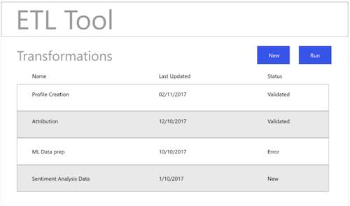

# ETL工作流程

各种提取、转换和加载(ETL)工具的格式可能不同，但大多数工具都提供类似的功能，以协助组合多个数据源。

## ETL工具示例

下图提供了常见ETL操作的模型以及基于标准交互的通用用户体验。 这些图像可以轻松适应特定ETL用户体验。

以下操作在[ ETL集成指南](home.md)中概述的步骤中进行了说明。 某些步骤引用特定的“图”，其他步骤则描述与此处显示的工作流相似的操作。

### 图1 —— 配置新的Adobe Experience Platform连接器：

### 图2 - [!DNL Experience Platform]已激活连接器：

### 图3 - ETL转换管理UI:

### 图4 —— 新建转换UI，选择[!DNL Experience Platform]连接：

### 图5 —— 浏览源[!DNL Experience Platform]数据集：

### 图6 - ETL UI中数据集的元数据和示例数据：

### 图7 —— 查看数据集中的字段模式信息：

### 图8 —— 预览数据集中的数据：

### 图9 —— 为转换操作定义数据同步参数：

### 图10 —— 定义[!DNL Experience Data Model](XDM)目标数据集：

### 图11 —— 查看XDM分层模式和元数据以支持映射／转换：

### 图12 —— 保存并运行/计划转换：

