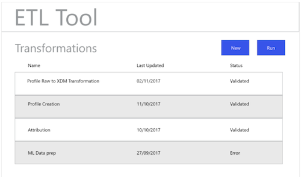

# ETL工作流

各种提取、转换和加载(ETL)工具在格式上可能有所不同，但大多数工具都公开类似的功能，以帮助合并多个数据源。

## ETL工具示例

下图提供了常见ETL操作的模型以及基于标准交互的通用用户体验。 这些图像可以容易地适应特定的ETL用户体验。

在中概述的步骤中说明了以下操作 [ETL集成指南](home.md). 一些步骤引用了特定的“数字”，而另一些步骤则描述了与此处显示的工作流类似的操作。

### 图1 — 配置新的Adobe Experience Platform连接器：

### 图2 - [!DNL Experience Platform] 连接器已激活：

### 图3 - ETL Transformation Management UI：

### 图4 — 新建转换UI，选择 [!DNL Experience Platform] 连接：

### 图5 — 浏览源 [!DNL Experience Platform] 数据集：

### 图6 - ETL UI中数据集的元数据和示例数据：

### 图7 — 查看数据集的字段架构信息：

### 图8 — 预览数据集中的数据：

### 图9 — 为转换操作定义数据同步参数：

### 图10 — 定义 [!DNL Experience Data Model] (XDM)目标数据集：

### 图11 — 查看XDM分层架构和元数据以支持映射/转换：

### 图12 — 保存并运行/计划转换：

