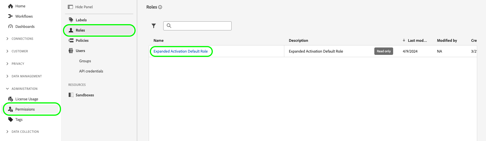

# 帐户管理

要从Audience Manager摄取受众并将它们激活到社交和广告目标，您必须首先创建一个扩展的激活用户帐户，并将该帐户分配给正确的权限角色。

本页介绍如何在Admin Console中创建用户帐户，并为扩展激活分配正确的权限。

## 创建用户帐户 {#create-users}

必须先创建用户帐户，然后才能使用[!DNL Audience Manager Expanded Activation]。

要为[!DNL Expanded Activation]创建用户帐户，请按照[Adobe Admin Console](https://helpx.adobe.com/cn/enterprise/using/manage-users-individually.html)文档中有关管理用户的说明进行操作。

## 将用户添加到权限角色 {#permissions}

创建用户帐户后，必须在[!DNL Expanded Activation]用户界面中将其添加到[!DNL Expanded Activation]权限角色。

转到&#x200B;**[!UICONTROL 管理]** -> **[!UICONTROL 权限]** -> **[!UICONTROL 角色]**，然后选择&#x200B;**[!UICONTROL 扩展的激活默认角色]**。

转到&#x200B;**[!UICONTROL 用户]**&#x200B;选项卡并选择&#x200B;**[!UICONTROL 添加用户]**。

从可用列表中选择新创建的用户，然后选择&#x200B;**[!UICONTROL 保存]**。

现在将创建用户帐户并为其分配正确的角色。 现在可以访问&#x200B;**[!UICONTROL 扩展激活]**&#x200B;用户界面。

## 监测许可证使用情况 {#license-usage}

您的[!DNL Audience Manager Expanded Activation]合同指定了可摄取到帐户的经过哈希处理的电子邮件的最大数目。

您可以转到&#x200B;**[!UICONTROL 管理]** -> **[!UICONTROL 许可证使用情况]**&#x200B;页面来查找此信息。

在此页上，您可以找到以下信息：

* **[!UICONTROL 产品]**：您获得许可的Adobe产品。 这将始终为&#x200B;**[!UICONTROL Audience Manager扩展激活]**。
* **[!UICONTROL 主要量度]**：要跟踪使用的量度的名称。 这始终是&#x200B;**[!UICONTROL 可寻址受众]**。
* **[!UICONTROL 许可证数量]**：您许可接收的最大哈希电子邮件数量。

  >[!TIP]
  >
  >您通过[Audience Manager源连接器](../sources/connectors/adobe-applications/audience-manager.md)摄取经过哈希处理的电子邮件。 有关更多详细信息，请参阅有关[如何激活受众](activate-audiences.md)的文档。

* **[!UICONTROL 使用情况]**：您已摄取的经过哈希处理的电子邮件数。
* **[!UICONTROL 使用情况%]**：您已使用的许可证数量的百分比。

要了解有关Experience Platform中许可证使用的更多信息，请参阅[许可证使用文档](../dashboards/guides/license-usage.md)。

## 后续步骤 {#next-steps}

现在，您已配置至少一个用户帐户以正确访问扩展激活，您可以开始使用该帐户[激活受众](activate-audiences.md)。
