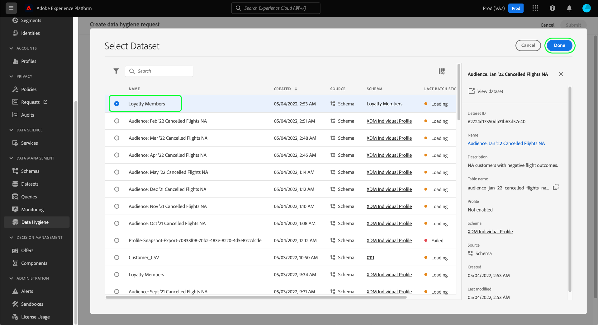

# 管理数据集过期日期

>[!IMPORTANT]
>
>Adobe Experience Platform中的数据卫生功能目前仅适用于已购买Healthcare Shield的组织。

的 [[!UICONTROL 数据卫生] 工作区](./overview.md) 在Adobe Experience Platform UI中，您可以计划数据集过期。 当数据集到期日期时，数据湖、Identity Service和实时客户配置文件将开始单独的进程，以从各自的服务中删除数据集的内容。 从所有这三项服务中删除数据后，过期时间将标记为完成。

本文档介绍如何在Platform UI中计划和管理数据集过期。

## 计划数据集过期

要创建新请求，请选择 **[!UICONTROL 创建请求]** 的页面。

![显示 [!UICONTROL 创建请求] 按钮](../images/ui/ttl/create-request-button.png)

<!-- The request creation dialog appears. Under the **[!UICONTROL Action]** section, select **[!UICONTROL Dataset]** to update the available controls for dataset expiration scheduling-->

### 选择日期和数据集

将出现请求创建对话框。 在 **[!UICONTROL 操作]** 部分，选择您希望删除数据集的日期。 您可以手动输入日期(格式为 `mm/dd/yyyy`)或选择日历图标()从对话框中选择日期。

下一个，下 **[!UICONTROL 数据集详细信息]**，选择数据库图标()打开数据集选择对话框。 从列表中选择要将过期时间应用到的数据集，然后选择 **[!UICONTROL 完成]**.

>[!NOTE]
>
>只显示属于当前沙盒的数据集。

### 提交请求

选择数据集和过期日期后，请选择 **[!UICONTROL 提交]**.

![显示 [!UICONTROL 提交] 按钮](../images/ui/ttl/submit.png)

系统将要求您确认删除数据集的日期。 选择 **[!UICONTROL 提交]** 继续。

提交请求后，将创建工作单，并显示在 [!UICONTROL 数据卫生] 工作区。 在此处，您可以在处理请求时监控工作单的状态。

## 编辑或取消数据集过期

要编辑或取消数据集过期，请选择 **[!UICONTROL 数据集]** ，然后从列表中选择数据集过期时间。

在数据集过期的详细信息页面上，右边栏会显示用于编辑或取消计划删除的控件。

## 后续步骤

本文档介绍了如何在Experience PlatformUI中计划数据集过期。 要了解如何使用数据卫生API计划数据集过期，请参阅 [数据集过期端点指南](../api/dataset-expiration.md).
