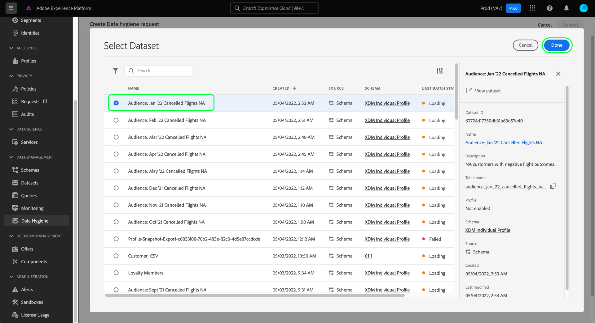

# 删除消费者记录

>[!IMPORTANT]
>
>Adobe Experience Platform中的Adobe卫生功能目前仅适用于已购买Data Shield for Healthcare的组织。

的 [[!UICONTROL 数据卫生] 工作区](./overview.md) 在Adobe Experience Platform UI中，您可以删除参与Identity服务和实时客户资料的客户记录。

## 先决条件

删除消费者记录需要对身份字段在Experience Platform中的工作方式有良好的了解。 具体而言，您必须知道要删除其记录的消费者的主要身份值，具体取决于您从中删除这些记录的数据集（或数据集）。

有关Platform中身份的更多信息，请参阅以下文档：

* [Adobe Experience Platform Identity Service](../../identity-service/home.md):跨设备和系统构建身份桥梁，根据数据集符合的XDM架构定义的身份字段，将数据集链接在一起。
   * [身份命名空间](../../identity-service/namespaces.md):身份命名空间定义可与单个人员关联的不同身份信息类型，这些信息是每个身份字段的必需组件。
* [实时客户资料](../../profile/home.md):利用消费者身份图表，根据来自多个来源的汇总数据提供统一的消费者用户档案，这些数据近乎实时地更新。
* [体验数据模型(XDM)](../../xdm/home.md):通过使用架构为平台数据提供标准定义和结构。 所有Platform数据集都符合特定的XDM架构，并且该架构定义哪些字段是标识。
   * [标识字段](../../xdm/ui/fields/identity.md):了解如何在XDM架构中定义标识字段。

## 创建新请求

要启动该流程，请选择 **[!UICONTROL 创建请求]** 的页面。

![显示 [!UICONTROL 创建请求] 按钮](../images/ui/delete-consumer/create-request-button.png)

将出现请求创建对话框。 默认情况下， **[!UICONTROL 消费者]** 选项 **[!UICONTROL 操作]** 中。 保持选中此选项。


## 选择数据集

在 **[!UICONTROL 消费者详细信息]** 部分，下一步是确定要从单个数据集还是所有数据集中删除消费者数据。

如果您选择 **[!UICONTROL 选择数据集]**，选择数据库图标()，此时会出现一个对话框，允许您从列表中选择所需的数据集。



如果要从所有数据集中删除消费者数据，请选择 **[!UICONTROL 所有数据集]**.

![显示 [!UICONTROL 所有数据集] 已选择](../images/ui/delete-consumer/all-datasets.png)

>[!NOTE]
>
>选择 **[!UICONTROL 所有数据集]** 选项可能会导致删除操作花费较长的时间，并且可能不会导致准确删除记录。

## 提供消费者身份 {#provide-consumer-identities}

>[!CONTEXTUALHELP]
>id="platform_hygiene_primaryidentity"
>title="主标识"
>abstract="主标识是将记录与Experience Platform中消费者的配置文件关联的属性。 数据集的主标识字段由数据集所基于的架构定义。 在此列中，您必须为消费者的主标识提供类型（或命名空间），例如 `email` (电子邮件地址和 `ecid` Experience CloudID。 要了解更多信息，请参阅数据卫生UI指南。"

>[!CONTEXTUALHELP]
>id="platform_hygiene_identityvalue"
>title="标识值"
>abstract="在此列中，您必须为消费者的主标识提供值，该值必须与左列中提供的标识类型相对应。 如果主标识类型为 `email`，值应为消费者的电子邮件地址。 要了解更多信息，请参阅数据卫生UI指南。"

删除消费者数据时，必须提供身份信息，以便系统能够确定必须删除哪些记录。 对于Platform中的任何数据集，将根据 **主标识** 字段。

与Platform中的所有标识字段一样，主标识由两个部分组成：a **type** （有时称为身份命名空间）和 **值**. 标识类型提供有关字段如何标识消费者的上下文（如电子邮件地址），并且值表示消费者对该类型的特定标识(例如， `jdoe@example.com` 对于 `email` 标识类型)。  用作标识的常用字段包括帐户信息、设备ID和Cookie ID。

>[!TIP]
>
>如果您不知道特定数据集的主标识，则可以在Platform UI中找到该数据集。 在 **[!UICONTROL 数据集]** 工作区中，从列表中选择相关数据集。 在数据集的详细信息页面上，将鼠标悬停在右边栏中数据集架构的名称上。 主标识与架构名称和描述一起显示。
>
>

如果您从单个数据集中删除消费者记录，则您提供的所有身份必须具有相同的类型，因为数据集只能有一个主要身份。 如果从所有数据集中删除，则可以包含多个身份类型，因为不同的数据集可能具有不同的主身份。

在删除消费者记录时，有两种选项可提供消费者身份：

* [上传JSON文件](#upload-json)
* [手动输入标识值](#manual-identity)

### 上传JSON文件 {#upload-json}

要上传JSON文件，您可以将文件拖放到提供区域，或选择 **[!UICONTROL 选择文件]** 从本地目录中浏览并选择。


JSON文件必须格式化为对象数组，每个对象表示消费者身份。

```json
[
  {
    "namespaceCode": "email",
    "value": "jdoe@example.com"
  },
  {
    "namespaceCode": "email",
    "value": "san.gray@example.com"
  }
]
```

| 属性 | 描述 |
| --- | --- |
| `namespaceCode` | 身份类型。 |
| `value` | 用户的身份由类型表示。 |

上传文件后，您可以继续 [提交请求](#submit).

### 手动输入标识 {#manual-identity}

要手动输入标识，请选择 **[!UICONTROL 添加标识]**.

![显示 [!UICONTROL 添加标识] 按钮](../images/ui/delete-consumer/add-identity.png)

此时会显示允许您一次输入一个消费者身份的控件。 在 **[!UICONTROL 主标识]**，请使用下拉菜单选择身份类型。 在 **[!UICONTROL 标识值]**，为消费者提供主标识值。


要添加更多标识，请选择加号图标()，或选择 **[!UICONTROL 添加标识]**.


## 提交请求(#submit)

完成向请求添加身份后，选择 **[!UICONTROL 提交]**.

![显示 [!UICONTROL 提交] 按钮](../images/ui/delete-consumer/submit.png)

系统将要求您确认要删除其数据的身份列表。 选择 **[!UICONTROL 提交]** 以确认您的选择。


提交请求后，将创建工作单，并在 [!UICONTROL 消费者] 选项卡 [!UICONTROL 数据卫生] 工作区。 在此处，您可以在处理请求时监控工作单的状态。 大多数消费者删除工作单都需要几天时间才能完成。

## 后续步骤

本文档介绍了如何在Experience PlatformUI中删除用户记录。 有关如何在UI中执行其他数据卫生任务的信息，请参阅 [数据卫生UI概述](./overview.md).

<!--

Paragraph below should be commented out until workorder.md will be added to the TOC.

To learn how to delete consumer records using the Data Hygiene API, refer to the [work order endpoint guide](../api/workorder.md).

-->
