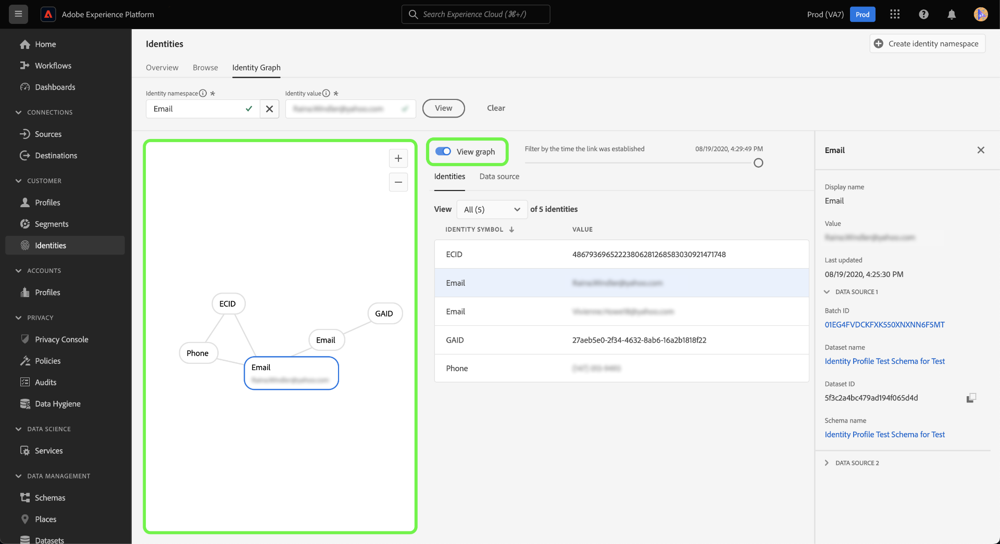

# 身份图查看器

标识图是特定客户的不同标识之间的关系映射，为您提供客户如何跨不同渠道与您的品牌互动的可视表示形式。 Adobe Experience Platform 身份标识服务几乎可以实时地集体管理和更新所有客户身份标识图，以响应客户活动。

通过Experience Platform用户界面中的身份图查看器，您可以可视化并更好地了解哪些客户身份是通过哪些方式拼合在一起的。 查看器允许您拖动图形的不同部分并与之交互，从而检查复杂的身份标识关系、更高效地进行调试，了解信息的利用方式从而增强透明度并从中受益。

以下文档提供了有关如何在Experience Platform UI中访问和使用身份图查看器的步骤。

## 教程视频

以下视频旨在支持您了解身份图查看器。

>[!VIDEO](https://video.tv.adobe.com/v/345652/?quality=12&learn=on&captions=chi_hans)

## 快速入门

使用身份图查看器需要了解所涉及的各种Adobe Experience Platform服务。 在开始使用身份图查看器之前，请查看以下服务的文档：

- [[!DNL Identity Service]](../home.md)：通过跨设备和系统桥接身份，更好地了解个人客户及其行为。
- [实时客户个人资料](../../profile/home.md)：实时客户个人资料利用身份图创建客户属性和行为的全面且单一视图。

### 术语

- **标识（节点）：**&#x200B;标识或节点是实体（通常是人员）的唯一数据。 身份由身份命名空间和身份值组成。 例如，完全限定的身份可以包含&#x200B;**Email**&#x200B;的身份命名空间，并包含&#x200B;**robin@email.com**&#x200B;的身份值。
- **链接（边缘）：**&#x200B;链接或边缘表示标识之间的连接。 身份链接包括首次建立和上次更新时间戳等属性。 第一个建立的时间戳定义新身份链接到现有身份的日期和时间。 上次更新时间戳定义上次更新现有身份链接的日期和时间。
- **图形（群集）：**&#x200B;图形或群集是代表人员的标识和链接组。

## 访问身份图查看器 {#access-identity-graph-viewer}

在Experience Platform UI中，在左侧导航中选择&#x200B;**[!UICONTROL 标识]**，然后从标题的选项卡列表中选择&#x200B;**[!UICONTROL 标识图形]**。

要查看身份图，请提供身份命名空间及其相应的值，然后选择&#x200B;**[!UICONTROL 查看]**。

>[!TIP]
>
>选择表图标可查看包含组织中所有可用身份命名空间列表的面板。 只要连接了有效的标识值，您就可以使用任何标识命名空间。 有关详细信息，请阅读[身份命名空间指南](./namespaces.md)。

## 了解身份图查看器界面

身份图查看器界面由多个元素组成，可用于与交互并更好地了解您的身份数据。

身份图显示链接到您输入的身份命名空间和值组合的所有身份。 每个节点都由一个身份命名空间及其对应的值组成。 您可以选择、保持和拖动任何节点以与图形交互。 或者，您可以将鼠标悬停在节点上，以查看有关其相应标识值的信息。 选择&#x200B;**[!UICONTROL 查看图形]**&#x200B;以隐藏或显示该图形。

>[!IMPORTANT]
>
>身份图至少需要生成两个链接的身份，以及有效的身份命名空间和值组合。 图形查看器可显示的最大身份数为50。 有关详细信息，请参阅下面的[附录](#appendix)部分。

选择图表中的链接可查看参与该链接的数据集和批次ID。 选择链接还会更新右边栏以提供更多有关数据源详细信息以及首次建立和上次更新时间戳等属性的信息。

[!UICONTROL 身份]表提供了您的身份数据的不同视图，以表格形式列出了身份命名空间和身份值组合。 选择图形中的节点将更新[!UICONTROL 标识]表中突出显示的行项。

使用下拉菜单对图形数据进行排序，并突出显示有关特定身份命名空间的信息。 例如，从菜单中选择&#x200B;**[!UICONTROL 电子邮件]**&#x200B;以查看特定于电子邮件身份命名空间的数据。

右边栏显示有关所选身份的信息，包括其上次更新的时间戳。 右边栏还会显示与所选身份对应的数据源信息，包括其批处理ID、数据集名称、数据集ID和架构名称。

下表提供了有关右边栏中显示的数据源属性的更多信息：

| 数据源 | 描述 |
| --- | --- | 
| 批次 ID | 与批次数据对应的自动生成的标识符。 |
| 数据集 ID | 与您的数据集对应的自动生成标识符。 |
| 数据集名称 | 包含批次数据的数据集的名称。 |
| 架构名称 | 架构的名称。 架构提供了一组规则，用于表示和验证数据的结构和格式。 |

您还可以使用&#x200B;*[!UICONTROL 数据源]*&#x200B;查看与您的身份有关的数据源的列表。 为数据集和批次ID的表格视图选择[!UICONTROL 数据源]。

使用滑块可按首次建立身份的时间过滤图形数据。 默认情况下，身份图查看器显示图形内链接的所有身份。 按住并拖动滑块可调整时间，以调整新身份链接到图形的最后一个时间戳。 在以下示例中，图形显示最近的标识链接(GAID)是在&#x200B;**[!UICONTROL 08/19/2020,4:29:29 PM]**&#x200B;建立的。

调整滑块以查看另一个标识链接（电子邮件）已在&#x200B;**[!UICONTROL 08/19/2020,4:25:30 PM]**&#x200B;建立。

您还可以调整滑块以查看图形的最早小版本。 在以下示例中，身份图形查看器显示图形首次创建于&#x200B;**[!UICONTROL 08/19/2020， 4:11:49 PM]**，其第一个链接为ECID、电子邮件和电话。

## 附录

以下部分提供了有关使用身份图查看器的其他信息。

### 了解错误消息

访问身份图形查看器时可能会出错。 以下是使用身份图查看器时要注意的先决条件和限制列表。

- 所选命名空间中必须存在标识值。
- 身份图查看器需要至少生成两个链接身份。 可能只有一个标识值，没有链接的标识，在这种情况下，该值将仅存在于[!DNL Profile]查看器中。
- 身份图查看器不能超过最多50个身份。

### 从数据集访问身份图查看器

您还可以使用数据集界面访问身份图查看器。 从数据集[!UICONTROL 浏览]页面中，选择要与之交互的数据集，然后选择&#x200B;**[!UICONTROL 预览数据集]**

从预览窗口中，选择指纹图标以查看通过身份图查看器表示的身份。

>[!TIP]
>
>仅当数据集具有两个或更多身份时，才会显示指纹图标。

## 后续步骤

通过阅读本文档，您已了解如何在Experience Platform UI中探索客户的身份图。 有关Experience Platform中标识的更多信息，请参阅[标识服务概述](../home.md)

## Changelog

| 日期 | 操作 |
| ---- | ------ |
| 2021-01 | <ul><li>添加了对流式处理摄取的数据和非生产沙盒的支持。</li><li>若干小错误修复。</li></ul> |
| 2021-02 | <ul><li>可通过数据集预览访问身份图查看器。</li><li>若干小错误修复。</li><li>身份图查看器已正式可用。</li></ul> |
| 2023-01 | <ul><li>UI更新。</li></ul> |
