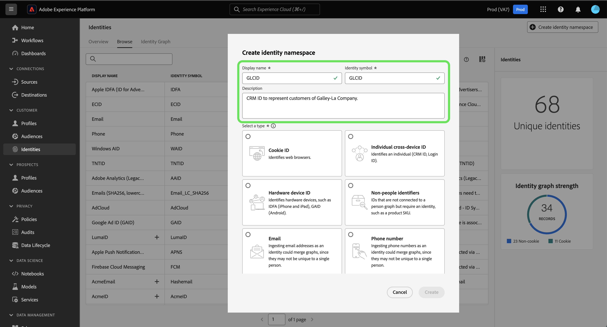

# 身份标识命名空间概述

请阅读以下文档，了解有关在Adobe Experience Platform Identity Service中可以使用身份命名空间执行的操作的更多信息。

## 快速入门

身份命名空间需要了解各种Adobe Experience Platform服务。 开始使用命名空间之前，请参阅以下服务的文档：

* [[!DNL Real-Time Customer Profile]](../../profile/home.md)：根据来自多个源的汇总数据，实时提供统一的客户个人资料。
* [[!DNL Identity Service]](../home.md)：通过跨设备和系统桥接身份，更好地了解个人客户及其行为。
* [[!DNL Privacy Service]](../../privacy-service/home.md)：身份命名空间用于隐私法规(如《通用数据保护条例》(GDPR))的合规请求中。 每个隐私请求都是相对于命名空间发出的，以确定哪些消费者的数据应该受到影响。

## 了解身份标识命名空间 {#understanding-identity-namespaces}

>[!CONTEXTUALHELP]
>id="platform_identity_namespace"
>title="身份标识命名空间"
>abstract="身份标识命名空间是给定身份标识的上下文。例如，`Email` 的命名空间可能类似于 **name@acme.com**。同样，`Phone` 的命名空间可能类似于 `555-555-1234`。"
>text="Learn more in documentation"

>[!CONTEXTUALHELP]
>id="platform_identity_value"
>title="身份标识值"
>abstract="身份标识值是代表唯一个人、组织或资产的身份标识符。该值表示的身份标识的上下文或类型由相应的身份标识命名空间定义。在轮廓片段间匹配记录数据时，命名空间和身份标识的值必须相同。在轮廓片段间匹配记录数据时，命名空间和身份标识的值必须相同。"
>text="Learn more in documentation"

完全限定的身份包含两个组件： **身份值**&#x200B;和&#x200B;**身份命名空间**。 例如，如果标识的值为`scott@acme.com`，则命名空间会通过将其识别为电子邮件地址来为此值提供上下文。 同样，命名空间可以将`555-123-456`区分为电话号码，将`3126ABC`区分为CRMID。 基本上，**命名空间为给定标识**&#x200B;提供上下文。 跨配置文件片段匹配记录数据时，如[!DNL Real-Time Customer Profile]合并配置文件数据时，标识值和命名空间必须匹配。

例如，两个配置文件片段可能包含不同的主ID，但它们的“电子邮件”命名空间共享相同的值，因此Experience Platform能够看到这些片段实际上是同一个人，并在该人的身份图表中将数据汇总在一起。

>[!BEGINSHADEBOX]

**身份命名空间已解释**

要更好地理解命名空间的概念，另一种方法是考虑现实世界的例子，例如城市及其相应的状态。 例如，缅因州的波特兰和俄勒冈州的波特兰是美国两个不同的地方。 虽然这两个城市同名，但国家作为一个命名空间运行，并提供区分这两个城市的必要环境。

将相同的逻辑应用于Identity Service：

* 一眼就知道：`1-234-567-8900`的标识值可能看起来像电话号码。 但是，从系统的角度来看，此值可以配置为CRMID。 如果没有相应的命名空间，Identity Service无法将必要的上下文应用于此身份值。
* 另一个示例是标识值： `john@gmail.com`。 虽然可以轻松将此标识值假定为电子邮件，但完全可以将其配置为自定义命名空间CRMID。 使用命名空间，您可以区分`Email:john@gmail.com`和`CRMID:john@gmail.com`。

>[!ENDSHADEBOX]

### 命名空间的组件

命名空间包含以下组件：

* **显示名称**：给定命名空间的用户友好名称。
* **身份符号**：身份服务内部用于表示命名空间的代码。
* **身份类型**：给定命名空间的分类。
* **描述**： （可选）您可以提供的有关给定命名空间的任何补充信息。

### 身份标识类型 {#identity-type}

>[!CONTEXTUALHELP]
>id="platform_identity_create_namespace"
>title="指定身份标识类型"
>abstract="身份标识类型控制数据是否存储到身份标识图形中。对于以下身份标识类型不生成身份标识图：非个人身份标识符和合作伙伴 ID。"
>text="Learn more in documentation"

标识命名空间的一个元素是&#x200B;**标识类型**。 身份类型确定：

* 是否将生成身份图：
   * 对于以下身份标识类型不生成身份标识图：非个人身份标识符和合作伙伴 ID。
   * 为所有其他身份类型生成身份图。
* 达到系统限制时，将从身份图中删除哪些身份。 有关详细信息，请阅读标识数据[的](../guardrails.md)护栏。

Experience Platform中提供了以下身份类型：

| 身份标识类型 | 描述 |
| --- | --- |
| Cookie ID | Cookie ID识别Web浏览器。 这些身份对于扩展至关重要，并构成身份图的大多数。 然而，它们自然会快速衰变，并随着时间而失去价值。 |
| 跨设备ID | 跨设备ID识别个人，通常将其他ID绑定在一起。 例如，登录ID、CRMID和忠诚度ID。 这是指示[!DNL Identity Service]敏感地处理该值。 |
| 设备 ID | 设备 ID 识别硬件设备，如 IDFA（iPhone 和 iPad）、GAID (Android) 和 RIDA (Roku)，可以由多人在家庭中共享。 |
| 电子邮件地址 | 电子邮件地址通常与单个人员关联，因此可用于跨不同渠道识别该人员。 此类型的身份包括个人身份信息(PII)。 这是指示[!DNL Identity Service]敏感地处理该值。 |
| 非人员标识符 | 非人员 ID 用于存储需要命名空间但未连接到人员集群的标识符。例如，产品 SKU，与产品、组织或门店相关的数据。 |
| 合作伙伴 ID | <ul><li>合作伙伴 ID 是数据合作伙伴用来代表人员的标识符。合作伙伴ID通常采用匿名形式，以免泄露某人的真实身份，并且可能是概率性的。 在Real-Time Customer Data Platform中，合作伙伴ID主要用于扩展受众激活和数据扩充，而不是用于构建标识图链接。</li><li>在摄取包含指定为合作伙伴ID类型的身份命名空间的身份时，不会生成身份图。</li><li>如果使用合作伙伴ID的身份类型来摄取合作伙伴数据，可能会导致达到Identity Service的系统图限制，以及不必要地合并用户档案。</li><ul> |
| 电话号码 | 电话号码通常与单个人员相关联，因此可用于跨不同渠道识别该人员。 此类型的标识包括PII。 这是指示[!DNL Identity Service]敏感地处理该值。 |

{style="table-layout:auto"}

### 标准命名空间 {#standard}

Experience Platform提供了多个可用于所有组织的身份命名空间。 这些名称空间称为标准命名空间，可使用[!DNL Identity Service] API或通过Experience Platform UI查看。

提供了以下标准命名空间供Experience Platform中的所有组织使用：

| 显示名称 | 描述 |
| ------------ | ----------- |
| AdCloud | 表示Adobe AdCloud的命名空间。 |
| Adobe Analytics（旧版 ID） | 表示Adobe Analytics的命名空间。 有关详细信息，请参阅以下有关[Adobe Analytics命名空间](https://experienceleague.adobe.com/docs/analytics/admin/data-governance/gdpr-namespaces.html#namespaces)的文档。 |
| Apple IDFA（广告商的ID） | 表示广告商的Apple ID的命名空间。 有关详细信息，请参阅以下有关[基于兴趣的广告](https://support.apple.com/en-us/HT202074)的文档。 |
| Apple推送通知服务 | 表示使用Apple推送通知服务收集的标识的命名空间。 有关详细信息，请参阅有关[Apple推送通知服务](https://developer.apple.com/library/archive/documentation/NetworkingInternet/Conceptual/RemoteNotificationsPG/APNSOverview.html#//apple_ref/doc/uid/TP40008194-CH8-SW1)的以下文档。 |
| ECID | 表示ECID的命名空间。 此命名空间还可以由以下别名引用：“Adobe Marketing Cloud ID”、“Adobe Experience Cloud ID”、“Adobe Experience Platform ID”。 有关详细信息，请参阅[ECID](./ecid.md)上的以下文档。 |
| 电子邮件 | 表示电子邮件地址的命名空间。 此类命名空间通常与单个人员关联，因此可用于跨不同渠道识别该人员。 |
| 电子邮件（SHA256，小写） | 预哈希电子邮件地址的命名空间。使用SHA256进行哈希处理之前，此命名空间中提供的值将转换为小写。 在规范化电子邮件地址之前，需要修剪前导空格和尾随空格。 此设置不能进行追溯性更改。 有关详细信息，请参阅以下有关[SHA256哈希处理支持](https://experienceleague.adobe.com/docs/id-service/using/reference/hashing-support.html#hashing-support)的文档。 |
| Firebase云消息 | 一个命名空间，它表示使用Google Firebase Cloud Messaging为推送通知收集的身份。 有关详细信息，请参阅以下有关[Google Firebase Cloud Messaging](https://firebase.google.com/docs/cloud-messaging)的文档。 |
| Google Ad ID (GAID) | 表示Google Advertising ID的命名空间。 有关详细信息，请参阅以下有关[Google Advertising ID](https://support.google.com/googleplay/android-developer/answer/6048248?hl=en)的文档。 |
| 电话 | 表示电话号码的命名空间。 此类命名空间通常与单个人员关联，因此可用于跨不同渠道识别该人员。 |
| 电话(E.164) | 表示需要以E.164格式进行哈希处理的原始电话号码的命名空间。 E.164格式包括加号(`+`)、国际国家/地区呼叫代码、本地区号和电话号码。 例如：`(+)(country code)(area code)(phone number)`。 |
| 手机 (SHA256) | 一个命名空间，它表示需要使用SHA256进行哈希处理的电话号码。 必须删除符号、字母和任何前导零。 您还必须添加国家/地区呼叫代码作为前缀。 |
| 电话(SHA256_E.164) | 表示需要使用 SHA256 和 E.164 格式进行哈希处理的原始电话号码的命名空间。 |
| TNTID | 表示Adobe Target的命名空间。 有关详细信息，请参阅[Target](https://experienceleague.adobe.com/docs/target/using/target-home.html)上的以下文档。 |
| Windows AID | 表示Windows Advertising ID的命名空间。 有关详细信息，请参阅[Windows Advertising ID](https://docs.microsoft.com/en-us/uwp/api/windows.system.userprofile.advertisingmanager.advertisingid?view=winrt-19041)上的以下文档。 |

### 查看身份标识命名空间 {#view-identity-namespaces}

>[!CONTEXTUALHELP]
>id="platform_identity_view_integration_identities"
>title="查看集成身份标识"
>abstract="集成身份标识是用于连接其他系统的命名空间，不用于身份标识解析或拼接身份标识。 默认情况下，这些身份标识是隐藏的。使用切换功能来查看集成命名空间。"

要在UI中查看身份命名空间，请在左侧导航中选择&#x200B;**[!UICONTROL Identities]**，然后选择&#x200B;**[!UICONTROL Browse]**。

此时会出现组织中的命名空间目录，其中显示有关其名称、身份符号、上次更新日期、相应身份类型和说明的信息。

## 创建自定义命名空间 {#create-namespaces}

根据您的组织数据和用例，您可能需要自定义命名空间。 可以使用[[!DNL Identity Service]](../api/create-custom-namespace.md) API或通过UI创建自定义命名空间。

要创建自定义命名空间，请选择&#x200B;**[!UICONTROL Create identity namespace]**。

>[!TIP]
>
>集成身份是用于与其他系统连接的命名空间。 它们不用于身份解析，也不用于拼接身份。 选择&#x200B;**[!UICONTROL View integration identities]**&#x200B;以更新列表并包含集成标识。 但是，默认情况下，集成身份是隐藏的，因为它们仅供查看，您不需要配置它们。

出现[!UICONTROL Create identity namespace]窗口。 首先，必须为要创建的自定义命名空间提供显示名称和标识符号。 您还可以选择提供描述，以便在您创建的自定义命名空间上添加更多上下文。

接下来，选择要分配给自定义命名空间的身份类型。 完成后，选择&#x200B;**[!UICONTROL Create]**。

>[!IMPORTANT]
>
>* 您定义的命名空间是组织专有的，需要唯一的身份符号才能成功创建。
>
>* 创建命名空间后，便无法删除该命名空间，也无法更改其标识符号和类型。
>
>* 不支持重复的命名空间。 创建新命名空间时，不能使用现有的显示名称和身份符号。

## 身份数据中的命名空间

提供身份命名空间取决于提供身份数据所使用的方法。 有关提供数据标识数据的详细信息，请参阅[[!DNL Identity Service] 实施指南](../implementation.md)。

## 后续步骤

现在，您已了解身份命名空间的主要概念，可以开始了解如何使用[身份图查看器](../features/identity-graph-viewer.md)处理身份图。
