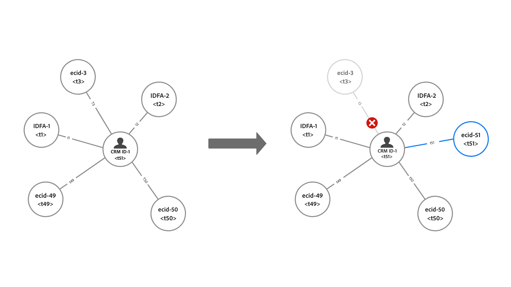

# 护栏 [!DNL Identity Service] 数据

本文档提供了有关以下各项的使用和速率限制的信息： [!DNL Identity Service] 数据，以帮助您优化身份图的使用。 查看以下护栏时，假定您已正确建模数据。 如果您对如何建立数据模型有疑问，请联系您的客户服务代表。

## 快速入门

以下Experience Platform服务与身份数据建模有关：

* [身份](home.md)：在身份被摄取到Platform中时桥接来自不同数据源的身份。
* [[!DNL Real-Time Customer Profile]](../profile/home.md)：使用来自多个源的数据创建统一的使用者配置文件。

## 数据模型限制

下表提供了有关静态限制的护栏以及要考虑用于身份命名空间的验证规则的指南。

### 静态限制

下表概述了应用于身份数据的静态限制。

| 护栏 | 限制 | 注释 |
| --- | --- | --- |
| 图形中的身份数 | 50 | 更新具有50个链接身份的图形时，Identity Service将应用“先进先出”机制并删除最早的身份，为最新身份腾出空间。 删除基于身份类型和时间戳。 该限制在沙盒级别应用。 有关详细信息，请阅读以下部分： [了解删除逻辑](#deletion-logic). |
| XDM记录中的标识数 | 20 | 所需的XDM记录的最小数量为2。 |
| 自定义命名空间的数量 | None | 可创建的自定义命名空间数量没有限制。 |
| 命名空间显示名称或身份符号的字符数 | None | 命名空间显示名称或身份符号的字符数没有限制。 |

### 身份值验证

下表概述了必须遵循的现有规则，以确保成功验证标识值。

| 命名空间 | 验证规则 | 违反规则时的系统行为 |
| --- | --- | --- |
| ECID | <ul><li>ECID的标识值必须刚好38个字符。</li><li>ECID的标识值必须仅由数字组成。</li></ul> | <ul><li>如果ECID的标识值不完全为38个字符，则会跳过该记录。</li><li>如果ECID的标识值包含非数字字符，则会跳过记录。</li></ul> |
| 非ECID | 标识值不能超过1024个字符。 | 如果标识值超过1024个字符，则会跳过该记录。 |

### 身份命名空间摄取

从2023年3月31日开始，Identity Service将阻止为新客户摄取Adobe Analytics ID (AAID)。 此身份通常通过 [Adobe Analytics源](../sources/connectors/adobe-applications/analytics.md) 和 [Adobe Audience Manager源](../sources//connectors/adobe-applications/audience-manager.md) 和是多余的，因为ECID表示相同的Web浏览器。 如果要更改此默认配置，请联系您的Adobe客户团队。

## 了解在容量中的身份图更新时的删除逻辑 {#deletion-logic}

更新完整的身份图后，Identity Service会先删除图中最旧的身份，然后再添加最新的身份。 这是为了保持身份数据的准确性和相关性。 此删除过程遵循两个主要规则：

### 删除规则#1根据命名空间的身份类型确定优先顺序

删除优先级如下：

1. Cookie ID
2. 设备ID
3. 跨设备ID、电子邮件和电话

### 删除规则#2基于存储在身份上的时间戳

图形中链接的每个标识都有其自己的相应时间戳。 更新完整图形时，Identity Service会删除具有最旧时间戳的标识。

当更新了具有新标识的完整图形时，这两个规则协同工作以指定将删除哪个旧标识。 Identity Service会先删除最早的Cookie ID，然后删除最旧的设备ID，最后删除最旧的跨设备ID/电子邮件/电话。

>[!NOTE]
>
>如果指定要删除的标识链接到图形中的多个其他标识，则连接该标识的链接也将被删除。

>[!BEGINSHADEBOX]

**删除逻辑的可视表示形式**

*图表说明：*

* `t` = 时间戳.
* 时间戳的值对应于给定身份的回访间隔。 例如， `t1` 表示第一个链接的身份（最早的）和 `t51` 表示最新的链接身份。

在此示例中，在可以使用新标识更新左侧的图形之前，Identity Service会先删除具有最早时间戳的现有标识。 但是，由于最早的标识是设备ID，因此Identity Service会跳过该标识，直到到达删除优先级列表中具有更高类型的命名空间（在本例中为） `ecid-3`. 一旦删除了具有更高删除优先级类型的最旧身份，该图形就会更新为新链接， `ecid-51`.

* 在极少数情况下，两个身份具有相同的时间戳和身份类型，Identity Service会根据这些ID进行排序 [XID](./api/list-native-id.md) 并执行删除。

>[!ENDSHADEBOX]

### 对实施的影响

以下部分概述了删除逻辑对Identity Service、Real-Time Customer Profile和WebSDK的影响。

#### 身份服务：自定义命名空间身份类型更改

Adobe如果您的生产沙盒包含：

* 将人员标识符（如CRM ID）配置为Cookie/设备标识类型的自定义命名空间。
* 将Cookie/设备标识符配置为跨设备标识类型的自定义命名空间。

此功能可用后，超过50个标识限制的图形将减少到50个标识。 对于Real-Time CDP B2C版本，这可能会导致符合受众资格的用户档案数量最小化，因为以前分段和激活时会忽略这些用户档案。

#### 实时客户个人资料：对可寻址受众的影响

删除仅发生在Identity Service中的数据，而不发生在Real-time Customer Profile中。

* 因此，如果只使用一个ECID，这种行为可能会创建更多配置文件，因为ECID不再是身份图的一部分。
* 为了让您保持在可寻址受众权利文件数字范围内，建议启用 [假名配置文件数据过期](../profile/pseudonymous-profiles.md) 以删除旧配置文件。

#### Real-Time Customer Profile和WebSDK：主身份删除

如果您希望保留针对CRM ID的已验证事件，那么建议您将主ID从ECID更改为CRM ID。 有关如何实施此更改的步骤，请阅读以下文档：

* [为Experience Platform标签配置身份映射](../tags/extensions/client/web-sdk/data-element-types.md#identity-map).
* [Experience PlatformWeb SDK中的身份数据](../edge/identity/overview.md#using-identitymap)

## 后续步骤

有关以下内容的更多信息，请参阅以下文档 [!DNL Identity Service]：

* [[!DNL Identity Service] 概述](home.md)
* [身份图查看器](ui/identity-graph-viewer.md)

请参阅Real-Time CDP产品描述文档中的以下文档，了解有关其他Experience Platform服务护栏、端到端延迟信息和许可信息的更多信息：

* [Real-Time CDP护栏](/help/rtcdp/guardrails/overview.md)
* [端到端延迟图](https://experienceleague.adobe.com/docs/blueprints-learn/architecture/architecture-overview/deployment/guardrails.html?lang=en#end-to-end-latency-diagrams) 用于各种Experience Platform服务。
* [Real-time Customer Data Platform （B2C版本 — Prime和Ultimate包）](https://helpx.adobe.com/legal/product-descriptions/real-time-customer-data-platform-b2c-edition-prime-and-ultimate-packages.html)
* [Real-time Customer Data Platform （B2P — 主要和最终包）](https://helpx.adobe.com/legal/product-descriptions/real-time-customer-data-platform-b2p-edition-prime-and-ultimate-packages.html)
* [Real-time Customer Data Platform （B2B - Prime和Ultimate包）](https://helpx.adobe.com/legal/product-descriptions/real-time-customer-data-platform-b2b-edition-prime-and-ultimate-packages.html)
