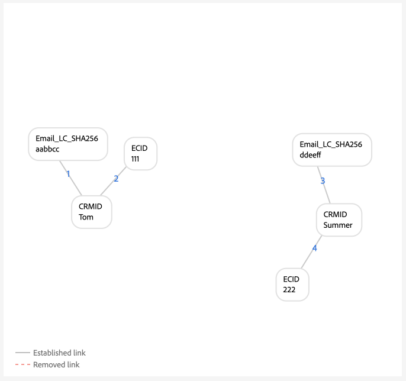

# 图形配置示例 {#examples-of-graph-configurations}

>[!CONTEXTUALHELP]
>id="platform_identities_algorithmconfiguration"
>title="算法配置"
>abstract="配置根据您所引入的身份标识定制的唯一命名空间和命名空间优先级。"

>[!AVAILABILITY]
>
>标识图链接规则当前处于“有限可用”状态，所有客户都可以在开发沙盒中访问它。
>
>* **激活要求**：在您配置和保存[!DNL Identity Settings]之前，该功能将保持非活动状态。 如果没有此配置，系统将继续正常运行，并且不会更改行为。
>* **重要说明**：在此“有限可用性”阶段，Edge分段可能会产生意外的区段成员资格结果。 但是，流分段和批量分段将按预期运行。
>* **后续步骤**：有关如何在生产沙盒中启用此功能的信息，请联系您的Adobe客户团队。

>[!NOTE]
>
>* “CRMID”和“loginID”是自定义命名空间。 在本文档中，“CRMID”是人员标识符，“loginID”是与给定人员关联的登录标识符。
>* 要模拟本文档中概述的示例图形场景，您必须首先创建两个自定义命名空间，一个具有身份符号“CRMID”，另一个具有身份符号“loginID”。 标识符号区分大小写。

本文档概述了在使用[!DNL Identity Graph Linking Rules]和身份数据时可能遇到的常见情况的图形配置示例。

## 仅限CRMID

这是一个简单的实施方案示例，其中摄取在线事件（CRMID和ECID），并仅针对CRMID存储离线事件（配置文件记录）。

**实现：**

| 使用的命名空间 | Web行为收集方法 |
| --- | --- |
| CRMID、ECID | Web SDK |

**事件：**

您可以通过将以下事件复制到文本模式，在图形模拟中创建此方案：

```shell
CRMID: Tom, ECID: 111
```

**算法配置：**

您可以通过为算法配置以下设置，在图形模拟中创建此方案：

| 优先级 | 显示名称 | 身份标识类型 | 每个图唯一 |
| ---| --- | --- | --- |
| 1 | CRMID | 跨设备 | 是 |
| 2 | ECID | COOKIE | 否 |

实时客户个人资料的&#x200B;**主身份选择：**

在此配置的上下文中，主标识的定义如下所示：

| 身份验证状态 | 事件中的命名空间 | 主要身份标识 |
| --- | --- | --- |
| Authenticated | CRMID、ECID | CRMID |
| 未验证 | ECID | ECID |

**图形示例**

>[!BEGINTABS]

>[!TAB 理想的单人图]

下面是一个理想的单人图示例，其中CRMID是唯一的，并且被赋予最高优先级。


>[!TAB 多人图表]

以下是多人图的一个示例。 此示例显示了“共享设备”方案，其中存在两个CRMID，并且已删除具有已建立旧链接的一个CRMID。


**图形模拟事件输入**

```shell
CRMID: Tom, ECID: 111
CRMID: Summer, ECID: 111
```

>[!ENDTABS]

## 使用哈希电子邮件的CRMID

在此方案中，CRMID是摄取的，表示在线（体验事件）和离线（配置文件记录）数据。 此方案还涉及引入哈希电子邮件，该电子邮件表示在CRM记录数据集中与CRMID一起发送的其他命名空间。

>[!IMPORTANT]
>
>**始终为每个用户发送CRMID这一点至关重要**。 如果不这样做，则可能会导致“悬挂”登录ID情况，在这种情况下，假定单个人员实体与其他人员共享设备。

**实现：**

| 使用的命名空间 | Web行为收集方法 |
| --- | --- |
| CRMID、Email_LC_SHA256、ECID | Web SDK |

**事件：**

您可以通过将以下事件复制到文本模式，在图形模拟中创建此方案：

```shell
CRMID: Tom, Email_LC_SHA256: tom<span>@acme.com
CRMID: Tom, ECID: 111
CRMID: Summer, Email_LC_SHA256: summer<span>@acme.com
CRMID: Summer, ECID: 222
```

**算法配置：**

您可以通过为算法配置以下设置，在图形模拟中创建此方案：

| 优先级 | 显示名称 | 身份标识类型 | 每个图唯一 |
| ---| --- | --- | --- |
| 1 | CRMID | 跨设备 | 是 |
| 2 | 电子邮件（SHA256，小写） | 电子邮件 | 否 |
| 3 | ECID | COOKIE | 否 |

**个人资料的主要身份选择：**

在此配置的上下文中，主标识的定义如下所示：

| 身份验证状态 | 事件中的命名空间 | 主要身份标识 |
| --- | --- | --- |
| Authenticated | CRMID、ECID | CRMID |
| 未验证 | ECID | ECID |

**图形示例**

>[!BEGINTABS]

>[!TAB 理想的单人图]

下面是一对理想的单人图示例，其中每个CRMID与其各自的哈希电子邮件命名空间和ECID相关联。



>[!TAB 多人图表：共享设备]

以下是多人图场景的示例，其中设备由两人共享。


**图形模拟事件输入**

```shell
CRMID: Tom, Email_LC_SHA256: aabbcc
CRMID: Tom, ECID: 111
CRMID: Summer, Email_LC_SHA256: ddeeff
CRMID: Summer, ECID: 222
CRMID: Summer, ECID: 111
```

>[!TAB 多人图表：非唯一电子邮件]

以下是多人员图场景的示例，其中电子邮件不唯一并与两个不同的CRMID关联。


**图形模拟事件输入**

```shell
CRMID: Tom, Email_LC_SHA256: aabbcc
CRMID: Tom, ECID: 111
CRMID: Summer, Email_LC_SHA256: ddeeff
CRMID: Summer, ECID: 222
CRMID: Summer, Email_LC_SHA256: aabbcc
```

>[!ENDTABS]

## CRMID，带有哈希电子邮件、哈希手机、GAID和IDFA

此方案与上一个方案类似。 但是，在此方案中，经过哈希处理的电子邮件和电话被标记为标识以便在[[!DNL Segment Match]](../../segmentation/ui/segment-match/overview.md)中使用。

>[!IMPORTANT]
>
>**始终为每个用户发送CRMID这一点至关重要**。 如果不这样做，则可能会导致“悬挂”登录ID情况，在这种情况下，假定单个人员实体与其他人员共享设备。

**实现：**

| 使用的命名空间 | Web行为收集方法 |
| --- | --- |
| CRMID、Email_LC_SHA256、Phone_SHA256、GAID、IDFA、ECID | Web SDK |

**事件：**

您可以通过将以下事件复制到文本模式，在图形模拟中创建此方案：

```shell
CRMID: Tom, Email_LC_SHA256: aabbcc, Phone_SHA256: 123-4567
CRMID: Tom, ECID: 111
CRMID: Tom, ECID: 222, IDFA: A-A-A
CRMID: Summer, Email_LC_SHA256: ddeeff, Phone_SHA256: 765-4321
CRMID: Summer, ECID: 333
CRMID: Summer, ECID: 444, GAID:B-B-B
```

**算法配置：**

您可以通过为算法配置以下设置，在图形模拟中创建此方案：

| 优先级 | 显示名称 | 身份标识类型 | 每个图唯一 |
| ---| --- | --- | --- |
| 1 | CRMID | 跨设备 | 是 |
| 2 | 电子邮件（SHA256，小写） | 电子邮件 | 否 |
| 3 | 手机 (SHA256) | 电话 | 否 |
| 4 | Google Ad ID (GAID) | 设备 | 否 |
| 5 | Apple IDFA(Apple的ID) | 设备 | 否 |
| 6 | ECID | COOKIE | 否 |

**个人资料的主要身份选择：**

在此配置的上下文中，主标识的定义如下所示：

| 身份验证状态 | 事件中的命名空间 | 主要身份标识 |
| --- | --- | --- |
| Authenticated | CRMID、IDFA、ECID | CRMID |
| Authenticated | CRMID、GAID、ECID | CRMID |
| Authenticated | CRMID、ECID | CRMID |
| 未验证 | GAID、ECID | GAID |
| 未验证 | IDFA、ECID | IDFA |
| 未验证 | ECID | ECID |

**图形示例**

>[!BEGINTABS]

>[!TAB 理想的单人图]

以下是理想的单人图方案，其中经过哈希处理的电子邮件和经过哈希处理的手机被标记为标识以便在[!DNL Segment Match]中使用。 在此方案中，这些图形将拆分为两个，以表示不同的人员实体。


>[!TAB 多人图表：共享设备，共享计算机]

以下是多人图场景，其中两个人共享一台设备（计算机）。 在此方案中，共享计算机由`{ECID: 111}`表示并链接到`{CRMID: Summer}`，因为该链接是最近建立的链接。 `{CRMID: Tom}`已删除，因为`{CRMID: Tom}`和`{ECID: 111}`之间的链接较旧，并且因为CRMID是此配置中指定的唯一命名空间。


**图形模拟事件输入**

```shell
CRMID: Tom, Email_LC_SHA256: aabbcc, Phone_SHA256: 123-4567
CRMID: Tom, ECID: 111
CRMID: Tom, ECID: 222, IDFA: A-A-A
CRMID: Summer, Email_LC_SHA256: ddeeff, Phone_SHA256: 765-4321
CRMID: Summer, ECID: 333
CRMID: Summer, ECID: 444, GAID:B-B-B
CRMID: Summer, ECID: 111
```

>[!TAB 多人图表：共享设备、android移动设备]

以下是多人图场景，其中一个Android设备由两个人共享。 在此方案中，CRMID配置为唯一的命名空间，因此`{CRMID: Tom, GAID: B-B-B, ECID:444}`的较新链接将取代较旧的`{CRMID: Summer, GAID: B-B-B, ECID:444}`。


**图形模拟事件输入**

```shell
CRMID: Tom, Email_LC_SHA256: aabbcc, Phone_SHA256: 123-4567
CRMID: Tom, ECID: 111
CRMID: Tom, ECID: 222, IDFA: A-A-A
CRMID: Summer, Email_LC_SHA256: ddeeff, Phone_SHA256: 765-4321
CRMID: Summer, ECID: 333
CRMID: Summer, ECID: 444, GAID: B-B-B
CRMID: Tom, ECID: 444, GAID: B-B-B
```

>[!TAB 多人图表：共享设备、apple移动设备、无ECID重置]

以下是多人图场景，两个人共享一个Apple设备。 在此方案中，将共享IDFA，但ECID不会重置。


**图形模拟事件输入**

```shell
CRMID: Tom, Email_LC_SHA256: aabbcc, Phone_SHA256: 123-4567
CRMID: Tom, ECID: 111
CRMID: Tom, ECID: 222, IDFA: A-A-A
CRMID: Summer, Email_LC_SHA256: ddeeff, Phone_SHA256: 765-4321
CRMID: Summer, ECID: 333
CRMID: Summer, ECID: 444, GAID: B-B-B
CRMID: Summer, ECID: 222, IDFA: A-A-A
```

>[!TAB 多人图表：共享设备、apple、ECID重置]

以下是多人图场景，两个人共享一个Apple设备。 在此方案中，ECID将重置，但IDFA保持不变。


**图形模拟事件输入**

```shell
CRMID: Tom, Email_LC_SHA256: aabbcc, Phone_SHA256: 123-4567
CRMID: Tom, ECID: 111
CRMID: Tom, ECID: 222, IDFA: A-A-A
CRMID: Summer, Email_LC_SHA256: ddeeff, Phone_SHA256: 765-4321
CRMID: Summer, ECID: 333
CRMID: Summer, ECID: 444, GAID: B-B-B
CRMID: Summer, ECID: 555, IDFA: A-A-A
```

>[!TAB 多人图表：非唯一电话]

以下是多人图场景，两个用户共享相同的电话号码。


**图形模拟事件输入**

```shell
CRMID: Tom, Email_LC_SHA256: aabbcc, Phone_SHA256: 123-4567
CRMID: Tom, ECID: 111
CRMID: Tom, ECID: 222, IDFA: A-A-A
CRMID: Summer, Email_LC_SHA256: ddeeff, Phone_SHA256: 765-4321
CRMID: Summer, ECID: 333
CRMID: Summer, ECID: 444, GAID: B-B-B
CRMID: Summer, Phone_SHA256: 123-4567
```

在此示例中，`{Phone_SHA256}`还标记为唯一的命名空间。 因此，图形不能有多个具有`{Phone_SHA256}`命名空间的标识。 在此方案中，`{Phone_SHA256: 765-4321}`从`{CRMID: Summer}`和`{Email_LC_SHA256: ddeeff}`中取消链接，因为它是旧链接，


>[!TAB 多人图表：非唯一电子邮件]

以下是多人图方案，其中电子邮件由两个人共享。


**图形模拟事件输入**

```shell
CRMID: Tom, Email_LC_SHA256: aabbcc, Phone_SHA256: 123-4567
CRMID: Tom, ECID: 111
CRMID: Tom, ECID: 222, IDFA: A-A-A
CRMID: Summer, Email_LC_SHA256: ddeeff, Phone_SHA256: 765-4321
CRMID: Summer, ECID: 333
CRMID: Summer, ECID: 444, GAID: B-B-B
CRMID: Summer, Email_LC_SHA256: aabbcc
```

>[!ENDTABS]

## 带多个登录ID的单个CRMID（简单版本）

在此方案中，有一个CRMID表示人员实体。 但是，人员实体可能具有多个登录标识符：

* 给定的人员实体可以具有不同的帐户类型（个人与企业、按州列出的帐户、按品牌列出的帐户等）
* 给定人员实体可以为任意数量的帐户使用不同的电子邮件地址。

>[!IMPORTANT]
>
>**始终为每个用户发送CRMID这一点至关重要**。 如果不这样做，则可能会导致“悬挂”登录ID情况，在这种情况下，假定单个人员实体与其他人员共享设备。

**实现：**

| 使用的命名空间 | Web行为收集方法 |
| --- | --- |
| CRMID、loginID、ECID | Web SDK |

**事件：**

您可以通过将以下事件复制到文本模式，在图形模拟中创建此方案：

```shell
CRMID: Tom, loginID: ID_A
CRMID: Tom, loginID: ID_B
loginID: ID_A, ECID: 111
CRMID: Summer, loginID: ID_C
CRMID: Summer, loginID: ID_D
loginID: ID_C, ECID: 222
```

**算法配置：**

您可以通过为算法配置以下设置，在图形模拟中创建此方案：

| 优先级 | 显示名称 | 身份标识类型 | 每个图唯一 |
| ---| --- | --- | --- |
| 1 | CRMID | 跨设备 | 是 |
| 2 | loginID | 跨设备 | 否 |
| 3 | ECID | COOKIE | 否 |

**个人资料的主要身份选择：**

在此配置的上下文中，主标识的定义如下所示：

| 身份验证状态 | 事件中的命名空间 | 主要身份标识 |
| --- | --- | --- |
| Authenticated | 登录ID，ECID | loginID |
| Authenticated | 登录ID，ECID | loginID |
| Authenticated | CRMID、loginID、ECID | CRMID |
| Authenticated | CRMID、ECID | CRMID |
| 未验证 | ECID | ECID |

**图形示例**

>[!BEGINTABS]

>[!TAB 理想的单人方案]

以下是单个CRMID和多个loginID的单人图场景。


>[!TAB 多人图表方案：共享设备]

以下是多人图场景，其中设备由两人共享。 在此方案中，`{ECID:111}`同时与`{loginID:ID_A}`和`{loginID:ID_C}`链接，并且旧已建立的`{ECID:111, loginID:ID_A}`链接被删除。


**图形模拟事件输入**

```shell
CRMID: Tom, loginID: ID_A
CRMID: Tom, loginID: ID_B
loginID: ID_A, ECID: 111
CRMID: Summer, loginID: ID_C
CRMID: Summer, loginID: ID_D
loginID: ID_C, ECID: 222
loginID: ID_C, ECID: 111
```

>[!TAB 多人图表方案：错误数据]

以下是涉及错误数据的多人图场景。 在此方案中，`{loginID:ID_D}`错误地链接到两个完全不同的用户，并且删除了具有旧时间戳的链接，以支持最近建立的链接。


**图形模拟事件输入**

```shell
CRMID: Tom, loginID: ID_A
CRMID: Tom, loginID: ID_B
loginID: ID_A, ECID: 111
CRMID: Summer, loginID: ID_C
CRMID: Summer, loginID: ID_D
loginID: ID_C, ECID: 222
CRMID: Tom, loginID: ID_D
```

>[!TAB &#39;Dangling&#39;登录ID]

下图模拟了“悬挂”的loginID方案。 在此示例中，两个不同的loginID绑定到相同的ECID。 但是，`{loginID:ID_C}`未链接到CRMID。 因此，Identity Service无法检测到这两个loginID代表两个不同的实体。


**图形模拟事件输入**

```shell
CRMID: Tom, loginID: ID_A
CRMID: Tom, loginID: ID_B
loginID: ID_A, ECID: 111
loginID: ID_C, ECID: 111
```

>[!ENDTABS]

## 具有多个登录ID的单个CRMID（复杂版本）

在此方案中，有一个CRMID表示人员实体。 但是，人员实体可能具有多个登录标识符：

* 给定的人员实体可以具有不同的帐户类型（个人与企业、按州列出的帐户、按品牌列出的帐户等）
* 给定人员实体可以为任意数量的帐户使用不同的电子邮件地址。

>[!IMPORTANT]
>
>**始终为每个用户发送CRMID这一点至关重要**。 如果不这样做，则可能会导致“悬挂”登录ID情况，在这种情况下，假定单个人员实体与其他人员共享设备。

**实现：**

| 使用的命名空间 | Web行为收集方法 |
| --- | --- |
| CRMID、Email_LC_SHA256、Phone_SHA256、loginID、ECID | Adobe Analytics源连接器。<br> **注意：**&#x200B;默认情况下，Identity Service中会阻止AAID，因此，在使用Analytics源时，您必须将ECID置于比AAID更高的优先级。 有关详细信息，请阅读[实施指南](./implementation-guide.md#ingest-your-data)。</br> |

**事件：**

您可以通过将以下事件复制到文本模式，在图形模拟中创建此方案：

```shell
CRMID: Tom, Email_LC_SHA256: aabbcc, Phone_SHA256: 123-4567
CRMID: Tom, loginID: ID_A
CRMID: Tom, loginID: ID_B
loginID: ID_A, ECID: 111
CRMID: Summer, Email_LC_SHA256: ddeeff, Phone_SHA256: 765-4321
CRMID: Summer, loginID: ID_C
CRMID: Summer, loginID: ID_D
loginID: ID_C, ECID: 222
```

**算法配置：**

您可以通过为算法配置以下设置，在图形模拟中创建此方案：

| 优先级 | 显示名称 | 身份标识类型 | 每个图唯一 |
| ---| --- | --- | --- | 
| 1 | CRMID | 跨设备 | 是 |
| 2 | Email_LC_SHA256 | 电子邮件 | 否 |
| 3 | Phone_SHA256 | 电话 | 否 |
| 4 | loginID | 跨设备 | 否 |
| 5 | ECID | COOKIE | 否 |
| 6 | AAID | COOKIE | 否 |

**个人资料的主要身份选择：**

在此配置的上下文中，主标识的定义如下所示：

| 身份验证状态 | 事件中的命名空间 | 主要身份标识 |
| --- | --- | --- |
| Authenticated | 登录ID，ECID | loginID |
| Authenticated | 登录ID，ECID | loginID |
| Authenticated | CRMID、loginID、ECID | CRMID |
| Authenticated | CRMID、ECID | CRMID |
| 未验证 | ECID | ECID |

**图形示例**

>[!BEGINTABS]

>[!TAB 理想的单人图]

以下是两个单人图示例，每个图具有一个CRMID和多个登录ID。


>[!TAB 多人图表：共享设备1]

以下是多人共享设备方案，其中`{ECID:111}`同时链接到`{loginID:ID_A}`和`{loginID:ID_C}`。 在这种情况下，已建立的旧链接会被删除，而支持最近建立的链接。


**图形模拟事件输入**

```shell
CRMID: Tom, Email_LC_SHA256: aabbcc, Phone_SHA256: 123-4567
CRMID: Tom, loginID: ID_A
CRMID: Tom, loginID: ID_B
loginID: ID_A, ECID: 111
CRMID: Summer, Email_LC_SHA256: ddeeff, Phone_SHA256: 765-4321
CRMID: Summer, loginID: ID_C
CRMID: Summer, loginID: ID_D
loginID: ID_C, ECID: 222
loginID: ID_C, ECID: 111
```

>[!TAB 多人图表：共享设备2]

在这种情况下，loginID和CRMID将作为体验事件发送，而不是只发送loginID。


**图形模拟事件输入**

```shell
CRMID: Tom, Email_LC_SHA256: aabbcc, Phone_SHA256: 123-4567
CRMID: Tom, loginID: ID_A
CRMID: Tom, loginID: ID_B
loginID: ID_A, ECID: 111
CRMID: Summer, Email_LC_SHA256: ddeeff, Phone_SHA256: 765-4321
CRMID: Summer, loginID: ID_C
CRMID: Summer, loginID: ID_D
loginID: ID_C, ECID: 222
CRMID: Summer, loginID: ID_C, ECID: 111
loginID: ID_A, ECID: 111
```

>[!TAB 多人图表：错误的loginID数据]

在此方案中，`{loginID:ID_C}`同时链接到`{CRMID:Tom}`和`{CRMID:Summer}`，因此被视为错误数据，因为理想的图形方案不应将相同的登录ID链接到两个不同的用户。 在这种情况下，将删除旧已建立的链接，而改用最近建立的链接。


**图形模拟事件输入**

```shell
CRMID: Tom, Email_LC_SHA256: aabbcc, Phone_SHA256: 123-4567
CRMID: Tom, loginID: ID_A
CRMID: Tom, loginID: ID_B
loginID: ID_A, ECID: 111
CRMID: Summer, Email_LC_SHA256: ddeeff, Phone_SHA256: 765-4321
CRMID: Summer, loginID: ID_C
CRMID: Summer, loginID: ID_D
loginID: ID_C, ECID: 222
CRMID: Tom, loginID: ID_C
```

>[!TAB 多人图表：非唯一电子邮件]

在此方案中，非唯一电子邮件与两个不同的CRMID链接，因此，已建立的旧链接会被删除，而采用的是最近建立的链接。


**图形模拟事件输入**

```shell
CRMID: Tom, Email_LC_SHA256: aabbcc, Phone_SHA256: 123-4567
CRMID: Tom, loginID: ID_A
CRMID: Tom, loginID: ID_B
loginID: ID_A, ECID: 111
CRMID: Summer, Email_LC_SHA256: ddeeff, Phone_SHA256: 765-4321
CRMID: Summer, loginID: ID_C
CRMID: Summer, loginID: ID_D
loginID: ID_C, ECID: 222
CRMID: Summer, Email_LC_SHA256: aabbcc
```

>[!TAB 多人图表：非唯一电话]

在此情景中，非唯一电话号码与两个不同的CRMID关联，旧的已建立链接会被删除，而采用的是最近建立的链接。


**图形模拟事件输入**

```shell
CRMID: Tom, Email_LC_SHA256: aabbcc, Phone_SHA256: 123-4567
CRMID: Tom, loginID: ID_A
CRMID: Tom, loginID: ID_B
loginID: ID_A, ECID: 111
CRMID: Summer, Email_LC_SHA256: ddeeff, Phone_SHA256: 765-4321
CRMID: Summer, loginID: ID_C
CRMID: Summer, loginID: ID_D
loginID: ID_C, ECID: 222
CRMID: Tom, Phone_SHA256: 111-1111
CRMID: Summer, Phone_SHA256: 111-1111
```

>[!ENDTABS]

## 在其他Adobe Commerce中的使用情况

此部分中的图形配置示例概述了Adobe Commerce的用例。 以下示例侧重于具有两种用户类型的零售客户：

* 已注册的用户（创建帐户的用户）
* 访客用户（仅具有电子邮件地址的用户）

>[!IMPORTANT]
>
>**始终为每个用户发送CRMID这一点至关重要**。 如果不这样做，则可能会导致“悬挂”登录ID情况，在这种情况下，假定单个人员实体与其他人员共享设备。

**实现：**

| 使用的命名空间 | Web行为收集方法 |
| --- | --- |
| CRMID、电子邮件、ECID | Web SDK |

**事件：**

您可以通过将以下事件复制到文本模式，在图形模拟中创建此方案：

```shell
CRMID: Tom, Email: tom@acme.com
CRMID: Tom, ECID: 111
```

**算法配置：**

您可以通过为算法配置以下设置，在图形模拟中创建此方案：

| 优先级 | 显示名称 | 身份标识类型 | 每个图唯一 |
| ---| --- | --- | --- | 
| 1 | CRMID | 跨设备 | 是 |
| 2 | 电子邮件 | 电子邮件 | 是 |
| 5 | ECID | COOKIE | 否 |

**个人资料的主要身份选择：**

在此配置的上下文中，主标识的定义如下所示：

| 用户活动 | 事件中的命名空间 | 主要身份标识 |
| --- | --- | --- |
| 经过身份验证的浏览 | CRMID、ECID | CRMID |
| 来宾结帐 | 电子邮件、ECID | 电子邮件 |
| 未经身份验证的浏览 | ECID | ECID |

>[!WARNING]
>
>注册用户在其用户档案中必须同时具有CRMID和电子邮件，以下图形方案才能正常工作。

**图形示例**

>[!BEGINTABS]

>[!TAB 理想的单人图]

下面是一个理想的单人图示例。


>[!TAB 多人图表]

以下是多人图的一个示例，在该示例中，两个注册用户使用同一设备浏览。


**图形模拟事件输入**

```shell
CRMID: Tom, Email: tom@acme.com
CRMID: Summer, Email: summer@acme.com
CRMID: Tom, ECID: 111
CRMID: Summer, ECID: 111
```

在此方案中，注册用户和访客用户共享同一设备。


**图形模拟事件输入**

```shell
CRMID: Tom, Email: tom@acme.com
CRMID: Tom, ECID: 111
Email: summer@acme.com, ECID: 111
```

在此方案中，注册用户和访客用户共享设备。 但是，由于CRMID不包含相应的电子邮件命名空间，因此发生实施错误。 在此方案中，Tom是注册用户，Summer是访客用户。 与上一个方案不同，这两个实体是合并的，因为这两个人员实体中没有共同的电子邮件命名空间。


**图形模拟事件输入**

```shell
CRMID: Tom, ECID: 111
Email: summer@acme.com, ECID: 111
```

在此方案中，两个访客用户共享同一设备。


**图形模拟事件输入**

```shell
Email: tom@acme.com, ECID: 111
Email: summer@acme.com, ECID: 111
```

在此方案中，访客用户签出某个项目，然后使用同一设备注册。


**图形模拟事件输入**

```shell
Email: tom@acme.com, ECID: 111
Email: tom@acme.com, CRMID: Tom
CRMID: Tom, ECID: 111
```

>[!ENDTABS]

## 后续步骤

有关[!DNL Identity Graph Linking Rules]的详细信息，请阅读以下文档：

* [[!DNL Identity Graph Linking Rules] 概述](./overview.md)
* [身份标识优化算法](./identity-optimization-algorithm.md)
* [实施指南](./implementation-guide.md)
* [疑难解答和常见问题](./troubleshooting.md)
* [命名空间优先级](./namespace-priority.md)
* [图形模拟UI](./graph-simulation.md)
* [身份设置UI](./identity-settings-ui.md)