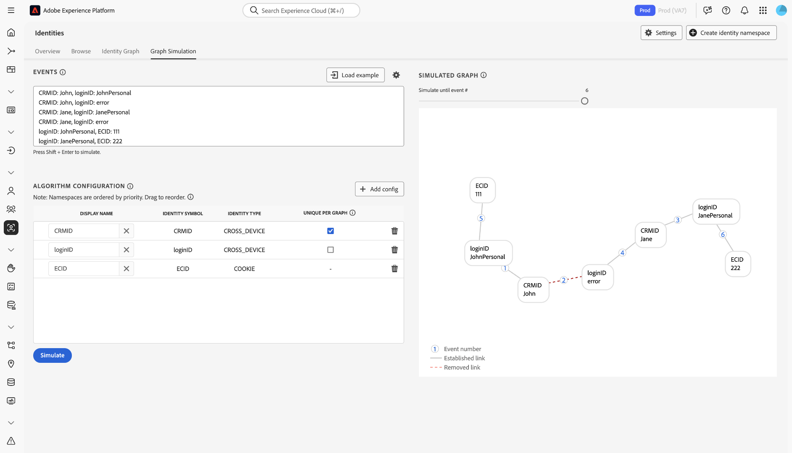
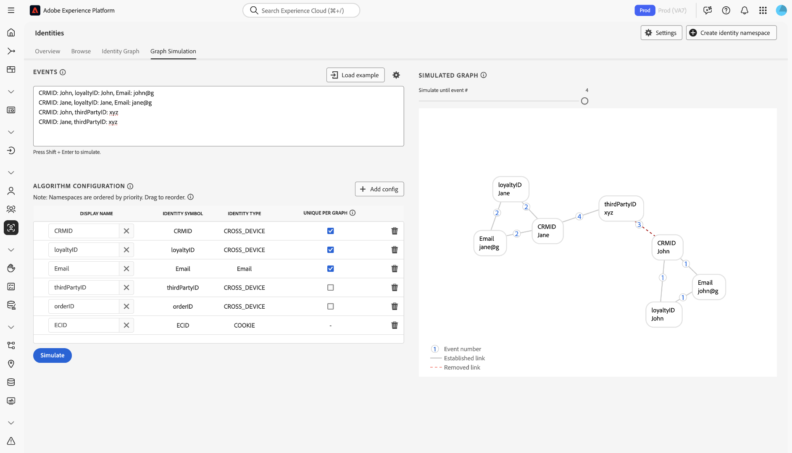

# [!DNL Identity Graph Linking Rules]配置指南 {#configurations-guide}

>[!CONTEXTUALHELP]
>id="platform_identities_algorithmconfiguration"
>title="算法配置"
>abstract="配置根据您所引入的身份标识定制的唯一命名空间和命名空间优先级。"

请阅读本文档，了解您可以使用[!DNL Identity Graph Linking Rules]配置的不同实现类型。

客户图方案可以分为三个不同的类别。

* **基本**： [基本实施](#basic-implementations)包含通常包含简单实施的图形。 这些实施倾向于围绕单个跨设备命名空间（例如CRMID）进行。 虽然基本实施相当简单，但图形折叠仍可能发生，通常是由于&#x200B;**共享设备**&#x200B;方案。
* **中间**： [中间实施](#intermediate-implementations)包含多个变量，如&#x200B;**多个跨设备命名空间**、**非唯一标识**&#x200B;和&#x200B;**多个唯一命名空间**。
* **高级**： [高级实施](#advanced-implementations)涉及复杂的多层图形方案。 对于高级实施，必须建立正确的命名空间优先级顺序，以确保删除适当的链接，从而防止图形折叠。

## 快速入门

在参阅以下文档之前，请确保您熟悉Identity Service和[!DNL Identity Graph Linking Rules]的几个重要概念。

* [身份标识服务概述](../home.md)
* [[!DNL Identity Graph Linking Rules] 概述](../identity-graph-linking-rules/namespace-priority.md)
* [命名空间优先级](namespace-priority.md)
* [唯一命名空间](overview.md#unique-namespace)
* [图形模拟](graph-simulation.md)

## 基本实施 {#basic-implementations}

>[!NOTE]
>
>要完成以下实施，您必须创建一个标识符号（区分大小写）为`CRMID`的自定义命名空间。

请阅读本节内容，了解[!DNL Identity Graph Linking Rules]的基本实施。

### 用例：使用一个跨设备命名空间的简单实施

通常，Adobe客户具有单一的跨设备命名空间，该命名空间可用于其所有资产，包括Web、移动设备和应用程序。 由于零售、电信和金融服务业的客户都使用此类实施，因此该系统在行业内和地理上均不可知。

通常，最终用户由跨设备命名空间（通常为CRMID）表示，因此CRMID应被分类为唯一的命名空间。 拥有计算机和[!DNL iPhone]并且不共享其设备的最终用户可以具有如下身份图。

假设您是一家名为&#x200B;**ACME**&#x200B;的电子商务公司的数据架构师。 约翰和珍是你的顾客。 他们是共同生活在加利福尼亚州圣何塞的最终用户。 他们共享一台台式计算机，并使用此计算机浏览您的网站。 同样，John和Jane也共享[!DNL iPad]，并偶尔使用此[!DNL iPad]浏览互联网，包括您的网站。

**文本模式**

```json
CRMID: John, ECID: 123
CRMID: John, ECID: 999, IDFA: a-b-c
```

**算法配置（身份设置）**

在模拟图形之前，在图形模拟界面中配置以下设置。

| 显示名称 | 身份标识符号 | 身份标识类型 | 每个图唯一 | 命名空间优先级 |
| --- | --- | --- | --- | --- |
| CRMID | CRMID | 跨设备 | ✔️ | 1 |
| ECID | ECID | COOKIE | | 2 |
| IDFA | IDFA | 设备 | | 3 |

**模拟图形**

在此图表中，John（最终用户）由CRMID表示。 `{ECID: 123}`表示John在其个人计算机上用于访问电子商务平台的Web浏览器。 `{ECID: 999}`表示他在[!DNL iPhone]上使用的浏览器，`{IDFA: a-b-c}`表示他的[!DNL iPhone]。


**练习**

在图形模拟中模拟以下配置。 您可以创建自己的事件，也可以使用文本模式复制并粘贴。

>[!BEGINTABS]

>[!TAB 共享设备（电脑）]

**共享设备（电脑）**

**文本模式**

```json
CRMID: John, ECID: 111
CRMID: Jane, ECID: 111
```

**模拟图形**

在此图表中，John和Jane由他们各自的CRMID表示：

* `{CRMID: John}`
* `{CRMID: Jane}`

桌面计算机上用于访问电子商务平台的浏览器由`{ECID: 111}`表示。 在此图形方案中，Jane是最后一个经过身份验证的最终用户，因此删除了`{ECID: 111}`和`{CRMID: John}`之间的链接。


>[!TAB 共享设备（移动设备）]

**共享设备（移动设备）**

**文本模式**

```json
CRMID: John, ECID: 111, IDFA: a-b-c
CRMID: Jane, ECID: 111, IDFA: a-b-c
```

**模拟图形**

在此图表中，John和Jane均由各自的CRMID表示。 他们使用的浏览器由`{ECID: 111}`表示，他们共享的[!DNL iPad]由`{IDFA: a-b-c}`表示。 在此图形方案中，Jane是最后一个经过身份验证的最终用户，因此删除从`{ECID: 111}`和`{IDFA: a-b-c}`到`{CRMID: John}`的链接。


>[!ENDTABS]

## 中间实施 {#intermediate-implementations}

>[!TIP]
>
>**非唯一标识**&#x200B;是与非唯一命名空间关联的标识。

请阅读本节内容，了解[!DNL Identity Graph Linking Rules]的中间实现。

### 用例：您的数据包括非唯一身份

>[!NOTE]
>
>要完成下面的实施，您必须使用以下自定义命名空间，其标识符号（区分大小写）为：
>* `CRMID`
>* `CChash` （这是一个自定义命名空间，表示经过哈希处理的信用卡号码。）

假设您是一位数据架构师，为一家发行信用卡的商业银行工作。 您的营销团队已指示他们要将过去的信用卡交易历史记录包含在配置文件中。 此身份图可能如下所示。

**文本模式**

```json
CRMID: John, CChash: 1111-2222 
CRMID: John, CChash: 3333-4444 
CRMID: John, ECID: 123 
CRMID: John, ECID: 999, IDFA: a-b-c
```

**算法配置（身份设置）**

在模拟图形之前，在图形模拟界面中配置以下设置。

| 显示名称 | 身份标识符号 | 身份标识类型 | 每个图唯一 | 命名空间优先级 |
| --- | --- | --- | --- | --- |
| CRMID | CRMID | 跨设备 | ✔️ | 1 |
| CChash | CChash | 跨设备 | | 2 |
| ECID | ECID | COOKIE | | 3 |
| IDFA | IDFA | 设备 | | 4 |

**模拟图形**


不保证这些信用卡号或任何其他非唯一命名空间将始终与单个最终用户关联。 两个最终用户可能会注册相同的信用卡，因此可能会错误地摄取非唯一的占位符值。 简而言之，无法保证非唯一命名空间不会导致图形折叠。

要解决此问题，Identity Service将删除最早的链接，并保留最新的链接。 这可确保图形中只有一个CRMID，从而防止图形折叠。

**练习**

在图形模拟中模拟以下配置。 您可以创建自己的事件，也可以使用文本模式复制并粘贴。

>[!BEGINTABS]

>[!TAB 共享设备]

**文本模式**

```json
CRMID: John, CChash: 1111-2222
CRMID: Jane, CChash: 3333-4444
CRMID: John, ECID: 123
CRMID: Jane, ECID:123
```

**模拟图形**


>[!TAB 两个使用相同信用卡的最终用户]

两个不同的最终用户使用相同的信用卡注册您的电子商务网站。 您的营销团队希望通过确保信用卡仅与单个配置文件关联来防止图形折叠。

**文本模式**

```json
CRMID: John, CChash: 1111-2222
CRMID: Jane, CChash: 1111-2222
CRMID: John, ECID: 123
CRMID: Jane, ECID:456
```

**模拟图形**


>[!TAB 信用卡号码无效]

由于数据未经清理，Experience Platform中引入了无效的信用卡号。

**文本模式**

```json
CRMID: John, CChash: undefined
CRMID: Jane, CChash: undefined
CRMID: Jack, CChash: undefined
CRMID: Jill, CChash: undefined
```

**模拟图形**


>[!ENDTABS]

### 用例：您的数据包括哈希和非哈希CRMID

>[!NOTE]
>
>要完成以下实施，您必须使用以下标识符号（区分大小写）创建自定义命名空间：
>* `CRMID`
>* `CRMIDhash`

您同时摄取了非哈希（离线）CRMID和哈希（在线）CRMID。 我们期望的是，非散列和散列的CRMID之间存在直接的关系。 当最终用户使用经过身份验证的帐户浏览时，经过哈希处理的CRMID与设备ID（在Identity Service上表示为ECID）一起发送。

**算法配置（身份设置）**

在模拟图形之前，在图形模拟界面中配置以下设置。

| 显示名称 | 身份标识符号 | 身份标识类型 | 每个图唯一 | 命名空间优先级 |
| --- | --- | --- | --- | --- | 
| CRMID | CRMID | 跨设备 | ✔️ | 1 |
| CRMIDhash | CRMIDhash | 跨设备 | ✔️ | 2 |
| ECID | ECID | COOKIE | | 3 |


**练习**

在图形模拟中模拟以下配置。 您可以创建自己的事件，也可以使用文本模式复制并粘贴。

>[!BEGINTABS]

>[!TAB 共享设备]

John和Jane共用一个装置。

**文本模式**

```json
CRMID: John, CRMIDhash: John
CRMID: Jane, CRMIDhash: Jane
CRMIDhash: John, ECID: 111 
CRMIDhash: Jane, ECID: 111
```


>[!TAB 数据错误]

由于哈希处理过程中出错，生成了一个非唯一的经过哈希处理的CRMID，并将其发送到Identity Service。

**文本模式**

```json
CRMID: John, CRMIDhash: aaaa
CRMID: Jane, CRMIDhash: aaaa
```


>[!ENDTABS]
<!-- 
### Use case: You are using Real-Time CDP and Adobe Commerce

You have two types of end-users:

* **Members**: An end-user who is assigned a CRMID and has an email account registered to your system.
* **Guests**: An end-user who is not a member. They do not have an assigned CRMID and their email accounts are not registered to your system.

In this scenario, your customers are sending data from Adobe Commerce to Real-Time CDP.

**Exercise**

Simulate the following configurations in the graph simulation tool. You can either create your own events, or copy and paste using text mode.

>[!BEGINTABS]

>[!TAB Shared device between two members]

In this scenario, two members share the same device to browse an e-commerce website.

**Text mode**

```json
CRMID: John, Email: john@g
CRMID: Jane, Email: jane@g
CRMID: John, ECID: 111
CRMID: Jane, ECID: 111
```


>[!TAB Shared device between two guests]

In this scenario, two guests share the same device to browse an e-commerce website.

**Text mode**

```json
Email: john@g, ECID: 111
Email: jane@g, ECID: 111
```


>[!TAB Shared device between a member and a guest]

In this scenario, a member and a guest share the same device to browse an e-commerce website.

**Text mode**

```json
CRMID: John, Email: john@g
CRMID: John, ECID: 111
Email: jane@g, ECID: 111
```


>[!ENDTABS] -->

### 用例：您的数据包括三个唯一的命名空间

>[!NOTE]
>
>要完成以下实施，您必须创建一个标识符号（区分大小写）为`CRMID`的自定义命名空间。

您的客户定义了单一人员实体，如下所示：

* 已分配CRMID的最终用户。
* 与经过哈希处理的电子邮件地址关联的最终用户，以便可以将配置文件激活到支持经过哈希处理的电子邮件的目标（例如，[!DNL Facebook]）。
* 与电子邮件地址关联的最终用户，以便支持人员可以使用所述电子邮件地址在Real-Time CDP上查找其个人资料。

| 显示名称 | 身份标识符号 | 身份标识类型 | 每个图唯一 | 命名空间优先级 |
| --- | --- | --- | --- | --- |
| CRMID | CRMID | 跨设备 | ✔️ | 1 |
| 电子邮件 | 电子邮件 | 电子邮件 | ✔️ | 2 |
| Email_LC_SHA256 | Email_LC_SHA256 | 电子邮件 | ✔️ | 3 |
| ECID | ECID | COOKIE | | 4 |

在图形模拟工具中模拟以下配置。 您可以创建自己的事件，也可以使用文本模式复制并粘贴。

>[!BEGINTABS]

>[!TAB 共享设备]

在此场景中，John和Jane都登录到电子商务网站。

**文本模式**

```json
CRMID: John, Email: john@g, Email_LC_SHA256: john_hash 
CRMID: Jane, Email: jane@g, Email_LC_SHA256: jane_hash 
CRMID: John, ECID: 111 
CRMID: Jane, ECID: 111
```


>[!TAB 最终用户更改其电子邮件]

**文本模式**

```json
CRMID: John, Email: john@g, Email_LC_SHA256: john_hash
CRMID: John, Email: john@y, Email_LC_SHA256: john_y_hash
```


>[!ENDTABS]

## 高级实施 {#advanced-implementations}

高级实施涉及复杂的多层图形场景。 这些类型的实现包括使用&#x200B;**命名空间优先级**&#x200B;以标识必须删除的正确链接以防止图形折叠。

**命名空间优先级**&#x200B;是按命名空间重要性对命名空间进行排名的元数据。 如果图表包含两个身份，每个身份具有不同的唯一命名空间，则Identity Service将使用命名空间优先级来决定要删除的链接。 有关详细信息，请阅读有关命名空间优先级](../identity-graph-linking-rules/namespace-priority.md)的[文档。

在复杂的图形场景中，命名空间优先级扮演着关键角色。 图形可以具有多个层 — 一个最终用户可以与多个登录ID相关联，并且这些登录ID可以进行哈希处理。 此外，不同的ECID可以链接到不同的登录ID。 为确保删除正确层中的正确链接，您的命名空间优先级配置必须正确。

有关[!DNL Identity Graph Linking Rules]的高级实施，请阅读此部分。

### 用例：您需要为多个业务线提供支持

>[!NOTE]
>
>要完成以下实施，您必须使用以下标识符号（区分大小写）创建自定义命名空间：
>* `CRMID`
>* `loginID`

您的最终用户有两个不同的帐户：个人帐户和业务帐户。 每个帐户由不同的ID标识。 在此场景中，典型图形如下所示：

**文本模式**

```json
CRMID: John, loginID: JohnPersonal
CRMID: John, loginID: JohnBusiness
loginID: JohnPersonal, ECID: 111
loginID: JohnPersonal, ECID: 222
loginID: JohnBusiness, ECID: 222
```

**算法配置（身份设置）**

在模拟图形之前，在图形模拟界面中配置以下设置。

| 显示名称 | 身份标识符号 | 身份标识类型 | 每个图唯一 | 命名空间优先级 |
| --- | --- | --- | --- | --- |
| CRMID | CRMID | 跨设备 | ✔️ | 1 |
| loginID | loginID | 跨设备 | | 2 |
| ECID | ECID | COOKIE | | 3 |

**模拟图形**


**练习**

在图形模拟中模拟以下配置。 您可以创建自己的事件，也可以使用文本模式复制并粘贴。

>[!BEGINTABS]

>[!TAB 共享设备]

**文本模式**

```json
CRMID: John, loginID: JohnPersonal
CRMID: John, loginID: JohnBusiness
CRMID: Jane, loginID: JanePersonal
CRMID: Jane, loginID: JaneBusiness
loginID: JohnPersonal, ECID: 111
loginID: JanePersonal, ECID: 111
```


>[!TAB 向Real-Time CDP发送错误数据]

**文本模式**

```json
CRMID: John, loginID: JohnPersonal
CRMID: John, loginID: error
CRMID: Jane, loginID: JanePersonal
CRMID: Jane, loginID: error
loginID: JohnPersonal, ECID: 111
loginID: JanePersonal, ECID: 222
```



>[!ENDTABS]

### 用例：您有需要多个命名空间的复杂实施

>[!NOTE]
>
>要完成以下实施，您必须使用以下标识符号（区分大小写）创建自定义命名空间：
>* `CRMID`
>* `loyaltyID`
>* `thirdPartyID`
>* `orderID`

您是一家媒体和娱乐公司，您的最终用户拥有以下优势：

* CRMID
* 忠诚度标识

此外，您的最终用户还可以在电子商务网站上进行购买，并且此数据会绑定到他们的电子邮件地址。 此外，第三方数据库提供商还会丰富用户数据，并将这些数据批量发送到Experience Platform。

**文本模式**

```json
CRMID: John, loyaltyID: John, Email: john@g
Email: john@g, orderID: aaa
CRMID: John, thirdPartyID: xyz
CRMID: John, ECID: 111
```

**算法配置（身份设置）**

在模拟图形之前，在图形模拟界面中配置以下设置。

| 显示名称 | 身份标识符号 | 身份标识类型 | 每个图唯一 | 命名空间优先级 |
| --- | --- | --- | --- | --- |
| CRMID | CRMID | 跨设备 | ✔️ | 1 |
| loyaltyID | loyaltyID | 跨设备 | ✔️ | 2 |
| 电子邮件 | 电子邮件 | 电子邮件 | ✔️ | 3 |
| thirdpartyID | thirdpartyID | 跨设备 | | 4 |
| orderID | orderID | 跨设备 | | 5 |
| ECID | ECID | COOKIE | | 6 |

**练习**

在图形模拟中模拟以下配置。 您可以创建自己的事件，也可以使用文本模式复制并粘贴。

>[!BEGINTABS]

>[!TAB 共享设备]

**文本模式**

```json
CRMID: John, loyaltyID: John, Email: john@g
CRMID: Jane, loyaltyID: Jane, Email: jane@g
Email: john@g, orderID: aaa 
CRMID: John, thirdPartyID: xyz 
CRMID: John, ECID: 111
CRMID: Jane, ECID: 111
```


>[!TAB 最终用户更改其电子邮件地址]

**文本模式**

```json
CRMID: John, loyaltyID: John, Email: john@g
CRMID: John, loyaltyID: John, Email: john@y
```


>[!TAB thirdPartyID关联更改]

**文本模式**

```json
CRMID: John, loyaltyID: John, Email: john@g
CRMID: Jane, loyaltyID: Jane, Email: jane@g
CRMID: John, thirdPartyID: xyz
CRMID: Jane, thirdPartyID: xyz
```



>[!TAB 非唯一的orderID]

**文本模式**

```json
CRMID: John, loyaltyID: John, Email: john@g
CRMID: Jane, loyaltyID: Jane, Email: jane@g
Email: john@g, orderID: aaa
Email: jane@g, orderID: aaa
```


>[!TAB 错误的忠诚度ID]

**文本模式**

```json
CRMID: John, loyaltyID: aaa, Email: john@g
CRMID: Jane, loyaltyID: aaa, Email: jane@g
```


>[!ENDTABS]

## 后续步骤

有关[!DNL Identity Graph Linking Rules]的详细信息，请阅读以下文档：

* [[!DNL Identity Graph Linking Rules] 概述](./overview.md)
* [身份标识优化算法](./identity-optimization-algorithm.md)
* [实施指南](./implementation-guide.md)
* [疑难解答和常见问题](./troubleshooting.md)
* [命名空间优先级](./namespace-priority.md)
* [图形模拟UI](./graph-simulation.md)
* [身份设置UI](./identity-settings-ui.md)