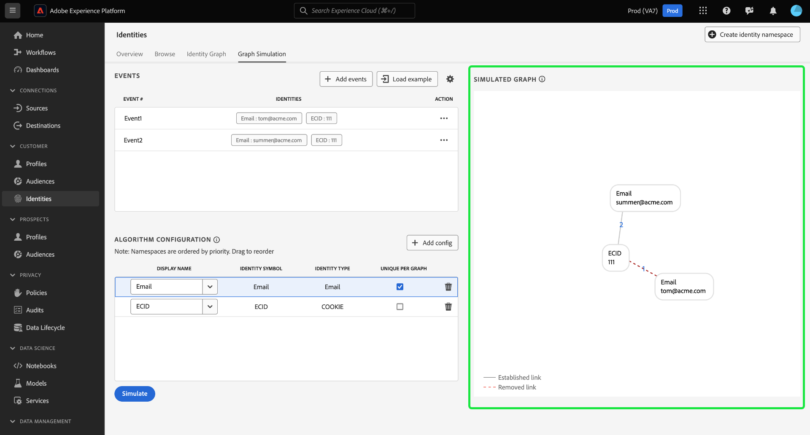
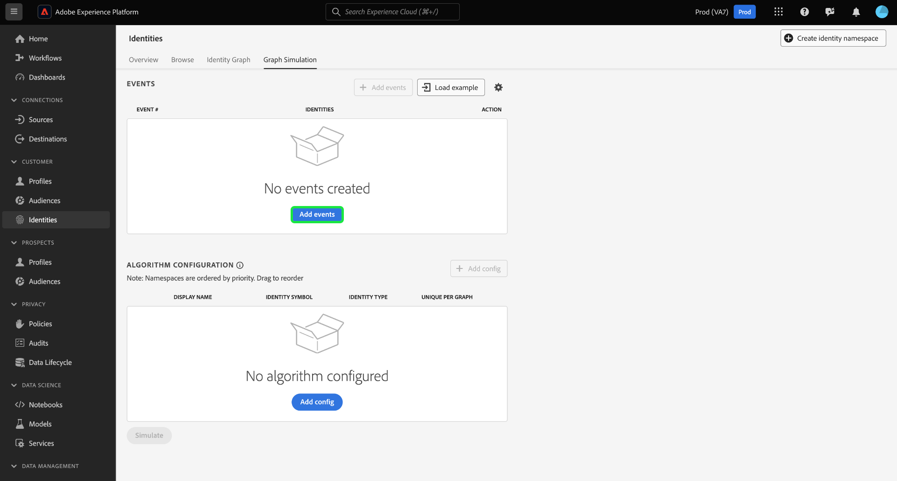
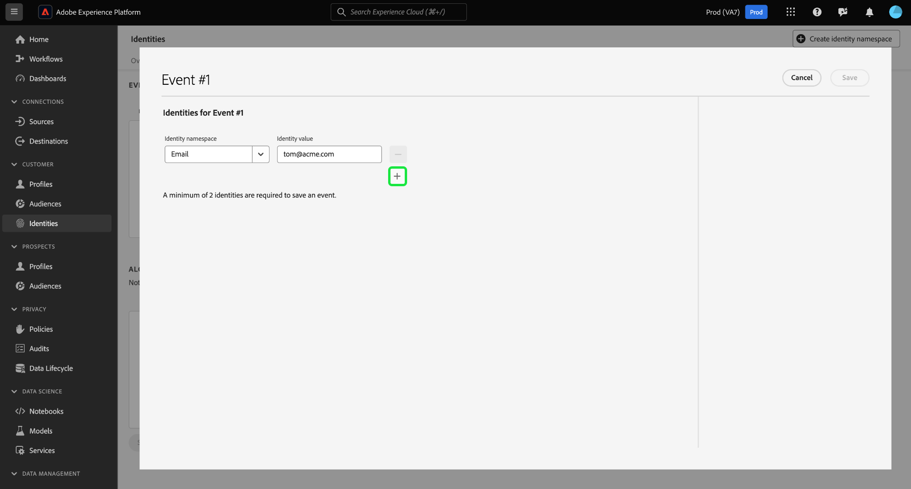

# 图形模拟

Graph Simulation是Identity Service UI中的一个工具，您可以使用它来模拟给定特定身份组合时身份图的行为方式以及配置 [身份优化算法](./identity-optimization-algorithm.md).

请阅读本文档，了解如何使用图形模拟来更好地了解身份图行为以及图形算法如何运行。

## 了解图形模拟界面

您可以在Adobe Experience Platform UI中访问图形模拟。 选择 **[!UICONTROL 身份]** 从左侧导航中，然后选择 **[!UICONTROL 图形模拟]** 从顶部标题中。

图形仿真界面可以分为三部分：

* 事件：使用 **[!UICONTROL 活动]** 用于添加身份以模拟图形的面板。 完全限定的身份必须具有身份命名空间及其相应的身份值。 您必须至少添加两个身份才能模拟图形。 您还可以选择 **[!UICONTROL 加载示例]** 输入预配置的事件和算法设置。

* 算法配置：使用 **[!UICONTROL 算法配置]** 面板，为命名空间添加和配置优化算法。 您可以拖放命名空间以修改其各自的优先级排名。 您还可以选择 **[!UICONTROL 每个图的唯一值]** 以确定命名空间是否唯一。

* 模拟的图形查看器：模拟的图形查看器根据您添加的事件和您配置的算法显示生成的图形。 两个节点之间的直线表示已建立链接。 虚线表示链接已被删除。

## 添加事件

要开始，请选择 **[!UICONTROL 添加事件]**.

此时将出现一个弹出窗口，用于 [!UICONTROL 事件#1]. 在此处，输入您的身份命名空间和身份值组合。 您可以使用下拉菜单选择身份命名空间。 或者，您可以键入命名空间的前几个字母，然后选择下拉菜单中提供的选项。 选择命名空间后，请提供与命名空间对应的身份值。

>[!TIP]
>
>您在“图形模拟”练习中输入的标识值不必是真实标识值，也可以是简单的占位符。

完成第一个身份后，选择添加图标(**`+`**)以添加第二个身份。

接下来，重复相同的步骤并添加第二个标识。 要生成标识图，需要两个完全限定的标识。 在以下示例中，ECID添加为命名空间，并提供了值 `111`. 完成后，选择 **[!UICONTROL 保存]**.

此 [!UICONTROL 活动] 界面将更新以显示您的第一个事件，在本例中为： `{Email: tom@acme.com, ECID: 111}`.

接下来，重复相同的步骤以添加第二个事件。 对于Event #2，添加 `{Email: summer@acme.com}` 作为您的第一个身份，然后添加相同的 `{ECID: 111}` 作为第二个标识，从而创建第二个事件： `{Email: summer@acme.com}, {ECID: 111}`. 完成后，您应该有两个事件，一个用于 `{Email: tom@acme.com, ECID: 111}` 一个用于 `{Email: summer@acme.com}, {ECID: 111}`.

### 加载示例

+++选择以查看如何使用预加载图形示例的步骤

要通过预配置的算法设置示例图，请选择 **[!UICONTROL 加载示例]**. 此时会出现一个弹出窗口，为您提供可以从以下内容中选择的可用图形方案：

| 示例图表 | 描述 | 示例 |
| --- | --- | --- |
| 共享设备 | 共享设备是指两个不同的用户登录到同一台设备的情况。 | 夫妻共享一个iPad用于互联网浏览和电子商务。 |
| 无效（非唯一）电话 | 无效或非唯一电话是指两个不同的用户使用相同的电话号码创建帐户的情况。 | 母亲和女儿使用共享的家庭电话号码注册任何电子商务帐户。 |
| “坏”的标识值 | “错误”标识值是指标识服务因错误实施而生成非唯一IDFA的情况。 | WebSDK错误地发送了 `user_null` 由于代码实施问题而为每个事件指定的值。 |

选择任意选项以加载具有预配置事件和算法的图形模拟。 您仍然可以对任何预加载的图形方案示例进行进一步的配置。

完成后，选择 **[!UICONTROL 模拟]**.

+++

### 使用文本版本

+++选择以查看如何使用文本版本的步骤

您还可以使用文本模式配置事件。 要使用文本模式，请选择齿轮(？) 图标，然后选择 **[!UICONTROL 文本（高级用户）]**.

您可以使用文本模式手动输入身份。 使用冒号(`:`)以区分与您输入的命名空间对应的身份值，然后使用逗号(`,`)以分离您的身份。 要区分不同的事件，请为每个事件使用新行。

+++

### 编辑事件

要编辑事件，请选择省略号(`...`)，然后选择 **[!UICONTROL 编辑]**.

### 删除事件

要删除事件，请选择省略号(`...`)，然后选择 **[!UICONTROL 删除]**.

## 配置算法

您配置的算法将指示Identity Service如何处理您在事件中输入的命名空间。 您在图形模拟UI中组合在一起的任何配置都不会保存在身份设置中。

要开始，请选择添加(`+`)进行配置。

出现空的配置行。 首先，输入您用于事件的同一命名空间。 在这种情况下，请先输入CRM ID。 输入命名空间后， [!UICONTROL 身份符号] 和 [!UICONTROL 身份类型] 自动填充。

接下来，重复相同的步骤并添加第二个命名空间，在本例中为ECID。 输入所有命名空间后，即可开始配置其优先级和唯一性。

* **命名空间优先级**：命名空间的优先级决定了它与给定身份图中其他命名空间相比的相对重要性。 例如，如果您的身份图有四个不同的命名空间：CRM ID、ECID、Email和Apple IDFA，则可以配置优先级以确定四个命名空间的重要性顺序。 （添加原因）
* **唯一的命名空间**：如果命名空间被指定为唯一，则Identity Service将生成图，并告诫只能存在一个具有给定唯一命名空间的身份。 例如，如果将CRM ID指定为唯一的命名空间，则图表只能有一个具有CRM ID的身份。 如果有多个具有CRM ID命名空间的身份，则将删除最早的链接。

要配置命名空间优先级，请选择命名空间行并将其拖动到所需的优先级排序，其中顶行表示较高的优先级，底行表示较低的优先级。 要将命名空间指定为唯一，请选择 **[!UICONTROL 每个图的唯一值]** 复选框。

完成后，选择 **[!UICONTROL 模拟]**.

## 查看模拟图形

此 [!UICONTROL 模拟图形] 部分显示根据您添加的事件和您配置的算法生成的身份图。

| 图表图标 | 描述 |
| --- | --- |
| 实线 | 实线表示两个身份之间已建立的链接。 |
| 虚线 | 虚线表示两个身份之间删除的链接。 |
| 联机编号 | 行中的数字表示生成该给定链接的时间戳。 最低数字(1)表示最早建立的链接。 |

在下面的示例图形中，虚线存在于以下内容之间 `{CRM ID: Tom}` 和 `{ECID: 111}` 原因如下：

* CRM ID在算法配置步骤中被指定为唯一。 因此，一个图形中可能只有一个具有CRM ID命名空间的身份。
* 之间的链接 `{CRM ID: Tom}` 和 `{ECID: 111}` 是第一个已建立的身份(事件#1)。 它是最早的链接，因此被删除。

## 示例图形方案

>[!NOTE]
>
>“CRM ID”是一个自定义命名空间。 因此，下面的示例要求您创建一个显示名称和身份符号为“CRM ID”的自定义命名空间。

以下部分提供了您在图形模拟中可能遇到的图形场景示例。

### 仅限CRM ID

事件：

* CRM ID：Tom，ECID：111

算法配置：

| 优先级 | 显示名称 | 标识符号 | 标识类型 | 每个图唯一 |
| ---| --- | --- | --- | --- |
| 1 | CRM ID | CRM ID | 跨设备 | 是 |
| 2 | ECID | ECID | COOKIE | 否 |

+++选择以查看模拟图形

+++

### 包含经过哈希处理的电子邮件的CRM ID

在此方案中，CRM ID是摄取的，表示在线（体验事件）和离线（配置文件记录）数据。 此方案还涉及引入哈希电子邮件，该电子邮件表示在CRM记录数据集中与CRM ID一起发送的其他命名空间。

事件：

* CRM ID：Tom， Email_LC_SHA256： tom@acme.com
* CRM ID：Tom，ECID：111
* CRM ID：Summer， Email_LC_SHA256： summer@acme.com
* CRM ID：Summer，ECID：222

算法配置：

| 优先级 | 显示名称 | 标识符号 | 标识类型 | 每个图唯一 |
| ---| --- | --- | --- | --- |
| 1 | CRM ID | CRM ID | 跨设备 | 是 |
| 2 | 电子邮件（SHA256，小写） | Email_LC_SHA256 | 电子邮件 | 否 |
| 3 | ECID | ECID | COOKIE | 否 |

+++选择以查看模拟图形

+++

### 包含哈希电子邮件、哈希手机、GAID和IDFA的CRM ID

事件：

* CRM ID：Tom， Email_LC_SHA256： aabbcc， Phone_SHA256： 123-4567
* CRM ID：Tom，ECID：111
* CRM ID：Tom，ECID：222，IDFA：A-A-A
* CRM ID：Summer，Email_LC_SHA256：deeff，Phone_SHA256:765-4321
* CRM ID：Summer，ECID：333
* CRM ID：Summer，ECID：444，GAID：B-B-B

算法配置：

| 优先级 | 显示名称 | 标识符号 | 标识类型 | 每个图唯一 |
| ---| --- | --- | --- | --- |
| 1 | CRM ID | CRM ID | 跨设备 | 是 |
| 2 | 电子邮件（SHA256，小写） | Email_LC_SHA256 | 电子邮件 | 否 |
| 3 | 手机 (SHA256) | Phone_SHA256 | 电话 | 否 |
| 4 | Google Ad ID (GAID) | GAID | 设备 | 否 |
| 5 | Apple IDFA(Apple的ID) | IDFA | 设备 | 否 |
| 6 | ECID | ECID | COOKIE | 否 |

+++选择以查看模拟图形

+++