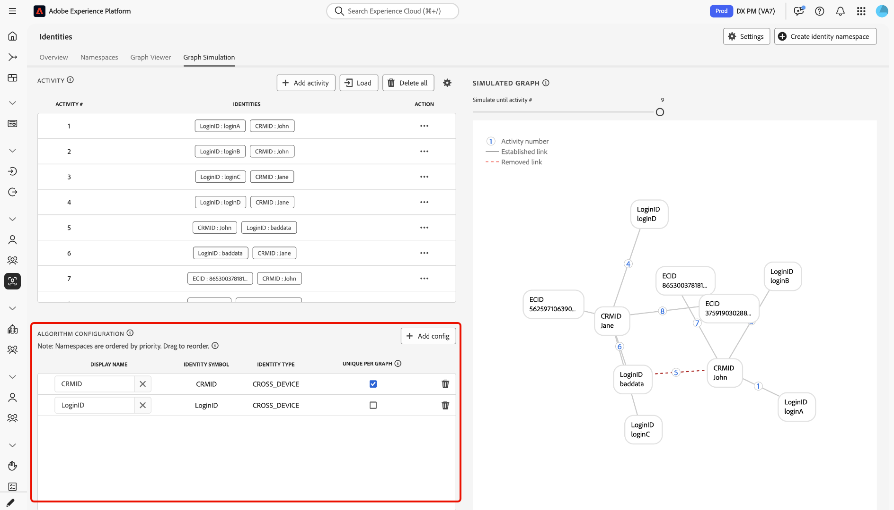
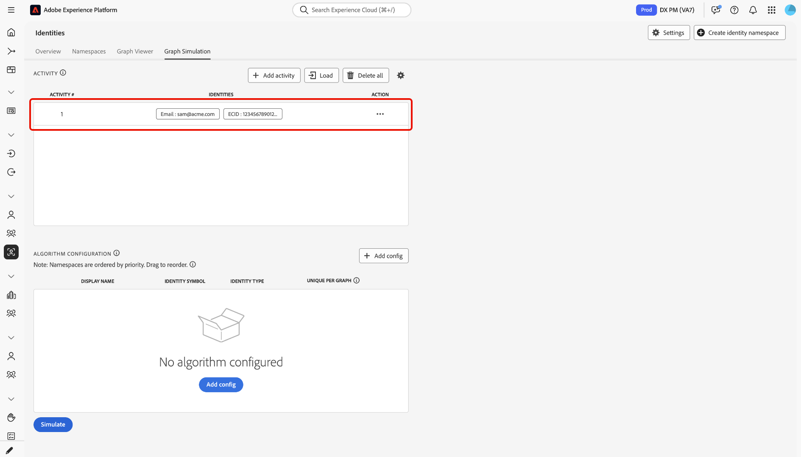
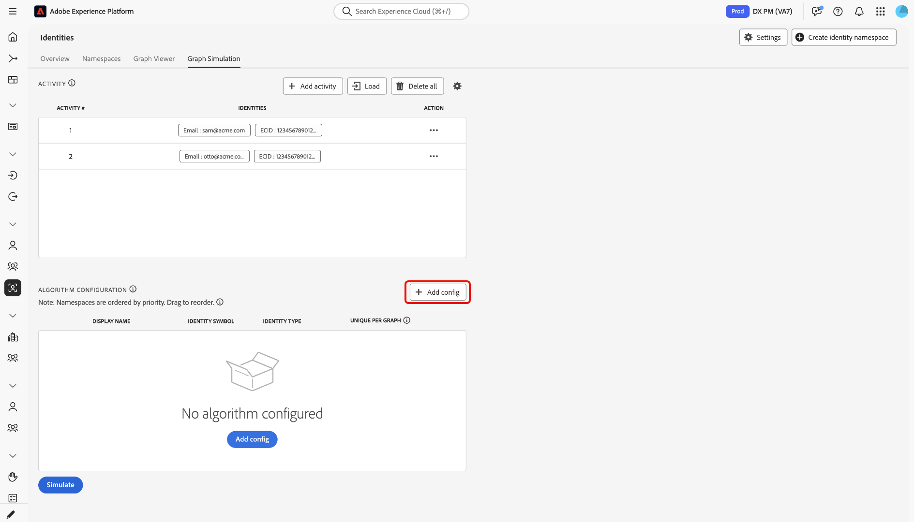
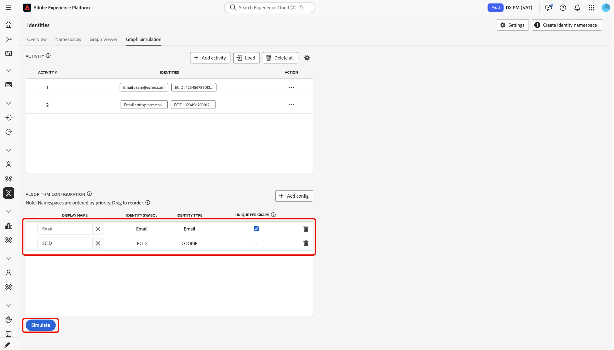
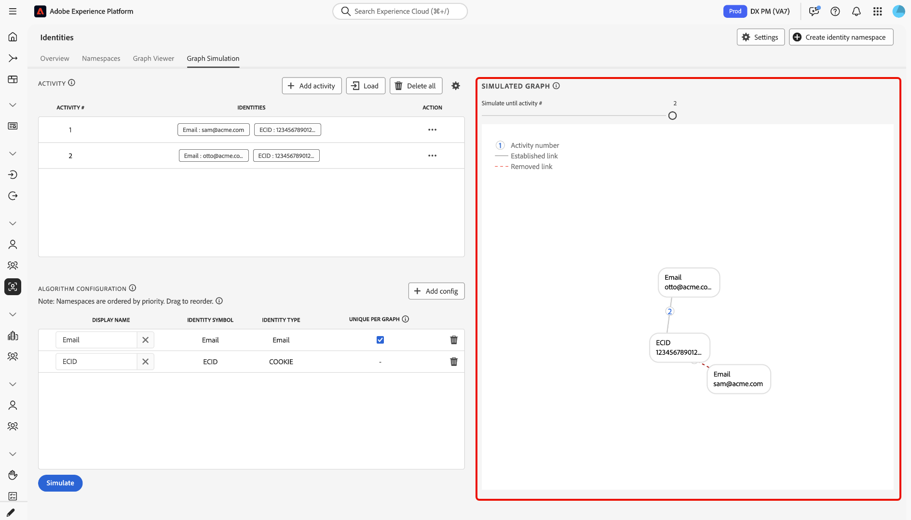

# [!DNL Graph Simulation] UI 指南 {#graph-simulation}

>[!CONTEXTUALHELP]
>id="platform_identities_graphsimulation"
>title="图形模拟"
>abstract="模拟图形以了解身份标识服务如何链接身份标识，以及身份标识优化算法是如何工作的。"

[!DNL Graph Simulation]是Identity Service UI中的一个工具，可用于根据您提供的身份模拟身份图的行为方式，以及配置[身份优化算法](./identity-optimization-algorithm.md)的方式。

在将[!DNL Identity Graph Linking Rules]应用于生产数据之前，使用此插件可安全地测试图形行为。 通过定义示例事件并配置身份优化算法（包括命名空间优先级和“每个图形唯一”设置），您可以查看身份是合并到一个图形中还是保持独立，然后根据需要调整配置。 使用此功能可以：

* 防止图形折叠（例如，当多人共享一台设备或一个电话号码时）
* 调整命名空间优先级（例如，EMAIL或CRM_ID是否应占主导地位）
* 评估低质量或重复使用的标识符对环境中拼接的影响。

您还可以演练在下游应用程序中显示的配置更改和调试身份问题。 例如，如果受众规模或合并的配置文件看起来错误，您可以在[!DNL Graph Simulation]中重新构建相关事件，以查看当前规则如何影响图形并尝试更安全的替代方案。

内置示例场景可帮助您向利益相关者解释身份行为和图形折叠风险，并支持数据质量和身份治理的认可。

## 了解[!DNL Graph Simulation]接口

要访问[!DNL Graph Simulation]，请在Adobe Experience Platform用户界面中导航到Identity Service工作区，然后选择&#x200B;**[!UICONTROL Graph Simulation]**。

该界面分为三个主要部分：

>[!BEGINTABS]

>[!TAB 活动]

使用&#x200B;**[!UICONTROL Activity]**&#x200B;面板添加身份以模拟图形。 每个身份都需要一个命名空间和一个值。 您必须至少添加两个身份才能运行模拟。 您还可以选择&#x200B;**[!UICONTROL Load]**&#x200B;以导入预配置的事件和算法设置或打开现有图形。

>[!TAB 算法配置]

使用&#x200B;**[!UICONTROL Algorithm configuration]**&#x200B;面板为命名空间添加和配置优化算法。 拖放命名空间行以更改优先级顺序。 您还可以选择&#x200B;**[!UICONTROL Unique Per Graph]**&#x200B;来标记命名空间在图形中是否必须是唯一的。

>[!TAB 模拟图形]

使用&#x200B;**[!UICONTROL Simulated graph]**&#x200B;显示查看从您的活动和算法设置生成的图形。 两个身份之间的实线表示保留链接；虚线表示算法删除了该链接。

>[!ENDTABS]

## [!DNL Graph Simulation]工作流

### 添加活动

要开始模拟身份图，请选择&#x200B;**[!UICONTROL Add Activity]**。

当出现[!UICONTROL Activity #1]的弹出窗口时，请选择身份命名空间并输入其值。 您可以从下拉列表中选取命名空间或键入几个字母以筛选列表。 选择命名空间后，请输入匹配的身份值。

>[!TIP]
>
>使用[!DNL Graph Simulation]时不必使用真实身份值。

[!UICONTROL Activity]界面将更新以显示您的第一个活动。

再次选择&#x200B;**[!UICONTROL Add Activity]**&#x200B;并完成第二个活动。 您至少需要两个完全限定的身份（命名空间加值）才能生成图形。

### 配置算法

>[!IMPORTANT]
>
>您配置的算法控制Identity Service如何处理活动中的命名空间。 您在[!DNL Graph Simulation UI]中设置的任何内容都不会保存到Identity Service标识设置。

活动就绪后，配置用于模拟的算法。 选择 **[!UICONTROL Add config]**。

添加您希望算法考虑的每个命名空间。 使用下拉菜单进行搜索，或键入前几个字母以缩小列表范围。

* **命名空间优先级**：您可以控制身份图中每个命名空间的重要性顺序。 例如，如果您的图形使用CRMID、ECID、电子邮件和Apple IDFA，则可以设置其优先级以反映在关联身份时应首先考虑哪些因素。 列表顶部的命名空间具有最高优先级。
* **唯一命名空间**：当命名空间标记为唯一时，身份服务可确保图形中只显示一个具有该命名空间的身份。 例如，如果电子邮件设置为唯一，则每个图表将仅包含一个电子邮件标识。 如果存在具有相同电子邮件的多个身份，则将删除最早的连接以保持唯一性。

将命名空间行拖入优先级顺序：顶行优先级最高，底行优先级最低。 要将命名空间在图形中视为唯一，请选中其&#x200B;**[!UICONTROL Unique Per Graph]**&#x200B;复选框。

准备就绪后，选择&#x200B;**[!UICONTROL Simulate]**。

### 查看模拟图形

[!UICONTROL Simulated Graph]部分显示从活动和算法配置生成的一个或多个图形。

| 图表图标 | 描述 |
| --- | --- |
| 实线 | 实线表示两个身份之间已建立的链接。 |
| 虚线 | 虚线表示两个身份之间删除的链接。 |
| 联机编号 | 行上的数字表示该链接相对于其他链接形成的时间。 最小值(1)是最早的链接。 |

## 附加功能

您还可以编辑或删除活动，在文本模式下输入活动，加载示例方案，或从Identity Service拉入现有图形。

### 编辑活动 {#edit-activity}

要编辑活动，请选择给定活动旁边的省略号(`...`)，然后选择&#x200B;**[!UICONTROL Edit]**。

### 删除活动 {#delete-activity}

要删除某个活动，请选择给定活动旁边的省略号(`...`)，然后选择&#x200B;**[!UICONTROL Delete]**。

### 使用文本模式 {#use-text-mode}

您可以使用文本模式配置活动。 要使用文本模式，请选择设置图标，然后选择&#x200B;**[!UICONTROL Text (Advanced users)]**。

在文本模式下，将每个标识键入为`namespace:value`。 使用逗号(`,`)分隔同一事件中的多个标识。 为每个事件启动一个新行。

### 加载示例 {#load-example}

选择&#x200B;**[!UICONTROL Load example]**&#x200B;以加载包含预设活动和算法设置的现成图表。

对话框列出了可以打开的场景：

| 示例图表 | 描述 | 示例 |
| --- | --- | --- |
| 共享设备 | 两个不同的用户登录同一设备。 | 夫妻共享一个iPad用于浏览和电子商务。 |
| 无效（非唯一）电话 | 两个不同的用户使用相同的电话号码注册。 | 母亲和女儿使用共享的家庭电话号码注册电子商务帐户。 |
| “坏”的身份标识值 | 实施错误会发送重复的ID或占位符ID（例如，对于许多用户而言，相同的IDFA）。 | 由于代码缺陷，Web SDK会在每个活动上发送一个`user_null`值。 |

选择要加载具有匹配活动和算法设置的[!DNL Graph Simulation]的方案。 您可以像编辑任何其他模拟一样编辑结果。

加载示例场景后

### 加载现有图表 {#load-existing-graph}

您可以使用[!DNL Graph Simulation]加载现有图形并查看其活动、算法配置和图形。

选择&#x200B;**[!UICONTROL Load]**，然后选择&#x200B;**[!UICONTROL Existing graph]**。

在对话框中，输入属于要检查的图形的命名空间和标识值。

加载成功后，[!DNL Graph Simulation]显示包含该标识的图形。

>[!TIP]
>
>在前[身份设置](./identity-settings-ui.md)屏幕上配置设置后，可以使用&#x200B;**加载现有图形**&#x200B;选项基于这些确切设置模拟图形。 模拟将使用您定义的配置。

## 后续步骤

在更改生产设置之前，您可以使用[!DNL Graph Simulation]查看Identity Service如何链接不同规则下的身份。 要更深入了解，请参阅以下文档：

* [[!DNL Identity Graph Linking Rules] 概述](./overview.md)
* [身份标识优化算法](./identity-optimization-algorithm.md)
* [实施指南](./implementation-guide.md)
* [疑难解答和常见问题](./troubleshooting.md)
* [图形配置示例](./example-configurations.md)
* [命名空间优先级](./namespace-priority.md)
* [身份设置UI](./identity-settings-ui.md)
