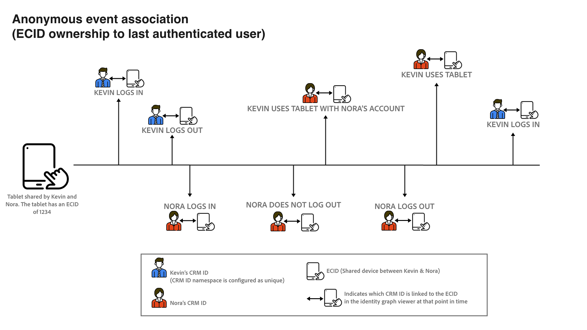

# 身份优化算法 {#identity-optimization-algorithm}

>[!CONTEXTUALHELP]
>id="platform_identities_uniquenamespace"
>title="唯一命名空间"
>abstract="一个图形不能拥有两个具有唯一命名空间的身份标识。如果图形试图超过此限制，则保留最新的链接，并移除最旧的链接。"

身份优化算法是Identity Service上的一种图算法，有助于确保身份图代表单个人，从而防止实时客户档案上不需要的身份合并。

## 输入参数 {#input-parameters}

请阅读此部分以了解有关唯一命名空间和命名空间优先级的信息。 这两个概念作为身份优化算法所需的输入参数。

### 唯一命名空间 {#unique-namespace}

唯一的命名空间可确定发生图形折叠时删除的链接。

单个合并的用户档案及其对应的身份图应表示单个个人（人员实体）。 单个用户通常由CRMID和/或登录ID表示。 预计不会将两个个人(CRMID)合并到单个配置文件或图表中。

您必须使用身份优化算法指定哪些命名空间代表Identity Service中的人员实体。 例如，如果CRM数据库定义了一个要与单个CRMID和单个电子邮件地址关联的用户帐户，则此沙盒的标识设置将如下所示：

* CRMID命名空间=唯一
* 电子邮件命名空间=唯一

声明为唯一的命名空间会自动配置为在给定身份图内最多有一个。 例如，如果您声明CRMID命名空间是唯一的，则身份图只能有一个包含CRMID命名空间的身份。 如果不将命名空间声明为唯一，则图形可以包含多个具有该命名空间的身份。

>[!NOTE]
>
>* 此时不支持家庭实体表示（“家庭图”）。
>
>* 作为人员标识符并且在沙盒中用于生成身份图的所有命名空间必须标记为唯一的命名空间。 否则，您可能会看到不希望出现的链接结果。

### 命名空间优先级 {#namespace-priority}

命名空间优先级决定身份优化算法如何删除链接。

Identity Service中的命名空间具有隐式相对重要性顺序。 考虑一个结构类似于金字塔的图表。 顶层有一个节点，中间层有两个节点，底层有四个节点。 命名空间优先级必须反映此相对顺序，以确保准确表示人员实体。

要深入了解命名空间优先级及其完整的功能和用法，请阅读[命名空间优先级指南](./namespace-priority.md)。

## 进程 {#process}

在摄取新身份时，Identity Service会检查新身份及其对应的命名空间是否遵循唯一的命名空间配置。 如果遵循了配置，则会继续摄取，并且新身份将链接到图表。 但是，如果未遵循配置，则身份优化算法将：

* 摄取最新事件，同时考虑命名空间优先级。
* 删除将从相应的图层中合并两个人员实体的链接。

## 身份优化算法详细信息

当违反唯一命名空间约束时，身份优化算法将“重播”链接并从头重建图形。

* 链接按以下顺序排序：
   * 最新事件。
   * 按命名空间优先级总和的时间戳（低和=高阶）。
* 将基于上述顺序重新建立该图。 如果添加链接违反了限制约束（例如，图形包含两个或多个具有唯一命名空间的身份），则会删除链接。
* 然后，生成的图形将与您配置的唯一命名空间约束兼容。

## 身份优化算法的示例场景

以下部分概述了在共享设备或摄取具有相同时间戳的数据等场景中，身份优化算法的行为。

### 共享设备

共享设备是指由多个用户使用的设备。 例如，共享设备可以是您与合作伙伴或家庭成员共享的笔记本电脑或平板电脑、库计算机或公共信息亭。

>[!BEGINTABS]

>[!TAB 示例1]

| 命名空间 | 唯一命名空间 |
| --- | --- |
| CRMID | 是 |
| 电子邮件 | 是 |
| ECID | 否 |

在此示例中，CRMID和电子邮件都被指定为唯一的命名空间。 在`timestamp=0`，摄取了一个CRM记录数据集并创建了两个不同的图形，这是因为唯一的命名空间配置。 每个图形都包含一个CRMID和一个电子邮件命名空间。

* `timestamp=1`： Jane使用笔记本电脑登录到您的电子商务网站。 Jane由CRMID和电子邮件代表，而她使用的笔记本电脑上的Web浏览器则由ECID代表。
* `timestamp=2`： John使用同一台笔记本电脑登录到您的电子商务网站。 John由他的CRMID和电子邮件代表，而他使用的Web浏览器已由ECID代表。 由于同一个ECID链接到两个不同的图形，因此Identity Service能够知道此设备（笔记本电脑）是共享设备。
* 但是，由于唯一的命名空间配置（每个图最多设置一个CRMID命名空间和一个电子邮件命名空间），身份优化算法随后将图拆分为两个。
   * 最后，由于John是最后一个经过身份验证的用户，因此表示笔记本电脑的ECID仍与他的图表关联，而不是Jane&#39;s的图表。

>[!TAB 示例2]

| 命名空间 | 唯一命名空间 |
| --- | --- |
| CRMID | 是 |
| ECID | 否 |

在此示例中，CRMID命名空间被指定为唯一的命名空间。

* `timestamp=1`： Jane使用笔记本电脑登录到您的电子商务网站。 她由CRMID代表，笔记本电脑上的Web浏览器由ECID代表。
* `timestamp=2`： John使用同一台笔记本电脑登录到您的电子商务网站。 他由他的CRMID代表，他所使用的Web浏览器由相同的ECID代表。
   * 此事件将两个独立的CRMID链接到同一ECID，该ECID超出配置的一个CRMID限制。
   * 因此，标识优化算法会删除旧链接，在本例中，该链接为在`timestamp=1`处链接的Jane CRMID。
   * 但是，尽管Jane的CRMID将不再作为Identity Service上的图形存在，它仍将作为配置文件保留在实时客户配置文件上。 这是因为标识图必须至少包含两个链接的标识，并且在删除链接后，Jane的CRMID将不再具有要链接到的其他标识。

>[!ENDTABS]

### 错误电子邮件

在某些情况下，用户可能会为其电子邮件和/或电话号码输入错误的值。

| 命名空间 | 唯一命名空间 |
| --- | --- |
| CRMID | 是 |
| 电子邮件 | 是 |
| ECID | 否 |

在本例中，CRMID和电子邮件命名空间被指定为唯一。 考虑Jane和John使用错误的电子邮件值(例如，test@test.com)注册您的电子商务网站的情况。

* `timestamp=1`： Jane在其iPhone上使用Safari登录到您的电子商务网站，并建立其CRMID（登录信息）和ECID（浏览器）。
* `timestamp=2`： John在其iPhone上使用Google Chrome登录到您的电子商务网站，并建立其CRMID（登录信息）和ECID（浏览器）。
* `timestamp=3`：您的数据工程师摄取Jane的CRM记录，这会导致她的CRMID与错误电子邮件关联。
* `timestamp=4`：您的数据工程师摄取John的CRM记录，这会导致他的CRMID被链接到错误的电子邮件。
   * 这随后将违反唯一命名空间配置，因为它将创建具有两个CRMID命名空间的单个图形。
   * 因此，身份优化算法会删除旧链接，在本例中，该链接是Jane的具有CRMID命名空间的身份与具有测试@test的身份之间的链接。

使用身份优化算法，不正确的身份值（如虚假电子邮件或电话号码）不会在多个不同的身份图之间传播。

## 匿名事件关联

ECID存储未经身份验证的（匿名）事件，而CRMID存储经过身份验证的事件。 在共享设备的情况下，ECID（未验证事件的持有者）与&#x200B;**上次验证的用户**&#x200B;关联。

查看下图以更好地了解匿名事件关联的工作方式：

* 凯文和诺拉共享平板电脑。
   * `timestamp=1`： Kevin使用其帐户登录到电子商务网站，从而建立其CRMID（登录信息）和ECID（浏览器）。 登录时，Kevin现在被视为最后经过身份验证的用户。
   * `timestamp=2`： Nora使用她的帐户登录到电子商务网站，从而建立她的CRMID（登录信息）和相同的ECID。 登录时，Nora现在被视为最后经过身份验证的用户。
   * `timestamp=3`： Kevin使用平板电脑浏览电子商务网站，但未使用自己的帐户登录。 之后，Kevin的浏览活动存储在ECID中，ECID又与Nora相关联，因为她是最后一个经过身份验证的用户。 此时，Nora拥有匿名活动。
      * 在Kevin再次登录之前，Nora的合并配置文件将与针对ECID存储的所有未经身份验证的事件相关联（其中ECID是主要身份）。
   * `timestamp=4`： Kevin第二次登录。 此时，他再次成为最后一个经过身份验证的用户，并且现在拥有未经身份验证的事件：
      * 在`timestamp=1`之前首次登录；以及
      * 他或Nora在凯文首次登录和第二次登录之间匿名浏览时所做的任何活动。

## 后续步骤

有关[!DNL Identity Graph Linking Rules]的详细信息，请阅读以下文档：

* [[!DNL Identity Graph Linking Rules] 概述](./overview.md)
* [实施指南](./implementation-guide.md)
* [图形配置示例](./example-configurations.md)
* [疑难解答和常见问题](./troubleshooting.md)
* [命名空间优先级](./namespace-priority.md)
* [图形模拟UI](./graph-simulation.md)
* [身份设置UI](./identity-settings-ui.md)