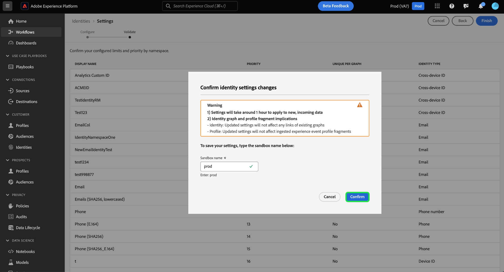

# 身份设置UI

>[!AVAILABILITY]
>
>此功能尚不可用；标识图链接规则的测试版计划预计于7月在开发沙盒上开始。 有关参与标准的信息，请与您的Adobe客户团队联系。

身份设置是Adobe Experience Platform Identity Service UI中的一项功能，可用于指定唯一的命名空间并配置命名空间优先级。

请阅读本指南，了解如何使用身份设置工具。

## 先决条件

在开始使用标识设置之前，请阅读以下文档：

* [身份优化算法](./identity-optimization-algorithm.md)
* [命名空间优先级](./namespace-priority.md)
* [图形模拟](./graph-simulation.md)

## 配置您的身份设置

要访问身份设置，请导航到Adobe Experience Platform UI中的Identity Service工作区，然后选择 **[!UICONTROL 设置]**.

此时将显示身份设置页面，将向您显示一条确认消息，提醒您在完成生产沙盒中的配置之前，首先在开发沙盒中测试和验证您的身份设置。

“身份设置”页面分为两个部分： [!UICONTROL 人员命名空间] 和 [!UICONTROL 设备或Cookie命名空间]. 人员命名空间是单个个人的标识符。 它们可以是跨设备ID、电子邮件地址和电话号码。 设备或Cookie命名空间是设备和Web浏览器的标识符，不能赋予它们比人员命名空间更高的优先级。 您也不能将设备或Cookie命名空间指定为唯一的命名空间。

### 指定您的唯一命名空间

要指定唯一的命名空间，请选择 [!UICONTROL 每个图的唯一值] 与该命名空间对应的复选框。 可以为身份设置配置选择多个唯一的命名空间。

建立唯一的命名空间后，图形将不再能够拥有包含唯一命名空间的多个身份。 例如，如果将Analytics自定义ID指定为唯一的命名空间，则图表只能有一个具有Analytics自定义ID命名空间的身份。 欲知更多信息，请参阅 [身份优化算法概述](./identity-optimization-algorithm.md#unique-namespace).

### 配置命名空间优先级

要配置命名空间优先级，请在身份设置菜单中选择命名空间，然后将该命名空间拖放到您喜欢的顺序中。 将命名空间放在列表中较高的位置，赋予它较高的优先级；相反，将命名空间放在列表中较低的位置，赋予它较低的优先级。 具有最高优先级的命名空间也应指定为唯一的命名空间。

完成配置后，选择 **[!UICONTROL 下一个]**. 出现确认消息，使用此机会验证您的配置是否正确，然后选择 **[!UICONTROL 完成]**.

出现警告，指示您的新设置不会对身份图中的现有链接和已摄取的体验事件配置文件片段产生任何影响。 要确认，请输入沙盒名称，然后选择 **[!UICONTROL 确认]**.

