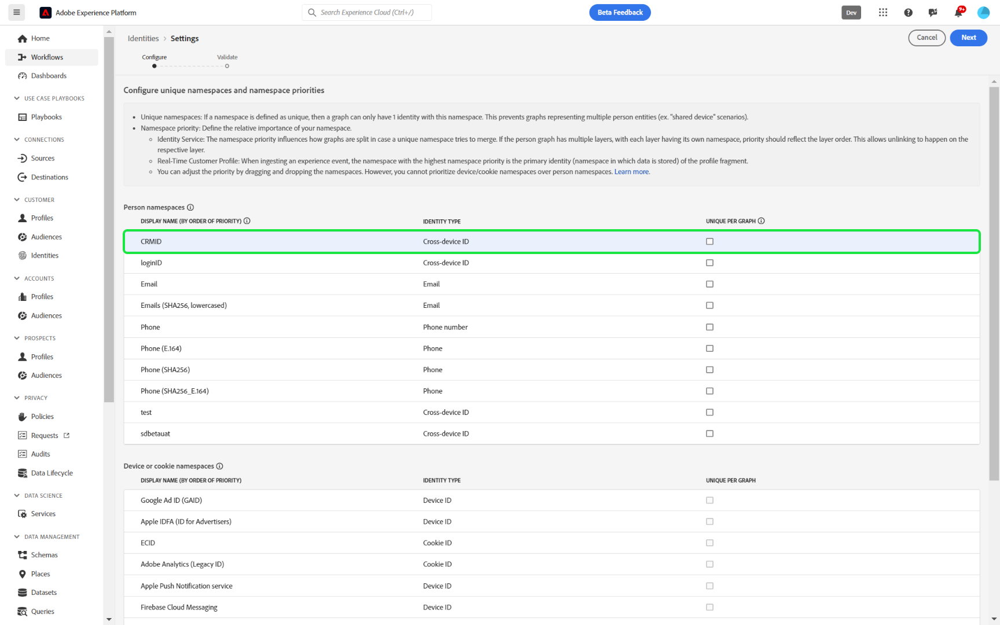

# 身份设置UI

>[!IMPORTANT]
>
>[!DNL Identity Graph Linking Rules]现已正式可用。 如果您有一个现有的沙盒，需要在启用身份设置后取消折叠图形（“已修复”），请联系您的Adobe客户团队或Adobe支持。

身份设置是Adobe Experience Platform Identity Service UI中的一项功能，可用于指定唯一的命名空间并配置命名空间优先级。

观看以下视频，了解有关在Identity Service UI工作区中使用[!DNL Graph Simulation]界面的更多信息：

>[!VIDEO](https://video.tv.adobe.com/v/3458487/?learn=on&enablevpops)

阅读本指南，了解如何在UI中配置身份设置。

## 先决条件

在开始使用标识设置之前，请阅读以下文档：

* [[!DNL Identity Graph Linking Rules]](./overview.md)
* [身份优化算法](./identity-optimization-algorithm.md)
* [实施指南](./implementation-guide.md)
* [图形配置示例](./example-configurations.md)
* [命名空间优先级](./namespace-priority.md)
* [图形模拟](./graph-simulation.md)

### 设置权限 {#set-permissions}

接下来，必须确保为帐户配置了以下权限：

* **[!UICONTROL 查看身份设置]**：应用此权限以便在身份命名空间浏览页中查看唯一的命名空间和命名空间优先级。
* **[!UICONTROL 编辑身份设置]**：应用此权限以便能够编辑和保存您的身份设置。

如果您没有这些权限，请联系您的管理员。 有关详细信息，请阅读[权限指南](../../access-control/abac/ui/permissions.md)。

## 配置您的身份设置

要访问身份设置，请在Adobe Experience Platform UI中导航到Identity Service工作区，然后选择&#x200B;**[!UICONTROL 设置]**。

身份设置页面分为两个部分：[!UICONTROL 人员命名空间]和[!UICONTROL 设备或Cookie命名空间]。 人员命名空间是单个个人的标识符。 它们可以是跨设备ID、电子邮件地址和电话号码。 设备或Cookie命名空间是设备和Web浏览器的标识符，不能赋予它们比人员命名空间更高的优先级。 您也不能将设备或Cookie命名空间指定为唯一的命名空间。

### 配置命名空间优先级

要配置命名空间优先级，请在身份设置菜单中选择命名空间，然后将该命名空间拖放到您喜欢的顺序中。 将命名空间放在列表上较高可为其提供较高的优先级，相反，将命名空间放在列表上较低可为其提供较低的优先级。 具有最高优先级的命名空间也应指定为唯一的命名空间。

### 指定您的唯一命名空间

要指定唯一的命名空间，请选中与该命名空间对应的[!UICONTROL 每个图形唯一]复选框。 您最多可以为身份设置配置选择&#x200B;**三个唯一的命名空间**。

建立唯一的命名空间后，图形将不再能够拥有包含唯一命名空间的多个身份。 例如，如果将CRMID指定为唯一的命名空间，则图形只能有一个具有CRMID命名空间的身份。 有关详细信息，请阅读[标识优化算法概述](./identity-optimization-algorithm.md#unique-namespace)。

完成配置后，选择&#x200B;**[!UICONTROL 下一步]**&#x200B;以继续。

在继续最后一步之前，您必须在此确认以下各项：

1. 选定的唯一命名空间。
2. 每个已知配置文件中是否存在具有最高优先级唯一命名空间的身份。
3. 命名空间优先级的顺序。

### 确认设置 {#confirm-your-settings}

>[!IMPORTANT]
>
>* 最后一步是另一条确认消息，指示仅在保存设置后更新图形时，现有图形才会受图形算法&#x200B;**的影响，并且在命名空间优先级更改后，实时客户配置文件上事件片段的主要标识也不会更新。**
>
>* 您的新设置或更新设置最多需要&#x200B;**24小时**&#x200B;才能生效。 要确认，请输入沙盒名称，然后选择&#x200B;**[!UICONTROL 确认]**。
>
>* 在保存身份设置之前，不会更改您的数据。

## 后续步骤

有关[!DNL Identity Graph Linking Rules]的详细信息，请阅读以下文档：

* [[!DNL Identity Graph Linking Rules] 概述](./overview.md)
* [身份优化算法](./identity-optimization-algorithm.md)
* [实施指南](./implementation-guide.md)
* [图形配置示例](./example-configurations.md)
* [疑难解答和常见问题](./troubleshooting.md)
* [命名空间优先级](./namespace-priority.md)
* [图形模拟UI](./graph-simulation.md)