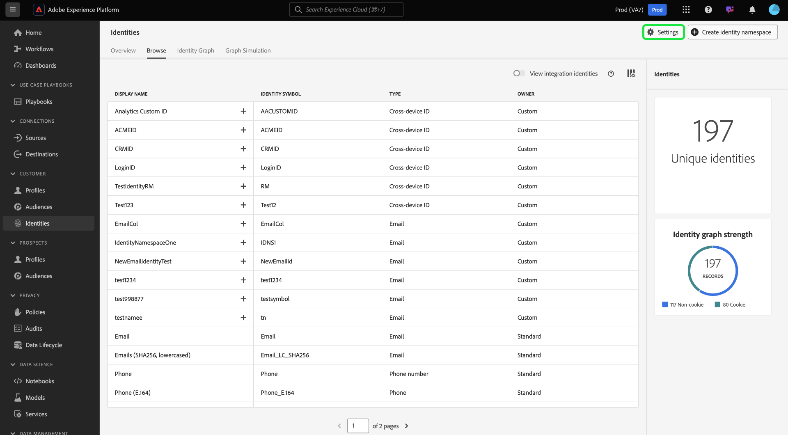

# [!DNL Identity Graph Linking Rules]的实施指南

>[!IMPORTANT]
>
>本文档假设您将在没有任何数据的新沙盒中启动实施。

阅读本文档以了解在使用Adobe Experience Platform Identity服务实施数据时可以遵循的分步指南。

分步概述：

1. [实施的完整先决条件](#prerequisites-for-implementation)
2. [创建必要的身份命名空间](#namespace)
3. [使用图形模拟工具熟悉身份优化算法](#graph-simulation)
4. [使用身份设置UI指定唯一的命名空间并配置命名空间的优先级排名](#identity-settings)
5. [创建Experience Data Model (XDM)架构](#schema)
6. [创建数据集](#dataset)
7. [将数据摄取到Experience Platform](#ingest)

## 实施的先决条件 {#prerequisites-for-implementation}

此部分概述在对数据实施[!DNL Identity Graph Linking Rules]之前必须完成的先决步骤。

### 唯一命名空间

#### 单一人员命名空间要求 {#single-person-namespace-requirement}

您必须确保每个配置文件中始终存在具有最高优先级的唯一命名空间。 这样做可让Identity Service在给定图形中检测适当的人员标识符。

+++选择以查看没有单一人员标识符命名空间的图形示例

如果没有用于表示人员标识符的唯一命名空间，您最终可能会看到一个将不同的人员标识符链接到同一ECID的图表。 在此示例中，B2BCRM和B2CCRM同时链接到同一ECID。 此图表建议Tom使用其B2C登录帐户与Summer使用其B2B登录帐户共享设备。 但是，系统将识别出这是一个配置文件（图形折叠）。

{zoomable="yes"}

+++

+++选择以查看具有单个人员标识符命名空间的图形示例

给定唯一的命名空间（在本例中，是指CRMID而不是两个完全不同的命名空间），Identity Service能够识别上次与ECID关联的人员标识符。 在此示例中，由于存在唯一的CRMID，因此Identity Service能够识别“共享设备”方案，即两个实体共享同一设备。

{zoomable="yes"}

+++

### 命名空间优先级配置

如果您使用[Adobe Analytics源连接器](../../sources/tutorials/ui/create/adobe-applications/analytics.md)来摄取数据，则必须为您的ECID指定比Adobe Analytics ID (AAID)更高的优先级，因为Identity Service阻止AAID。 通过优先处理ECID，您可以指示Real-time Customer Profile将未经身份验证的事件存储到ECID而不是AAID。

### XDM 体验事件 {#xdm-experience-events}

>[!CONTEXTUALHELP]
>id="platform_identities_linkingrules_xdm"
>title="确保您拥有单个用户标识符"
>abstract="在预实施过程中，您必须确保系统发送到 Experience Platform 的经过身份验证的事件始终包含&#x200B;**单个**&#x200B;用户标识符，如 CRMID。"

在预实施过程中，您必须确保系统发送到 Experience Platform 的经过身份验证的事件始终包含&#x200B;**单个**&#x200B;用户标识符，如 CRMID。

* （推荐）具有一个唯一人员标识符的已验证事件。
* （不推荐）具有两个唯一人员标识符的已验证事件。 如果您有多个唯一人员标识符，则可能会遇到不需要的图形折叠问题。
* （不推荐）没有任何唯一人员标识符的经过身份验证的事件。 如果您没有任何唯一的人员标识符，则未经身份验证和经过身份验证的事件都将根据ECID进行存储。

>[!BEGINTABS]

>[!TAB 具有一个人员标识符的已验证事件]

```json
{
  "_id": "test_id",
  "identityMap": {
      "ECID": [
          {
              "id": "62486695051193343923965772747993477018",
              "primary": false
          }
      ],
      "CRMID": [
          {
              "id": "John",
              "primary": true
          }
      ]
  },
  "timestamp": "2024-09-24T15:02:32+00:00",
  "web": {
      "webPageDetails": {
          "URL": "https://business.adobe.com/",
          "name": "Adobe Business"
      }
  }
}
```

>[!TAB 具有两个人员标识符的已验证事件]

如果您的系统发送了两个人员标识符，则实施可能会不符合单人员命名空间要求。 例如，如果webSDK实施中的identityMap包含CRMID、customerID和ECID命名空间，则无法保证每个事件都包含CRMID和customerID。

您应该&#x200B;**不**&#x200B;发送如下有效负载：

```json
{
  "_id": "test_id",
  "identityMap": {
      "ECID": [
          {
              "id": "62486695051193343923965772747993477018",
              "primary": false
          }
      ],
      "CRMID": [
          {
              "id": "John",
              "primary": true
          }
      ],
      "customerID": [
          {
            "id": "Jane",
            "primary": false
          }
      ],
  },
  "timestamp": "2024-09-24T15:02:32+00:00",
  "web": {
      "webPageDetails": {
          "URL": "https://business.adobe.com/",
          "name": "Adobe Business"
      }
  }
}
```

但是，请务必注意，虽然您可以发送两个人员标识符，但无法保证会由于实施或数据错误而阻止不需要的图形折叠。 请考虑以下方案：

* `timestamp1` = John登录 — >系统捕获`CRMID: John, ECID: 111`。 但是，此事件有效负载中不存在`customerID: John`。
* `timestamp2` = Jane登录 — >系统捕获`customerID: Jane, ECID: 111`。 但是，此事件有效负载中不存在`CRMID: Jane`。

因此，最佳实践是只发送一个包含已验证事件的人员标识符。

在图形模拟中，此摄取可能如下所示：

{zoomable="yes"}

>[!TAB 没有任何人员标识符的已验证事件]

在此示例中，您可以假设在John（最终用户）在验证期间浏览您的网站时，向Experience Platform发送了以下事件。 但是，尽管已通过身份验证，Experience Platform仍无法识别John，因为事件中缺少人员标识符。 因此，此事件将被解释为匿名用户浏览Adobe商业网站，而不是将其识别为专门与John关联的在线活动。

```json
{
    "_id": "test_id",
    "identityMap": {
        "ECID": [
            {
                "id": "62486695051193343923965772747993477018",
                "primary": false
            }
        ]
    },
    "timestamp": "2024-09-24T15:02:32+00:00",
    "web": {
        "webPageDetails": {
            "URL": "https://business.adobe.com/",
            "name": "Adobe Business"
        }
    }
}
```

>[!ENDTABS]

## 设置权限 {#set-permissions}

Identity Service实施流程的第一步是，确保将您的Experience Platform帐户添加到配置了必要权限的角色。 管理员可通过导航到Adobe Experience Cloud中的权限UI，配置您帐户的权限。 从那里，必须将您的帐户添加到具有以下权限的角色：

* [!UICONTROL 查看身份设置]：应用此权限以便在身份命名空间浏览页中查看唯一的命名空间和命名空间优先级。
* [!UICONTROL 编辑身份设置]：应用此权限以便能够编辑和保存您的身份设置。

有关权限的详细信息，请阅读[权限指南](../../access-control/abac/ui/permissions.md)。

## 创建您的身份命名空间 {#namespace}

如果您的数据需要它，则必须首先为组织创建适当的命名空间。 有关如何创建自定义命名空间的步骤，请阅读有关[在UI中创建自定义命名空间](../features/namespaces.md#create-custom-namespaces)的指南。

## 使用图形模拟工具 {#graph-simulation}

接下来，导航到Identity Service UI工作区中的[图形模拟工具](./graph-simulation.md)。 您可以使用图形模拟工具来模拟使用各种不同的唯一命名空间和命名空间优先级配置构建的身份图形。

通过创建不同的配置，您可以使用图形模拟工具来学习和更好地了解身份优化算法和某些配置如何影响图形的行为。

## 配置身份设置 {#identity-settings}

了解图形的行为方式后，请导航到Identity Service UI工作区中的[身份设置UI](./identity-settings-ui.md)。 要访问身份设置UI，请从左侧导航中选择&#x200B;**[!UICONTROL 身份]**，然后选择&#x200B;**[!UICONTROL 设置]**。

{zoomable="yes"}

使用身份设置UI指定唯一的命名空间并按优先级配置命名空间。 完成应用设置后，必须至少等待六小时才能继续摄取数据，因为新设置至少需要六小时才能反映在Identity Service中。

有关详细信息，请阅读[身份设置UI指南](./identity-settings-ui.md)。

## 创建 XDM 架构 {#schema}

在建立唯一的命名空间和命名空间优先级后，您现在可以继续进行所需的设置以摄取数据。 首先，必须创建XDM架构。 根据您的数据，您可能需要为XDM Individual Profile和XDM ExperienceEvent创建架构。

要将数据摄取到Real-time Customer Profile，您必须确保您的架构至少包含一个已指定为主标识的字段。 通过设置主要身份，您可以为配置文件摄取启用给定架构。

有关如何创建架构的说明，请阅读有关[在UI中创建XDM架构](../../xdm/tutorials/create-schema-ui.md)的指南。

## 创建数据集 {#dataset}

接下来，创建一个数据集以为要摄取的数据提供结构。 数据集是用于数据集合的存储和管理结构，通常是表格，其中包含架构（列）和字段（行）。数据集与架构配合使用，要将数据摄取到Real-time Customer Profile，必须为数据集启用配置文件摄取。 要为配置文件启用数据集，它必须引用为配置文件摄取启用的架构。

有关如何创建数据集的说明，请阅读[数据集UI指南](../../catalog/datasets/user-guide.md)。

## 引入数据 {#ingest}

此时，您应该具备以下内容：

* 访问Identity Service功能所需的权限。
* 数据的命名空间。
* 为命名空间指定的唯一命名空间和配置的优先级。
* 至少一个XDM架构。 （根据您的数据和特定用例，您可能需要创建用户档案和体验事件架构。）
* 基于架构的数据集。

完成上面列出的所有项目后，即可开始将数据摄取到Experience Platform。 您可以通过多种不同的方式执行数据摄取。 您可以使用以下服务将数据导入Experience Platform：

* [批处理摄取和流式摄取](../../ingestion/home.md)
* [Experience Platform中的数据收集](../../collection/home.md)
* [Experience Platform源](../../sources/home.md)

>[!TIP]
>
>摄取数据后，XDM原始数据有效负载不会发生更改。 您仍可能会在UI中看到主要身份配置。 但是，这些配置将由身份设置覆盖。

若要获得任何反馈，请使用Identity Service UI工作区中的&#x200B;**[!UICONTROL Beta反馈]**&#x200B;选项。

## 验证图形 {#validate}

使用身份仪表板可以查看身份图的状态，例如总体身份计数和图形计数趋势、按命名空间划分的身份计数以及按图形大小划分的图形计数。 您还可以使用身份仪表板查看具有两个或多个身份（按命名空间组织）的图形的趋势。

选择省略号(`...`)，然后选择&#x200B;**[!UICONTROL 查看更多]**&#x200B;以获取详细信息，并验证没有折叠的图形。

{zoomable="yes"}

使用显示的窗口查看有关折叠图形的信息。 在此示例中，电子邮件和电话都标记为唯一的命名空间，因此，您的沙盒中没有折叠的图形。

{zoomable="yes"}

## 附录 {#appendix}

请参阅此部分以了解在实施身份设置和唯一命名空间时可以参考的其他信息。

### 挂起loginID方案 {#dangling-loginid-scenario}

下图模拟了“悬挂”的loginID方案。 在此示例中，两个不同的loginID绑定到相同的ECID。 但是，`{loginID: ID_C}`未链接到CRMID。 因此，Identity Service无法检测到这两个loginID代表两个不同的实体。

>[!BEGINTABS]

>[!TAB 不明确的登录ID]

在此示例中，`{loginID: ID_C}`悬空且未链接到CRMID。 因此，应与loginID关联的人员实体将变得模棱两可。

{zoomable="yes"}

>[!TAB loginID链接到CRMID]

在此示例中，`{loginID: ID_C}`链接到`{CRMID: Tom}`。 因此，系统能够识别此loginID与Tom相关联。

{zoomable="yes"}

>[!TAB loginID已链接到另一个CRMID]

在此示例中，`{loginID: ID_C}`链接到`{CRMID: Summer}`。 因此，系统能够识别此loginID与另一个人员实体（在本例中为Summer）相关联。

此示例还显示Tom和Summer是共享设备的不同人员实体，该设备由`{ECID: 111}`表示。

{zoomable="yes"}

>[!ENDTABS]

## 后续步骤

有关[!DNL Identity Graph Linking Rules]的详细信息，请阅读以下文档：

* [[!DNL Identity Graph Linking Rules] 概述](./overview.md)
* [身份优化算法](./identity-optimization-algorithm.md)
* [图形配置示例](./example-configurations.md)
* [疑难解答和常见问题](./troubleshooting.md)
* [命名空间优先级](./namespace-priority.md)
* [图形模拟UI](./graph-simulation.md)
* [身份设置UI](./identity-settings-ui.md)
