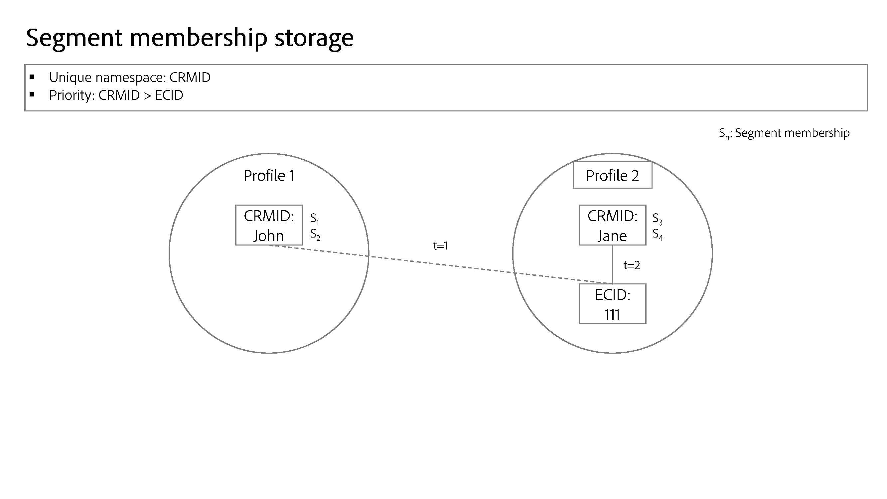

# 命名空间优先级

>[!AVAILABILITY]
>
>标识图链接规则当前处于“有限可用”状态。 有关如何访问开发沙盒中的功能的信息，请与您的Adobe客户团队联系。

每个客户实施都是独一无二的，并且是根据特定组织的目标而量身定制的，因此，给定命名空间的重要性因客户而异。 现实世界的例子包括：

* 一方面，您可能会将电子邮件命名空间视为代表人员实体，因此每个人的命名空间都是唯一的。 另一方面，另一个客户可能会将电子邮件命名空间视为不可靠的标识符，因此，他们可能允许单个CRMID与电子邮件命名空间中的多个身份相关联。
* 您可能会使用“登录ID”命名空间收集在线行为。 此登录ID可能与CRMID具有1:1关系，然后CRMID存储CRM系统中的属性，并且可能被视为最重要的命名空间。 在这种情况下，您需要确定CRMID命名空间是人员的更准确表示形式，而登录ID命名空间是第二重要的命名空间。

您必须在Identity Service中进行反映命名空间重要性的配置，因为这会影响配置文件的形成和分段方式。

## 确定您的优先级

命名空间优先级的确定基于以下因素：

### 身份图结构

如果贵组织的图形是分层的，则命名空间优先级应反映这一点，以便在图形折叠的情况下删除正确的链接。

>[!TIP]
>
>* “图形折叠”是指多个不同的配置文件无意中合并到单个身份图形中的情况。
>
>* 分层图是指具有多级链接的标识图。 查看下图，了解具有三个图层的图形示例。

### 命名空间的语义含义

标识表示真实世界的对象。 身份图中有三个表示对象。 按重要性排序，它们是：

* 人员（跨设备、电子邮件、电话号码）
* 硬件设备
* Web浏览器(Cookie)

人员命名空间与硬件设备（例如IDFA、GAID）相比相对不可变，而硬件设备与Web浏览器相比相对不可变。 基本上，您（人员）将始终是单一实体，可以拥有多个硬件设备（手机、笔记本电脑、平板电脑等），并且可以使用多个浏览器(Google Chrome、Safari、FireFox等)

处理此主题的另一种方法是通过基数。 对于给定的人员实体，将创建多少个身份？ 在大多数情况下，人员将拥有一个CRMID、多个硬件设备标识符（IDFA/GAID重置不应经常发生）以及更多Cookie（可以想象的是，个人可以在任何给定时间浏览多个设备、使用无痕模式或重置Cookie）。 通常，**较低的基数表示命名空间具有较高值**。

## 验证命名空间优先级设置

了解如何设置命名空间的优先级后，您可以使用图形模拟工具来测试各种图形折叠方案，并确保优先级配置返回预期的图形结果。 有关详细信息，请阅读有关使用[图形模拟工具](./graph-simulation.md)的指南。

## 配置命名空间优先级

可使用[!UICONTROL 身份设置]配置命名空间优先级。 在[!UICONTROL 身份设置]界面中，您可以拖放命名空间以确定其相对重要性。

>[!IMPORTANT]
>
>无法区分设备/Cookie命名空间的优先级与人员命名空间的优先级。 此限制可确保不会发生错误配置。

## 命名空间优先级使用情况

目前，命名空间优先级影响实时客户配置文件的系统行为。 下图说明了此概念。 有关详细信息，请阅读[Adobe Experience Platform和应用程序体系结构图](https://experienceleague.adobe.com/en/docs/blueprints-learn/architecture/architecture-overview/platform-applications)的指南。

### Identity Service：身份优化算法

对于相对复杂的图形结构，命名空间优先级在确保在图形折叠场景发生时删除正确链接方面发挥重要作用。 有关详细信息，请参阅[标识优化算法概述](../identity-graph-linking-rules/identity-optimization-algorithm.md)。

### 实时客户个人资料：体验事件的主要身份确定

* 对于体验事件，一旦您为给定沙盒配置了身份设置，主身份将由未来最高的命名空间优先级决定。
   * 这是因为体验事件在本质上是动态的。 身份映射可以包含三个或更多身份，命名空间优先级可确保最重要的命名空间与体验事件相关联。
* 因此，实时客户个人资料&#x200B;**将不再使用下列配置**：
   * WebSDK中数据元素类型的“主要”复选框（在identityMap中转换为`primary=true`）。 **注意**：身份命名空间和身份值将继续在配置文件中使用。 此外，您仍然必须配置“主”复选框设置，因为Real-Time Customer Profile以外的服务将继续引用此配置。
   * 在XDM体验事件类架构中标记为主要标识的任何字段。
   * Adobe Analytics源连接器（ECID或AAID）中的默认主标识设置。
* 另一方面，**命名空间优先级不能确定配置文件记录**&#x200B;的主要身份。
   * 对于配置文件记录，您可以使用Experience PlatformUI中的架构工作区来定义您的身份字段，包括主要身份。 有关详细信息，请阅读[在UI](../../xdm/ui/fields/identity.md)中定义标识字段的指南。

>[!TIP]
>
>* 命名空间优先级是&#x200B;**命名空间**&#x200B;的属性。 它是分配给命名空间以指示其相对重要性的数值。
>
>* 主要身份是存储配置文件片段的身份。 配置文件片段是存储有关特定用户的信息的数据记录：属性（通常通过CRM记录摄取）或事件（通常从体验事件或在线数据中摄取）。

### 示例场景

本节提供了一个优先级配置如何影响数据的示例。

假设为给定沙盒建立了以下配置：

| 命名空间 | 命名空间的实际应用 | 优先级 |
| --- | --- | --- |
| CRMID | 用户 | 1 |
| IDFA | Apple硬件设备(iPhone、IPad等) | 2 |
| GAID | Google硬件设备(Google Pixel、Pixelbook等) | 3 |
| ECID | Web浏览器(Firefox、Safari、Google Chrome等) | 4 |
| AAID | Web 浏览器 | 5 |

{style="table-layout:auto"}

鉴于上述配置，用户操作和主标识的确定将按如下方式解析：

| 用户操作（体验事件） | 身份验证状态 | 数据源 | 标识映射 | 主标识（配置文件片段的主键） |
| --- | --- | --- | --- | --- |
| 查看信用卡优惠页面 | 未经身份验证（匿名） | Web SDK | {ECID} | ECID |
| 查看帮助页面 | 未验证 | Mobile SDK | {ECID， IDFA} | IDFA |
| 查看支票帐户余额 | Authenticated | Web SDK | {CRMID， ECID} | CRMID |
| 注册家庭贷款 | Authenticated | Analytics源连接器 | {CRMID， ECID， AAID} | CRMID |
| 将1,000美元从支票转帐到节省额 | Authenticated | Mobile SDK | {CRMID， GAID， ECID} | CRMID |

{style="table-layout:auto"}

### 分段服务：分段成员资格元数据存储

对于给定的合并用户档案，区段成员资格将根据具有最高优先级命名空间的身份进行存储。

例如，假设有两个配置文件：

* 第一个配置文件代表John。
* 第二个个人资料代表简。

如果John和Jane共享设备，则ECID（网络浏览器）会从一个人转移到另一个人。 但是，这不会影响针对John和Jane存储的区段会员资格信息。

如果区段资格标准完全基于针对ECID存储的匿名事件，则Jane将有资格使用该区段

## 对其他Experience Platform服务的影响 {#implications}

此部分概述命名空间优先级如何影响其他Experience Platform服务。

### 高级数据生命周期管理

对于给定标识，数据卫生记录删除请求功能采用以下方式：

* Real-time Customer Profile：删除指定为主要标识的任何配置文件片段。 **现在将根据命名空间优先级确定配置文件上的主要身份。**
* 数据湖：删除将指定标识作为主标识的所有记录。

有关详细信息，请阅读[高级生命周期管理概述](../../hygiene/home.md)。

### 计算属性

计算属性不使用命名空间优先级来计算值。 如果您使用计算属性，则必须确保将CRMID指定为WebSDK的主要标识。 这一限制预计将在2024年8月解决。

有关详细信息，请阅读[计算属性UI指南](../../profile/computed-attributes/ui.md)。

### 数据湖

数据摄取到数据湖将继续遵循在[Web SDK](../../tags/extensions/client/web-sdk/data-element-types.md#identity-map)和架构上配置的主要身份设置。

数据湖不会根据命名空间优先级确定主身份。 例如，即使在启用了命名空间优先级（例如，向新连接添加数据集）后，Adobe Customer Journey Analytics仍将继续使用身份映射中的值，因为Customer Journey Analytics会使用来自数据湖的数据。

### Experience Data Model (XDM)架构

任何不是XDM体验事件的架构（如XDM个人资料）将继续遵循您标记为身份](../../xdm/ui/fields/identity.md)的任何[字段。

有关XDM架构的更多信息，请阅读[架构概述](../../xdm/home.md)。

### 智能服务

在选择数据时，您需要指定一个命名空间，该命名空间将用于确定计算得分的事件和存储计算得分的事件。 建议您选择代表人员的命名空间。

* 如果您使用WebSDk收集Web行为数据，则建议您在身份映射中选择CRMID命名空间。
* 如果您使用Analytics Source Connector收集Web行为数据，则应当选择身份描述符(CRMID)。

此配置导致仅使用已验证的事件计算得分。

有关详细信息，请阅读[Attribution AI](../../intelligent-services/attribution-ai/overview.md)和[客户人工智能](../../intelligent-services/customer-ai/overview.md)上的文档。

### Privacy Service

对于给定标识，[Privacy Service删除请求](../privacy.md)将以下列方式运行：

* Real-time Customer Profile：删除将指定标识值作为主标识的任何配置文件片段。 **现在将根据命名空间优先级确定配置文件上的主要身份。**
* 数据湖：删除具有指定身份作为主身份或辅助身份的任何记录。

有关详细信息，请阅读[Privacy Service概述](../../privacy-service/home.md)。

### Adobe Target

Adobe Target可能会导致针对共享设备场景的意外用户定位。