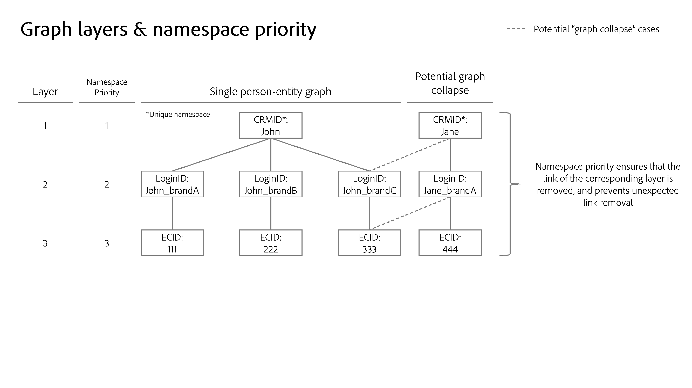
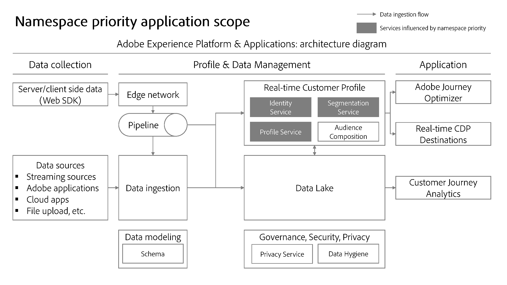
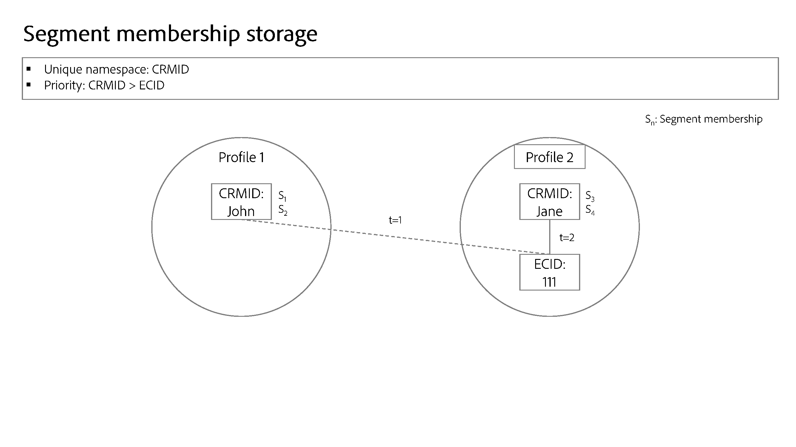

# 命名空间优先级 {#namespace-priority}

>[!CONTEXTUALHELP]
>id="platform_identities_namespacepriority"
>title="命名空间优先级"
>abstract="命名空间优先级决定如何从身份标识图形中移除链接。"

每个客户实施都是独一无二的，并且是根据特定组织的目标而量身定制的，因此，给定命名空间的重要性因客户而异。 现实世界的例子包括：

* 您的公司可能会将每个电子邮件地址视为单个人员实体，因此使用[身份设置](./identity-settings-ui.md)将电子邮件命名空间配置为唯一。 但是，另一家公司可能希望将单一人员实体表示为具有多个电子邮件地址，因此将电子邮件命名空间配置为不唯一。 这些公司需要使用另一个唯一身份命名空间，如CRMID命名空间，因此可以有一个与多个电子邮件地址关联的单一人员标识符。
* 您可能会使用“登录ID”命名空间收集在线行为。 此登录ID可能与CRMID有1:1关系，CRMID随后存储来自CRM系统的属性，并且可能被视为最重要的命名空间。 在这种情况下，您需要确定CRMID命名空间是人员的更准确表示形式，而登录ID命名空间是第二重要的命名空间。

您必须在Identity Service中进行反映命名空间重要性的配置，因为这会影响配置文件及其相关身份图的形成和拆分方式。

## 确定您的优先级

命名空间优先级的确定基于以下因素：

### 身份图结构

如果贵组织的图形结构是分层的，则命名空间优先级应反映这一点，以便在图形折叠的情况下删除正确的链接。

>[!TIP]
>
>* “图形折叠”是指多个不同的配置文件无意中合并到单个身份图形中的情况。
>
>* 分层图是指具有多级链接的标识图。 查看下图，了解具有三个图层的图形示例。

{zoomable="yes"}

### Semantic meaning of the namespace

An identity represents a real-world object. There are three objects that are represented in the identity graph. In order of importance, they are:

* People (Cross-device, Email, Phone number)
* Hardware device
* Web浏览器(Cookie)

与硬件设备（如IDFA、GAID）相比，人名空间相对不可变，而硬件设备与Web浏览器相比相对不可变。 基本上，您（人）将始终是单个实体，可以拥有多个硬件设备（手机、笔记本电脑、平板电脑等），并使用多个浏览器(Google Chrome、Safari、FireFox等)

处理这个问题的另一种方法是基数。 对于给定的人员实体，将创建多少个身份？ 在大多数情况下，一个人将拥有一个CRMID、少数硬件设备标识符（不应当经常进行IDFA/GAID重置）以及更多Cookie（可以想象一个人可以在多个设备上浏览、使用无痕模式或在任意给定时间重置Cookie）。 通常，**基数越低表示命名空间优先级越高**。

## 验证命名空间优先级设置

了解了如何排列命名空间的优先级后，您就可以使用UI中的图形模拟工具测试各种图形折叠方案，并确保您的优先级配置返回预期的图形结果。 有关详细信息，请阅读有关使用[图形模拟工具](./graph-simulation.md)的指南。

## 配置命名空间优先级

可使用[标识设置UI](./identity-settings-ui.md)配置命名空间优先级。 在标识设置界面中，可以拖放命名空间以确定其相对重要性。

>[!IMPORTANT]
>
>不能将设备/Cookie命名空间优先于人员命名空间。 This restriction ensures that misconfigurations do not happen.

## 命名空间优先级使用情况

目前，命名空间优先级影响实时客户配置文件的系统行为。 下图说明了此概念。 有关详细信息，请阅读[Adobe Experience Platform和应用程序体系结构图](https://experienceleague.adobe.com/en/docs/blueprints-learn/architecture/architecture-overview/platform-applications)的指南。

{zoomable="yes"}

## Identity服务：身份优化算法

对于相对复杂的图形结构，命名空间优先级在确保在图形折叠场景发生时删除正确链接方面发挥重要作用。 有关详细信息，请参阅[标识优化算法概述](../identity-graph-linking-rules/identity-optimization-algorithm.md)。

## 实时客户个人资料：体验事件的主要身份确定

* 为给定沙盒配置身份设置后，体验事件的主要身份将由配置中的最高命名空间优先级确定。
   * 这是因为体验事件在本质上是动态的。 身份映射可以包含三个或更多身份，命名空间优先级可确保最重要的命名空间与体验事件相关联。
* 因此，实时客户个人资料&#x200B;**将不再使用下列配置**：
   * 使用Web SDK、Mobile SDK或Edge Network API在`primary=true`中发送身份时的主要身份配置(`identityMap`)（将继续在配置文件中使用身份命名空间和身份值）。 **注意**：数据湖存储或Adobe Target等Real-Time客户配置文件之外的服务将继续使用主身份配置(`primary=true`)。
   * 在XDM体验事件类架构上标记为主标识的任何字段。
   * Adobe Analytics源连接器（ECID或AAID）中的默认主身份设置。
* 另一方面，**命名空间优先级不会确定配置文件记录的主标识**。
   * For profile records, you should continue to define your identity fields in the schema, including the primary identity. 有关详细信息，请阅读[在UI](/help/xdm/ui/fields/identity.md)中定义标识字段的指南。

>[!TIP]
>
>* 命名空间优先级是&#x200B;**命名空间**&#x200B;的属性。 它是分配给命名空间以指示其相对重要性的数值。
>
>* 主要身份是存储配置文件片段的身份。 配置文件片段是存储有关特定用户的信息的数据记录：属性（例如CRM记录）或事件（例如，网站浏览）。

### 示例场景

本节提供了一个优先级配置如何影响数据的示例。

假设为给定沙盒建立了以下配置：

| 命名空间 | 命名空间的实际应用 | 优先级 |
| --- | --- | --- |
| CRMID | 用户 | 1 |
| IDFA | Apple硬件设备(iPhone、IPad等) | 2 |
| GAID | Google硬件设备(Google Pixel、Pixelbook等) | 3 |
| ECID | Web浏览器(Firefox、Safari、Google Chrome等) | 4 |
| AAID | Web 浏览器 | 5 |

{style="table-layout:auto"}

鉴于上述配置，用户操作和主标识的确定将按如下方式解析：

| 用户操作（体验事件） | 身份验证状态 | 数据源 | Namespaces in event | Namespace of primary identity |
| --- | --- | --- | --- | --- |
| View credit card offer page | 未经身份验证（匿名） | Web SDK | `{ECID}` | ECID |
| 查看帮助页面 | 未经身份验证 | Mobile SDK | `{ECID, IDFA}` | IDFA |
| 查看支票帐户余额 | Authenticated | Web SDK | `{CRMID, ECID}` | CRMID |
| Sign up for home loan | Authenticated | Analytics source connector | `{CRMID, ECID, AAID}` | CRMID |
| Transfer $1,000 from checking to savings | Authenticated | Mobile SDK | `{CRMID, GAID, ECID}` | CRMID |

{style="table-layout:auto"}

## 分段服务：分段会员资格元数据存储

{zoomable="yes"}

对于给定的合并配置文件，段成员资格将根据具有最高命名空间优先级的标识进行存储。

例如，假设有两个配置文件：

* 配置文件1表示John。
   * John的个人资料符合S1（区段会员资格1）的条件。 例如， S1可以表示标识为男性的客户群体。
   * John的个人资料也符合S2（区段会员资格2）的条件。 这可以指忠诚度为金牌的客户群体。
* 个人资料2代表简。
   * Jane的个人资料符合S3（区段会员资格3）的要求。 这可能指客户中识别为女性的部分。
   * Jane的个人资料还符合S4（区段成员资格4）的条件。 这可能指忠诚度状态为白金级的客户区段。

如果John和Jane共享设备，则ECID（网络浏览器）会从一个人转移到另一个人。 但是，这不会影响针对John和Jane存储的区段会员资格信息。

如果区段资格标准完全基于针对ECID存储的匿名事件，则Jane将有资格使用该区段。

## 对其他Experience Platform服务的影响 {#implications}

此部分概述命名空间优先级如何影响其他Experience Platform服务。

### 高级数据生命周期管理

对于给定标识，数据卫生记录删除请求功能采用以下方式：

* Real-time Customer Profile：删除指定为主要标识的任何配置文件片段。 **现在将基于命名空间优先级确定配置文件上的主标识。**
* 数据湖：删除以指定标识作为主标识的所有记录。 与Real-Time Customer Profile不同，数据湖中的主身份基于WebSDK (`primary=true`)上指定的主身份或标记为主身份的字段

有关详细信息，请参阅[高级生命周期管理概述](/help/hygiene/home.md)。

### 计算属性

如果启用了身份设置，则计算属性将使用命名空间优先级来存储计算属性值。 对于给定事件，具有最高命名空间优先级的身份将具有针对其写入的计算属性的值。 有关详细信息，请阅读[计算属性UI指南](/help/profile/computed-attributes/ui.md)。

### 数据湖

数据摄取到数据湖将继续遵循在[Web SDK](/help/tags/extensions/client/web-sdk/data-element-types.md#identity-map)和架构上配置的主要身份设置。

数据湖不会根据命名空间优先级确定主身份。 例如，即使在启用了命名空间优先级（例如，向新连接添加数据集），Adobe Customer Journey Analytics仍将继续使用身份映射中的值，因为Customer Journey Analytics会使用来自数据湖的数据。

### Experience Data Model (XDM)架构

任何不是XDM体验事件的架构（如XDM个人资料）将继续遵循您标记为身份[的任何](/help/xdm/ui/fields/identity.md)字段。

有关XDM架构的更多信息，请阅读[架构概述](/help/xdm/home.md)。

### 智能服务

在选择数据时，您需要指定一个命名空间，该命名空间将用于确定计算得分的事件和存储计算得分的事件。 建议您选择代表人员的命名空间。

* 如果您使用WebSDk收集Web行为数据，则建议您在身份映射中选择CRMID命名空间。
* If you are collecting web behavior data using the Analytics source connector, then you should select the identity descriptor (CRMID).

This configuration results in computing scores only using authenticated events.

For more information, read the documents on [Attribution AI](/help/intelligent-services/attribution-ai/overview.md) and [Customer AI](/help/intelligent-services/customer-ai/overview.md).

### Partner-built destinations

Updated audience disqualification results for profiles associated to a shared device may not be sent to downstream destinations. This may happen in certain rare occurrences where:

* 受众资格认证仅基于匿名活动。
* 在短时间内跨多个配置文件登录。

有关合作伙伴构建目标的详细信息，请阅读[目标概述](/help/destinations/home.md#adobe-built-and-partner-built-destinations)。

### 隐私服务

对于给定标识，[Privacy Service删除请求](../privacy.md)将按以下方式运行：

* Real-time Customer Profile：删除将指定标识值作为主标识的任何配置文件片段。 **现在将根据命名空间优先级确定配置文件上的主要身份。**
* 数据湖：删除具有指定身份作为主身份或辅助身份的任何记录。

有关详细信息，请阅读[Privacy Service概述](/help/privacy-service/home.md)。

### Edge分段和Edge Network应用程序

在[!DNL Identity Graph Linking Rules]的上下文中，需要注意有关Edge分段和Edge Network应用程序的两个主要行为更改：

1. `identityMap`必须包含已标记为唯一的人员命名空间。 不支持标记为身份（身份描述符）的字段。
2. The person namespace must have the `primary = true` configuration when an end-user is browsing while authenticated.

#### 边缘分段

In a given event, ensure that all of your namespaces that represent a person entity are included in the `identityMap` because [identities sent as XDM fields](/help/xdm/ui/fields/identity.md) are ignored and are not used for segment membership metadata storage.

* **Event applicability**: This behavior applies only to events sent directly to the Edge Network (such as WebSDK and Mobile SDK). Events ingested from [Experience Platform hub](/help/landing/edge-and-hub-comparison.md), such as those ingested with the HTTP API source, other streaming sources, and batch sources, are not subject to this limitation.
* **边缘分割特异性**：此行为特定于边缘分割。 批量分段和流分段是在集线器上评估的单独服务，不遵循相同的流程。 有关详细信息，请阅读[边缘分段指南](/help/segmentation/methods/edge-segmentation.md)。
* 有关详细信息，请阅读[Adobe Experience Platform和应用程序体系结构图表](https://experienceleague.adobe.com/en/docs/blueprints-learn/architecture/architecture-overview/platform-applications#detailed-architecture-diagram)和[Edge Network和中心比较](/help/landing/edge-and-hub-comparison.md)页。

#### Edge Network应用程序

要确保Edge Network上的应用程序可立即访问边缘配置文件，请确保您的活动在CRMID上包括`primary=true`。 这可确保立即可用，而无需等待集线器的身份图更新。

* Edge Network上的应用程序(如Adobe Target、Offer Decisioning和自定义Personalization目标)将继续依赖事件中的主要身份来从Edge配置文件访问配置文件。
* 有关Edge Network行为的详细信息，请阅读[Experience PlatformWeb SDK和Edge Network体系结构图表](https://experienceleague.adobe.com/en/docs/blueprints-learn/architecture/architecture-overview/deployment/websdk#experience-platform-webmobile-sdk-or-edge-network-server-api-deployment)。
* 有关如何在Web SDK上配置主标识的详细信息，请阅读有关[数据元素类型](/help/tags/extensions/client/web-sdk/data-element-types.md)和[Web SDK中的标识数据](/help/collection/use-cases/identity/id-overview.md)的文档。
* 确保体验事件中包含ECID。 如果ECID缺失，则会将其添加到事件负载中，并显示`primary=true`，这可能会导致意外结果。