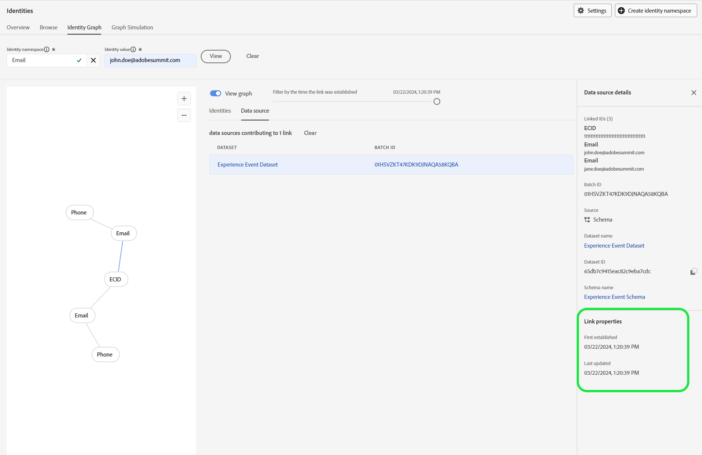

# 身份标识图链接规则故障排除指南

>[!AVAILABILITY]
>
>标识图链接规则当前处于“有限可用”状态。 有关如何访问开发沙盒中的功能的信息，请与您的Adobe客户团队联系。

在测试和验证身份图形链接规则时，您可能会遇到一些与数据摄取和图形行为相关的问题。 请阅读本文档，了解如何解决您在使用身份图链接规则时可能遇到的一些常见问题。

## 数据摄取流概述 {#data-ingestion-flow-overview}

下图是数据如何流入Adobe Experience Platform和应用程序的简化表示形式。 使用此图表作为参考，以帮助您更好地了解此页面的内容。


请务必注意以下因素：

* 对于流式传输数据，Real-time Customer Profile、Identity Service和Data Lake将在数据发送后开始处理数据。 但是，完成数据处理所需的延迟取决于该服务。 通常，与个人资料和身份相比，数据湖处理时间更长。
   * 如果即使在数小时后，对数据集运行查询时仍未显示数据，则数据可能未摄取到Experience Platform中。
* 对于批处理数据，所有数据将先流入数据湖，然后如果为配置文件和身份启用数据集，数据将传播到配置文件和身份。
* 对于摄取相关问题，请务必在服务级别隔离问题，以便进行准确调试和故障排除。 需要考虑三种潜在问题类型：

| 摄取问题类型 | 数据是否会摄取到数据湖中？ | 数据是否会摄取到配置文件中？ | 数据是否会在Identity Service中引入？ |
| --- | --- | --- | --- |
| 常规摄取问题 | 否 | 否 | 否 |
| 图表问题 | 是 | 是 | 否 |
| 配置文件片段问题 | 是 | 否 | 是 |

## 数据摄取问题 {#data-ingestion-issues}

>[!NOTE]
>
>* 此部分假设数据已成功摄取到Data Lake中，并且没有语法或其他错误会阻止数据首先被摄取到Experience Platform中。
>
>* 这些示例使用ECID作为Cookie命名空间，使用CRMID作为人员命名空间。

### 我的身份未摄取到Identity服务{#my-identities-are-not-getting-ingested-into-identity-service}

发生这种情况的原因有多种，包括但不限于以下各项：

* [未为配置文件](../../catalog/datasets/enable-for-profile.md)启用数据集。
* 跳过该记录，因为事件中只有一个标识。
* [身份服务中发生验证失败](../guardrails.md#identity-value-validation)。
   * 例如，ECID可能超过最大长度38个字符。
* 默认情况下，[AAID被阻止引入](../guardrails.md#identity-namespace-ingestion)。
* 身份因[系统护栏](../guardrails.md#understanding-the-deletion-logic-when-an-identity-graph-at-capacity-is-updated)而被删除。

在身份图链接规则的上下文中，可能会拒绝来自Identity Service的记录，因为传入事件具有两个或多个具有相同唯一命名空间但身份值不同的身份。 这种情况通常因实施错误而发生。

用两个假设来考虑以下事件：

1. 字段名称CRMID标记为具有命名空间CRMID的标识。
2. 命名空间CRMID被定义为唯一的命名空间。

以下事件将返回一条错误消息，指示引入失败。

<!-- because the ingestion of this erroneous event would have resulted in graph collapse. In the following event, two entities (Alice and Bob) are both associated with the same namespace (CRMID). -->

```json
{ 
  "_id": "random_string", 
  "eventType": "web browsing event", 
  "identityMap": { 
    "ECID": [ 
      { 
        "id": "11111111111111111111111111111111111111", 
        "primary": false 
      } 
    ], 
    "CRMID": [ 
      { 
        "id": "Alice", 
        "primary": true 
      } 
    ] 
  }, 
  "CRMID": "Bob", 
  "timestamp": "2024-08-17T15:22:51+00:00", 
  "web": { 
    "webPageDetails": { 
      "URL": "https://www.adobe.com/acrobat.html", 
      "name": "Adobe Acrobat" 
    } 
  } 
} 
```

**疑难解答步骤**

要解决此错误，必须首先收集以下信息：

* 您应在身份图表中摄取的身份值(`identity_value`)。
* 发送事件的数据集(`dataset_name`)。

接下来，使用[Adobe Experience Platform查询服务](../../query-service/home.md)并运行以下查询：

>[!TIP]
>
>将`dataset_name`和`identity_value`替换为您收集的信息。

```sql
  SELECT key, col.id as identityValue, timestamp, _id, identityMap, * 
  FROM (SELECT key, explode(value), * 
  FROM (SELECT explode(identityMap), * 
  FROM dataset_name)) WHERE col.id = 'identity_value' 
```

运行查询后，查找预期生成图形的事件记录，然后验证同一行中的标识值是否不同。 查看以下图像的示例：


>[!NOTE]
>
>如果两个身份完全相同，并且事件是通过流式摄取的，则身份和配置文件都将删除重复身份。

### 身份验证后ExperienceEvents被归因于错误的身份验证配置文件

命名空间优先级在事件片段确定主要身份的方式中发挥重要作用。

* 配置并保存给定沙盒的[身份设置](./identity-settings-ui.md)后，配置文件将使用[命名空间优先级](namespace-priority.md#real-time-customer-profile-primary-identity-determination-for-experience-events)确定主要身份。 在使用identityMap时，配置文件将不再使用`primary=true`标志。
* 虽然配置文件将不再引用此标记，但Experience Platform上的其他服务可能会继续使用`primary=true`标记。

为了将[经过身份验证的用户事件](implementation-guide.md#ingest-your-data)绑定到人员命名空间，所有经过身份验证的事件都必须包含人员命名空间(CRMID)。 这意味着即使用户登录后，人员命名空间仍必须存在于每个已验证的事件中。

在配置文件查看器中查找配置文件时，您可能会继续看到`primary=true`个“事件”标记。 但是，这将被忽略并且不会被配置文件使用。

默认情况下，会阻止AAID。 因此，如果您使用的是[Adobe Analytics源连接器](../../sources/tutorials/ui/create/adobe-applications/analytics.md)，则必须确保ECID的优先级高于ECID，以便未经身份验证的事件将具有ECID的主标识。

**疑难解答步骤**

1. 要验证经过身份验证的事件是否同时包含人员和Cookie命名空间，请阅读[中有关未摄取到Identity服务的数据的错误疑难解答部分概述的步骤](#my-identities-are-not-getting-ingested-into-identity-service)。
2. 要验证经过身份验证的事件是否具有人员命名空间的主要身份（例如CRMID），请使用无拼接合并策略（这是不使用专用图的合并策略）在配置文件查看器中搜索人员命名空间。 此搜索将仅返回与人员命名空间关联的事件。

### 我的体验事件片段未摄取到配置文件 {#my-experience-event-fragments-are-not-getting-ingested-into-profile}

您的体验事件片段未摄取到配置文件中的原因有多种，包括但不限于：

* [未为配置文件](../../catalog/datasets/enable-for-profile.md)启用数据集。
* [配置文件](../../xdm/classes/experienceevent.md)上可能发生了验证失败。
   * 例如，体验事件必须同时包含`_id`和`timestamp`。
   * 此外，每个事件（记录）的`_id`必须是唯一的。

在命名空间优先级上下文中，配置文件将拒绝任何包含两个或更多具有最高命名空间优先级的身份的事件。 例如，如果GAID未标记为唯一的命名空间，并且有两个同时具有GAID命名空间和不同的标识值的标识，则Profile将不存储任何事件。

**疑难解答步骤**

如果您的数据被发送到Data Lake，但未发送到Profile，并且您认为这是因为在单个事件中发送了两个或更多具有最高命名空间优先级的身份，则可以运行以下查询来验证是否针对同一命名空间发送了两个不同的身份值：

>[!TIP]
>
>在以下查询中，您必须：
>
>* 将`_testimsorg.identification.core.email`替换为发送标识的路径。
>* 将`Email`替换为具有最高优先级的命名空间。 这是未被摄取的相同命名空间。
>* 将`dataset_name`替换为您要查询的数据集。

```sql
  SELECT identityMap, key, col.id as identityValue, _testimsorg.identification.core.email, _id, timestamp 
  FROM (SELECT key, explode(value), * 
  FROM (SELECT explode(identityMap), * 
  FROM dataset_name)) WHERE col.id != _testimsorg.identification.core.email and key = 'Email' 
```

此查询假定：

* 一个标识从identityMap发送，另一个标识从标识描述符发送。 **注意**：在Experience Data Model (XDM)架构中，身份描述符是标记为身份的字段。
* CRMID通过identityMap发送。 如果CRMID作为字段发送，请从WHERE子句中删除`key='Email'`。

## 与图表行为相关的问题 {#graph-behavior-related-issues}

本节概述您可能会遇到的有关身份图行为方式的常见问题。

### 未经身份验证的ExperienceEvents被附加到错误的已身份验证配置文件

标识优化算法将执行[最近建立的链接并删除最早的链接](./identity-optimization-algorithm.md#identity-optimization-algorithm-details)。 因此，启用此功能后，可以将ECID从一个人重新分配（重新链接）到另一个人。 要了解标识如何随时间链接的历史记录，请执行以下步骤：

**疑难解答步骤**

>[!NOTE]
>
>以下步骤将根据以下假设检索信息：
>
>* 单个数据集正在使用中（这不会查询多个数据集）。
>
>* 由于[高级数据生命周期管理](../../hygiene/home.md)、[Privacy Service](../../privacy-service/home.md)或执行删除的其他服务删除了数据，因此数据不会从数据湖中删除。

首先，您必须收集以下信息：

1. 已发送的Cookie命名空间（例如ECID）和人员命名空间（例如CRMID）的标识符号(namespaceCode)。
1.1.对于Web SDK实施，这些通常是identityMap中包含的命名空间。
1.2.对于Analytics源连接器实施，这些是identityMap中包含的Cookie标识符。 人员标识符是标记为身份的eVar字段。
2. 在中发送事件的数据集(dataset_name)。
3. 要查找的Cookie命名空间的身份值(identity_value)。

身份符号(namespaceCode)区分大小写。 要检索identityMap中给定数据集的所有标识符号，请运行以下查询：

```sql
SELECT distinct explode(*)FROM (SELECT map_keys(identityMap) FROM dataset_name)
```

如果您不知道Cookie标识符的标识值，并且希望搜索已链接到多个人员标识符的Cookie ID，则必须运行以下查询。 此查询假定ECID作为Cookie命名空间，CRMID作为人员命名空间。

>[!BEGINTABS]

>[!TAB Web SDK实现]

```sql
  SELECT identityMap['ECID'][0]['id'], count(distinct identityMap['CRMID'][0]['id']) as crmidCount FROM dataset_name GROUP BY identityMap['ECID'][0]['id'] ORDER BY crmidCount desc 
```

>[!TAB Analytics源连接器实施]

```sql
  SELECT identityMap['ECID'][0]['id'], count(distinct personID) as crmidCount FROM dataset_name group by identityMap['ECID'][0]['id'] ORDER BY crmidCount desc 
```

**注意：**&#x200B;人员ID引用描述符的路径。 您可以在架构下找到此信息。

>[!ENDTABS]

现在，您已识别链接到多个人员ID的Cookie值，请从结果中获取一个，并在以下查询中使用它来获取有关该Cookie值何时链接到其他人员ID的时间顺序视图：

>[!BEGINTABS]

>[!TAB Web SDK实现]

```sql
  SELECT identityMap['CRMID'][0]['id'] as personEntity, * 
  FROM dataset_name 
  WHERE identitymap['ECID'][0].id ='identity_value' 
  ORDER BY timestamp desc 
```

>[!TAB Analytics源连接器实施]

```sql
SELECT _experience.analytics.customDimensions.eVars.eVar10 as personEntity, * 
FROM dataset_name 
WHERE identitymap['ECID'][0].id ='identity_value' 
ORDER BY timestamp desc 
```

**注意**：此示例假定`eVar10`被标记为身份。 对于您的配置，必须根据您自己组织的实施更改eVar。

>[!ENDTABS]

### 身份优化算法未按预期“工作”

**疑难解答步骤**

请参阅有关[标识优化算法](./identity-optimization-algorithm.md)的文档，以及支持的图形结构类型。

* 有关支持的图形结构的示例，请阅读[图形配置指南](./example-configurations.md)。
* 您还可以阅读[实施指南](./implementation-guide.md#appendix)以了解不支持的图形结构的示例。 有两种情况可能会发生：
   * 您的所有配置文件中没有单个命名空间。
   * 出现[“挂起ID”](./implementation-guide.md#dangling-loginid-scenario)方案。 在此方案中，Identity Service无法确定挂起ID是否与图形中的任何人员实体相关联。

您还可以使用UI](./graph-simulation.md)中的[图形模拟工具来模拟事件并配置您自己的唯一命名空间和命名空间优先级设置。 这样做有助于您基本了解身份优化算法的行为。

如果仿真结果符合图形行为预期，则可以检查[身份设置](./identity-settings-ui.md)是否与您在模拟中配置的设置匹配。

### 即使在配置身份设置后，我仍会在沙盒中看到折叠的图形

在保存设置后&#x200B;_身份图形将遵循您配置的唯一命名空间和命名空间优先级_。 任何在&#x200B;_之前存在_&#x200B;的“折叠”图形都不会受到影响，除非引入新数据以更新折叠的图形。 即使命名空间优先级发生更改，实时客户配置文件上事件片段的主要标识也不会更新。

**疑难解答步骤**

您可以使用[身份图形查看器](../features/identity-graph-viewer.md)来检查您的图形是在设置之前还是之后摄取。 检查[!UICONTROL 链接属性]下的上次更新时间戳，以查看Identity Service何时摄取该图形。 如果时间戳在配置之前，则表示在启用该功能之前创建了“折叠”图。



### 我想知道我的沙盒中有多少个“折叠”的图表

使用身份仪表板可以查看身份图的状态，如身份计数和图形。 请参阅量度“具有多个命名空间的图形计数”，了解已折叠的图形计数 — 这些图形包含两个或多个具有相同命名空间的身份。 假定沙盒没有数据，并且您已将命名空间（例如CRMID）配置为唯一，则预期应存在具有两个或更多CRMID的零个图形。 在下面的示例中，有两个包含两个或更多电子邮件地址的图表。


通过运行以下查询，您可以在Data Lake的[配置文件快照导出数据集](../../dashboards/query.md)中找到详细细分：

>[!NOTE]
>
>* 将`dataset_name`替换为数据集的实际名称。
>
>* 这些数量可能并不完全匹配。 身份仪表板基于身份图计数，以下查询基于具有两个或多个身份的配置文件计数。 数据由服务独立处理和更新。

```sql
  SELECT key, identityCountInGraph, count(identityCountInGraph) as graphCount 
  FROM (SELECT key, cardinality(value) as identityCountInGraph 
  FROM (SELECT explode(identityMap) 
  FROM dataset_name 
  WHERE cardinality(identityMap) > 1)) /* by definition, graphs have 2 or more identities */ 
  WHERE key not in ('ecid', 'aaid', 'idfa', 'gaid') /* filter out common device/cookie namespaces */ 
  GROUP BY 1, 2 
  ORDER BY 1, 2 asc 
```

您可以在配置文件快照导出数据集中使用以下查询，以从“折叠”的图形获取示例身份。

```sql
  SELECT identityMap 
  FROM dataset_name 
  WHERE cardinality(identityMap['CRMID'])>1 /* any graphs with 2+ CRMID. Change CRMID namespace if needed */ 
```

>[!TIP]
>
>如果没有为共享设备临时方法启用沙盒，上面列出的两个查询将产生预期结果，并且其行为与标识图链接规则有所不同。

## 常见问题解答 {#faq}

本节概述了有关身份图关联规则的常见问题解答列表。

## 身份标识优化算法 {#identity-optimization-algorithm}

请阅读本节以获取有关[标识优化算法](./identity-optimization-algorithm.md)的常见问题解答。

### 我的每个业务单元都有一个CRMID(B2C CRMID、B2B CRMID)，但我的所有配置文件中没有唯一的命名空间。 如果我将B2C CRMID和B2B CRMID标记为唯一，并启用我的身份设置，会出现什么情况？

此方案不受支持。 因此，当用户使用其B2C CRMID登录，而另一个用户使用其B2B CRMID登录时，您可能会看到图形折叠。 有关详细信息，请阅读实施页面中有关[单一人员命名空间要求](./implementation-guide.md#single-person-namespace-requirement)的部分。

### 标识优化算法是否“修复”现有的折叠图？

只有在保存新设置后更新现有折叠图形时，这些图形才会受图形算法影响（“固定”）。

### 如果两个用户使用同一设备登录和注销，则事件会发生什么情况？ 所有事件都将转移到最后一个经过身份验证的用户吗？

* 匿名事件（在Real-Time Customer Profile上将ECID作为主标识的事件）将传输给最后一个经过身份验证的用户。 这是因为ECID将链接到最后一个经过身份验证的用户的CRMID（在Identity Service上）。
* 所有已验证的事件（CRMID定义为主身份的事件）将保留在人员内。

有关详细信息，请阅读有关[确定体验事件](../identity-graph-linking-rules/namespace-priority.md#real-time-customer-profile-primary-identity-determination-for-experience-events)的主要标识的指南。

### 当ECID从一个人转移到另一个人时，Adobe Journey Optimizer中的旅程会受到什么影响？

上次通过身份验证的用户的CRMID将链接到ECID（共享设备）。 可以根据用户行为将ECID从一个人重新分配给另一个人。 影响将取决于历程的构建方式，因此客户在开发沙盒环境中测试历程以验证行为非常重要。

要强调的要点如下：

* 用户档案进入历程后，ECID重新分配不会导致用户档案在历程中间退出。
   * 图形更改不会触发历程退出。
* 如果配置文件不再与ECID关联，则当存在使用受众鉴别的条件时，这可能会导致更改历程路径。
   * ECID删除可能会更改与用户档案关联的事件，这可能导致受众资格发生更改。
* 历程的重新进入取决于历程属性。
   * 如果禁用历程的重新进入，则一旦某个配置文件从该历程退出，则同一配置文件将在91天内不会重新进入（基于全局历程超时）。
* 如果历程以ECID命名空间开始，则进入的用户档案和收到操作的用户档案(例如 电子邮件、选件)可能会有所不同，具体取决于旅程的设计方式。
   * 例如，如果操作之间存在等待条件，并且在等待期间传输ECID，则可能会定向不同的配置文件。
   * 利用此功能，ECID不再总是与一个配置文件关联。
   * 建议使用人员命名空间(CRMID)开始历程。

>[!TIP]
>
>历程应查找具有唯一命名空间的配置文件，因为会将非唯一命名空间重新分配给另一个用户。
>
>* ECID和非唯一电子邮件/电话命名空间可能会从一个人移动到另一个人。
>* 如果历程具有等待条件，并且使用这些非唯一命名空间在历程中查找用户档案，则历程消息可能会发送给错误的人员。

## 命名空间优先级

请阅读本节以获取有关[命名空间优先级](./namespace-priority.md)的常见问题解答。

### 我已启用我的身份设置。 如果在启用设置后添加自定义命名空间，我的设置会发生什么情况？

存在两个命名空间的“存储桶”：人员命名空间和设备/Cookie命名空间。 新创建的自定义命名空间在每个“存储段”中的优先级最低，因此这个新的自定义命名空间不会影响现有的数据摄取。

### 如果Real-time Customer Profile不再使用identityMap上的“primary”标记，是否仍需要发送此值？

是，identityMap上的“主要”标志由其他服务使用。 有关详细信息，请阅读关于[命名空间优先级对其他Experience Platform服务的影响](../identity-graph-linking-rules/namespace-priority.md#implications-on-other-experience-platform-services)的指南。

### 命名空间优先级是否适用于实时客户配置文件中的配置文件记录数据集？

不会。命名空间优先级将仅适用于使用XDM ExperienceEvent类的体验事件数据集。

### 此功能如何与每个图50个身份的身份图护栏一起使用？ 命名空间优先级是否会影响此系统定义的护栏？

首先应用身份优化算法，保证人物实体的表达； 之后，如果图形尝试超过[标识图形护栏](../guardrails.md)（每个图形50个标识），则将应用此逻辑。 命名空间优先级不会影响50身份/图形护栏的删除逻辑。

## 测试

有关测试和调试身份图关联规则中功能的常见问题解答，请阅读此部分。

### 我应该在开发沙盒环境中测试哪些场景？

通常，在开发沙盒上测试应模拟您打算在生产沙盒上执行的用例。 在执行全面测试时，请参阅下表以了解要验证的一些关键方面：

| 测试用例 | 测试步骤 | 预期结果 |
| --- | --- | --- |
| 准确的人员实体表示 | <ul><li>模拟匿名浏览</li><li>模拟两个人(John、Jane)使用同一设备登录</li></ul> | <ul><li>John和Jane都应该与其属性和经过身份验证的事件相关联。</li><li>应将上次经过身份验证的用户与匿名浏览事件关联。</li></ul> |
| 区段 | 创建四个区段定义（**注意**：每对区段定义应该使用批处理评估一个，使用另一个流评估。） <ul><li>区段定义A：基于John的已验证事件和/或属性的区段鉴别。</li><li>区段定义B：基于Jane的已验证事件和/或属性的区段鉴别。</li></ul> | 无论共享设备情况如何，John和Jane都应始终符合各自区段的条件。 |
| Adobe Journey Optimizer上的受众资格/单一历程 | <ul><li>创建以受众资格活动（如上面创建的流分段）开始的历程。</li><li>创建以单一事件开始的历程。 此单一事件应为经过身份验证的事件。</li><li>创建这些历程时，必须禁用重新进入。</li></ul> | <ul><li>无论共享设备情况如何，John和Jane都应触发他们应输入的相应历程。</li><li>当ECID传回给John和Jane后，他们不应重新进入历程。</li></ul> |

{style="table-layout:auto"}

### 如何验证此功能是否按预期工作？

使用[图形模拟工具](./graph-simulation.md)验证该功能是否在单个图形级别工作。

要在沙盒级别验证该功能，请参阅身份仪表板中的[!UICONTROL 具有多个命名空间的Graph计数]部分。