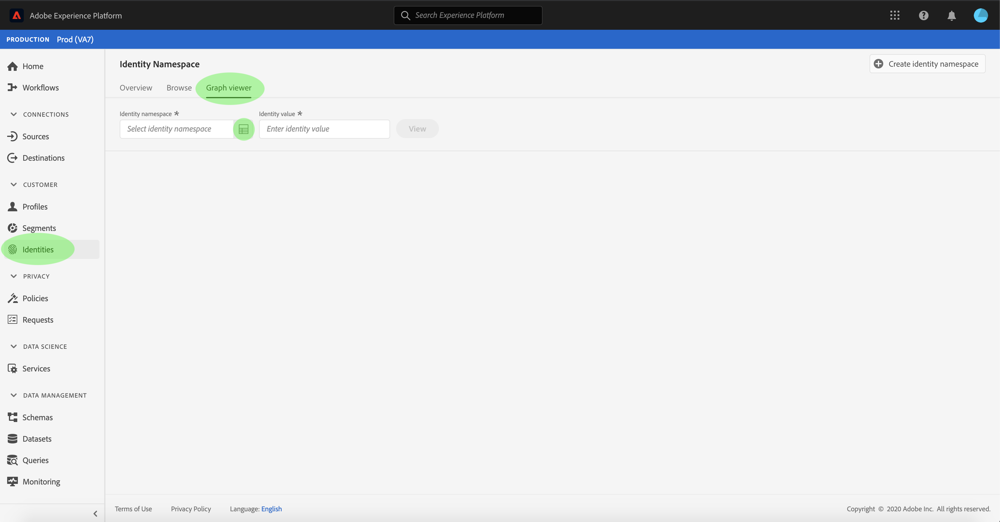
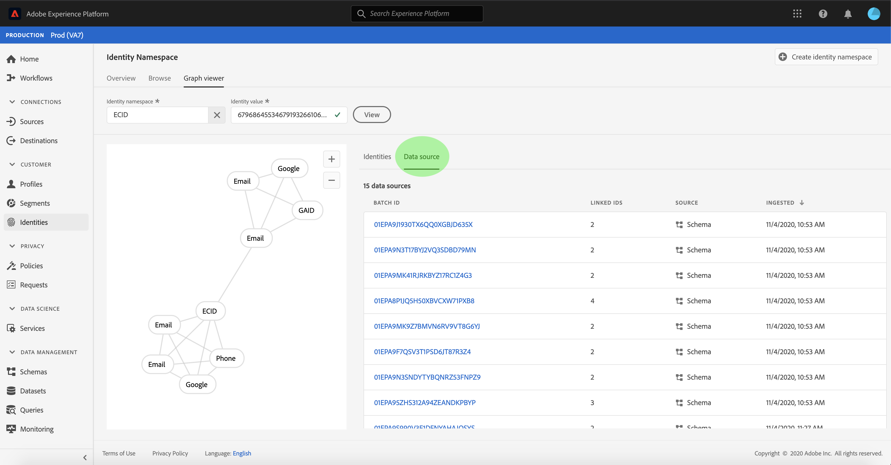
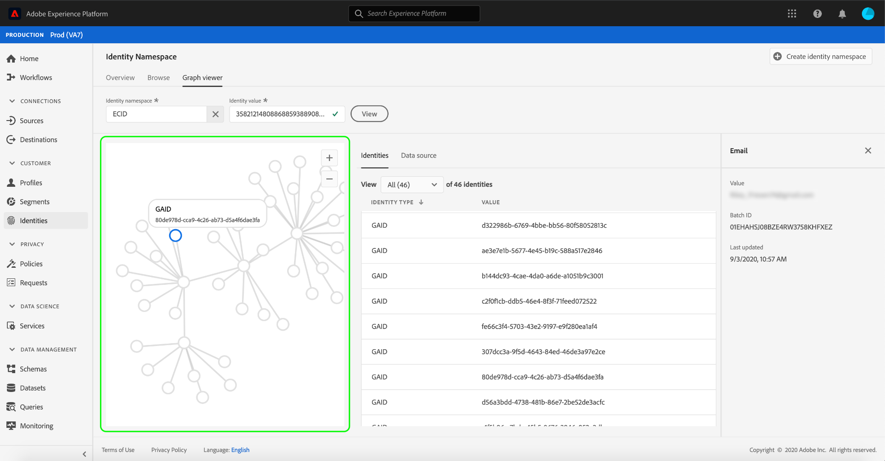

# （测试版）标识图查看器

>[!NOTE]
>
>标识图查看器当前处于测试版中。 其功能可能会发生变化。

标识图是特定客户不同标识之间关系的映射，可直观地展示客户如何跨不同渠道与品牌互动。 所有客户身份图均由Adobe Experience Platform身份服务以响应客户活动的方式近期实时进行集体管理和更新。

通过平台用户界面中的标识图查看器，您可以直观地了解哪些客户标识是拼接在一起的，以及以哪些方式拼接在一起。 查看器允许您拖动图形的不同部分并与之交互，从而检查复杂的身份关系、更高效地调试并从信息利用方式提高的透明度中受益。

## 入门指南

使用标识图查看器需要了解涉及的各种Adobe Experience Platform服务。 在开始使用标识图查看器之前，请查看以下服务的相关文档：

- [[!DNL Identity Service]](../home.md):通过跨设备和系统桥接身份，更好地视图个别客户及其行为。

### 术语

- **标识（节点）:** 标识或节点是实体（通常是人）特有的数据。 标识由命名空间和标识值组成。
- **链接（边缘）:** 链接或边缘表示标识之间的连接。
- **图形（群集）:** 图形或群集是代表人的一组身份和链接。

## 访问标识图查看器

要在UI中使用标识图查看器，请在左侧导 **[!UICONTROL 航中]** 选择标识，然后选择 **[!UICONTROL 标识图表选]** 项卡。 在“标 **[!UICONTROL 识命名空间]** ”屏幕中，单 **[!UICONTROL 击“选择标识命名空间]** ”图标以搜索要使用的命名空间。

出现 **[!UICONTROL “选择身份命名空间]** ”面板。 此屏幕包含可供您的组织使用的列表 **[!UICONTROL ，包括有关命名空间的显]**&#x200B;示名称 **[!UICONTROL 、]**&#x200B;标识符 **[!UICONTROL 、所有]**&#x200B;者 **[!UICONTROL 、LastUpdatedDate、]******&#x200B;命名空间和的信息。 只要您有有效的标识值连接到它们，就可以使用提供的任何命名空间。

选择要使用的命名空间，然后单击“ **[!UICONTROL 选择]** ”继续。

选择命名空间后，在“标识值”文本框中为特定客户输 **[!UICONTROL 入其相应]** 值，然后选择 **[!UICONTROL 视图]**。

将显示标识图查看器。 屏幕左侧是标识图，显示与您选择的命名空间链接的所有标识以及您输入的标识值。 每个标识节点都包含一个命名空间及其对应的ID值。 您可以选择并保留任何标识以拖动图形并与其交互。 或者，您也可以将鼠标悬停在某个标识上，以查看有关其ID值的信息。 图形输出也以表格列表显示在屏幕的中央。

>[!IMPORTANT]
>
>身份图需要至少两个链接身份才能生成，以及有效的命名空间和ID对。 图形查看器可显示的最大身份数为400。 有关详细 [信息](#appendix) ，请参阅下面的附录部分。

选择标识以更新“标识”表上高亮显 **[!UICONTROL 示的行]** ，并更新右边栏上提供的信息，该信息包括标识的 **[!UICONTROL Value]**、 **[!UICONTROL Batch ID]**，以及其上次更 **** 新的日期。

您可以通过图形进行筛选，并使用“标识”(Identities)表顶部的排序选项隔离特 **[!UICONTROL 定命名空间]** 。 从下拉菜单中，选择要突出显示的命名空间。

图形查看器返回，突出显示您选择的命名空间。 过滤器选项还更新“ **[!UICONTROL 身份]** ”表，以仅返回您选定命名空间的信息。

图形查看器框的右上方包含放大选项。 选择 **(+)图** 标可放大图形，或 **** 选择(-)图标可缩小图形。

您可以通过从标题中选择数据源来视图有 **[!UICONTROL 关批的]** 更多信息。 “数 **[!UICONTROL 据源]** ”表显示与图 **[!UICONTROL 形关联的批ID]** 列表，以及 **[!UICONTROL 其链接ID]**、源模式和摄取日期。

您可以选择标识图中的任何链接，以查看贡献到该链接的所有源批。

或者，您可以选择一个批来查看此批贡献的所有链接。

通过标识图查看器也可以访问具有较大标识簇的标识图。

## 附录

如果不满足以下先决条件，图形查看器将返回错误：

- 所选命名空间中不存在标识值。
- 这个图只有两个身份。
- 该图超过400个最大身份。
- 您处于非生产沙箱环境。

## 后续步骤

通过阅读此文档，您学习了如何在平台UI中浏览客户的身份图。 有关平台中身份的更多信息，请参阅身份 [服务概述](../home.md)