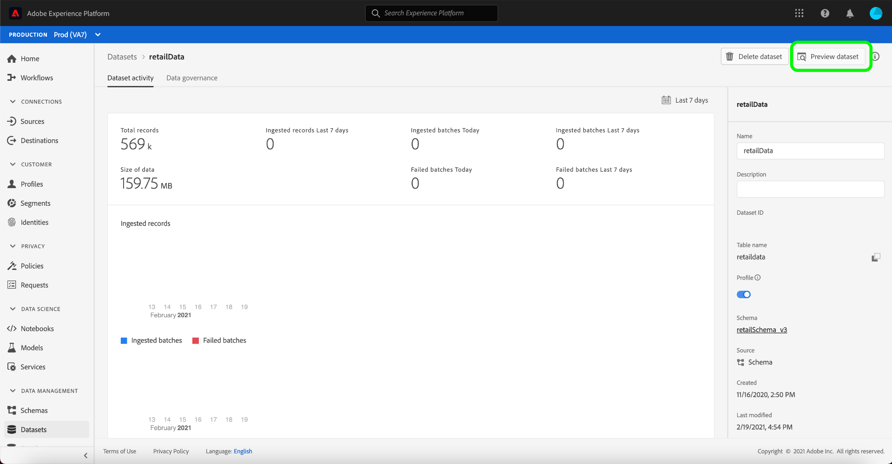

# Identity Graph查看器概述

身份图是特定客户不同身份之间关系的映射，可直观地展示不同渠道中客户如何与您的品牌互动。 Adobe Experience Platform Identity Service几乎实时地集体管理和更新所有客户身份图，以响应客户活动。

平台用户界面中的标识图形查看器使您能够可视化并更好地了解哪些客户标识是通过何种方式拼接在一起的。 查看器允许您拖动图形的不同部分并与它们交互，允许您检查复杂的身份关系、更高效地调试并从信息利用方式提高的透明度中受益。

## 教程视频

以下视频旨在支持您对身份图查看器的了解。

>[!VIDEO](https://video.tv.adobe.com/v/331030/?quality=12&learn=on)

## 入门指南

使用标识图查看器需要了解所涉及的各种Adobe Experience Platform服务。 在开始使用标识图查看器之前，请查看以下服务的文档：

- [[!DNL Identity Service]](../home.md):通过跨设备和系统连接身份，更好地视图个别客户及其行为。

### 术语

- **标识（节点）：标** 识或节点是实体（通常是个人）特有的数据。标识由命名空间和标识值组成。
- **链接（边缘）：** 链接或边缘表示标识之间的连接。
- **图（群集）：** 图或群集是一组代表人的身份和链接。

## 访问标识图查看器

要在UI中使用标识图查看器，请在左侧导航中选择&#x200B;**[!UICONTROL Identities]**，然后选择&#x200B;**[!UICONTROL Identity graph]**&#x200B;选项卡。 在&#x200B;**[!UICONTROL Identity Namespace]**&#x200B;屏幕中，单击&#x200B;**[!UICONTROL Select identity namespace]**&#x200B;图标以搜索要使用的命名空间。

出现&#x200B;**[!UICONTROL Select identity namespace]**&#x200B;面板。 此屏幕包含可用于您的组织的列表命名空间，包括有关命名空间的&#x200B;**[!UICONTROL Display name]**、**[!UICONTROL Identity symbol]**、**[!UICONTROL Owner]**、**[!UICONTROL Last updated]**&#x200B;日期和&#x200B;**[!UICONTROL Description]**&#x200B;的信息。 只要您有有效的标识值连接到它们，就可以使用提供的任何命名空间。

选择要使用的命名空间，然后单击&#x200B;**[!UICONTROL Select]**&#x200B;继续。

选择命名空间后，在&#x200B;**[!UICONTROL Identity value]**&#x200B;文本框中为特定客户输入相应的值，然后选择&#x200B;**[!UICONTROL View]**。

### 从数据集访问标识图查看器

您还可以使用数据集界面访问标识图查看器。 从数据集[!UICONTROL Browse]页中，选择要与之交互的数据集，然后选择&#x200B;**[!UICONTROL Preview dataset]**

从“预览”窗口中，选择一个指纹图标，以查看通过标识图查看器表示的身份。

>[!TIP]
>
>仅当数据集具有两个或多个身份时，才显示指纹图标。

将显示标识图查看器。 屏幕左侧是标识图，显示与您选择的命名空间链接的所有标识以及您输入的标识值。 每个标识节点都由一个命名空间及其对应的ID值组成。 您可以选择并按住任何标识以拖动图形并与其交互。 或者，您也可以将鼠标悬停在某个标识上，以查看有关其ID值的信息。 图形输出也会显示为屏幕中心的嵌入列表。

>[!IMPORTANT]
>
>标识图需要至少两个链接的标识来生成，以及有效的命名空间和ID对。 图表查看器可显示的最大身份数为150。 有关详细信息，请参见下面的[附录](#appendix)部分。

选择标识以更新&#x200B;**[!UICONTROL Identities]**&#x200B;表上高亮显示的行，并更新右边栏上提供的信息，该信息包括标识的&#x200B;**[!UICONTROL Value]**、**[!UICONTROL Batch ID]**&#x200B;及其&#x200B;**[!UICONTROL Last updated]**&#x200B;日期。

您可以通过图表进行筛选，并使用&#x200B;**[!UICONTROL Identities]**&#x200B;表顶部的排序选项隔离特定命名空间。 从下拉菜单中，选择要突出显示的命名空间。

图形查看器返回，突出显示您选择的命名空间。 过滤器选项还更新&#x200B;**[!UICONTROL Identities]**&#x200B;表，以仅返回您选择的命名空间的信息。

图表查看器框的右上角包含放大选项。 选择&#x200B;**(+)**&#x200B;图标可放大图形，或选择&#x200B;**(-)**&#x200B;图标可缩小。

您可以通过从题头中选择&#x200B;**[!UICONTROL Data source]**&#x200B;来视图有关批的详细信息。 **[!UICONTROL Data source]**&#x200B;表显示与图形关联的&#x200B;**[!UICONTROL Batch IDs]**&#x200B;的列表，以及其&#x200B;**[!UICONTROL Linked IDs]**、源模式和摄取日期。

您可以选择标识图中的任何链接，以查看贡献到该链接的所有源批。

或者，您可以选择一个批，以查看此批贡献的所有链接。

通过标识图查看器还可以访问具有较大标识簇的标识图。

## 附录

以下部分提供了有关使用标识图查看器的其他信息。

### 了解错误消息

访问标识图查看器时可能会发生错误。 以下是使用标识图查看器时要注意的先决条件和限制的列表。

- 选定命名空间中必须存在标识值。
- 要生成标识图查看器，至少需要两个链接标识。 可能只有一个标识值且没有链接的标识，在这种情况下，该值仅存在于[!DNL Profile]查看器中。
- 标识图查看器不能超过150个标识。

## 后续步骤

通过阅读此文档，您学习了如何在平台UI中浏览客户的标识图。 有关平台中身份的详细信息，请参阅[Identity Service概述](../home.md)

## Changelog

| Date | 操作 |
| ---- | ------ |
| 2021-01 | <ul><li>增加了对流式收录的数据和非生产沙箱的支持。</li><li>若干小错误修复。</li></ul> |
| 2021-02 | <ul><li>可通过数据集预览访问标识图查看器。</li><li>若干小错误修复。</li><li>“Identity Graph viewer”（标识图查看器）设为“Generally Available”（一般可用）。</li></ul> |
