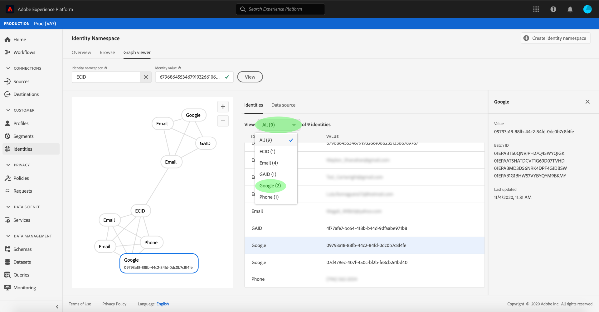

# 身份图查看器概述

身份图是特定客户不同身份之间关系的映射，可直观地展示客户如何跨不同渠道与您的品牌进行交互。 所有客户身份图表都由Adobe Experience Platform Identity Service近乎实时地进行集体管理和更新，以响应客户活动。

通过Platform用户界面中的身份图查看器，您可以可视化并更好地了解将哪些客户身份拼合在一起，以及以哪些方式拼合在一起。 查看器允许您拖动图形的不同部分并与之交互，从而允许您检查复杂的身份关系、更高效地进行调试，并从信息的使用方式提高透明度中受益。

## 教程视频

以下视频旨在支持您对身份图查看器的了解。

>[!VIDEO](https://video.tv.adobe.com/v/331030/?quality=12&learn=on)

## 快速入门

使用身份图查看器需要了解所涉及的各种Adobe Experience Platform服务。 在开始使用身份图查看器之前，请查阅以下服务的文档：

- [[!DNL Identity Service]](../home.md):通过跨设备和系统桥接身份，更好地了解各个客户及其行为。

### 术语

- **身份（节点）：** 身份或节点是实体（通常为人员）特有的数据。 标识由命名空间和标识值组成。
- **链接（边缘）：** 链接或边缘表示标识之间的连接。
- **图形（集群）：** 图形或群集是一组表示人员的身份和链接。

## 访问身份图查看器

要在UI中使用身份图查看器，请选择 **[!UICONTROL 标识]** ，然后选择 **[!UICONTROL 身份图]** 选项卡。 从 **[!UICONTROL 身份命名空间]** 屏幕，单击 **[!UICONTROL 选择身份命名空间]** 图标来搜索您打算使用的命名空间。

的 **[!UICONTROL 选择身份命名空间]** 中。 此屏幕包含贵组织可用的命名空间列表，包括有关命名空间的 **[!UICONTROL 显示名称]**, **[!UICONTROL 身份符号]**, **[!UICONTROL 所有者]**, **[!UICONTROL 上次更新时间]** 日期和 **[!UICONTROL 描述]**. 您可以使用提供的任何命名空间，前提是已将有效的标识值连接到这些命名空间。

选择要使用的命名空间，然后单击 **[!UICONTROL 选择]** 以继续。

选择命名空间后，请在 **[!UICONTROL 标识值]** 文本框和选择 **[!UICONTROL 查看]**.

### 从数据集访问身份图查看器

您还可以使用数据集界面访问身份图查看器。 从数据集 [!UICONTROL 浏览] ，选择要与之交互的数据集，然后选择 **[!UICONTROL 预览数据集]**

从预览窗口中，选择一个指纹图标，以查看通过身份图查看器表示的身份。

>[!TIP]
>
>仅当数据集具有两个或更多标识时，才会显示指纹图标。

此时将显示身份图查看器。 屏幕左侧是标识图，用于显示链接到您选择的命名空间和您输入的标识值的所有标识。 每个标识节点都包含一个命名空间及其相应的ID值。 您可以选择并按住任何标识以拖动图形并与其交互。 或者，您也可以将鼠标悬停在标识上以查看有关其ID值的信息。 图形输出也作为表列表显示在屏幕的中央。

>[!IMPORTANT]
>
>标识图需要至少生成两个链接的标识，以及有效的命名空间和ID对。 图形查看器可显示的最大身份数为150。 请参阅 [附录](#appendix) 部分以了解更多信息。

选择标识以更新 **[!UICONTROL 标识]** 表格和用于更新在右边栏上提供的信息，该信息包括标识 **[!UICONTROL 值]**, **[!UICONTROL 批处理ID]**，及其 **[!UICONTROL 上次更新时间]** 日期。

您可以在图表中进行过滤，并使用 **[!UICONTROL 标识]** 表。 从下拉菜单中，选择要突出显示的命名空间。

图形查看器返回，突出显示您选择的命名空间。 过滤器选项还会更新 **[!UICONTROL 标识]** 表以仅返回您选择的命名空间的信息。

图形查看器框的右上角包含放大选项。 选择 **(+)** 图标以放大图表或 **(-)** 图标来缩小。

您可以通过选择 **[!UICONTROL 数据源]** 中。 的 **[!UICONTROL 数据源]** 表格显示 **[!UICONTROL 批量ID]** 与图形及其 **[!UICONTROL 链接的ID]**、源架构和摄取日期。

您可以选择标识图中的任意链接，以查看对链接做出贡献的所有源批次。

或者，您可以选择一个批来查看此批贡献的所有链接。

还可以通过身份图查看器访问具有较大身份群集的身份图。

## 附录

以下部分提供了有关使用身份图查看器的其他信息。

### 了解错误消息

访问身份图查看器时可能会出错。 以下是使用身份图查看器时需要注意的先决条件和限制列表。

- 标识值必须存在于所选命名空间中。
- 身份图查看器至少需要两个链接的身份才能生成。 可能只有一个标识值并且没有关联的标识，在这种情况下，该值仅存在于 [!DNL Profile] 查看器。
- 身份图查看器不能超过150个身份。

## 后续步骤

通过阅读本文档，您了解了如何在Platform UI中探索客户的身份图。 有关平台中身份的更多信息，请参阅 [Identity Service概述](../home.md)

## Changelog

| 日期 | 操作 |
| ---- | ------ |
| 2021-01 | <ul><li>添加了对流式引入数据和非生产沙盒的支持。</li><li>若干小错误修复。</li></ul> |
| 2021-02 | <ul><li>可通过数据集预览访问身份图查看器。</li><li>若干小错误修复。</li><li>“身份图”查看器已设为“一般可用”。</li></ul> |
