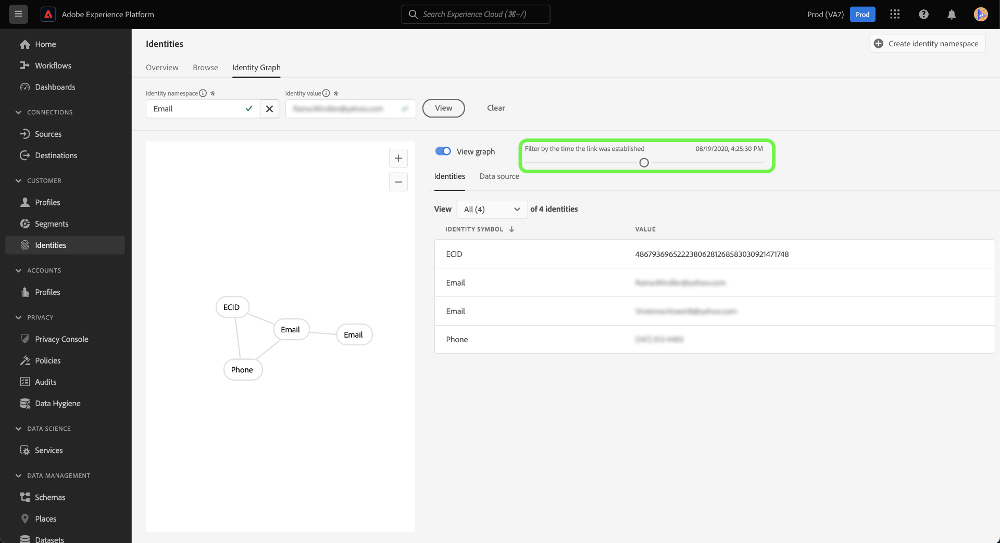

# 身份图查看器

身份图是特定客户不同身份之间关系的映射，可直观地展示客户如何跨不同渠道与您的品牌进行交互。 所有客户身份图表都由Adobe Experience Platform Identity Service近乎实时地进行集体管理和更新，以响应客户活动。

通过Platform用户界面中的身份图查看器，您可以可视化并更好地了解将哪些客户身份拼合在一起，以及以哪些方式拼合在一起。 查看器允许您拖动图形的不同部分并与之交互，从而允许您检查复杂的身份关系、更高效地进行调试，并从信息的使用方式提高透明度中受益。

以下文档提供了有关如何在Platform UI中访问和使用身份图查看器的步骤。

## 教程视频

以下视频旨在支持您对身份图查看器的了解。

>[!VIDEO](https://video.tv.adobe.com/v/331030/?quality=12&learn=on)

## 快速入门

使用身份图查看器需要了解所涉及的各种Adobe Experience Platform服务。 在开始使用身份图查看器之前，请查阅以下服务的文档：

- [[!DNL Identity Service]](../home.md):通过跨设备和系统桥接身份，更好地了解各个客户及其行为。
- [实时客户资料](../../profile/home.md):实时客户资料利用身份图来创建客户属性和行为的全面、单一视图。

### 术语

- **身份（节点）：** 身份或节点是实体（通常为人员）特有的数据。 标识由标识命名空间和标识值组成。 例如，完全限定的身份可以包含的身份命名空间为 **电子邮件**，与的标识值组合在一起 **robin@email.com**.
- **链接（边缘）：** 链接或边缘表示标识之间的连接。 身份链接包括首次建立和上次更新时间戳等属性。 第一个建立的时间戳定义了将新身份链接到现有身份的日期和时间。 上次更新的时间戳定义了上次更新现有身份链接的日期和时间。
- **图形（集群）：** 图形或群集是一组表示人员的身份和链接。

## 访问身份图查看器 {#access-identity-graph-viewer}

在平台UI中，选择 **[!UICONTROL 标识]** 在左侧导航中，然后选择 **[!UICONTROL 身份图]** 从标题的选项卡列表。

要查看身份图，请提供身份命名空间及其相应值，然后选择 **[!UICONTROL 查看]**.

>[!TIP]
>
>选择表图标  以查看包含组织中所有可用身份命名空间列表的面板。 只要您有一个有效的标识值连接到这些标识命名空间，就可以使用任何标识命名空间。 有关更多信息，请阅读 [identity namespace指南](../namespaces.md).

## 了解身份图查看器界面

身份图查看器界面由多个元素组成，您可以使用这些元素与之交互并更好地了解您的身份数据。

身份图显示链接到您输入的身份命名空间和值组合的所有身份。 每个节点都包含一个身份命名空间及其相应值。 您可以选择、按住并拖动任何节点以与图形进行交互。 或者，您可以将鼠标悬停在某个节点上以查看有关其相应标识值的信息。 选择 **[!UICONTROL 查看图]** 来隐藏或显示图表。

>[!IMPORTANT]
>
>身份图需要至少生成两个链接的身份以及有效的身份命名空间和值组合。 图形查看器可显示的最大身份数为150。 请参阅 [附录](#appendix) 部分以了解更多信息。

在图表中选择一个链接，以查看对该链接贡献的数据集和批处理ID。 选择链接还会更新右边栏，以提供有关数据源详细信息以及诸如首次建立时间戳和上次更新时间戳之类的属性的更多信息。

的 [!UICONTROL 标识] 表格提供了身份数据的不同视图，以表格格式列出身份命名空间和身份值组合。 选择图形中的节点将更新 [!UICONTROL 标识] 表。

使用下拉菜单对图形数据进行排序，并突出显示有关特定身份命名空间的信息。 例如，选择 **[!UICONTROL 电子邮件]** ，以查看特定于电子邮件身份命名空间的数据。

右边栏显示有关选定身份的信息，包括上次更新的时间戳。 右边栏还显示有关与所选标识对应的数据源的信息，包括其批量ID、数据集名称、数据集ID和架构名称。

下表提供了有关右边栏中显示的数据源属性的其他信息：

| 数据源 | 描述 |
| --- | --- | 
| 批次 ID | 与批量数据对应的自动生成的标识符。 |
| 数据集 ID | 与您的数据集对应的自动生成的标识符。 |
| 数据集名称 | 包含批量数据的数据集的名称。 |
| 架构名称 | 架构的名称。 架构提供了一组规则来表示和验证数据的结构和格式。 |

您还可以使用 *[!UICONTROL 数据源]* 以查看对您的身份做出贡献的数据源列表。 选择 [!UICONTROL 数据源] ，以查看数据集和批量ID的表格视图。

使用滑块可按首次建立身份时间筛选图形数据。 默认情况下，标识图形查看器显示图形中链接的所有标识。 按住并拖动滑块，将时间调整到将新标识链接到图形的最后一个时间戳。 在以下示例中，该图表显示最近的身份链接(GAID)是在 **[!UICONTROL 08/19/2020, 4:29:29 PM]**.

调整滑块，以查看已在上建立另一个身份链接（电子邮件） **[!UICONTROL 08/19/2020, 4:25:30 PM]**.

您还可以调整滑块以查看图形的最早小版本。 在以下示例中，身份图查看器显示图表是首次在 **[!UICONTROL 08/19/2020, 4:11:49 PM]**，其首个链接为ECID、电子邮件和电话。

## 附录

以下部分提供了有关使用身份图查看器的其他信息。

### 了解错误消息

访问身份图查看器时可能会出错。 以下是使用身份图查看器时需要注意的先决条件和限制列表。

- 标识值必须存在于所选命名空间中。
- 身份图查看器至少需要两个链接的身份才能生成。 可能只有一个标识值并且没有关联的标识，在这种情况下，该值仅存在于 [!DNL Profile] 查看器。
- 身份图查看器不能超过150个身份。

### 从数据集访问身份图查看器

您还可以使用数据集界面访问身份图查看器。 从数据集 [!UICONTROL 浏览] ，选择要与之交互的数据集，然后选择 **[!UICONTROL 预览数据集]**

从预览窗口中，选择一个指纹图标，以查看通过身份图查看器表示的身份。

>[!TIP]
>
>仅当数据集具有两个或更多标识时，才会显示指纹图标。

## 后续步骤

通过阅读本文档，您了解了如何在Platform UI中探索客户的身份图。 有关平台中身份的更多信息，请参阅 [Identity Service概述](../home.md)

## Changelog

| 日期 | 操作 |
| ---- | ------ |
| 2021-01 | <ul><li>添加了对流式引入数据和非生产沙盒的支持。</li><li>若干小错误修复。</li></ul> |
| 2021-02 | <ul><li>可通过数据集预览访问身份图查看器。</li><li>若干小错误修复。</li><li>“身份图”查看器已设为“一般可用”。</li></ul> |
| 2023-01 | <ul><li>UI更新。</li></ul> |
