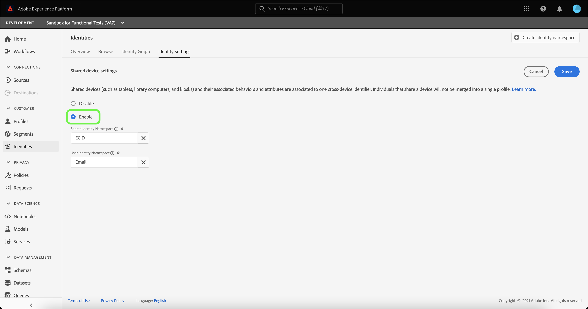

# 共享设备检测概述（测试版）

>[!IMPORTANT]
>
>的 [!DNL Shared Device Detection] 功能在测试版中。 其功能和文档可能会发生更改。

Adobe Experience Platform [!DNL Identity Service] 通过跨设备和系统桥接身份，使您能够实时提供有影响的个人数字体验，从而帮助您更好地了解客户及其行为。

[!DNL Shared Device] 是指由多个个人使用的设备。 共享设备的示例包括平板电脑、库计算机和网亭。 通过 [!DNL Shared Device Detection] 功能，可以防止同一设备的不同用户合并到单个标识中，从而允许更准确地表示个人。

使用 [!DNL Shared Device Detection] 您可以：

* 为同一设备的不同用户创建单独的身份图；
* 防止使用同一设备的不同个人混合数据；
* 更清晰、更准确地查看客户。

>[!TIP]
>
>的配置 [!DNL Shared Device Detection] 必须在启用数据集的配置文件之前完成，因为在 [!DNL Identity Service].

## 入门 [!DNL Shared Device Detection]

使用 [!DNL Shared Device Detection] 需要了解所涉及的各种平台服务。 开始使用之前 [!DNL Shared Device Detection]，请查阅以下服务的文档：

* [[!DNL Identity Service]](../home.md):通过跨设备和系统桥接身份，更好地了解各个客户及其行为。
   * [身份图查看器](./identity-graph-viewer.md):可视化身份图形查看器并与之进行交互，以便更好地了解客户身份如何拼合在一起，以及以何种方式拼合在一起。
   * [身份命名空间](../namespaces.md):请参阅完全限定身份的组件，以及身份命名空间如何让您区分身份的上下文和类型。

## 了解 [!DNL Shared Device Detection]

使用时，请务必了解以下术语
[!DNL Shared Device Detection]. 请参阅下表，了解了解必要术语的列表 [!DNL Shared Device Detection].

### 术语

| 术语 | 定义 |
| --- | --- |
| 共享设备 | 共享设备是指多个个人使用的任何设备。 共享设备的示例包括平板电脑、库计算机和网亭。 |
| [!DNL Shared Device Detection] | [!DNL Shared Device Detection] 是指一种配置设置，允许将来自同一设备的不同用户的数据彼此分离。 |
| 共享身份命名空间 | 共享身份命名空间表示可由多个用户使用的设备。 共享身份命名空间通常为ECID，但可以设置为其他设备ID。 |
| 用户身份命名空间 | 用户身份命名空间表示已验证（已登录）的共享设备用户。 |
| 上次验证用户 | 如果设备被多个帐户登录，则最后一个经过身份验证的用户表示上次登录到某个设备的用户。 |

{style=&quot;table-layout:auto&quot;}

[!DNL Shared Device Detection] 通过建立两个命名空间来工作：the **共享身份命名空间** 和 **用户身份命名空间**.

* 共享身份命名空间表示可由多个用户使用的设备。 Adobe建议客户使用ECID作为共享设备标识符。
* 用户身份命名空间映射到与用户登录ID对应的身份命名空间，这可以是用户的CRM ID、电子邮件地址、经过哈希处理的电子邮件或电话号码。

共享设备（如平板电脑）具有 **共享身份命名空间**. 另一方面，共享设备的每个用户都有其自己的指定 **用户身份命名空间** 与各自的登录ID对应的ID。 例如，Kevin和Nora共享用于电子商务的平板电脑具有其自己的ECID: `1234`，而Kevin有自己的用户身份命名空间已映射到其 `kevin@email.com` 帐户和Nora有自己的用户身份命名空间映射到她 `nora@email.com` 帐户。

[!DNL Shared Device Detection] 能够通过链接共享身份命名空间(例如， ECID)，具有上次经过身份验证的用户的用户身份命名空间（登录ID）。

### 如何将身份数据发送到身份图

请考虑以下示例，以帮助您了解如何 [!DNL Shared Device Detection] 工作：

>[!NOTE]
>
>在此图表中，共享身份命名空间已配置为ECID，用户身份命名空间已配置为CRM ID。

* 凯文和诺拉共享平板电脑访问电子商务网站。 但是，他们都有自己的独立账户，每个账户都用来在网上浏览和购物；
   * 作为共享设备，平板电脑具有相应的ECID，表示平板电脑的Web浏览器Cookie ID;
* 假设Kevin使用平板电脑和 **登录** 到他的电子商务帐户以浏览耳机，这表示Kevin的CRM ID(**用户身份命名空间**)现在已与平板电脑的ECID(**共享身份命名空间**)。 平板电脑的浏览数据现已与Kevin的身份图相结合。
   * 如果凯文 **注销** 诺拉用了平板电脑 **登录** 若转到自己的账户并购买相机，则她的CRM ID现在会与平板电脑的ECID关联。 因此，平板电脑的浏览数据现在与诺拉的身份图相结合。
   * 如果诺拉 **不注销** 凯文用的是平板电脑，但 **未登录**，则平板电脑的浏览数据仍会与Nora一起使用，因为她仍将作为经过身份验证的用户，并且其CRM ID仍与平板电脑的ECID关联。
   * 如果诺拉 **注销** 凯文用的是平板电脑，但 **未登录**，则平板电脑的浏览数据仍会与诺拉的身份图相结合，因为 **上次验证用户**，则其CRM ID仍会与平板电脑的ECID关联。
   * 如果凯文 **登录** 同样，他的CRM ID现在会链接到平板电脑的ECID，因为他现在是最后一个经过身份验证的用户，平板电脑的浏览数据现在已与其身份图相结合。

### 如何 [!DNL Profile Service] 将配置文件片段合并到 [!DNL Shared Device Detection] 已启用

[!DNL Profile Service] 请注意配置文件片段和合并的配置文件。 每个客户配置文件都由多个配置文件片段组成，这些片段已合并，以形成该客户的单一视图。 例如，如果客户跨多个渠道与您的品牌进行交互，则您的组织将在多个数据集中显示与该单个客户相关的多个配置文件片段。 将这些片段摄取到Platform后，它们会合并在一起，以便为该客户创建单个配置文件。

When [!DNL Shared Device Detection] 启用， [!DNL Profile] 根据体验事件是经过身份验证还是未经身份验证来定义配置文件片段的主要标识

安 **经过验证的体验事件** 是用户在登录到设备时完成的操作。 对于已验证的体验事件，主标识是 **用户身份命名空间** （登录ID）。 安 **未经身份验证的体验事件** 是未登录到设备的用户完成的一项操作。 对于未经身份验证的体验事件，主标识为 **共享身份命名空间** (ECID)。

有关更多信息，请参阅  [[!DNL Real-time Customer Profile] 概述](../../profile/home.md).

## 共享设备UI

在平台UI中，选择 **[!UICONTROL 标识]** 从左侧导航中，然后选择 **[!UICONTROL 身份设置]**.

的 [!UICONTROL 共享设备设置] 页面，为您提供用于为数据配置共享设备设置的界面。 默认情况下，共享设备设置处于禁用状态。

启用共享设备设置后，共享设备设置允许将来自同一设备不同用户的数据彼此分离。 此配置设置允许更简洁、更准确地表示身份图，其中同一设备的用户身份不会合并在一起。

选择 **[!UICONTROL 启用]** 以开始修改共享设备设置。

的 [!UICONTROL 共享身份命名空间] 和 [!UICONTROL 用户身份命名空间] 此时会显示配置选项，允许您修改要使用的身份命名空间。

[!UICONTROL 共享身份命名空间] 表示多个不同用户使用的单个设备。 此命名空间始终设置为 **[!UICONTROL ECID]** 因为所有平台用户都使用 **[!UICONTROL ECID]** 作为web浏览器标识符。

的 [!UICONTROL 用户身份命名空间] 允许您识别同一设备的不同用户，并阻止数据合并到同一身份图中。

选择 **[!UICONTROL 用户身份命名空间]** 搜索栏，然后输入身份命名空间或从下拉菜单中选择身份命名空间。

>[!TIP]
>
>的 [!UICONTROL 用户身份命名空间] 应映射到与最终用户登录ID对应的身份命名空间。 选项包括客户ID、电子邮件和经过哈希处理的电子邮件。

配置好 [!UICONTROL 共享设备设置]，选择 **[!UICONTROL 保存]**.

出现一个弹出窗口，提示您确认您的选择。 选择 **[!UICONTROL 是]** 以完成配置设置。

