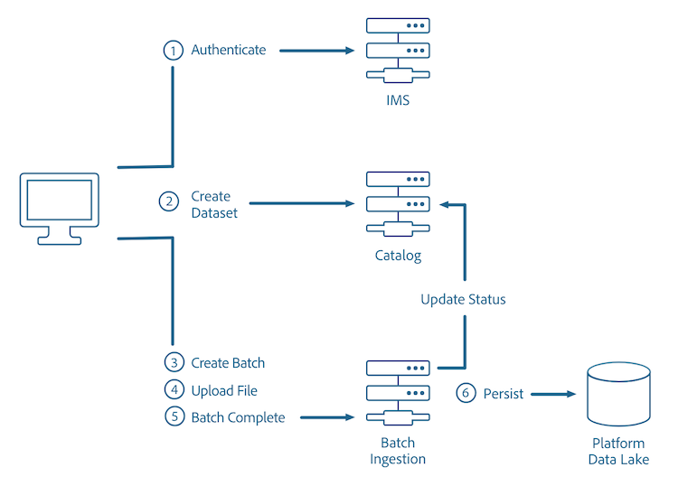

# 批量摄取概述

Batch Ingestion API允许您将数据作为批处理文件导入到Adobe Experience Platform中。 所摄取的数据可以是CRM系统（如拼花文件）中平面文件的用户档案数据，也可以是符合Experience Data Model(XDM)注册表中的已知模式的数据。

数据 [摄取API参考提供](https://www.adobe.io/apis/experienceplatform/home/api-reference.html#!acpdr/swagger-specs/ingest-api.yaml) 有关这些API调用的其他信息。

下图概述了批量摄取过程：



## 使用API

数据摄取API允许您通过三个基本步骤将数据作为批量（由一个或多个要作为单个单元摄取的文件组成的数据单元）摄取到Experience Platform中：

1. 创建新批。
2. 将文件上传到与数据的XDM模式匹配的指定数据集。
3. 发出批次结束的信号。


### 数据获取先决条件

- 要上传的数据必须采用Parke或JSON格式。
- 在目录服务中创建的 [数据集](../../catalog/home.md)。
- 拼花文件的内容必须与要上传到的数据集的模式的子集匹配。
- 在验证后赋予您独特的访问令牌。

### 批量摄取最佳实践

- 建议的批处理大小介于256 MB和100 GB之间。
- 每个批次最多应包含1500个文件。

要上传大于512MB的文件，文件需要分为较小的块。 此处可找到上传大文件的说 [明](#large-file-upload---create-file)。

### 读取示例API调用

本指南提供示例API调用，以演示如何设置请求的格式。 这些包括路径、必需的标题和格式正确的请求负载。 还提供API响应中返回的示例JSON。 有关示例API调用文档中使用的惯例的信息，请参阅Experience Platform疑难解答指南 [中有关如何阅读示例API调用的部分](../../landing/troubleshooting.md#how-do-i-format-an-api-request) 。

### 收集所需标题的值

要调用平台API，您必须首先完成身份验证 [教程](../../tutorials/authentication.md)。 完成身份验证教程后，将为所有Experience Platform API调用中的每个所需标头提供值，如下所示：

- 授权：承载人 `{ACCESS_TOKEN}`
- x-api-key: `{API_KEY}`
- x-gw-ims-org-id: `{IMS_ORG}`

Experience Platform中的所有资源都与特定虚拟沙箱隔离。 对平台API的所有请求都需要一个标头，它指定操作将在以下位置进行的沙箱的名称：

- x-sandbox-name: `{SANDBOX_NAME}`

>[!NOTE] 有关平台中沙箱的详细信息，请参阅沙 [箱概述文档](../../sandboxes/home.md)。

所有包含有效负荷(POST、PUT、PATCH)的请求都需要额外的标头：

- 内容类型：application/json

### 创建批

在将数据添加到数据集之前，它必须链接到一个批，随后该批将上传到指定的数据集。

```http
POST /batches
```

**请求**

```shell
curl -X POST "https://platform.adobe.io/data/foundation/import/batches" \
  -H "Content-Type: application/json" \
  -H "x-gw-ims-org-id: {IMS_ORG}" \
  -H "x-sandbox-name: {SANDBOX_NAME}" \
  -H "Authorization: Bearer {ACCESS_TOKEN}" \
  -H "x-api-key : {API_KEY}"
  -d '{ 
          "datasetId": "{DATASET_ID}" 
      }'
```

| 属性 | 描述 |
| -------- | ----------- |
| `datasetId` | 要将文件上传到的数据集的ID。 |

**响应**

```JSON
{
    "id": "{BATCH_ID}",
    "imsOrg": "{IMS_ORG}",
    "updated": 0,
    "status": "loading",
    "created": 0,
    "relatedObjects": [
        {
            "type": "dataSet",
            "id": "{DATASET_ID}"
        }
    ],
    "version": "1.0.0",
    "tags": {},
    "createdUser": "{USER_ID}",
    "updatedUser": "{USER_ID}"
}
```

| 属性 | 描述 |
| -------- | ----------- |
| `id` | 刚创建的批的ID（在后续请求中使用）。 |
| `relatedObjects.id` | 要将文件上传到的数据集的ID。 |

## 文件上传

在成功创建新批量以进行上传后，文件随后可以上传到特定数据集。

您可以使用“小文件上 **传API”上传文件**。 但是，如果文件过大且超出网关限制（如延长超时、超出正文大小请求和其他限制），您可以切换到“大文件上传 **API”**。 此API以块为单位上传文件，并使用“大文件上传完 **整API”调用将数据拼接在一起** 。

>[!NOTE] 以下示例使用镶 [木](https://parquet.apache.org/documentation/latest/) 文件格式。 可在批量摄取开发人员指南中找到使用JSON文件格 [式的示例](./api-overview.md)。

### 小文件上传

创建批后，数据即可上传到预先存在的数据集。  要上传的文件必须与其引用的XDM模式匹配。

```http
PUT /batches/{BATCH_ID}/datasets/{DATASET_ID}/files/{FILE_NAME}
```

| 属性 | 描述 |
| -------- | ----------- |
| `{BATCH_ID}` | 批的ID。 |
| `{DATASET_ID}` | 要上传文件的数据集的ID。 |
| `{FILE_NAME}` | 数据集中将显示的文件名。 |

**请求**

```SHELL
curl -X PUT "https://platform.adobe.io/data/foundation/import/batches/{BATCH_ID}/datasets/{DATASET_ID}/files/{FILE_NAME}.parquet" \
  -H "content-type: application/octet-stream" \
  -H "x-gw-ims-org-id: {IMS_ORG}" \
  -H "x-sandbox-name: {SANDBOX_NAME}" \
  -H "Authorization: Bearer {ACCESS_TOKEN}" \
  -H "x-api-key : {API_KEY}" \
  --data-binary "@{FILE_PATH_AND_NAME}.parquet"
```

| 属性 | 描述 |
| -------- | ----------- |
| `{FILE_PATH_AND_NAME}` | 要上传到数据集中的文件的路径和文件名。 |

**响应**

```JSON
#Status 200 OK, with empty response body
```

### 大文件上传——创建文件

要上传大文件，文件必须拆分为较小的块，并一次上传一个。

```http
POST /batches/{BATCH_ID}/datasets/{DATASET_ID}/files/{FILE_NAME}?action=initialize
```

| 属性 | 描述 |
| -------- | ----------- |
| `{BATCH_ID}` | 批的ID。 |
| `{DATASET_ID}` | 摄取文件的数据集的ID。 |
| `{FILE_NAME}` | 数据集中将显示的文件名。 |

**请求**

```SHELL
curl -X POST "https://platform.adobe.io/data/foundation/import/batches/{BATCH_ID}/datasets/{DATASET_ID}/files/part1=a/part2=b/{FILE_NAME}.parquet?action=initialize" \
  -H "x-gw-ims-org-id: {IMS_ORG}" \
  -H "x-sandbox-name: {SANDBOX_NAME}" \
  -H "Authorization: Bearer {ACCESS_TOKEN}" \
  -H "x-api-key: {API_KEY}"
```

**响应**

```JSON
#Status 201 CREATED, with empty response body
```

### 大文件上传——上传后续部分

创建文件后，可以通过重复发出PATCH请求来上传所有后续数据块，每个PATCH请求对应文件的每个部分。

```http
PATCH /batches/{BATCH_ID}/datasets/{DATASET_ID}/files/{FILE_NAME}
```

| 属性 | 描述 |
| -------- | ----------- |
| `{BATCH_ID}` | 批的ID。 |
| `{DATASET_ID}` | 要将文件上传到的数据集的ID。 |
| `{FILE_NAME}` | 数据集中将显示的文件名。 |

**请求**

```SHELL
curl -X PATCH "https://platform.adobe.io/data/foundation/import/batches/{BATCH_ID}/datasets/{DATASET_ID}/files/part1=a/part2=b/{FILE_NAME}.parquet" \
  -H "content-type: application/octet-stream" \
  -H "x-gw-ims-org-id: {IMS_ORG}" \
  -H "x-sandbox-name: {SANDBOX_NAME}" \
  -H "Authorization: Bearer {ACCESS_TOKEN}" \
  -H "x-api-key: {API_KEY}" \
  -H "Content-Range: bytes {CONTENT_RANGE}" \
  --data-binary "@{FILE_PATH_AND_NAME}.parquet"
```

| 属性 | 描述 |
| -------- | ----------- |
| `{FILE_PATH_AND_NAME}` | 要上传到数据集中的文件的路径和文件名。 |

**响应**

```JSON
#Status 200 OK, with empty response
```

## 信号批量完成

在所有文件已上传到该批后，可以指示该批完成。 通过执行此操作，将为完 **成的文件创建Catalog** DataSetFile（目录数据集文件）条目，并与上面生成的批次相关联。 然后，将目录批标记为成功，这将触发下游流以获取可用数据。

**请求**

```http
POST /batches/{BATCH_ID}?action=COMPLETE
```

| 属性 | 描述 |
| -------- | ----------- |
| `{BATCH_ID}` | 要上传到数据集中的批的ID。 |

```SHELL
curl -X POST "https://platform.adobe.io/data/foundation/import/batches/{BATCH_ID}?action=COMPLETE" \
-H "x-gw-ims-org-id: {IMS_ORG}" \
-H "x-sandbox-name: {SANDBOX_NAME}" \
-H "Authorization: Bearer {ACCESS_TOKEN}" \
-H "x-api-key : {API_KEY}"
```

**响应**

```JSON
#Status 200 OK, with empty response
```

## 检查批状态

在等待文件上传到批时，可以检查批的状态以查看其进度。

**API格式**

```http
GET /batch/{BATCH_ID}
```

| 属性 | 描述 |
| -------- | ----------- |
| `{BATCH_ID}` | 正在检查的批的ID。 |

**请求**

```shell
curl GET "https://platform.adobe.io/data/foundation/catalog/batch/{BATCH_ID}" \
  -H "Authorization: Bearer {ACCESS_TOKEN}" \
  -H "x-gw-ims-org-id: {IMS_ORG}" \
  -H "x-sandbox-name: {SANDBOX_NAME}" \
  -H "x-api-key: {API_KEY}"
```

**响应**

```JSON
{
    "{BATCH_ID}": {
        "imsOrg": "{IMS_ORG}",
        "created": 1494349962314,
        "createdClient": "MCDPCatalogService",
        "createdUser": "{USER_ID}",
        "updatedUser": "{USER_ID}",
        "updated": 1494349963467,
        "externalId": "{EXTERNAL_ID}",
        "status": "success",
        "errors": [
            {
                "code": "err-1494349963436"
            }
        ],
        "version": "1.0.3",
        "availableDates": {
            "startDate": 1337,
            "endDate": 4000
        },
        "relatedObjects": [
            {
                "type": "batch",
                "id": "foo_batch"
            },
            {
                "type": "connection",
                "id": "foo_connection"
            },
            {
                "type": "connector",
                "id": "foo_connector"
            },
            {
                "type": "dataSet",
                "id": "foo_dataSet"
            },
            {
                "type": "dataSetView",
                "id": "foo_dataSetView"
            },
            {
                "type": "dataSetFile",
                "id": "foo_dataSetFile"
            },
            {
                "type": "expressionBlock",
                "id": "foo_expressionBlock"
            },
            {
                "type": "service",
                "id": "foo_service"
            },
            {
                "type": "serviceDefinition",
                "id": "foo_serviceDefinition"
            }
        ],
        "metrics": {
            "foo": 1337
        },
        "tags": {
            "foo_bar": [
                "stuff"
            ],
            "bar_foo": [
                "woo",
                "baz"
            ],
            "foo/bar/foo-bar": [
                "weehaw",
                "wee:haw"
            ]
        },
        "inputFormat": {
            "format": "parquet",
            "delimiter": ".",
            "quote": "`",
            "escape": "\\",
            "nullMarker": "",
            "header": "true",
            "charset": "UTF-8"
        }
    }
}
```

| 属性 | 描述 |
| -------- | ----------- |
| `{USER_ID}` | 创建或更新批的用户的ID。 |

字 `"status"` 段显示请求的批的当前状态。 批可以具有以下状态之一：

## 批摄取状态

| 状态 | 描述 |
| ------ | ----------- |
| 已放弃 | 批未在预期时间范围内完成。 |
| 已中止 | 已显式调用( **通过** Batch Ingest API)指定批次的中止操作。 一旦批处于“已加载 **”状态** ，便无法中止该批。 |
| 活动 | 批已成功提升，可用于下游冲减。 此状态可与“成功”交替使 **用**。 |
| 已删除 | 批的数据已被完全删除。 |
| 失败 | 由错误配置和／或错误数据导致的终端状态。 失败批次的数据 **将不** 显示。 此状态可与“失败”( **Failure)交替使用**。 |
| 非活动 | 批已成功提升，但已还原或已过期。 批不再可用于下游冲减。 |
| 已加载 | 批的数据已完成，批准备好进行升级。 |
| 正在加载 | 正在上传此批的数据，且该批当前 **尚未** 准备好升级。 |
| 重试 | 正在处理此批的数据。 但是，由于系统或临时错误，批处理失败——因此，正在重试此批处理。 |
| 已暂存 | 批处理的升级过程的分阶段已完成，且摄取作业已运行。 |
| 暂存 | 正在处理批的数据。 |
| 停止 | 正在处理批的数据。 但是，批促销在多次重试后已停止。 |