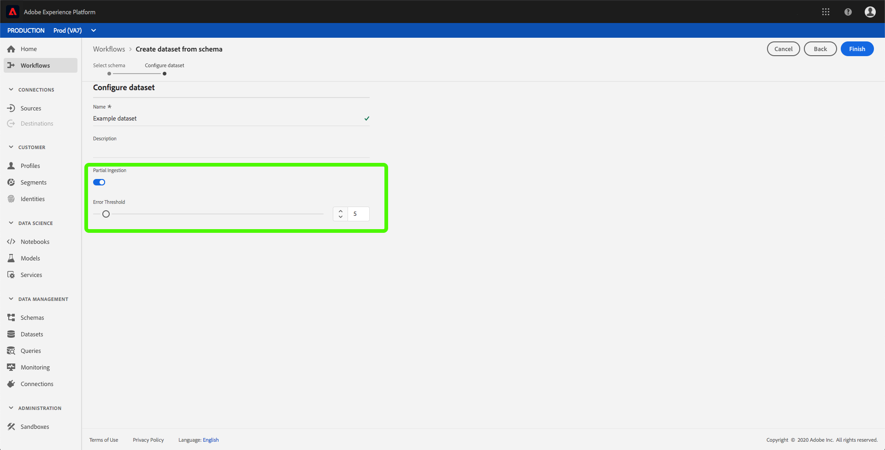

# 部分批量摄取

部分批量摄取是指能够摄取包含错误的数据，最高可达到某个阈值。 借助此功能，用户可以成功地将其所有正确数据收录到Adobe Experience Platform中，同时单独分批其所有错误数据，并详细了解其无效原因。

本文档提供了用于管理部分批摄取的教程。

此外，本教程的附 [录](#partial-batch-ingestion-error-types) ，提供了部分批量摄取错误类型的参考。

## 入门指南

本教程需要了解与部分批量摄取相关的各种Adobe Experience Platform服务的相关工作知识。 在开始本教程之前，请查看以下服务的相关文档：

- [批量摄取](./overview.md):平台从数据文件（如CSV和Parke）中摄取和存储数据的方法。
- [体验数据模型(XDM)](../../xdm/home.md):平台通过标准化框架组织客户体验数据。

以下各节提供了成功调用平台API所需了解的其他信息。

### 读取示例API调用

本指南提供示例API调用，以演示如何设置请求的格式。 这些包括路径、必需的标题和格式正确的请求负载。 还提供API响应中返回的示例JSON。 有关示例API调用文档中使用的惯例的信息，请参阅Experience Platform疑难解答指南 [中有关如何阅读示例API调用的部分](../../landing/troubleshooting.md#how-do-i-format-an-api-request) 。

### 收集所需标题的值

要调用平台API，您必须首先完成身份验证 [教程](../../tutorials/authentication.md)。 完成身份验证教程后，将为所有Experience Platform API调用中的每个所需标头提供值，如下所示：

- 授权：承载人 `{ACCESS_TOKEN}`
- x-api-key: `{API_KEY}`
- x-gw-ims-org-id: `{IMS_ORG}`

Experience Platform中的所有资源都与特定虚拟沙箱隔离。 对平台API的所有请求都需要一个标头，它指定操作将在以下位置进行的沙箱的名称：

- x-sandbox-name: `{SANDBOX_NAME}`

>[!NOTE] 有关平台中沙箱的详细信息，请参阅沙 [箱概述文档](../../sandboxes/home.md)。

## 在API中为部分批量摄取启用数据集

>[!NOTE] 本节介绍如何使用API为部分批量摄取启用数据集。 有关使用UI的说明，请阅读在UI [步骤中为部分批量提取启用数据集](#enable-a-dataset-for-partial-batch-ingestion-in-the-ui) 。

您可以创建新数据集或修改启用了部分摄取的现有数据集。

要创建新数据集，请按照创建数据集教 [程中的步骤操作](../../catalog/api/create-dataset.md)。 进入创建数 *据集步骤后* ，在请求主体中添加以下字段：

```json
{
    ...
    "tags" : {
        "partialBatchIngestion":["errorThresholdPercentage:5"]
    },
    ...
}
```

| 属性 | 描述 |
| -------- | ----------- |
| `errorThresholdPercentage` | 整个批处理失败之前可接受的错误百分比。 |

同样，要修改现有数据集，请按照“目录开发人员指南”中的 [步骤操作](../../catalog/api/update-object.md)。

在数据集中，您需要添加上述标记。

## 在UI中为部分批量摄取启用数据集

>[!NOTE] 本节介绍如何使用UI为部分批量摄取启用数据集。 如果您已使用API为部分批量摄取启用了数据集，则可跳到下一节。

要通过平台UI启用数据集以进行部分摄取，请单击左侧导 **航中的** “数据集”。 您可以创建 [新数据集](#create-a-new-dataset-with-partial-batch-ingestion-enabled) ，也 [可以修改现有数据集](#modify-an-existing-dataset-to-enable-partial-batch-ingestion)。

### 创建启用了部分批摄取的新数据集

要创建新数据集，请按照数据集用户指南 [中的步骤操作](../../catalog/datasets/user-guide.md)。 进入配置数 *据集步骤后* ，请注意“部分摄取 *”和“错误诊* 断”字段 ** 。


“部 *分摄取* ”切换允许您启用或禁用部分批摄取的使用。

“Error *Diagnostics* （错误诊断） *”切换仅在“Partial Ingestion（部分摄取）* ”切换关闭时显示。 此功能允许平台生成有关所摄取批次的详细错误消息。 如果打开 *了“部分摄取* ”切换，将自动实施增强的错误诊断。



“错 *误阈值* ”允许您在整个批次失败之前设置可接受错误的百分比。 默认情况下，此值设置为5%。

### 修改现有数据集以启用部分批量摄取

要修改现有数据集，请选择要修改的数据集。 右侧的提要栏会填充有关数据集的信息。


“部 *分摄取* ”切换允许您启用或禁用部分批摄取的使用。

“错 *误阈值* ”允许您在整个批次失败之前设置可接受错误的百分比。 默认情况下，此值设置为5%。

## 检索部分批摄取错误

如果批处理包含故障，您需要检索这些故障的错误信息，以便重新摄取数据。

### 检查状态

要检查摄取的批的状态，您必须在GET请求的路径中提供该批的ID。

**API格式**

```http
GET /catalog/batches/{BATCH_ID}
```

| 参数 | 描述 |
| --------- | ----------- |
| `{BATCH_ID}` | 要 `id` 检查其状态的批的值。 |

**请求**

```shell
curl -X GET https://platform.adobe.io/data/foundation/catalog/batches/{BATCH_ID} \
  -H 'Authorization: Bearer {ACCESS_TOKEN}' \
  -H 'x-api-key: {API_KEY}' \
  -H 'x-gw-ims-org-id: {IMS_ORG}' \
  -H 'x-sandbox-name: {SANDBOX_NAME}'
```

**响应**

成功的响应会返回HTTP状态200，其中包含有关批处理状态的详细信息。

```json
{
    "af838510-2233-11ea-acf0-f3edfcded2d2": {
        "status": "success",
        "tags": {
            ...
        },
        "relatedObjects": [
            {
                "type": "dataSet",
                "id": "5deac2648a19d218a888d2b1"
            }
        ],
        "id": "af838510-2233-11ea-acf0-f3edfcded2d2",
        "externalId": "af838510-2233-11ea-acf0-f3edfcded2d2",
        "inputFormat": {
            "format": "parquet"
        },
        "imsOrg": "{IMS_ORG}",
        "started": 1576741718543,
        "metrics": {
            "inputByteSize": 568,
            "inputFileCount": 4,
            "inputRecordCount": 519,
            "outputRecordCount": 497
        },
        "completed": 1576741722026,
        "created": 1576741597205,
        "createdClient": "{API_KEY}",
        "createdUser": "{USER_ID}",
        "updatedUser": "{USER_ID}",
        "updated": 1576741722644,
        "version": "1.0.5"
    }    
}
```

如果批处理有错误并启用了错误诊断，则状态将为“成功”，并在可下载的错误文件中提供有关该错误的更多信息。

## 后续步骤

本教程介绍了如何创建或修改数据集以启用部分批量摄取。 有关批量摄取的详细信息，请阅读批量摄取 [开发人员指南](./api-overview.md)。

## 部分批量摄取错误类型

在摄取数据时，部分批量摄取有四种不同的错误类型。

- [不可读的文件](#unreadable)
- [模式或标题无效](#schemas-headers)
- [不可取行](#unparsable)
- [XDM转换无效](#conversion)

### 不可读的文件 {#unreadable}

如果所摄取的批次具有不可读的文件，则批次的错误将附加到该批次本身。 有关检索失败批次的更多信息，请参阅检 [索失败批次指南](../quality/retrieve-failed-batches.md)。

### 模式或标题无效 {#schemas-headers}

如果所摄取的批具有无效的模式或无效的题头，则批的错误将附加到该批本身。 有关检索失败批次的更多信息，请参阅检 [索失败批次指南](../quality/retrieve-failed-batches.md)。

### 不可取行 {#unparsable}

如果所摄取的批次具有不可分割的行，则该批次的错误将存储在一个文件中，该文件中可以使用下面概述的端点进行访问。

**API格式**

```http
GET /export/batches/{BATCH_ID}/failed?path=parse_errors
```

| 参数 | 描述 |
| --------- | ----------- |
| `{BATCH_ID}` | 要 `id` 从中检索错误信息的批次的值。 |

**请求**

```shell
curl -X GET https://platform.adobe.io/data/foundation/export/batches/{BATCH_ID}/failed?path=parse_errors \
  -H 'Authorization: Bearer {ACCESS_TOKEN}' \
  -H 'x-api-key: {API_KEY}' \
  -H 'x-gw-ims-org-id: {IMS_ORG}' \
  -H 'x-sandbox-name: {SANDBOX_NAME}'
```

**响应**

成功的响应会返回HTTP状态200，其中包含不可取行的详细信息。

```json
{
    "_corrupt_record":"{missingQuotes:"v1"}",
    "_errors": [{
         "code":"1401",
         "message":"Row is corrupted and cannot be read, please fix and resend."
    }],
    "_filename": "a1.json"
}
```

### XDM转换无效 {#conversion}

如果摄取的批次具有无效的XDM转换，则该批次的错误将存储在可通过以下端点访问的文件中。

**API格式**

```http
GET /export/batches/{BATCH_ID}/failed?path=conversion_errors
```

| 参数 | 描述 |
| --------- | ----------- |
| `{BATCH_ID}` | 要 `id` 从中检索错误信息的批次的值。 |

**请求**

```shell
curl -X GET https://platform.adobe.io/data/foundation/export/batches/{BATCH_ID}/failed?path=conversion_errors \
  -H 'Authorization: Bearer {ACCESS_TOKEN}' \
  -H 'x-api-key: {API_KEY}' \
  -H 'x-gw-ims-org-id: {IMS_ORG}' \
  -H 'x-sandbox-name: {SANDBOX_NAME}'
```

**响应**

成功的响应会返回HTTP状态200，其中包含XDM转换失败的详细信息。

```json
{
    "col1":"v1",
    "col2":"v2",
    "col3":[{
        "g1":"h1"
    }],
    "_errors":[{
        "column":"col3",
        "code":"123",
        "message":"Cannot convert array element from Object to String"
    }],
    "_filename":"a1.json"
},
{
    "col1":"v1",
    "col2":"v2",
    "col3":[{
        "g1":"h1"
    }],
    "_errors":[{
        "column":"col1",
        "code":"100",
        "message":"Cannot convert string to float"
    }],
    "_filename":"a2.json"
}
```
